# 2021 年 CSS 的最新特性- LogRocket 博客

> 原文：<https://blog.logrocket.com/the-latest-features-of-css-in-2021/>

CSS 的范围和力量逐年增长。现在是 web 开发人员的大好时机，但是要跟上最新的特性却是一个挑战。

CSS 不像 JavaScript 一样有明确的版本。那么，你如何发现最新的功能是什么呢？

[万维网联盟(W3C)](https://en.wikipedia.org/wiki/World_Wide_Web_Consortium) 制作了一份[年度快照](https://www.w3.org/TR/CSS/)，在一份文件中包含了所有的当前规格。不幸的是，它没有列举新的内容。你需要通读每一个规格，看看有什么变化。谁想这么做呢？不是我！

实现规范中概述的功能取决于浏览器供应商。他们独立地决定何时实现这些特性。他们有自己的路线图，所以他们倾向于在不同的时间去做。在一个理想的世界中，应该有一个统一的来源来遵循这一点，但现在，没有。

为了省去你的麻烦，我收集了过去一年左右至少一个浏览器增加的主要特性。

## 锥形渐变

`conic-gradient`功能可用于创建一系列有趣的图像图案，如圆锥形、饼图、色轮和光滑表面。

锥形渐变围绕中心点旋转色标(而不是像径向渐变那样从中心点辐射)。圆锥形渐变色标位于一个圆的圆周上。

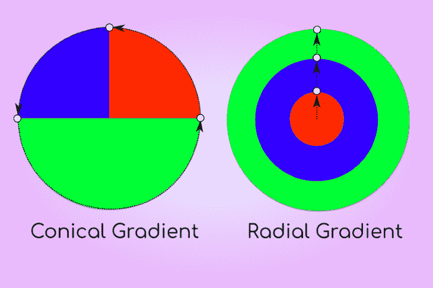

为了创建一个饼图，我们使用重叠的颜色停止(有突然的转变)。

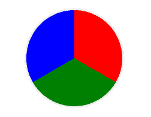

```
.pie-chart{
    background: conic-gradient(red 120deg, green 120deg 240deg, blue 240deg);
}

```

`repeating-conic-gradient()`功能提供了用简短的参数列表创建令人印象深刻的重复图形的可能性。

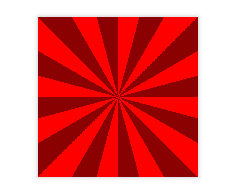

```
.sunburst{
    background: repeating-conic-gradient(red 0 15deg,darkred 0 30deg);
}

```

你可以在本书中看到更多的例子。

### 浏览器支持

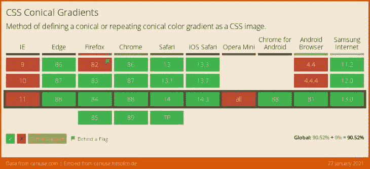

### 进一步阅读

如果您想了解更多信息，可以查看以下资源。

## 纵横比功能

另一个新特性是长宽比，即宽度和高度的比例关系。保持一致的纵横比对于创建响应性布局和防止[累积布局偏移](https://web.dev/cls/)(一个[网络重要性能指标](https://web.dev/vitals/))非常重要。

通常使用纵横比的一些示例:

*   为将要加载的内容创建占位符容器
*   创建一致、统一大小的组件，如卡片
*   创建响应性 iframes

[该属性](https://developer.mozilla.org/en-US/docs/Web/CSS/aspect-ratio)允许你在任何元素的*上固定[纵横比](https://wistia.com/learn/production/what-is-aspect-ratio)。图像和视频有一个固有的长宽比，但其他元素没有。*

语法非常简单。该值为:宽度比、正斜杠和高度比。

```
.widescreen {
  aspect-ratio: 16 / 9;
}

```

需要注意的是，如果为一个元素定义了`height`和`width`，那么这个元素将不会考虑`aspect-ratio`。

请看 Rob([@ robjoeol](https://codepen.io/robjoeol))[CodePen](https://codepen.io)上的 [笔宽高比(仅限 Chrome)](https://codepen.io/robjoeol/pen/oNYvRJg)。

您可以直接开始使用该属性，并使用`a`特性查询来提供一个回退，如下所示。

```
.standard {
  aspect-ratio: 4 / 3;
}

@supports not (aspect-ratio: 4 / 3) {
  .standard {
    width: 16rem;
    height: 9rem;
  }
}

```

### 浏览器支持

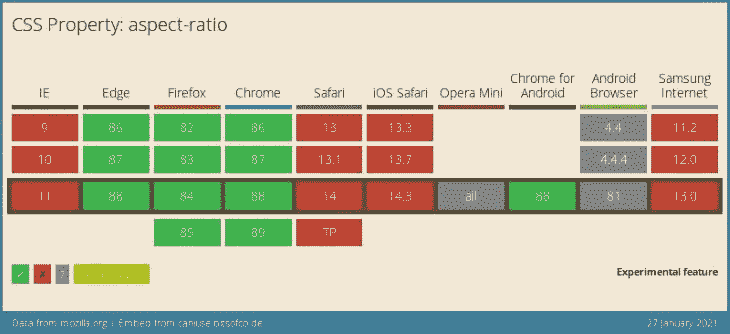

### 进一步阅读

如果您想了解更多信息，可以查看以下资源。

## `Content-visibility`属性

`content-visibility`属性是一个新的 CSS 属性，可以提高页面呈现性能。它使浏览器能够跳过元素的呈现工作，直到需要它时(当元素在视图中时)。如果大部分内容在屏幕外，利用这个属性可以大大减少页面的初始加载时间。

获得`content-visibility`的好处需要您考虑哪些内容必须首先加载，哪些内容可能会被推迟。该属性有一个`auto`选项，让浏览器决定是否可以跳过元素的呈现。

使用此属性时有一些重要的注意事项，例如:

*   页面的高度:浏览器将通过使其`height`为零来使带有`content-visibility: auto`或`content-visibility: hidden`的元素不可见，直到它被呈现。这将改变页面高度和滚动。您可以使用`contain-intrinsic-size`属性给元素一个显式的高度来补偿这一点，这可能是您的猜测，但您不需要精确！Orkan [在本文](https://blog.logrocket.com/using-css-content-visibility-to-boost-your-rendering-performance/)中讨论了这个话题。
*   对可访问性的影响:如果你在一个有标题和地标的部分使用`content-visibility`，当页面加载时，屏幕阅读器将不能访问这些。不幸的是，这降低了内容的可访问性。 [Marcy Sutton 讨论了这个用例](https://marcysutton.com/content-visibility-accessible-semantics),这是她最近为 *Dev.to* 审查的一个拉动式请求。

### 浏览器支持

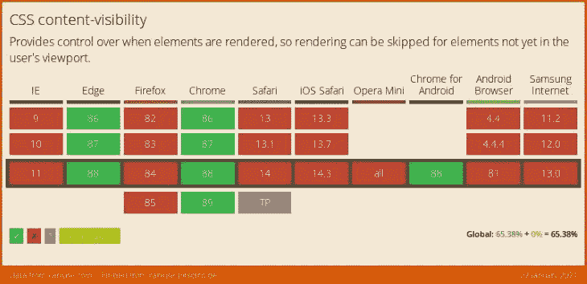

### 进一步阅读

如果您想了解更多信息，可以查看以下资源。

## 逻辑属性

逻辑属性是物理属性的[写模式](https://www.w3.org/TR/css-writing-modes-4/#writing-mode)等价物。它们提供了一种用通用词汇来描述网页布局的方法，这种词汇在不同的语言中是明确的。

例如，对于从左到右的文本，您可以使用`margin-block-start`而不是`margin-left`。

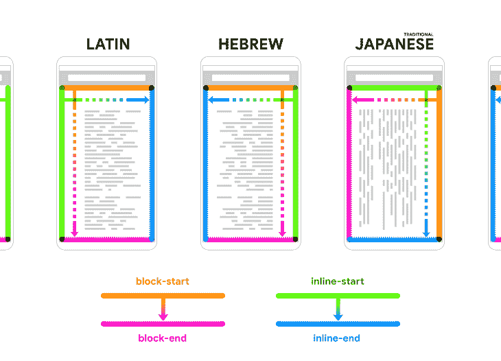

Image credit – [Web.dev](https://web.dev/logical-property-shorthands/)

[Adam Argyle](https://web.dev/logical-property-shorthands/#document-flow) 有一种描述逻辑属性的好方法:

> 逻辑属性是在适用语言方向的上下文中引用盒子模型的边、角或轴的属性。这类似于参考某人的`strong`手臂，而不是假设那是他们的`right`手臂。“右”是物理手臂参考，“强”是逻辑手臂参考，与个人相关。

逻辑属性已经存在很长时间了，但是在大多数浏览器中支持很少。现在，各方面的支持都好了很多。

然而，一些属性的简写版本仍然被认为是实验性的。在这些属性得到广泛支持之前，大规模使用逻辑属性是很棘手的。Elad Schether [在他的文章](https://elad.medium.com/why-css-logical-properties-arent-ready-for-use-c102925a5cba)中讨论了这个话题。

自从他写了那篇文章以来，已经取得了更多的进展(当他写那篇文章时，速记属性还没有实现)，但是我们还没有完全实现！

### 浏览器支持

*   现在，所有主流浏览器都支持`margin`、`border`和`padding`、[的逻辑属性。这些属性的简写版本可以作为实验特性使用。在大多数浏览器中，逻辑边框属性是待定的。](https://caniuse.com/css-logical-props)

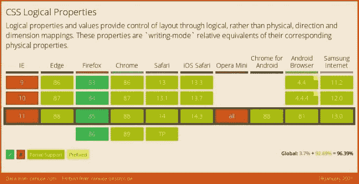

### 进一步阅读

如果您想了解更多信息，可以查看以下资源。

## CSS 子网格

CSS 子网格使得许多困难的布局模式变得更加简单。这是 CSS 网格蛋糕上的糖霜和樱桃。

如果你已经知道 CSS 网格，学习 CSS 子网格就不需要太多的努力。新的语法简洁明了。

从概念上讲，定义为子栅格的栅格与常规嵌套栅格非常相似，但它共享父栅格的轨迹。好处是它提供了一种将嵌套网格与其父网格对齐的方法。

一个常见的例子是具有不同部分的卡片布局。根据内容的不同，这些部分的大小会有所不同。使用常规嵌套网格，您无法在不同卡片之间保持相同部分的垂直对齐(见下文)。

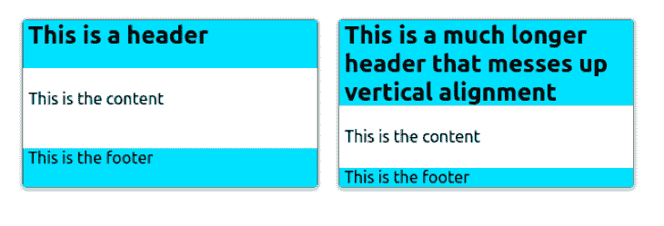

```
.container {
    display: grid;
    grid-template-columns: repeat(2, 1fr);
    gap: 20px;
}

.card {
    display: grid;
}

```

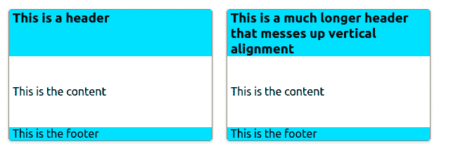

如果我们把卡片改成子网格，我们可以得到垂直对齐的部分。

```
.card {
    display: grid;
    grid-template-rows: subgrid;
    grid-row: auto / span 3;
}

```

您可以立即开始使用该属性，并使用功能查询为任何不支持该属性的浏览器提供后备。

```
@supports not (grid-template-rows: subgrid) {
  .card {
    /* ..alternative layout */
  }
}

```

你可以在[这个 codepen](https://codepen.io/robjoeol/pen/eYBYvNJ) 中探索上面的例子。

### 浏览器支持

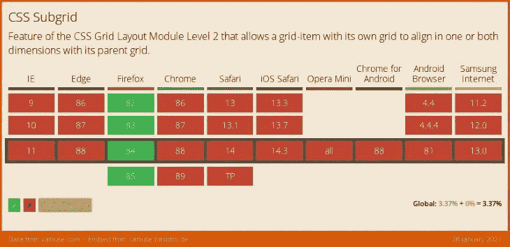

### 进一步阅读

如果您想了解更多信息，可以查看以下资源。

## `color`功能

`color()`函数允许在特定的[色彩空间](https://drafts.csswg.org/css-color/#colorspace)中指定一种颜色，而不是在大多数其他色彩函数运行的隐式 sRGB 色彩空间中。这将允许 web 开发者指定更大范围的颜色。

真正的物理设备还不能产生人眼能看到的每一种可能的颜色。给定设备可以产生的颜色范围称为色域。不同色彩空间的色域可以通过观察可以表达的颜色的体积(立方 Lab 单位)来进行比较。下表显示了 CSS 中可用的[预定义的](https://drafts.csswg.org/css-color/#predefined)色彩空间。

| 彩色空间 | 体积(百万实验室单位) |
| --- | --- |
| sRGB | 0.820 |
| 显示-p3 | 1.233 |
| a98-rgb | 1.310 |
| 正片 rgb | 2.896 |
| rec2020 | 2.042 |
| 实验室 | 6.578 |

结果是, **display-p3 比 sRGB 大 35%左右。**现在许多现代显示器覆盖 100%的显示器-p3 色彩空间。

您可以立即开始使用颜色函数，并通过如下的功能查询提供向后兼容的 sRGB 颜色。

```
/* sRGB color. */
:root {
    --bright-green: rgb(0, 255, 0);
}

/* Display-p3 color, when supported. */
@supports (color: color(display-p3 1 1 1)) {
    :root {
        --bright-green: color(display-p3 0 1 0);
    }
}

header {
    color: var(--bright-green);
}

```

### 浏览器支持

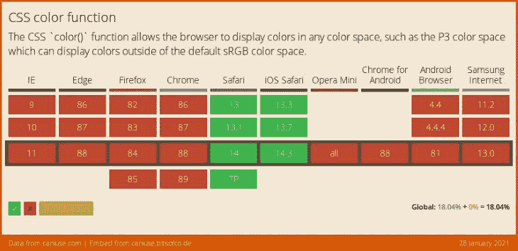

### 进一步阅读

如果您想了解更多信息，可以查看以下资源。

## URL 滚动到文本片段

这是一个 HTML 特性，真的，但是我将把它包含在这里，否则你可能很快就听不到它了！

滚动到文本片段(也称为文本片段)将文本查询附加到 URL。点按链接后，浏览器会在网页中找到文本，将其滚动到视图中，并高亮显示匹配的文本。它们使链接能够指定链接到页面的哪个部分，而不依赖于页面作者用`id`属性注释页面。

片段格式为:`#:~:text=\[prefix-,]textStart[,textEnd\][,-suffix]`。

这里有一个简单的例子，你可以在你的浏览器中测试。


您可以立即开始使用滚动到文本片段，而不会在不支持它们的浏览器中产生任何不良影响。

### 浏览器支持


### 进一步阅读

如果您想了解更多信息，可以查看以下资源。

## 结论

我希望这篇文章已经让你对最新的主要 CSS 特性有了一个清晰的了解，并为它们确定了清晰的用例。在[常青浏览器](https://www.hanselman.com/blog/the-evergreen-web)和[功能查询](https://developer.mozilla.org/en-US/docs/Web/CSS/CSS_Conditional_Rules/Using_Feature_Queries)的时代，早期采用新功能没有任何障碍。挑战在于知道浏览器中实际上有哪些新功能，找时间去了解它们，并随着时间的推移使它们成为你的网页设计武库的一部分。我希望网络社区能够在未来找到更好的方式来宣传这些信息。

## 你的前端是否占用了用户的 CPU？

随着 web 前端变得越来越复杂，资源贪婪的特性对浏览器的要求越来越高。如果您对监控和跟踪生产环境中所有用户的客户端 CPU 使用情况、内存使用情况等感兴趣，

[try LogRocket](https://lp.logrocket.com/blg/css-signup)

.

[](https://lp.logrocket.com/blg/css-signup)[https://logrocket.com/signup/](https://lp.logrocket.com/blg/css-signup)

LogRocket 就像是网络和移动应用的 DVR，记录你的网络应用或网站上发生的一切。您可以汇总和报告关键的前端性能指标，重放用户会话和应用程序状态，记录网络请求，并自动显示所有错误，而不是猜测问题发生的原因。

现代化您调试 web 和移动应用的方式— [开始免费监控](https://lp.logrocket.com/blg/css-signup)。