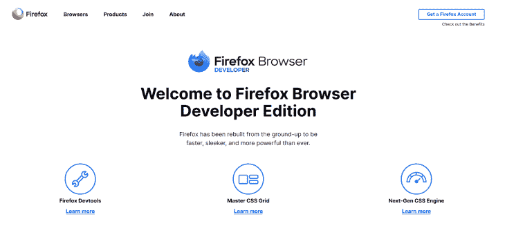
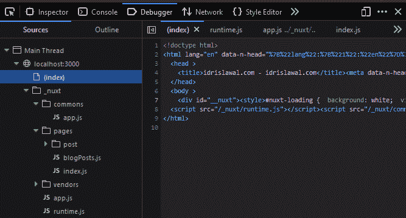
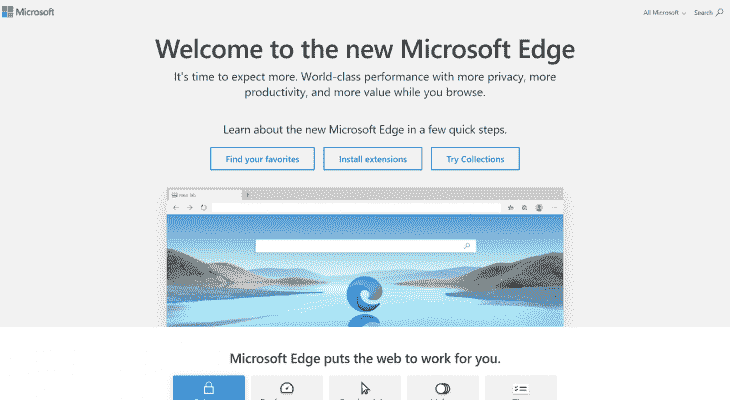
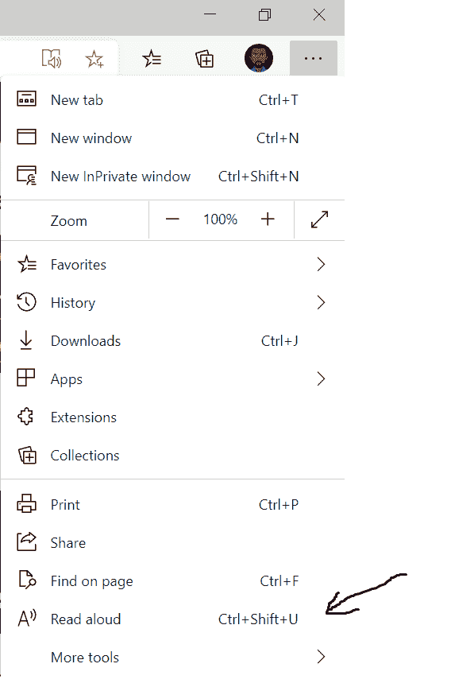
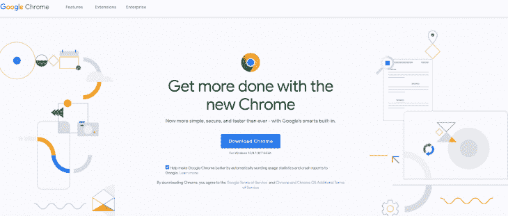
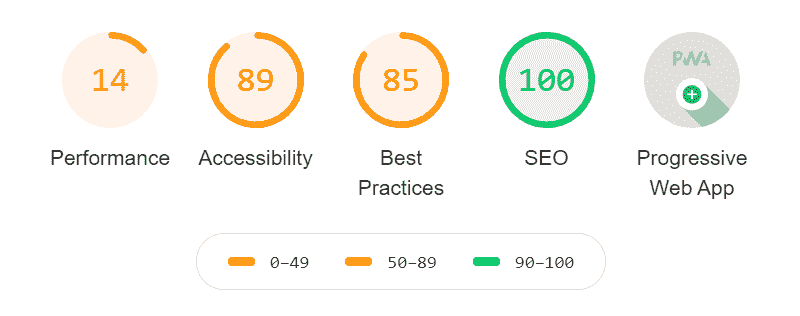
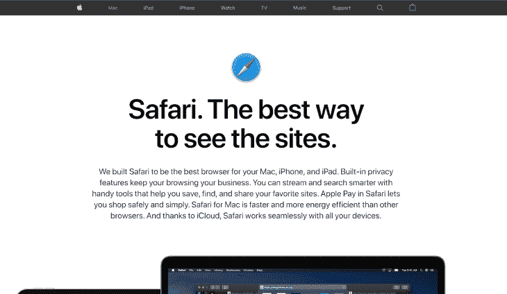
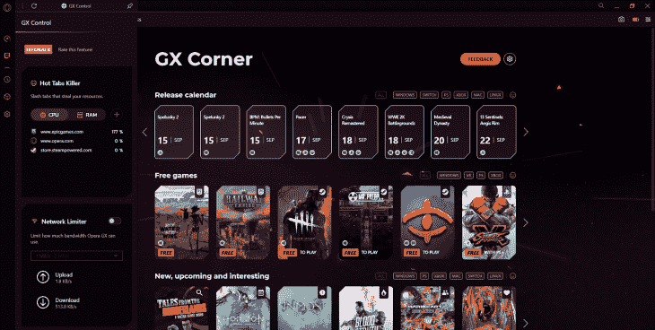

# 所有主流浏览器最重要的功能- LogRocket 博客

> 原文：<https://blog.logrocket.com/the-most-important-features-of-all-major-browsers/>

这些年来，浏览器一直在发展，而且还在不断发展。在早期，网页的内容要简单得多。

Nexus 是蒂姆·伯纳斯·李创造的第一款浏览器。

此后，出现了基于文本的浏览器 LynxMosaic 是第一款允许在文本中嵌入图像的浏览器；20 年后，随着网络技术的发展，浏览器变得更加复杂。

然而，这些年来，有一些独特的功能在许多浏览器中脱颖而出。这些特性、增强和改进通常是 web 技术进步和各种浏览器供应商争夺市场份额的结果。

在这篇文章中，我们将看看当今世界上所有的主流浏览器，以及哪些特性使它们变得重要。

## 火狐浏览器

世界上最流行的网络浏览器之一。它是由 Mozilla 基金会开发的免费开源网络浏览器。

根据[净市场份额](https://netmarketshare.com/)的数据，这款浏览器的使用率在 2009 年达到顶峰，为 32.21%，但由于其他浏览器的竞争，这一数字已经下降。截至 2020 年 9 月，其使用率为 7.11%。

Firefox 使用 Gecko 渲染引擎和 SpiderMonkey 作为其 JavaScript 引擎。

火狐由哪些特性组成？

默认情况下，Firefox 是隐私驱动的。它不断改进其隐私功能。这包括各种现代反跟踪技术，阻止广告跟踪器和点击诱饵。

浏览器的安全性相当重要，Firefox 在这方面做得很体面。默认情况下，用于重定向广告的第三方追踪器在 2019 年以来的所有 Firefox 版本中都被阻止。

### 开发者工具功能

Firefox 预建了标准开发工具，如控制台和视窗大小，供开发人员检查网页响应。然而，Mozilla 甚至在后来的 Firefox 开发者版中提供了额外的功能，为开发者提供了各种更好的工具。

开发人员版包括一个 CSS 网格工具，它为开发人员构建自定义 CSS 网格提供了简单的可视化支持。

它还包括其他可视化编辑网页的工具，如字体调整和通用样式编辑。

它还包含用于 web 优化的性能工具和用于调试应用程序内存泄漏的内存工具。

这个浏览器还有一个内置的 JSON 预览器，可以自动以易于查看的格式呈现 JSON 文件。

此外，它还具有令人印象深刻的 JavaScript 文件调试功能。内置调试器可以在调试的每个点查看变量值，单步执行代码中的每个`call stack`，添加断点，条件断点！全部处于黑暗模式！

这使得 Firefox 开发者版能够提供非常好的开发者体验。

### 支持网络技术

火狐浏览器目前在 caniuse.com 排名第二，这是一个致力于提供当前网络技术和所有主流浏览器兼容性信息的网站。

2017 年以来的所有版本都支持 CSS grid，2014 年以来发布的所有版本都支持 CSS flexbox。

版本 65(2019 年 1 月发布)支持 WebP 图像格式。2017 年以来发布的所有版本的 Firefox 都完全支持 Javascript ES6。

## 边缘

Edge 浏览器是由微软开发的，是停产的 Internet Explorer 的更好替代产品。1995 年发布的 Internet Explorer 一直在微软的每个操作系统上运行，直到它停产。Edge 是微软将用户带回浏览器的一种方式。

Edge 最初的构建使用 EdgeHTML 作为其浏览器引擎，使用 Chakra 作为其 Javascript 引擎。这个版本现在被称为微软 Edge Legacy，根据微软支持部门的消息，对它的支持将于 2021 年 3 月 9 日结束。

2020 年 1 月发布的新 Edge 浏览器现在基于谷歌的开源项目——Chromium。它使用 Blink 浏览器引擎和用于 Javascript 的 V8 引擎。

它有什么特点？

### 辅助功能

微软在其 Edge 浏览器中引入了一些辅助功能，做得很好。一个重要的特性是`Read Aloud`特性，它使用户能够立即阅读任何网页的内容。此功能也可用于阅读在浏览器中打开的 PDF 文件。

它还具有`immersive reader`功能，通过在 windows 笔记本电脑上按下 F9 键，Edge 浏览器可以立即将网页转换为一个高效且不太令人分心的阅读界面。

### PWA 功能

新的基于 chromium 的 Edge 现在有一个`install as app`功能，允许用户直接在他们的设备上安装渐进式网络应用程序。

### 扩展功能

Edge 现在有一些扩展，可以安装在浏览器上以提供额外的功能。虽然，微软的扩展商店还处于测试阶段。

### 支持网络技术

它支持其他基于 Chromium 的浏览器所支持的大多数 web 技术。它完全支持 ES6 和 ES6 类、Fetch API、FileReader API、Web cryptography 等。

## 铬

谷歌 Chrome 可以说是世界上最流行的网络浏览器，也是市场份额最大的浏览器，根据[净市场份额](https://netmarketshare.com/)计算，目前使用率为 69.13%。

这款浏览器于 2008 年首次发布，并从此占领了浏览器市场。其开源铬引擎因其速度和灵活性而受到用户的青睐。

### 安全性

Chrome 通过自动生成强密码在安全领域表现出色。这使得涉及密码的表单注册无缝衔接，并直接将密码保存在谷歌的云密码管理器[passwords.google.com](https://passwords.google.com/)中。

### 扩展功能

Chrome 的扩展市场可以说是最大的。有超过一万个扩展，用户可以在网上找到几乎任何他们需要的扩展。

### 轮廓

Chrome 有一个配置文件功能，可以与登录用户的帐户立即同步，并将用户的浏览数据直接保存到用户的谷歌帐户，这样当用户在另一台电脑上登录另一个 Chrome 浏览器时，他们的浏览器数据将被迁移到新电脑上。

Chrome 开发工具很受用户欢迎。它使开发人员能够拥有无数的特性，甚至可以通过扩展来进一步改进。典型的 devtools 包括从 Elements inspection 到用于 JavaScript 错误的控制台，用于查看文件加载请求和 API 调用的 network 选项卡，以及其他性能工具，如 Lighthouse，它使用户能够准确地测量他们的网站或 web 应用程序的性能、此类网站的 SEO 以及速度。

还可以安装附加功能，如用于构建 React 应用程序的 React devtools 和用于 Vue.js 和 Nuxt.js 应用程序的 Vue devtools，以及许多其他框架工具。

# 旅行队

苹果的 Safari 浏览器是 2003 年为麦金塔操作系统发布的。迄今为止，这款浏览器已经出现在每一款苹果设备上。

浏览器使用苹果的 Webkit 引擎和 Nitro JavaScript 引擎。根据[净市场份额](https://netmarketshare.com/)，Safari 浏览器目前在全球的使用率为 3.69%。

已知的最后一个针对 Windows 操作系统发布的 Safari 版本是 2012 年发布的 Safari 5.1.7。

因此，与其他浏览器不同，新款 Safari 目前仅适用于 macOS。

Safari 最重要的功能是什么？

### 隐私和安全

Safari 在保护用户安全方面做得不错。该浏览器具有有效的第三方跟踪阻止功能，可防止第三方 cookies 通过网络上的定向广告跟踪用户。

它还提供指纹保护。

浏览器指纹是通过浏览器与设备的交互收集的关于设备的一条信息。这些信息可能非常详细，包括设备运行的操作系统、设备规格、设备语言以及设备的独特画布指纹，任何人都可以通过网络识别您的设备，即使设备上没有 cookies。

还有苹果提到的沙盒功能，它可以保护用户的设备免受网络上恶意脚本的攻击，这样每个标签都会在自己的沙盒中打开，并且在受到攻击时不会感染其他标签或系统文件。

### 扩展ˌ扩张

Safari 也有一个扩展商店，用户可以在那里找到有益的扩展来改善他们的浏览体验。它可能不像其他浏览器那样健壮，但是它确实有一些在其他浏览器中可能找不到的扩展。

### 支持网络技术

Safari 支持 PWA。它还支持一些 ES6 APIs，比如地理定位 API。此外，它还部分支持来自 DOM 元素 API 的媒体捕获，如来自`<video>`、`<audio>`和`<canvas>`的捕获。然而，不包括`<video>`和`<audio>`。

Safari 还完全支持网络动画 API 等。

它完全支持 CSS 3 框大小、框阴影、选项卡大小、颜色、抓取和抓取光标、CSS3 光标(iOS Safari 上不可用)以及版本 14 和 TP 中的 CSS 不透明度。

## 歌剧

opera Software ASA 打造的 Opera 浏览器在浏览器市场可谓家喻户晓。这款浏览器自 1995 年首次发布以来一直在积极开发，是这方面最老的浏览器。

Opera 浏览器使用 Blink 布局引擎，与 Chrome 和现在的 Edge 一样。它以前的 JavaScript 引擎被称为 Carakan，后来在 V8 上放弃了。

它的界面设计不同于其他浏览器，后者操作的是自顶向下的浏览器设计。Opera 的功能在左侧窗格中打开。

根据 NetMarketShare 的数据，它的使用率为 1.2%。

其特点包括:

### 隐私

Opera 一直致力于维护用户的隐私。它是第一个提供免费内置 VPN(虚拟专用网)的主流浏览器。这允许用户在保持匿名的情况下上网冲浪。它还可以阻止广告、跟踪器和未经请求的 pop。

### 游戏支持

Opera 也是第一个通过其 Opera GX 浏览器直接支持游戏的主流浏览器。GX 歌剧院是专门为在线游戏环境设计和建造的。

它还具有控制系统资源使用的工具，例如 RAM 使用限制、CPU 使用限制、网络使用限制。和相关的计量器，以通知游戏者在游戏时使用了多少系统资源。

### 设备间同步

Opera 有一个名为 My Flow 的功能，允许桌面应用程序通过其移动应用程序 Opera touch 与移动设备即时共享文件和信息。移动应用通过扫描二维码来验证桌面应用。

这允许从桌面到移动设备快速共享文件和/或文本。用户还可以共享书签和链接。

### 支持网络技术

Opera 支持其他主要浏览器支持的大多数 web 技术，包括 CSS 伪元素选择器、CSS paint API(仅在 Chrome 和 Opera 上可用(仍在 Safari 中处于试验阶段)、Javascript 地理定位 API、indexedDB、MediaRecorder API(仍在 Safari 中处于试验阶段)、web USB(允许通过 USB 与设备进行 Web 通信，仅在 Chrome 和 Opera 上可用)、Web 蓝牙等。

## 结论

值得一提的是，用户也发现其他浏览器非常有用。其中包括 Vivaldi，这是一个基于 Chromium 的 Opera 风格的浏览器，被认为是非常快速和私密的。

JavaScript 开发者 Brendan Eich 创建的勇敢浏览器是一款非常受欢迎的关注隐私的浏览器。Brave 有`shields`，部署用来屏蔽各种追踪器和广告。

这也是众所周知的非常快。事实上，它号称是最快的。勇敢浏览器也可以直接安装 Chrome 扩展。

同样，UC 移动浏览器在浏览器市场占有相当大的份额，全球用户超过 1 亿。

下面是由[净市场份额](https://netmarketshare.com/)捕获的浏览器当前使用统计的表格。

Chrome 目前占据了很大的市场份额，但 Firefox 和 Edge 等浏览器仍在争夺浏览器的主导地位。Internet Explorer 仍然有相当多的用户群。这些企业倾向于将他们的一些工具迁移到新的浏览器上。

你喜欢浏览器的哪些功能，你用的是哪些？

## 通过理解上下文，更容易地调试 JavaScript 错误

调试代码总是一项单调乏味的任务。但是你越了解自己的错误，就越容易改正。

LogRocket 让你以新的独特的方式理解这些错误。我们的前端监控解决方案跟踪用户与您的 JavaScript 前端的互动，让您能够准确找出导致错误的用户行为。

LogRocket 记录控制台日志、页面加载时间、堆栈跟踪、慢速网络请求/响应(带有标题+正文)、浏览器元数据和自定义日志。理解您的 JavaScript 代码的影响从来没有这么简单过！

[Try it for free](https://lp.logrocket.com/blg/javascript-signup)

.