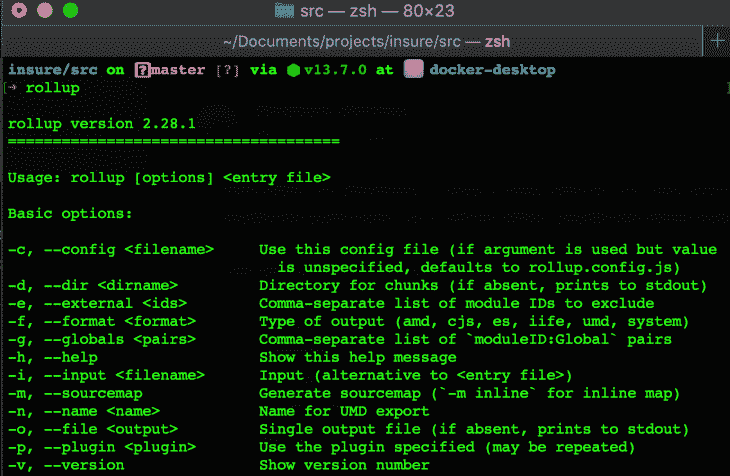
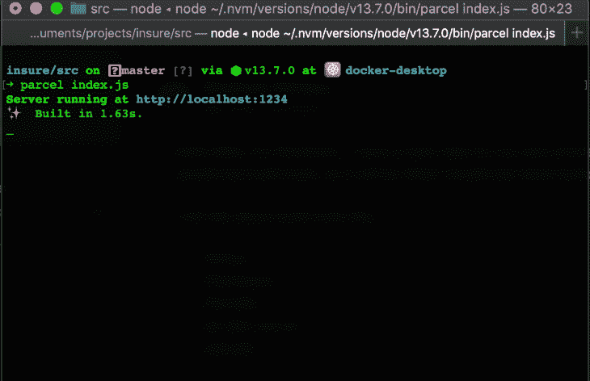
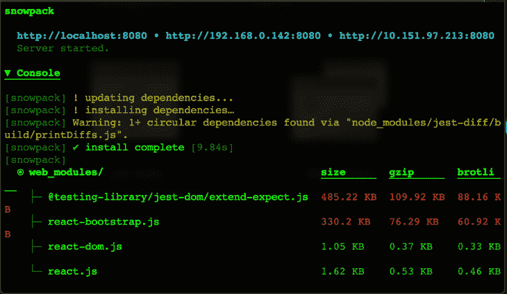
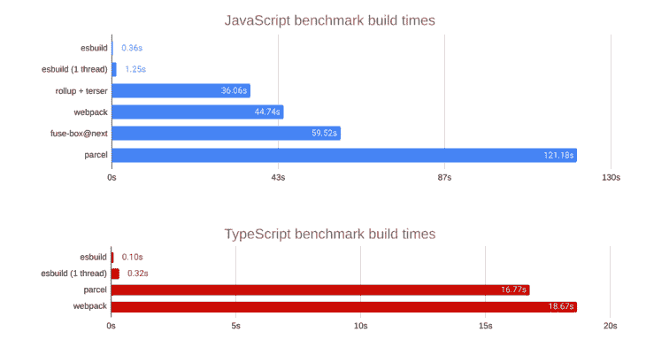

# JavaScript 的顶级最新构建工具- LogRocket 博客

> 原文：<https://blog.logrocket.com/the-top-latest-build-tools-for-javascript/>

## 介绍

多年来，我们已经看到了各种 JavaScript 构建工具的出现，从 Google Closure Tools 时代一直到今天。JavaScript 构建工具有了很大的改进，尤其是在构建时间、速度、定制、配置和可扩展性方面。

在本文中，我们将探索 JavaScript 生态系统使用的最新构建工具。

## 先决条件

对于本教程，您需要以下内容:

## Rollup.js



据其官方网站称，“ [Rollup](https://rollupjs.org/guide/en/) 是 JavaScript 的一个模块捆绑器，它将小块代码编译成更大更复杂的东西，比如一个库或应用程序。”它的第一个版本于 2018 年 12 月发布，但直到 2019 年底才开始流行。

目前在版本 2 中，Rollup 已经成为构建 JavaScript 包和模块的标准。它已经被世界各地的一些组织和个人开发者所采用。

### 使用 Rollup.js 的优点

以下是 Rollup 为 JavaScript 开发人员提供的一些很酷的特性:

*   快速构建
*   它很容易学习和入门，也很容易发布 JavaScript 包
*   代码分割
*   与 Webpack 相比，配置更少、更简单
*   非常适合 JavaScript 库
*   用于更好构建和定制的插件，以及定制插件支持
*   它提供了一个更小的包，并产生干净的代码
*   为 [ES 模块](https://developer.mozilla.org/en-US/docs/Web/JavaScript/Guide/Modules)提供强大的支持

### 使用 Rollup.js 的缺点

*   对异步/等待没有现成的支持

### Rollup.js 入门

要开始使用 Rollup，您需要通过运行以下命令在您的计算机上安装该软件包:

```
npm install --global rollup

```

此命令将全局安装汇总，因此当您下次需要它时，不需要在您的计算机上重新安装它。

如果需要，您可以通过运行以下命令在本地为您的计算机上的特定项目安装它:

npm

```
npm install rollup --save-dev

```

故事

```
yarn -D add rollup

```

如果全局安装了 Rollup，则可以通过运行以下命令快速启动它，具体取决于您的开发环境:

对于浏览器:

```
rollup <your application entry point> --file bundle.js --format iife

```

此命令将编译应用程序入口文件(例如 main.js 或 script.js)中的代码，包括将其导入到单个文件(bundle.js)中，然后将其作为脚本标记中的 IIFE(立即调用的函数表达式)提供给浏览器。

对于 [Node.js](https://nodejs.org/en/) :

```
rollup <your application entry point> --file bundle.js --format cjs

```

该命令将以 CommonJS 格式(例如 main.js 或 script.js)编译应用程序入口文件中的代码，包括将其导入到单个文件(bundle.js)中，以便 Node.js 可以识别和执行它。

对于浏览器和 Node.js:

```
rollup <your application entry point> --file bundle.js --format umd --name "myBundle"

```

这将把 UMD 格式的应用程序代码编译成一个文件(bundle.js ),供浏览器和 Node.js 使用

如果在本地安装了 Rollup，可以通过在项目的根文件夹中运行以下命令来启动它:

npm:

```
npx rollup --config

```

纱线:

```
yarn rollup --config

```

### 结束语

Rollup 可能不像现在可用的其他构建工具那样是全新的，但它已经被许多 JavaScript 开发人员采用。在我看来，如果您的 JavaScript 包或库需要一个构建工具或捆绑器，Rollup.js 是您的最佳选择。

关于如何在你的项目中使用 Rollup.js 的更多信息，你可以查看教程和官方文档[这里](https://rollupjs.org/guide/en/#tutorial)。

## 包裹



[Parcel](https://parceljs.org/) 是生态系统中最新的 JavaScript 捆绑器之一。它的官方文档将它描述为“一个 web 应用捆绑器，以其开发者经验而与众不同。”

2019 年发布的 Parcel 速度很快，不像 Rollup.js 和 Webpack 那样需要零配置。它本质上是一个即插即用的捆绑器，在本文发布时，它目前处于版本 2，beta 1。

通过获取所有项目文件和依赖项，转换它们，然后将它们合并成可用于执行您的代码的较小文件片段，来打包您的代码。

在 v2 版本的[文档](https://v2.parceljs.org/)中，Parcel 被称为“所有代码的编译器，不管是什么语言或工具链。”

### 使用包裹的好处

*   惊人的快速构建
*   出色的开发人员体验
*   零配置—只需安装并开始使用
*   插件支持，虽然你不一定需要插件
*   自定义插件支持
*   多核处理
*   支持低级语言，如 Rust 和任何编译成 WebAssembly 的语言(WASM)
*   [热模块更换](https://parceljs.org/hmr.html) (HMR)支持开箱
*   支持开箱即用的代码分割
*   支持低级语言，如 rust 和 WASM
*   支持即时可用的 React 和 Typescript

### 使用包裹的缺点

*   尝试使用最新的 ES7 功能(构造)时会出现一些问题
*   当开发者为[巴别塔](https://babeljs.io/)增加一些额外的插件时，高复杂性就出现了

### 包裹入门

Parcel 是一个零配置构建工具，因此入门很容易。首先，通过运行以下命令在项目中安装包:

纱线:

```
yarn global add parcel-bundler

```

npm:

```
npm install -g parcel-bundler

```

将它安装到项目中(或全局安装)后，您可以通过运行以下命令来捆绑您的项目:

```
parcel <your application entry point>

```

Parcel 提供了一个快速开发服务器，它会在您进行任何更改时自动重新构建您的应用程序代码。它还支持热模块替换，以提高您的开发速度。

### 生产建筑

您可以通过运行以下命令来构建用于 Parcel 生产的应用程序代码:

```
parcel <your application entry point>

```

### 结束语

Parcel 是一个很棒的编译器，大多数任务都不需要使用插件。当第二版最终面向公众推出时，它将是一个游戏规则的改变者。

package 的零配置特性及其对低级语言的支持，如 [Rust](https://www.rust-lang.org/) 和 [WebAssembly](https://webassembly.org/) 使其具有多种用途，而不仅仅是 JavaScript 生态系统。

关于如何在你的项目中使用 package 的更多信息，你可以查看它的官方文档[这里](https://parceljs.org/getting_started.html)，它的 v2 文档仍在开发中[这里](https://v2.parceljs.org/)。

## 积雪场



根据其官方网站“snow pack 是一个现代的前端构建工具，用于更快的网络开发。它取代了开发工作流程中更重、更复杂的捆扎机，如 Webpack 或 package。”

Snowpack 是作为 Webpack 和 package 的替代品而建立的，这是它的主要卖点。它最大的特点是跳过了开发中的捆绑过程，因为不需要构建任何东西，所以开发速度很快。这是一个比 Webpack、Rollup 和 package 更快的构建工具。

Snowpack 在[版本 2.7](https://www.snowpack.dev/posts/2020-07-30-snowpack-2-7-release/) 。你也可以在这里阅读我关于 Snowpack v2 [发布的文章。](https://blog.logrocket.com/whats-new-in-snowpack-2-0/)

### 积雪场的特点

*   O(1)构建时间
*   生产中不捆绑
*   闪电般的构建
*   热模块更换支持
*   对类型脚本、JSX、CSS 模块等的现成支持
*   简单的工具
*   面向开发者的应用模板

### 使用积雪场的缺点

*   无内置生产捆扎机

### 入门指南

要开始使用 Snowpack，您需要首先在您的项目中安装它，并启动它的开发服务器。您可以通过运行以下命令来实现这一点:

### 装置

npm:

```
npm install --save-dev snowpack

```

纱线:

```
yarn add --dev snowpack

```

据其官网介绍，Snowpack 也可以全球安装，但我建议你安装在本地。

### 启动开发服务器

以下命令将启动 Snowpack 开发服务器并在本地加载您的站点:

```
snowpack dev

```

### 生产建筑

接下来，构建您的生产应用程序:

```
snowpack build

```

*注意:Snowpack 没有内置的产品捆绑器，因为它给了你一个优化版本的代码。如果您需要为生产构建应用程序，您可以通过插件轻松地将其连接到您最喜欢的捆绑器。*

### 结束语

Snowpack 是下一代构建工具，它利用 es 模块来快速交付构建并跳过开发中的捆绑过程。它还有助于加快开发环境的构建，即使您的代码库在增长。

关于如何在你的项目中使用 Snowpack 的更多信息，你可以查看它的官方文档[这里](https://snowpack.dev)。

## msbuild


esbuild 是速度极快的下一代 JavaScript 捆绑器和迷你器。它将 JavaScript 和 TypeScript 代码打包，以便在 web 上分发。它是用 Go 写的，速度非常快。它也比其他捆扎机更轻，包括包裹和网袋。

下面是其 JavaScript 和 TypeScript 基准测试的图表:



它仍然是实验性的，目前版本为 0.72，正在积极开发中。

### esbuild 的功能

*   极快的构建速度
*   Typescript、JavaScript 和 JSON 的加载器
*   缩小
*   代码分割支持
*   集束
*   摇树
*   支持各种输出格式，如 CJS，生活，和 ESM
*   源地图生成
*   将 JSX 和较新的 JS 语法翻译到 ES6

### 使用 msbuild 的缺点

*   仍然是实验性的，所以还没有主要版本
*   没有人力资源管理

### 入门指南

esbuild 仍处于高度试验阶段，但可以通过运行以下命令进行安装:

### 装置

npm:

```
npm install --save-dev esbuild

```

纱线:

```
yarn add --dev esbuild

```

您也可以通过运行以下命令在本地安装 esbuild:

```
npm install --global esbuild

```

### 使用 msbuild

例如，如果您有一个如下所示的 React 文件:

```
//hello.tsx
import * as React from 'react'
import * as ReactDOM from 'react-dom'

ReactDOM.render(
  <h1>Hello, esbuild!</h1>,
  document.getElementById('root')
);

```

我们可以通过运行以下命令来捆绑它进行开发:

```
esbuild hello.tsx --bundle '--define:process.env.NODE_ENV="development"' --outfile=src.js

```

我们还可以通过运行以下命令将其打包用于生产:

```
esbuild hello.tsx --bundle '--define:process.env.NODE_ENV="production"' --outfile=build.js

```

### 结束语

esbuild 是一个新的实验性 JavaScript 捆绑器，但是它速度很快，并且提供了对 TypeScript 的开箱即用支持。

有关 esbuild 的更多信息，请访问网站[此处](https://github.com/evanw/esbuild)。

## 小包裹

Packem 是一个预编译的 JavaScript bundler，主要在 Rust 中实现。它还可以编译其他文件类型，如 YAML/TOML。Packem 使用 YAML 而不是 JSON 来构建配置数据。

### 使用 Packem 的优点

*   它比包裹快两倍
*   轻量级和高效的构建输出
*   简单的配置
*   用于数据结构化的 YML
*   动态导入的代码分割支持
*   用于更好开发体验的插件

### 使用包装的缺点

*   播种一个更加冗长的 API
*   它的采用率很低

### 装置

要安装 Packem，请在终端中运行以下命令:

npm:

```
npm install -g packem

```

纱线:

```
yarn global add packem

```

### 创建配置文件

为了在您的项目中使用 Packem，您必须在项目的根文件夹中创建一个`.packemrc`文件。该文件将包含项目所需的所有配置选项。在这个文件中，您需要定义以下字段:

```
input: "./src/index.js"
output: "./dist/bundle.js"
format: "iife"

```

`input`字段是捆绑过程开始的地方，而`output`字段是最终连接的捆绑包结束的地方。您需要指向一个现有的文件(没有动态文件创建)来获得正确的输入点。`format`选项将保存您希望 JavaScript 文件被处理的格式。Packem 会根据您的定义来处理余下的过程。

为了构建您的项目，您需要在项目的根文件夹中运行`pakem`。那你就可以走了。

### 结束语

Packem 是一个简洁的构建工具，特别是因为它是基于 Rust 的，所以它使用 YML 进行数据结构化。它也很轻。采用率仍然很低，但是考虑到 JavaScript 正逐步转向基于 Rust 的工具，它应该很快会被更广泛地采用。

## 结论

在这篇博文中，我们探索了许多开发人员使用的各种 JavaScript 构建工具。展望未来，我们预计构建工具将继续拥有更快的构建，以及更好的定制和零原型化和配置，更多的开箱即用支持，以及更多以 Rust 为中心的核心技术。

## 您是否添加了新的 JS 库来提高性能或构建新特性？如果他们反其道而行之呢？

毫无疑问，前端变得越来越复杂。当您向应用程序添加新的 JavaScript 库和其他依赖项时，您将需要更多的可见性，以确保您的用户不会遇到未知的问题。

LogRocket 是一个前端应用程序监控解决方案，可以让您回放 JavaScript 错误，就像它们发生在您自己的浏览器中一样，这样您就可以更有效地对错误做出反应。

[](https://lp.logrocket.com/blg/javascript-signup)[https://logrocket.com/signup/](https://lp.logrocket.com/blg/javascript-signup)

[LogRocket](https://lp.logrocket.com/blg/javascript-signup) 可以与任何应用程序完美配合，不管是什么框架，并且有插件可以记录来自 Redux、Vuex 和@ngrx/store 的额外上下文。您可以汇总并报告问题发生时应用程序的状态，而不是猜测问题发生的原因。LogRocket 还可以监控应用的性能，报告客户端 CPU 负载、客户端内存使用等指标。

自信地构建— [开始免费监控](https://lp.logrocket.com/blg/javascript-signup)。