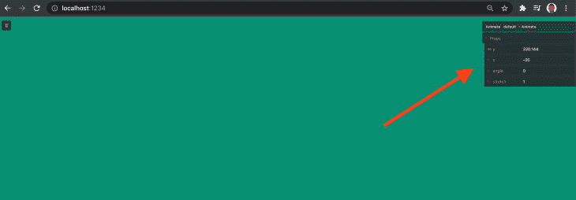

# Theatre.js:在 JavaScript 中创建复杂而强大的动画

> 原文：<https://blog.logrocket.com/theatre-js-creating-intricate-powerful-animations/>

相对较新的 [Theatre.js](https://www.theatrejs.com/) 在开发领域引起了很多讨论。那么，它只是另一个 JavaScript 动画库吗？

答案是不，不是真的。Theatre.js 是一个运动图形库，可以让你轻松构建强大的动画。据[创作者](https://github.com/ariaminaei/theatre)介绍，“Theatre.js 是一个高保真运动图形的动画库。它旨在帮助您表达详细的动画，使您能够创建复杂的运动，并传达细微差别。”

此外，与其他 JavaScript 和 CSS 动画库不同，Theatre.js 是一个带有图形用户界面(GUI)的动画库。GUI 允许您使用集成到浏览器中的编辑器可视化地构建动画。

它实际上把你的浏览器变成了一个动画工作室——你很可能只需要写设置代码，仅此而已。

它甚至制作了 [DOM](https://developer.mozilla.org/en-US/docs/Web/API/Document_Object_Model/Introduction) 、 [WebGL](https://developer.mozilla.org/en-US/docs/Web/API/WebGL_API) 、 [Three.js](https://threejs.org/) 、HTML 和其他 JavaScript 变量的动画，这意味着你可以设置它，甚至允许非开发人员使用 Theatre.js 编辑器在浏览器上制作动画。

这里有一个例子:


在本文中，我们将探索如何用 JavaScript 和 Theatre.js 建立和创建自己的动画实验室。

## 要求

## 设置 Theatre.js

你可以将 Theatre.js 与 vanilla JavaScript 或任何 JavaScript 库(如 React 或 Angular)一起使用。在本文中，我们将使用带有普通 JavaScript 和[包裹构建工具](https://parceljs.org/)的 Theatre.js。

首先，我们创建一个目录，用`npm init`初始化，运行下面的命令安装 Theatre Core 和 Theatre Studio。Theatre Core 是主库，而 Theatre Studio 是编辑器，你只需要在设计和开发中使用它。

剧院核心:

```
npm install @theatre/core --save

```

剧院工作室:

```
npm install @theatre/studio --save-dev

```

接下来，我们将创建运行应用程序所需的必要文件。为了便于理解，我为本文创建了一个样板文件。在你的终端上运行`git clone [https://github.com/ezesundayeze/theatrejs](https://github.com/ezesundayeze/theatrejs)`来获取它的副本。

编辑包含以下内容的 HTML 文档:

```
src/index.html

<style>
  body {
    background: rgb(6, 143, 113);
    margin: 0;
  }
  #box {
    position: absolute;
    width: 100%;
    top: 0;
    height: 50%;
    display: flex;
    justify-content: center;
    align-items: flex-end;
    gap: 8px;
    --box-size: 40px;
  }
  .boxContainer {
    width: var(--box-size);
    position: relative;
  }

</style>
<div class="boxContainer">
  <div id="box"></div>
</div>
<script type ="module" async src="index.ts"></script>

```

接下来，让我们添加链接到 HTML 的 JavaScript 代码。创建一个`index.js`文件，导入剧院和剧场工作室，如下图所示:

```
import * as core from "@theatre/core";
import studio from "@theatre/studio";

```

之后，通过在现有代码中添加`studio.initialize()`来初始化 Theatre Studio。它现在应该是这样的:

```
import * as core from "@theatre/core";
import studio from "@theatre/studio";

studio.initialize()

```

使用`npm run dev`运行应用程序，查看剧院工作室的运行情况。页面左上角的小图标显示 Studio 处于活动状态。


然而，我们仍然不能做任何事情，因为我们的工作室设置还没有完成。

在 Theatre.js 中，您会遇到并使用以下内容:

*   项目
*   工作表
*   目标
*   顺序

让我们把它们放在我们的工作室里。

### Theatre.js 中的项目

Theatre.js 中的一个项目是所有动画工作都将在其中完成的工作空间。在导入 Theatre.js 和 Studio 后，创建项目就像在代码中添加以下代码行一样简单:

```
const project = core.getProject("soccer ball Animation");

```

### 在 Theatre.js 中使用表单

薄片类似于 React 中的组件。它包含一起制作动画的对象，一个项目中可以有多个表单。

将图纸添加到项目的方法如下:

```
js
const ballSheet = project.sheet("ballSheet");

```

### 目标

Theatre.js 中的对象是指要制作动画的实际对象。在这个对象中，我们将设置想要制作动画的默认属性。可以在动画编辑器中修改这些道具，以创建我们想要的动画外观。

以下是如何添加对象道具的示例:

```
const ballObj = sheet.object("ballSheet", {
    y: 100,
    x: 150,
    angle: 0,
    stretch:1
});

```

让我们来看看当您运行应用程序时，对象属性如何在编辑器中显示为控件。你需要将它们从左向右滑动，反之亦然，以获得想要的动画。



### 顺序

序列定义了相关项目相互跟随的顺序和方式。在 Theatre.js 中，序列定义了对象属性移动的顺序。正是这种运动创造了真正的动画。

以下部分允许您创建和修改序列:


每个序列都有一个`[position](https://docs.theatrejs.com/in-depth/#sequence-position)`，它决定了动画的进度。条形图顶部的数字显示了对象在某个实例中的位置。默认单位是秒。

## 在 Theatre.js 中创建动画

所以，让我们给我们最初使用的 HTML 添加一些动画。首先，选择目标元素，添加我们打算使用的图像(不要求它是图像，您可以创建形状或动画任何项目)，并添加一些基本的 CSS 来对齐页面上的元素。

```
const boxDiv = document.getElementById("box");
const ball = document.createElement("img");
ball.src = "soccer ball.png";
boxDiv.appendChild(ball);
ball.style.position = "absolute";
ball.style.width = "100px";
ball.style.height = "100px";

```

对于这个例子，我将通过点击足球来开始动画。所以，我们给球元素加一个`eventListener`。

```
ball.addEventListener("click", () => {
    const sequence = sheet.sequence.play({ iterationCount: Infinity, rate: 1, range: [1, 6] })
});

```

当球被点击时，我们可以通过调用`sequence.play()`方法来播放序列。您可以通过传递一个带有属性的对象来自定义序列，比如设置序列速度的`rate`，以及设置您希望序列播放的次数的`iterationCount`。


在上面的例子中，我将它设置为永远播放。`Range`是您希望它运行的位置范围。我们将我们的设置为从位置`1`运行到`6`。你可以在[文档](https://docs.theatrejs.com)中找到更多道具。

为了查看动画进展，我们将使用 ball 对象的`.onValueChange`方法，然后设置 CSS 转换以匹配预期的行为。

```
ballObj.onValuesChange(({ y, x, angle, stretch }) => {
boxDiv.style.cssText = `
    transform: translateX(${x}px) rotate(${angle}deg) translateY(${y}px) scale(${1 / stretch}, ${stretch});
`;
});

```

在转换中(`transform`向一个元素添加一个 2D 或 3D 转换)，我们使用`translateY`和`translateX`属性来修改转换的行为。

我们现在已经建立了我们的 Theatre.js 动画工作室来制作足球的动画。您可以在下面查看这一操作，或者点击此[链接](https://c039j.csb.app/)查看 [CodeSandbox](https://codesandbox.io/s/late-pond-c039j?file=/src/index.js) 上的演示。

在制作过程中，您可能需要关闭工作室。您可以通过调用`studio.ui.hide()`方法来实现。要在开发中恢复它，调用`studio.ui.restore()`方法。

最后，在玩了工作室并为对象创建了你想要的动画后，你可以通过点击**项目**，然后**导出**来导出工作室状态，如下所示。


现在，您可以将此状态链接到您的项目，方法是将其导入并添加到您的项目实例中，如下所示:

```
import state from "./state.json"
const project = core.getProject("soccer ball Animation", {state});

```

恭喜你，你已经建立了你的剧院工作室，并探索了它的一些功能。我们只是触及了表面。请记住，还有很多东西需要学习，因为这个项目还不到两个月，在撰写本文时仍在开发中。

## 结论

Theatre.js 是一个了不起的项目，它让你有能力创建自己的动画工作室。这有可能塑造网络动画生态系统，因为它从社区中收集了更多的采用，所以现在是一个很好的时间来开始探索 [Theatre.js](https://github.com/ariaminaei/theatre) 或 [contribute](https://github.com/AriaMinaei/theatre/blob/main/CONTRIBUTING.md) 来进一步开发这个库。

## 您是否添加了新的 JS 库来提高性能或构建新特性？如果他们反其道而行之呢？

毫无疑问，前端变得越来越复杂。当您向应用程序添加新的 JavaScript 库和其他依赖项时，您将需要更多的可见性，以确保您的用户不会遇到未知的问题。

LogRocket 是一个前端应用程序监控解决方案，可以让您回放 JavaScript 错误，就像它们发生在您自己的浏览器中一样，这样您就可以更有效地对错误做出反应。

[](https://lp.logrocket.com/blg/javascript-signup)[https://logrocket.com/signup/](https://lp.logrocket.com/blg/javascript-signup)

[LogRocket](https://lp.logrocket.com/blg/javascript-signup) 可以与任何应用程序完美配合，不管是什么框架，并且有插件可以记录来自 Redux、Vuex 和@ngrx/store 的额外上下文。您可以汇总并报告问题发生时应用程序的状态，而不是猜测问题发生的原因。LogRocket 还可以监控应用的性能，报告客户端 CPU 负载、客户端内存使用等指标。

自信地构建— [开始免费监控](https://lp.logrocket.com/blg/javascript-signup)。