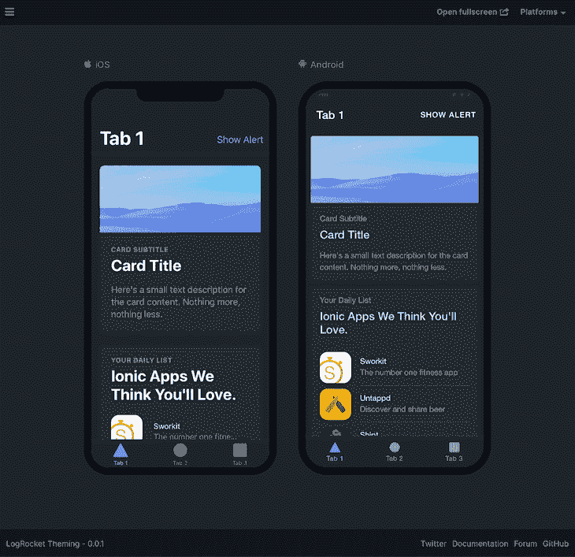
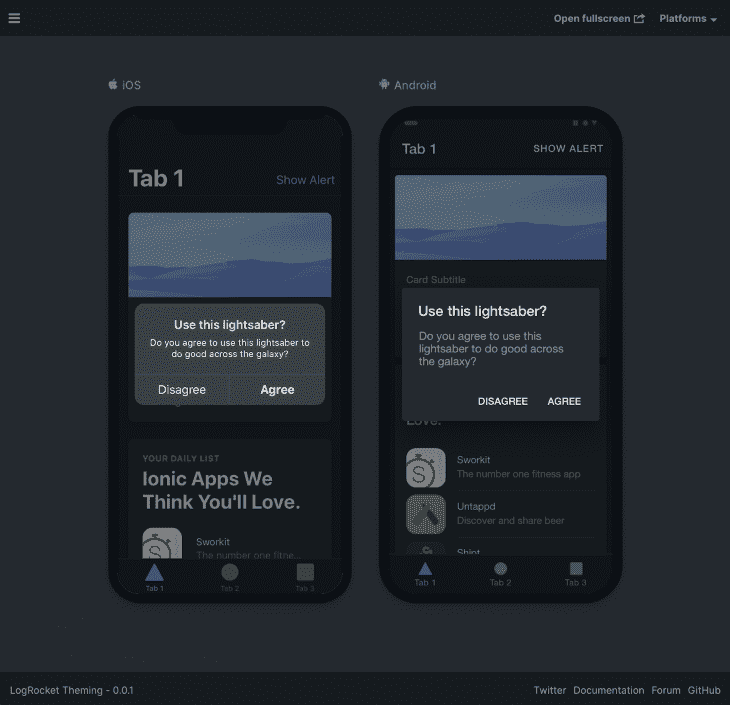
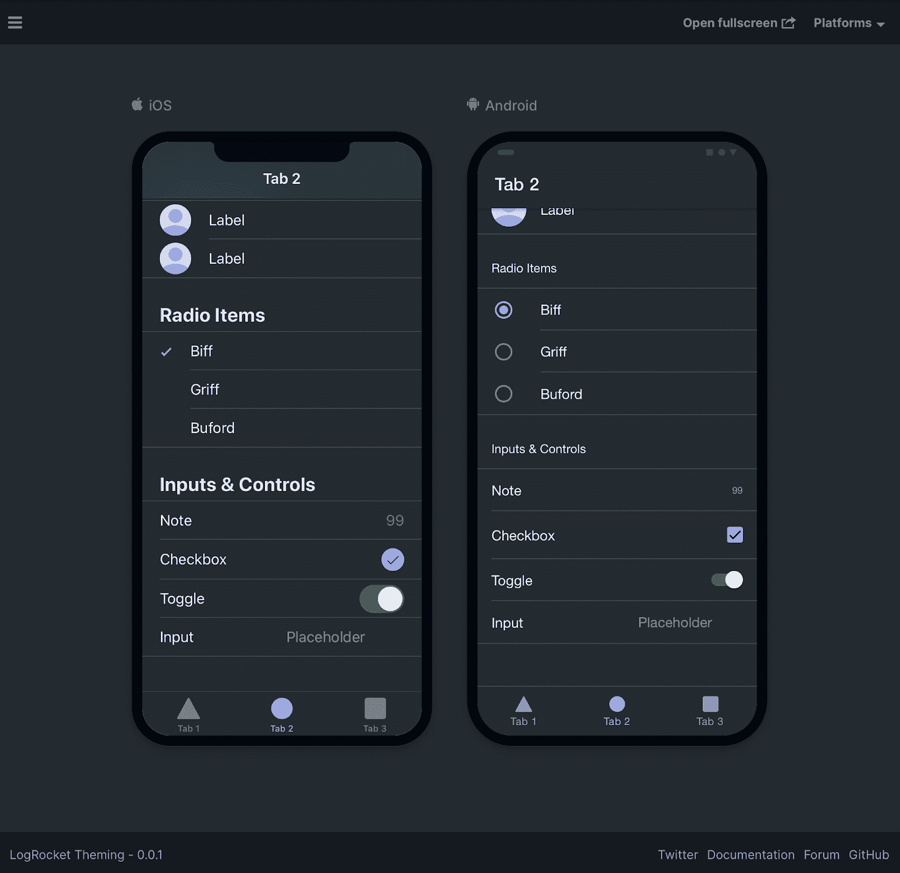

# 使用 Ionic 进行主题化和定制

> 原文：<https://blog.logrocket.com/theming-customization-with-ionic/>

Ionic Framework 是一个开源 UI 工具包，用于使用 web 技术(HTML、CSS、JavaScript)构建高性能、高质量的移动和桌面应用。它可以与普通的 JavaScript 一起使用，并且它集成了流行的框架，包括 Angular 和 React，并正在支持 Vue。

Ionic 组件根据应用运行的平台来调整它们的外观和行为。这使得开发人员可以为多个平台构建使用相同代码库的应用程序，同时看起来仍然是这些特定平台的“原生”应用程序。尽管组件是为匹配它们的本地对应物而构建的，但是由于框架是用 CSS 构建的，所以默认样式可以很容易地定制和主题化。

在本教程中，我们将介绍如何为 Ionic Framework 应用程序设置主题，以匹配特定的配色方案，并定制单个组件的样式。

### 完成的项目

如果你想继续完成这个项目，源代码可以在[这里](https://github.com/brandyscarney/log-rocket-theming-finished)找到。

## 先决条件

为了完成本教程，您需要:

## 开始一个新项目

### CLI 安装

启动一个新的 Ionic Framework 应用程序可以完全通过 [Ionic CLI](https://ionicframework.com/docs/intro/cli) 或通过 CLI 使用[启动向导](https://ionicframework.com/start)来完成，但后者需要一个帐户。

在本教程中，我们将只使用离子 CLI。要安装它，请打开终端并运行以下命令:

```
npm install -g @ionic/cli
```

> 如果你之前安装了一个旧版本或者遇到了权限错误，看看 [CLI 安装](https://ionicframework.com/docs/intro/cli#install-the-ionic-cli)来解决它们。

### 创造

Ionic CLI 有几个命令，使启动和预览应用程序变得快速而简单。为了创建 Ionic 应用程序，我们将在终端中运行 CLI 的`start`命令。

在本教程中，我使用 Angular 创建了一个启动器项目，我们将使用它作为模板，而不是离子启动器。这个项目是使用 Ionic tabs starter 创建的，并被修改为包含更多的组件，以保持本教程中主题化的重点。首先导航到您希望应用程序所在的目录，然后运行以下命令:

```
ionic start "Custom Theming" https://github.com/brandyscarney/log-rocket-theming
```

> 如果你在没有任何参数的情况下运行`ionic start`，它会提示你输入一个应用名称，选择一个框架，并选择一个启动模板(`tabs`、`sidemenu`、`blank`等等)。).我们通过传入参数绕过了这个提示，但是你可以在 [Ionic start 文档](https://ionicframework.com/docs/cli/commands/start)中看到所有可用的选项。

### 预视

启动命令完成后，我们可以通过运行以下命令导航到 app 目录:

```
cd ./custom-theming
```

要在浏览器中预览应用程序，请运行以下命令:

```
ionic serve --lab
```

您的首选浏览器将在 URL[http://localhost:8200](http://localhost:8200)打开一个窗口，并排显示两个设备预览:iOS 和 Android。

> 如果您希望一次只看到一个，可以运行没有`--lab`标志的`serve`命令，或者您可以导航到 [http://localhost:8100/](http://localhost:8100/) 。
> 
> 这样做需要您启用响应设备模式，以便在浏览器的不同模式之间轻松切换。

[点击此处查看应用程序。](https://blog.logrocket.com/wp-content/uploads/2020/08/initial-app-lab.mov)

该应用程序由三个选项卡页面组成。选项卡 1 包含一些卡片和右上角的一个按钮，用于显示警告。选项卡 2 由多个列表组成，每个列表中包含不同的组件。表 3 包括许多展示不同离子颜色的文本示例。

## 主题概念

Ionic 框架是使用 Web 组件构建的，并且可以使用 CSS 进行样式化。除了使用 CSS，许多组件可以使用 CSS 自定义属性(变量)和 CSS 阴影部分来设置样式。

### CSS 自定义属性

CSS 自定义属性允许一个值存储在一个地方，然后在多个其他地方引用。它们还使得在运行时动态地改变 CSS 成为可能，这在应用程序中提供动态主题时很方便。在 Ionic Framework 中，CSS 自定义属性在组件级别提供，用于自定义单个组件和全局，以便快速主题化整个应用程序。

Ionic Framework 提供了 CSS 自定义属性指南以获取更多信息。

### CSS 阴影部分

CSS 阴影部分允许开发人员在阴影树内部的元素上设置 CSS 属性的样式。一个部件被添加到一个影子树中的一个元素中，然后可以使用 CSS 对它进行样式化。重要的是要注意，阴影部分只暴露在 [Shadow DOM](https://developer.mozilla.org/en-US/docs/Web/Web_Components/Using_shadow_DOM) 组件上。

稍后我们将详细介绍 Ionic Framework 的不同组件。

有关更多信息，请查看 Ionic Framework 的 [CSS 阴影部分指南](https://ionicframework.com/docs/theming/css-shadow-parts)。

### 全局主题化

Ionic Framework 是为适应您的主题或品牌而定制的。为了实现这一点，有一些全局 CSS 自定义属性可以用来改变应用程序的颜色和默认的离子颜色。

## 添加新主题

我们将从应用自定义主题到我们的应用程序开始。Ionic 文档有一个[步进颜色生成器](https://ionicframework.com/docs/theming/themes#stepped-color-generator)，我将用它来为应用程序的背景和文本颜色生成变量。我用`#1e2b33`作为背景颜色，用`#ffffff`作为文本颜色。


使用生成器后，我们需要打开`src/theme/variables.scss`文件来粘贴代码。更新`:root`选择器以添加生成的代码:

```
:root {
  --ion-background-color: #1e2b33;
  --ion-background-color-rgb: 30,43,51;

  --ion-text-color: #ffffff;
  --ion-text-color-rgb: 255,255,255;

  --ion-color-step-50: #29363d;
  --ion-color-step-100: #354047;
  --ion-color-step-150: #404b52;
  --ion-color-step-200: #4b555c;
  --ion-color-step-250: #566066;
  --ion-color-step-300: #626b70;
  --ion-color-step-350: #6d757a;
  --ion-color-step-400: #788085;
  --ion-color-step-450: #838a8f;
  --ion-color-step-500: #8f9599;
  --ion-color-step-550: #9aa0a3;
  --ion-color-step-600: #a5aaad;
  --ion-color-step-650: #b0b5b8;
  --ion-color-step-700: #bcbfc2;
  --ion-color-step-750: #c7cacc;
  --ion-color-step-800: #d2d5d6;
  --ion-color-step-850: #dddfe0;
  --ion-color-step-900: #e9eaeb;
  --ion-color-step-950: #f4f4f5;
}
```

> 您可能会注意到背景和文本变量有额外的`-rgb`变量。Ionic Framework 在几个组件中使用不透明度(alpha)的背景/文本颜色。为了实现这一点，这些属性也必须以 RGB 格式提供，没有换行`rgb()`。

要了解更多信息，请参见[高级主题化文档](https://ionicframework.com/docs/theming/advanced#the-alpha-problem)。

阶梯式颜色从背景颜色值开始，并以递增的百分比与文本颜色值混合。这些在整个 Ionic 框架组件中使用，必须定义，否则应用程序将显示不正确的边框和文本颜色，例如，在多个地方。

应用程序在这一点上看起来应该很好，但我们可以通过将卡片背景变量设置为步进颜色来更进一步:

```
:root {
  /* previous variables from the generator */

  --ion-card-background: var(--ion-color-step-50);
}
```

完成此操作后，第一个选项卡上第二张卡片中的列表仍显示为背景色。我们还可以修改项目的颜色。但是，由于第二个选项卡上的项目应该与背景颜色相匹配，所以我们可以只修改第一个选项卡上的项目。

全局变量可以在根选择器上设置，但也可以在每页上设置。打开`src/app/tab1/tab1.page.scss`并包含以下 CSS:

```
:host {
  --ion-item-background: var(--ion-card-background);
}
```

通过设置这个页面上的项目来使用`--ion-card-background`变量，我们可以更新主题，它会自动随之更新。

此时，你的应用程序看起来应该是这样的。

如果你想在全球范围内改变特定组件，Ionic 还提供了其他几种应用颜色。

### 改变爱奥尼亚的颜色

Ionic 有九种默认颜色，可以定制。原色用于几个离子组件，其他颜色可以使用`color`属性在许多组件上设置。

每种颜色都是多种属性的集合，包括阴影和色调。我们可以使用[颜色生成器](https://ionicframework.com/docs/theming/color-generator)来创建自定义调色板。


非常欢迎您在这里创建自己的颜色，或者您可以复制并粘贴我在`src/theme/variables.scss`中的`:root`选择器的开头生成的颜色:

```
:root {
  --ion-color-primary: #9a95ff;
  --ion-color-primary-rgb: 154,149,255;
  --ion-color-primary-contrast: #000000;
  --ion-color-primary-contrast-rgb: 0,0,0;
  --ion-color-primary-shade: #8883e0;
  --ion-color-primary-tint: #a4a0ff;

  --ion-color-secondary: #ff7c9f;
  --ion-color-secondary-rgb: 255,124,159;
  --ion-color-secondary-contrast: #000000;
  --ion-color-secondary-contrast-rgb: 0,0,0;
  --ion-color-secondary-shade: #e06d8c;
  --ion-color-secondary-tint: #ff89a9;

  --ion-color-tertiary: #66f2f8;
  --ion-color-tertiary-rgb: 102,242,248;
  --ion-color-tertiary-contrast: #000000;
  --ion-color-tertiary-contrast-rgb: 0,0,0;
  --ion-color-tertiary-shade: #5ad5da;
  --ion-color-tertiary-tint: #75f3f9;

  --ion-color-success: #2fdf75;
  --ion-color-success-rgb: 47,223,117;
  --ion-color-success-contrast: #000000;
  --ion-color-success-contrast-rgb: 0,0,0;
  --ion-color-success-shade: #29c467;
  --ion-color-success-tint: #44e283;

  --ion-color-warning: #ffd534;
  --ion-color-warning-rgb: 255,213,52;
  --ion-color-warning-contrast: #000000;
  --ion-color-warning-contrast-rgb: 0,0,0;
  --ion-color-warning-shade: #e0bb2e;
  --ion-color-warning-tint: #ffd948;

  --ion-color-danger: #ff4961;
  --ion-color-danger-rgb: 255,73,97;
  --ion-color-danger-contrast: #000000;
  --ion-color-danger-contrast-rgb: 0,0,0;
  --ion-color-danger-shade: #e04055;
  --ion-color-danger-tint: #ff5b71;

  --ion-color-dark: #f4f5f8;
  --ion-color-dark-rgb: 244,245,248;
  --ion-color-dark-contrast: #000000;
  --ion-color-dark-contrast-rgb: 0,0,0;
  --ion-color-dark-shade: #d7d8da;
  --ion-color-dark-tint: #f5f6f9;

  --ion-color-medium: #989aa2;
  --ion-color-medium-rgb: 152,154,162;
  --ion-color-medium-contrast: #000000;
  --ion-color-medium-contrast-rgb: 0,0,0;
  --ion-color-medium-shade: #86888f;
  --ion-color-medium-tint: #a2a4ab;

  --ion-color-light: #222428;
  --ion-color-light-rgb: 34,36,40;
  --ion-color-light-contrast: #ffffff;
  --ion-color-light-contrast-rgb: 255,255,255;
  --ion-color-light-shade: #1e2023;
  --ion-color-light-tint: #383a3e;

  /* previous theming variables should be here */
}
```

你的应用程序现在将使用紫色作为主色。您可以在选项卡按钮颜色上看到原色的变化。在第一个选项卡上，iOS 上工具栏中的按钮发生了变化。第二个选项卡显示了许多输入控件的颜色变化。第三个选项卡显示了所有颜色的变化，尽管在某些情况下很微妙。

这些颜色都可以改变，以适应您的应用程序的品牌，并且还可以添加其他颜色。



## 定制组件

### 组件类型

Ionic Framework 有三种不同类型的组件:Light DOM、Shadow DOM 和 Scoped 组件。重要的是要知道你正在设计哪一个来决定如何应用 CSS。每个组件都列在[组件文档](https://ionicframework.com/docs/components)中。

如果组件有一个“影子”标记，它就是一个影子 DOM 组件。如果它有一个“作用域”标记，那么它就是一个作用域组件。否则，如果没有徽章，它就是一个轻量级的 DOM 组件。下图显示了三种不同的类型。


Light DOM
Light DOM 组件没有封装，不呈现任何内部元素。当添加一个轻量级 DOM 组件时，可以直接使用 CSS 来设置组件的样式。

**Shadow DOM**
Shadow DOM 是一个组件的 DOM 和样式封装的原生浏览器解决方案。它将组件与其周围环境隔离开来，防止样式漏入或漏出组件。要样式化阴影 DOM 组件的内部元素，必须使用 CSS 自定义属性或 CSS 阴影部分。

使用作用域封装的组件会在运行时通过给每个样式附加一个数据属性来自动确定 CSS 的作用域。在 CSS 中覆盖作用域选择器需要更高的特异性选择器。也可以使用 CSS 自定义属性来设置作用域组件的样式。

### 自定义警报

Alert 是一个作用域组件，这意味着我们可以使用 CSS 和 CSS 自定义属性(变量)自定义主机元素及其内部元素。所有可以样式化的 CSS 变量都可以在[警告文档](https://ionicframework.com/docs/api/alert#css-custom-properties)中找到。

与轻量级 DOM 和影子 DOM 组件相比，作用域组件具有更高的[特异性](https://developer.mozilla.org/en-US/docs/Web/CSS/Specificity)选择器。因此，我们在创建警报时分配了一个`cssClass`。在`src/app/tab1/tab1.page.ts`中，`cssClass`的值为`themed-alert`。我们可以使用这个`themed-alert`类来获得比离子风格更高的优先级。使用`!important`覆盖样式也可以达到同样的效果，但是我们通常会尽量避免使用它。

所有 Ionic 框架覆盖组件(警报、行动表、弹出窗口等。)被附加到主`ion-app`组件。因为角度页面是有范围的，所以我们需要在全局层次上设计警告的样式，在我们正在查看的页面之外。

打开`src/global.scss`文件并在末尾添加以下 CSS:

```
.themed-alert {
  --backdrop-opacity: .5;
}
```

这将设置背景不透明度稍微不透明。我们可以更进一步，添加一条规则，修改按钮颜色，使用与应用程序文本颜色相同的颜色，而不是原色:

```
/* This will show as #ffffff, or white */
.themed-alert .alert-button {
  color: var(--ion-text-color);
}
```

此时，您的警报应该如下所示:



正如您所看到的，您可以定制警报的任何部分，但是它需要检查元素以找出您需要样式化的类。

### 自定义开关

Toggle 是一个阴影 DOM 组件，它公开了用于样式化的 [CSS 阴影部分](https://ionicframework.com/docs/api/toggle#css-shadow-parts)和 [CSS 变量](https://ionicframework.com/docs/api/toggle#css-custom-properties)。

我将使用 CSS 阴影部分来展示如何定制一个切换，但重要的是要在支持[的浏览器](https://caniuse.com/#feat=mdn-css_selectors_part)中预览，以便正确地看到最终结果。

导航到选项卡 2 并滚动到底部以查看切换。在`src/app/tab2/tab2.page.css`的内部，将以下 CSS 粘贴到末尾:

```
ion-toggle::part(track) {
  background: var(--ion-color-step-150);
}

ion-toggle.toggle-checked::part(track) {
  background: rgb(var(--ion-color-success-rgb), 0.5);
}

ion-toggle::part(handle) {
  background: #ffffff;
}
```

发生了一些事情，让我们来分析一下。首先，我们正在更新切换轨迹的背景，以使用我们在本教程前面定义的背景颜色的一个步骤。然后，当切换被选中时，我们将改变轨迹背景，使用我们之前也改变过的`success`颜色的不透明版本。之后，我们改变手柄颜色，使用`#ffffff`，或`white`。前两个背景值可以被硬编码，但是当你改变主题时使用 CSS 变量真的很好。

我们只修改了切换的颜色，但是，通过使用 CSS 阴影部分，这些元素的任何属性都可以改变。我们可以改变`height`、`width`、`border-radius`等等。

我有一个 [Codepen](https://codepen.io/brandyscarney/pen/NWGawmg) ,里面有更多只使用 CSS 和 CSS 变量改变 Ionic 框架切换的例子。

下面是最终切换的样子:



## 结论

我们已经学习了 Ionic 框架中主题化和定制的基础知识。你还可以做更多的事情！用户可以通过对一个类应用全局变量来动态地改变主题。可以进一步定制组件，以修改它们的外观，包括它们的大小。在此之后，我推荐一些事情:

*   通读所有的[离子主题指南](https://ionicframework.com/docs/theming/basics)。
*   遵循[颜色指南](https://ionicframework.com/docs/theming/colors#adding-colors)并使用[新颜色生成器](https://ionicframework.com/docs/theming/colors#new-color-creator)添加更多颜色。
*   了解如何根据用户的设备设置启用[黑暗模式](https://ionicframework.com/docs/theming/dark-mode)。注意:黑暗模式在新的 Ionic Framework 应用程序中是默认启用的，但在本教程中它被移除了。
*   遵循[平台风格指南](https://ionicframework.com/docs/theming/platform-styles)定制基于设备的组件。
*   使用 Ionic 的[开始向导](https://ionicframework.com/start)创建一个新的应用程序，创建一个免费的 Appflow 帐户，并利用它提供的即时应用程序预览、部署和原生构建。
*   在 [GitHub](https://github.com/brandyscarney/log-rocket-theming-finished) 上查看完成的源代码。

如果你对此有疑问，或者想展示你设计的一些主题，请在 Twitter 上联系我！

## 使用 [LogRocket](https://lp.logrocket.com/blg/signup) 消除传统错误报告的干扰

[](https://lp.logrocket.com/blg/signup)

[LogRocket](https://lp.logrocket.com/blg/signup) 是一个数字体验分析解决方案，它可以保护您免受数百个假阳性错误警报的影响，只针对几个真正重要的项目。LogRocket 会告诉您应用程序中实际影响用户的最具影响力的 bug 和 UX 问题。

然后，使用具有深层技术遥测的会话重放来确切地查看用户看到了什么以及是什么导致了问题，就像你在他们身后看一样。

LogRocket 自动聚合客户端错误、JS 异常、前端性能指标和用户交互。然后 LogRocket 使用机器学习来告诉你哪些问题正在影响大多数用户，并提供你需要修复它的上下文。

关注重要的 bug—[今天就试试 LogRocket】。](https://lp.logrocket.com/blg/signup-issue-free)