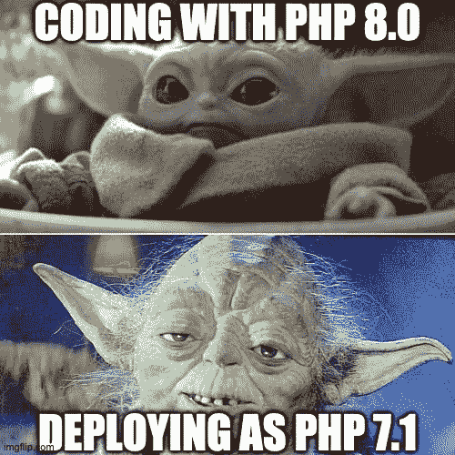

# 将代码从 PHP 8.0 移植到 7.1 的技巧

> 原文：<https://blog.logrocket.com/tips-transpiling-code-from-php-8-0-to-7-1/>

理想情况下，我们应该总是在我们的 web 服务器上安装最新版本的 PHP。现在，那是 PHP 8.0。

然而，在许多情况下，这是不可能的。考虑我们的客户运行与最新 PHP 版本不兼容的遗留软件的情况。或者也许我们没有控制环境，比如在为普通大众构建 WordPress 的插件时。

在这些情况下，[转换 PHP 代码](https://blog.logrocket.com/transpiling-php-code-from-8-0-to-7-x-via-rector/)是有意义的，因为它使我们能够使用最新的 PHP 特性进行开发，同时发布代码转换为旧版本 PHP 代码的软件以用于生产。



在这篇文章中，我们将学习从 PHP 8.0 到 7.1 的一些技巧。

## PHP 7.1 够好吗？

降级是通过 PHP 重建工具 [Rector](https://github.com/rectorphp/rector) 完成的。PHP 7.1 是降级的目标，因为这是目前 Rector 能够处理降级的最低 PHP 版本。(将来，我们可能会将[降级到 7.0 和 5.6](https://github.com/rectorphp/rector/issues/6079) 。)

由于 [PHP 7.1 已经是 EOL](https://www.php.net/eol.php) ，这对于大多数场景来说应该足够了。毕竟，我们应该总是只运行一个积极维护的 PHP 版本，这意味着 PHP 7.3 及以上。否则，我们会冒着使用包含未打补丁的漏洞的 PHP 的风险。

不幸的是，情况并非总是如此。例如，WordPress 仍然支持 PHP 5.6，因此，在 PHP 5.6 和 7.0 上运行 WordPress 的用户将无法使用使用 PHP 7.1 的插件，目前这部分用户约占所有 WordPress 用户的 16.4%。

如果您的用户依赖于遗留软件，而您目前正在使用非常旧的 PHP 版本(比如 5.6)进行开发，那么您应该考虑跳到 PHP 7.1 是否值得。如果是，那么由于 transpiling，您可以直接跳到使用 PHP 8.0。

在我的情况下，因为只有现代应用程序会运行 GraphQL，所以我的插件 [GraphQL API for WordPress](https://graphql-api.com) 应该不会因为排除运行 WordPress 5.6 和 7.0 的用户而受到太大影响，所以这是值得的。

然而，在 Yoast 的情况下，影响会很大:因为它有超过 500 万的活跃安装，排除 16.4%可能意味着大约 100 万用户。那不值得。

## 通过编译 PHP 代码可以实现什么？

在我的插件中引入 transpiling 之后，我已经能够[将其最低要求的 PHP 版本](https://graphql-api.com/blog/the-plugin-is-now-transpiled-from-php-80-to-71/)提升到 8.0(用于开发)。

回报是巨大的:通过访问 PHP 8.0 的联合类型，加上 PHP 7.4 的类型化属性，我已经能够在插件的代码库中的任何地方完全添加严格类型(包括所有函数参数、返回语句和类属性)，这转化为更少的错误和更容易理解的代码。

我对[这段我现在可以编写的代码](https://github.com/leoloso/PoP/blob/b9d379dc34195701e3afac2be4c132da6728ab75/layers/Schema/packages/custompost-mutations/src/TypeAPIs/CustomPostTypeAPIInterface.php#L18)感到兴奋不已:

```
interface CustomPostTypeAPIInterface
{
  public function createCustomPost(array $data): string | int | null | Error;
}
```

此函数的返回类型表示发生了以下情况之一:

*   通过返回 ID 成功创建了新的自定义 post 对象，ID 的类型为`string`或`int`
*   由于通过返回`null`验证失败，未创建新对象
*   由于流程中出现错误(例如，连接到所需的第三方 API 失败),通过返回类型为`Error`的自定义对象(也包含错误消息),未创建新对象

因此，transpiling 让我有机会成为一名更好的开发人员，生产更高质量的代码。

## 编译后的代码在生产中的表现

将上面的代码移植到 PHP 7.1 后，返回类型将被删除:

```
interface CustomPostTypeAPIInterface
{
  public function createCustomPost(array $data);
}
```

现在，如果在这个函数的返回类型和它被调用的位置之间存在类型不匹配，我将在开发过程中已经意识到这一点并解决这个问题。

因此，为生产移除返回类型不会产生任何结果。

## 哪些新功能变得可用？

能够用 PHP 8.0 编码并不意味着可以使用 PHP 8.0、7.4、7.3 和 7.2 版本的所有特性。相反，只能使用那些在 Rector 中有降级规则的特性，加上那些被 Symfony 的 polyfill 包(`[polyfill-php80](https://packagist.org/packages/symfony/polyfill-php80)`、`[polyfill-php74](https://packagist.org/packages/symfony/polyfill-php74)`、`[polyfill-php73](https://packagist.org/packages/symfony/polyfill-php73)`和`[polyfill-php72](https://packagist.org/packages/symfony/polyfill-php72)`)反向移植的特性。

例如，目前没有办法降级 [PHP 8.0 的属性](https://www.php.net/manual/en/language.attributes.overview.php)，所以我们不能使用这个特性。在撰写本文时，用 PHP 8.0 编写的应用程序的可用 PHP 特性列表如下:

## 执行运输

将代码从 PHP 8.0 一直转换到 PHP 7.1 的目录配置是[这个是](https://github.com/leoloso/PoP/blob/5ef93ef29f2c7d96989447ad7242446df93bdc98/layers/GraphQLAPIForWP/plugins/graphql-api-for-wp/rector-downgrade-code.php#L15-L20):

```
return static function (ContainerConfigurator $containerConfigurator): void {
  // get parameters
  $parameters = $containerConfigurator->parameters();

  // here we can define, what sets of rules will be applied
  $parameters->set(Option::SETS, [
    DowngradeSetList::PHP_80,
    DowngradeSetList::PHP_74,
    DowngradeSetList::PHP_73,
    DowngradeSetList::PHP_72,
  ]);
}
```

## 仅供生产使用的传输代码

我们需要传输组成我们项目的所有代码，包括我们的源代码和它所依赖的所有第三方包。

关于包裹，我们不需要运输所有的包裹；只有那些将成为可交付成果的一部分。换句话说，只有产品包，没有开发包。

这是好消息，因为:

*   在代码库上运行 Rector 需要一些时间，所以删除所有不需要的包(比如 PHPUnit、PHPStan、Rector 本身以及其他包)将会减少运行时间
*   这个过程很可能不会完全顺利(有些文件可能会产生错误，需要一些定制的解决方案)。因此，要传输的文件越少，所需的工作量就越少

我们可以找出 Composer 中哪些是 PROD 依赖项，如下所示:

```
composer info --name-only --no-dev
```

以下 Bash 脚本计算要降级的所有路径的列表(即项目的源代码及其 PROD 依赖项),并对它们应用 Rector:

```
# Get the paths for all PROD dependencies
# 1\. `composer`: Get the list of paths, in format "packageName packagePath"
# 2\. `cut`: Remove the packageNames
# 3\. `sed`: Remove all empty spaces
# 4\. `tr`: Replace newlines with spaces
paths="$(composer info --path --no-dev | cut -d' ' -f2- | sed 's/ //g' | tr '\n' ' ')"

# Execute the downgrade
# 1\. Project's source folder as "src"
# 2\. All the dependency paths
vendor/bin/rector process src $paths --ansi
```

配置必须排除所有测试用例上运行的 Rector。否则，Rector 将抛出一个错误，因为 PROD 中缺少`PHPUnit\Framework\TestCase`。不同的依赖项可能会将它们放在不同的位置，这就是我们需要微调我们的 Rector 配置的方式。为了找到答案，我们可以检查他们的源代码或运行 Rector，看看它是否/如何失败。

对于我的插件，要跳过的文件夹(包括来自插件源代码及其依赖项的文件夹)是[这些](https://github.com/leoloso/PoP/blob/4c0f3b6dd69ee4e69e5c66c2750c07237f67dd4f/layers/GraphQLAPIForWP/plugins/graphql-api-for-wp/rector-downgrade-code.php#L54-L57):

```
$parameters->set(Option::SKIP, [
  // Skip tests
  '*/tests/*',
  '*/test/*',
  '*/Test/*',
]);
```

## 注意依赖性的不一致性

有时，依赖项可能会引用一些为开发而加载的外部类。当 Rector 分析依赖关系时，它会抛出一个错误，因为 PROD 引用的代码不存在。

例如，Symfony 缓存组件的[类`EarlyExpirationHandler`](https://github.com/symfony/symfony/blob/8f03a1f/src/Symfony/Component/Cache/Messenger/EarlyExpirationHandler.php) 实现了 Messenger 组件的[接口`MessageHandlerInterface`](https://github.com/symfony/symfony/blob/191cb52/src/Symfony/Component/Messenger/Handler/MessageHandlerInterface.php) :

```
class EarlyExpirationHandler implements MessageHandlerInterface
{
    //...
}
```

但是，`symfony/cache`对`symfony/messenger` [的依赖是在`require-dev`](https://github.com/symfony/symfony/blob/6fe82d8/src/Symfony/Component/Cache/composer.json#L43) 上，而不是在`require`上。因此，如果我们的项目依赖于`symfony/cache`，并且我们用 Rector 分析它，它将抛出一个错误:

```
[ERROR] Could not process "vendor/symfony/cache/Messenger/EarlyExpirationHandler.php" file, due to:
  "Analyze error: "Class Symfony\Component\Messenger\Handler\MessageHandlerInterface not found.". Include your files in "$parameters->set(Option::AUTOLOAD_PATHS, [...]);" in "rector.php" config.
  See https://github.com/rectorphp/rector#configuration".
```

要解决这个问题，首先检查这是不是依赖关系的 repo 中的 bug。在这种情况下，是否应该将`symfony/messenger`添加到`symfony/cache`的`require`部分？如果你不知道答案，你可以通过他们回购的问题来问。

如果它是一个 bug，它将有希望被修复，并且您可以等待那个改变发生(或者甚至直接贡献它)。否则，您需要考虑您的生产项目是否使用了产生错误的类。

如果它确实使用了它，那么您可以通过它的`Option::AUTOLOAD_PATHS` config 将缺少的依赖项加载到 Rector 的配置中:

```
$parameters->set(Option::AUTOLOAD_PATHS, [
  __DIR__ . '/vendor/symfony/messenger',
]);
```

如果它不使用它，那么您可以直接跳过该文件，这样 Rector 就不会处理它:

```
$parameters->set(Option::SKIP, [
  __DIR__ . '/vendor/symfony/cache/Messenger/EarlyExpirationHandler.php',
]);
```

## 优化运输流程

我们之前看到的 Bash 脚本很简单，因为它将所有 PROD 依赖项从 PHP 8.0 降级到 7.1。

现在，如果 PHP 7.1 或更低版本上已经有了任何依赖，会发生什么？在其代码上运行 Rector 不会产生副作用，但这是浪费时间。如果有很多代码，那么浪费的时间会变得很大，让我们在测试/合并 PR 时等待 CI 过程完成的时间更长。

每当发生这种情况，我们宁愿只在那些包含必须降级的代码的包中运行 Rector，而不是在所有的包中运行。我们可以通过 Composer 找到这些包。由于依赖关系通常指定它们需要什么版本的 PHP，我们可以像这样推断出哪些包需要 PHP 7.2 和更高版本:

```
composer why-not php "7.1.*" | grep -o "\S*\/\S*"
```

出于某种原因，`composer why-not`不能与`--no-dev`标志一起使用，因此我们只需要安装 PROD 依赖项来获取这些信息:

```
# Switch to production, to calculate the packages
composer install --no-dev --no-progress --ansi
# Obtain the list of packages needing PHP 7.2 and above
packages=$(composer why-not php "7.1.*" | grep -o "\S*\/\S*")
# Switch to dev again
composer install --no-progress --ansi
```

有了包名列表，我们可以像这样计算它们的路径:

```
for package in $packages
do
  # Obtain the package's path from Composer
  # Format is "package path", so extract everything after the 1st word with cut to obtain the path
  path=$(composer info $package --path | cut -d' ' -f2-)
  paths="$paths $path"
done
```

最后，我们在所有路径(和项目的源文件夹)上运行 Rector:

```
vendor/bin/rector process src $paths --ansi
```

## 当心连锁规则

在某些情况下，我们可能会遇到连锁规则:应用降级规则产生的代码本身需要被另一个降级规则修改。

我们可能认为，按照预期的执行顺序定义规则将会处理链式规则。不幸的是，[这并不总是有效的](https://github.com/rectorphp/rector/issues/5962)，因为我们无法控制[PHP-Parser 如何遍历节点](https://github.com/rectorphp/rector/issues/5962#issuecomment-804959594)。

这种情况[发生在我的项目](https://github.com/symfony/cache/blob/be5707f/CacheItem.php#L115) : `symfony/cache`有文件`vendor/symfony/cache/CacheItem.php`，函数`tag`返回`ItemInterface`:

```
final class CacheItem implements ItemInterface
{
    public function tag($tags): ItemInterface
    {
        // ...
        return $this;
    }
}
```

被实现的接口`ItemInterface`，反而[在函数`tag`上返回`self`](https://github.com/symfony/contracts/blob/ff78fa8/Cache/ItemInterface.php#L57) :

```
interface ItemInterface extends CacheItemInterface
{
    public function tag($tags): self;
}
```

PHP 7.4 的降级集包含以下两个规则，按此顺序定义:

```
$services = $containerConfigurator->services();
$services->set(DowngradeCovariantReturnTypeRector::class);
$services->set(DowngradeSelfTypeDeclarationRector::class);
```

降级类别`CacheItem`时，函数`tag`需要修改两次:

1.  `DowngradeCovariantReturnTypeRector`必须首先将返回类型从`ItemInterface`转换为`self`
2.  `DowngradeSelfTypeDeclarationRector`然后应该删除`self`返回类型

但是第二步并没有发生。结果，运行降级后，函数`tag`返回`self`，对于 PHP 7.3 及以下版本，函数[将不起作用。](https://3v4l.org/ttop8)

我想出的解决这个问题的方法包括两个步骤:

1.  无论何时出现这种问题，都要找出原因(这是例外情况)
2.  通过运行第二个具有自己的配置的 Rector 进程来“手动”修复问题，专门解决问题

让我们看看它们是如何工作的。

### 1.无论何时出现这种问题，都要找出原因

通常，我们希望运行一次 Rector，让它执行所有需要的修改。然后，如果我们第二次运行 Rector(在第一次执行的输出上)，我们预计不会修改任何代码。如果任何代码在第二次通过时被修改，这意味着在第一次通过时有些事情不太顺利。最有可能的是，这是一个没有应用的连锁规则。

Rector 接受标志`--dry-run`，这意味着它将在屏幕上打印修改，但不会实际应用到代码上。方便的是，只要有修改，用这个标志运行 Rector 就会[返回一个错误](https://github.com/rectorphp/rector/blob/06f85e4a68acba9ea05d7894e79df5661663e452/src/Console/Command/ProcessCommand.php#L273-L277)。

然后，我们可以运行`rector process --dry-run`作为我们 CI 中的[第二遍。每当 CI 过程失败时，控制台中的输出将显示在第二次传递中应用了哪个规则，从而指出哪个是在第一次传递中未应用的链式规则。](https://github.com/leoloso/PoP/blob/d564131230fca7dedde97efe2e8c0df98e3f78d3/.github/workflows/downgrade_php_tests.yml#L59-L67)

运行第二遍还有一个额外的好处:如果生成的 PHP 代码有问题(这种情况偶尔会发生，比如本例中的)，那么 Rector 的第二遍将会失败。换句话说，我们使用 Rector 来测试来自 Rector 本身的输出。

### 2.手动修复问题

一旦我们发现某个规则没有在某个节点上执行，我们必须引入一种方法，在第一次遍历之后立即应用它。我们可以再次运行相同的 Rector 过程，但这是低效的，因为该过程涉及应用于数千个文件的数十个规则，需要几分钟才能完成。

但是这个问题很可能涉及到一个规则和一个类。所以我们宁愿[创建第二个目录配置](https://github.com/leoloso/PoP/blob/f31770f5c33a42c0e264d845c5cfb89fa1e8d081/rector-downgrade-code-hacks-CacheItem.php)，它只需要几秒钟就可以执行:

```
return static function (ContainerConfigurator $containerConfigurator): void {
  $parameters = $containerConfigurator->parameters();
  $parameters->set(Option::PATHS, [
    __DIR__ . '/vendor/symfony/cache/CacheItem.php',
  ]);

  $services = $containerConfigurator->services();
  $services->set(DowngradeSelfTypeDeclarationRector::class);
};
```

为了支持必须处理多个额外的 Rector 配置，我们可以将一个 Rector 配置列表[传递给一个 Bash 脚本](https://github.com/leoloso/PoP/blob/11337232187ad59b761dcb9ed6c2c6a1db49a4e9/ci/downgrade_code.sh#L121-L128):

```
# Execute additional rector configs
# They must be self contained, already including all the src/ folders to downgrade
if [ -n "$additional_rector_configs" ]; then
    for rector_config in $additional_rector_configs
    do
        vendor/bin/rector process --config=$rector_config --ansi
    done
fi
```

## 结论

传输 PHP 代码本身就是一门艺术，需要一点努力来设置。更有可能的是，我们将需要微调 Rector 的配置，使其能够完美地与我们的项目一起工作，给定它需要哪些依赖项以及它们利用了哪些 PHP 特性。

然而，翻译代码是一种非常强大的体验，我强烈推荐。在我自己的例子中，我能够将 PHP 8.0 的特性用于我的公开可用的 WordPress 插件(这是前所未闻的)，允许我在它的代码基础上添加严格的类型，从而降低了错误的可能性并改进了它的文档。

## 使用 [LogRocket](https://lp.logrocket.com/blg/signup) 消除传统错误报告的干扰

[](https://lp.logrocket.com/blg/signup)

[LogRocket](https://lp.logrocket.com/blg/signup) 是一个数字体验分析解决方案，它可以保护您免受数百个假阳性错误警报的影响，只针对几个真正重要的项目。LogRocket 会告诉您应用程序中实际影响用户的最具影响力的 bug 和 UX 问题。

然后，使用具有深层技术遥测的会话重放来确切地查看用户看到了什么以及是什么导致了问题，就像你在他们身后看一样。

LogRocket 自动聚合客户端错误、JS 异常、前端性能指标和用户交互。然后 LogRocket 使用机器学习来告诉你哪些问题正在影响大多数用户，并提供你需要修复它的上下文。

关注重要的 bug—[今天就试试 LogRocket】。](https://lp.logrocket.com/blg/signup-issue-free)