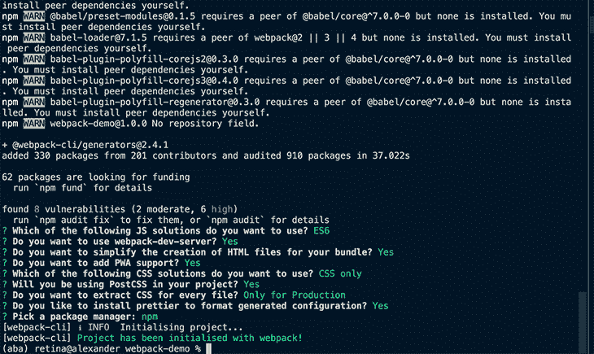
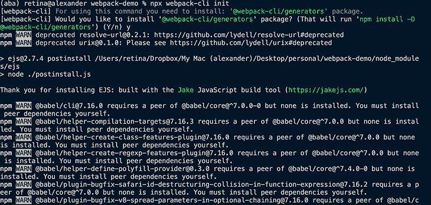

# 如何用 webpack 和 Node.js - LogRocket Blog 移植 ES 模块

> 原文：<https://blog.logrocket.com/transpile-es-modules-with-webpack-node-js/>

在 JavaScript 生态系统中，webpack 是捆绑代码的主要工具。但是在我们深入探讨 webpack 如何做到这一点之前，这也是我们这篇文章的重点，让我们首先了解什么是 es 模块。

## 什么是 ES 模块？

ES 模块(ESM)是为 Node.js 和浏览器编写代码的推荐方式。目前，所有主流浏览器都支持 ES 模块，它们代表了一种官方标准格式，用于在 web 上打包和重用 JavaScript 代码。

在一些早期的帖子中，我们已经介绍了如何使用 ES 模块，也简要地谈到了 ESM 在 Node.js 生态系统中的演变。本文将主要关注第一篇文章的扩展，在第一篇文章中，我们阐明了 Node.js 模块生态系统多年来是如何发展的——从 CommonJS 模块系统发展到目前对 ESM 的完全就绪的生产级支持，这是目前推荐使用的符合规范、向后兼容且可互操作的模块系统。

正如我们在之前的文章中提到的，我们注意到我们可以用关键字`export`和`import`在模块系统中定义和使用包。此外，我们指出了源代码或库作者可以指示 Node.js 运行时将 JavaScript 代码视为 ESM 的不同方式，因为 Node 运行时默认将 JavaScript 代码视为 CommonJS 模块。

在这篇文章中，我们将扩展我们以前的文章，并优化用 ECMAScript 模块规范编写的代码，使它们具有可移植性，并可与旧版本的 Node.js 互操作。

## 导入和导出函数

请参见下面如何使用 ES 模块语法导入和导出函数的示例:

```
// smallestNumber.js
export function smallestNumber(arr) {
    let smallestNumber = arr[0]
    let smallestIndex = 0
    for(let i = 1; i < arr.length; i++) {
       if(arr[i] < smallestNumber) {
         smallestNumber = arr[i]
         smallestIndex = i 
       }
    }
     return smallestNumber;
}

```

注意，正如我们可能知道的，`export`关键字是有用的，因为它允许我们将我们的`smallestNumber`函数提供给需要调用它的其他模块。除了常规函数，我们可以导出常量、类，甚至只是简单的变量。另请注意，我们可以通过 ESM 进行默认导出。

```
// result.js
import { smallestNumber } from './smallestNumber.js';

console.log(smallestNumber([3,2,5,6,0,-1]))

//returns -1

```

注意，对于`import`关键字，我们可以引用从 ESM 模块或包`smallestNumber.js`中导出的`smallestNumber`函数。

简单回顾一下，关于这些主题的更多细节——包括 ES 模块的概要以及如何使用它们——可以在我们之前的博客文章中找到。ESM 的[文档广泛涵盖了这个主题，包括我们之前的博客文章中没有涉及的其他更广泛的主题。](https://nodejs.org/api/esm.html#modules-ecmascript-modules)

## 向后兼容的编译代码

在下一节中，我们将最终关注代码编译过程的机制，但在此之前，让我们首先理解这个过程的重要性。

正如我们前面提到的，旧的 JavaScript 版本，比如 ES5，需要能够运行我们的新代码，并且理解它的语法。这意味着需要有一种方法让语言完全向后兼容。

当向编程语言添加新特性时，向后兼容性是要考虑和优先考虑的最重要的方面之一。对于 ESM，Node.js 运行时能够根据位于项目根目录的`package.json`文件中的`type`字段设置为`module`时，确定它应该默认的模块系统/格式。

```
//package.json file 
{
  "type": "module"
}

```

上述设置会将与`package.json`文件处于同一文件夹结构级别的所有文件默认为 ESM。或者，我们可以决定将类型设置为`commonjs`，并且 Node 运行时将强制所有文件符合默认的公共 JS 模块系统。虽然如果没有指定`type`字段，这通常是默认行为。

我们在[之前的博客文章](https://blog.logrocket.com/es-modules-in-node-today/)中也谈到了其他方式——例如，使用`.mjs`或`.cjs`文件格式，以及如何将这些扩展名解析为 ESM 或其他模块格式。

本质上，当模块被标记为 ECMAScript 模块时，节点运行时使用不同的模式或方法来解析文件导入。例如，导入现在更严格了，这意味着我们必须视情况为相对路径或请求附加完整的文件名及其扩展名。

## 什么是代码翻译？

随着新 JavaScript 版本的推出和语法的变化(也称为 ES2015)，TypeScript、JavaScript 超集和 CoffeeScript 等其他语言进步的引入，编写随处运行的 JavaScript 不再像以前那样简单。

正如我们可能已经意识到的，不同的浏览器有不同的 JavaScript 引擎，它们对这些新 JS 特性的采用和支持的不同水平可能并不一致，因为它们并不同时满足语言规范。这导致了这样的情况:代码可以在一种浏览器上运行，而在另一种浏览器上却不能运行。

因此，transpilation 的本质是能够将新的 JS ES2015 语法转换为旧的 ES5 语法，因此代码可以在旧的浏览器上运行。

例如，模板文字，或者说，空合并和其他 ES2015 或 ES2015+功能，仍然没有完全的浏览器支持和服务器端运行时支持，所以我们可能需要转换我们的代码来支持这些版本。

大多数情况下， [Babel](https://blog.logrocket.com/tag/babel/) 、 [Traceur](https://github.com/google/traceur-compiler) 和[等被称为加载器的工具与 webpack 结合使用来传输代码。](https://webpack.js.org/loaders/#transpiling)

在高层次上，transpilers 通过逐行读取源代码并产生等效的输出来跨编程语言工作。例如，我们可能希望将一个类型脚本代码库转换成普通的旧 JavaScript。

一般来说，transpilers 允许我们放心地使用新的、非标准化的 JavaScript 特性。目前，在 Node.js 和浏览器环境中使用 ES 模块的最佳方法是用 Babel 将它们转换成 CommonJS 模块格式。

## Node.js 中的传输文件

默认情况下，ESM 附带了一个 [transpiler loader](https://nodejs.org/api/esm.html#transpiler-loader) ，它使用[加载器钩子](https://nodejs.org/dist/latest-v9.x/docs/api/esm.html)将节点运行时不理解的源代码转换成普通的 JS。

在这里，我们可以根据需要从磁盘加载我们的源代码，但是在 Node.js 为我们执行它之前。这通常不适用于浏览器环境，因为通过网络单独获取每个文件将会非常慢，而且性能低下。

transpiler 加载器还带有一个 [`resolve`钩子](https://nodejs.org/api/esm.html#resolvespecifier-context-defaultresolve)，告诉运行时如何处理未知的文件类型。

## 什么是 webpack？

Webpack 是一个构建工具，它帮助我们将代码及其依赖项捆绑到一个 JavaScript 文件中。我们也可以说 webpack 是 JavaScript 应用程序的静态模块捆绑器。这是因为它对我们的源代码应用了诸如[树摇动](https://blog.logrocket.com/tree-shaking-and-code-splitting-in-webpack/)和编译(包括编译和缩小步骤)之类的技术。

像 webpack 这样的捆扎机与运输机携手合作。这意味着它们是完全不同的，而是互补的工具集。因此，我们需要[配置 webpack 与 transpiler](https://blog.logrocket.com/versatile-webpack-configurations-react-application/) 一起工作，比如 Babel。

正如我们前面提到的，transpilers 要么执行将一种语言编译成另一种语言的工作，要么使一种语言向后兼容。Webpack 与 Babel 配合得很好，而且也很容易配置。例如，我们可以通过使用 Babel 插件创建 webpack 配置文件(`webpack.config.js`)来配置 Babel 与 webpack 一起工作——事实上，webpack 插件生态系统是 webpack 的基础。

另一方面，Babel 可以使用一个`babel.config.js`文件或一个`.babelrc`文件进行配置。

### 为什么选择 webpack？

如您所知， [webpack 支持一些现成的模块类型](https://webpack.js.org/concepts/modules/#supported-module-types)，包括 CommonJS 和 es 模块。Webpack 也适用于客户端和服务器端的 JavaScript，因此使用 webpack，我们也可以轻松地处理图像、字体、样式表等资产和资源。

它仍然是一个非常强大的工具，因为它可以根据文件的导入和导出自动构建和推断依赖图(因为在本质上，每个文件都是一个模块)。将它与加载器和插件结合起来，使 webpack 成为我们武库中的一个伟大工具。关于[如何在引擎盖下工作的更多细节](https://webpack.js.org/concepts/under-the-hood/)可以在文档中找到。

插件方面，webpack 也有[丰富的插件生态系统](https://webpack.js.org/concepts/plugins/)。插件支持 webpack 做一些脏活，比如优化包、管理资产等等。

总之，与 webpack 等工具捆绑在一起是目前工作或确保向后兼容模块的最快方式，因为 ESM 正逐渐成为生态系统中代码重用的官方标准。

Webpack 还支持加载器，这有助于它决定如何处理、捆绑和处理非本机模块或文件。指出 webpack 如何对待加载器是很重要的。加载程序是自底向上评估和执行的。因此，最后一个加载程序首先被执行，以此类推。

在这篇文章中，我们主要关注 webpack 如何传输或处理 ECMAScript 模块。

## 使用装载机进行运输

加载器将文件从一种编程语言转换成另一种编程语言。例如,`ts-loader`可以将类型脚本转换成 JavaScript。通常，我们使用加载器作为开发依赖。例如，让我们看看如何利用`ts-loader`。

要安装，我们可以运行以下命令:

```
npm install --save-dev ts-loader

```

然后，我们可以使用这个加载器来指示 webpack 正确地处理源代码中的所有类型脚本文件。参见下面的样本`webpack.config.js`文件。

```
module.exports = {
  module: {
    rules: [
      { test: /.ts$/, use: 'ts-loader' },
    ],
  },
};

```

这里，正如我们提到的，我们告诉 webpack 处理所有以扩展名`.ts`结尾的文件路径，并将它们转换成浏览器和节点运行时可以理解的 JavaScript 语法。这意味着加载器也可以在 Node.js 环境中运行，因此也遵循[模块解析](https://webpack.js.org/concepts/module-resolution/)标准。

### 加载程序命名约定

命名加载器的一般方法是一致的，因为加载器是用它们的名字和一个连字符来命名的——通常称为`xxx-loader`。比如`babel-loader`、`ts-loader`等等。

对于我们的用例，我们最感兴趣的是 ESNext 或 babel-loader，这是一个社区构建并支持的加载程序，目前版本为 7.16。关于加载器的更多信息可以在 webpack 文档中找到。

## 一些 webpack 核心概念

为了理解 webpack 是如何工作的，本节涵盖了读者应该了解的一些高级概念。

正如我们前面提到的，webpack 使用依赖图，这意味着它递归地建立一种关系，其中包括应用程序需要或依赖的每个模块，然后将所有这些模块捆绑到一个输出文件中，以备使用。这意味着 webpack 需要有一个入口点——它确实有。

在设置我们的 webpack 配置时，[入口点](https://webpack.js.org/concepts/entry-points)是文件路径 webpack 检查的开始，然后才开始为我们的应用程序构建内部依赖关系图。请注意，webpack 还支持我们的应用程序的多个入口点。

```
module.exports = {
  entry: ['./path/to/my/entry1/file1.js', './path/to/my/entry2/file2.js']
};

```

要添加多个入口点，我们可以使用数组来代替。在 webpack v5 中，我们现在可以有一个空的入口对象。这允许我们在添加条目时使用插件。

在 webpack 内部构建依赖图并完成捆绑过程之后，它需要将捆绑包输出到另一个文件路径，然后我们需要提供这个文件路径。

这就是`output`属性的作用。它告诉 webpack 使用哪个路径来发出它所创建的包，以及如何命名文件。

```
const path = require('path');

module.exports = {
  entry: './path/to/my/entry/file.js',
  output: {
    path: path.resolve(__dirname, 'dist'),
    filename: 'my-first-webpack.bundle.js',
  },
};

```

从 v4.0.0 开始，webpack 不需要配置文件来捆绑您的项目，尽管它确实假设您已经用文件夹和文件路径定义了应用程序的入口点为`src/index.js`，并且输出被捆绑到`dist/main.js`文件夹路径中，经过缩小、优化，并准备好用于生产。

## 设置 webpack 和 Babel

已经有[完全支持使用原生 ES2015 模块语法](https://webpack.js.org/api/module-methods/#es6-recommended)。这意味着我们可以使用`import`和`export`语句，而不需要依赖外部的 transpilation 工具或者像 Babel 这样的依赖。但是，仍然建议配置 Babel，以防有其他更新的 ES2015+功能 webpack 尚未考虑到。

基于适当的模块格式，webpack 检查最近的`package.json`文件，并实施适当的建议。当使用 webpack 捆绑我们的代码时，通常建议坚持单一模块语法，以允许 webpack 以一致的方式正确处理捆绑的输出，从而防止不必要的错误。

首先，我们需要确保我们的机器上安装了 webpack CLI。然后，我们可以利用`init` CLI 命令，根据我们的项目需求快速构建一个 webpack 配置。我们可以通过简单地运行`npx webpack-cli init`并适当地响应提示来做到这一点。





现在，我们需要将 ES2015 代码编译成 ES5，这样我们就可以跨不同的浏览器环境或运行时使用它。为此，我们需要安装 Babel 及其所有 webpack 所需的依赖项。

让我们继续安装以下内容:

要安装，我们可以运行:

```
npm i webpack webpack-cli webpack-dev-server @babel/core @babel/preset-env babel-loader rimraf  -D

```

在安装结束时，我们的`package.json`应该是这样的:

```
{
  "name": "webpack-demo",
  "version": "1.0.0",
  "description": "A demo of webpack with babel",
  "main": "dist/bundle.js",
  "scripts": {
    "build": "node_modules/.bin/webpack --config webpack.config.js --mode=production",
    "watch": "node_modules/.bin/webpack --config webpack.config.js --mode=development -w",
    "prebuild:dev": "rimraf dist"
  },
  "author": "Alexander Nnakwue",
  "license": "MIT",
  "dependencies": {},
  "devDependencies": {
    "@babel/core": "^7.16.0",
    "@babel/preset-env": "^7.16.4",
    "babel-loader": "^8.2.3",
    "rimraf": "^3.0.2",
    "webpack": "^5.64.3",
    "webpack-cli": "^4.9.1",
    "webpack-dev-server": "^4.5.0"
  },
  "type": "module"
}

```

请注意，我们已经固定了依赖关系，以便在将来运行应用程序时保持一致性。

[`@babel/preset-env`包](https://babeljs.io/docs/en/babel-preset-env)会将所有 es 2015–es 2020 代码转换成 ES5 或者我们在目标选项中指定的任何目标环境。当我们打算设定一个特定的目标时，我们通常需要它，然后允许巴别塔针对特定的环境。但是也可以在不设定目标的情况下使用，但是代价是更大的包大小。

这个包基本上是根据它自己的内部映射来检查指定的目标环境，然后编译一个插件列表，并传递给 Babel 进行代码转换。这导致了更小的 JavaScript 包。

因此，如果我们没有指定目标，输出的代码会更大，因为默认情况下，Babel 插件将 ECMAScript 语法特性分组到相关特性的集合中。关于这一点的更多细节可以在[文档](https://babeljs.io/docs/en/babel-preset-env#bugfixes)中找到。

更好的是，通过选择更小的包大小和更大的性能增益，我们可以利用 [`babel/preset-modules`](https://github.com/babel/preset-modules) ，它将最终合并到 [`@babel/preset-env`](https://babeljs.io/docs/en/babel-preset-env) 内核中。

## 配置`webpack.config.js`文件

现在，让我们继续配置我们的 webpack 文件。继续在我们项目的根目录下创建一个新的`webpack.config.js`文件。

```
import path from "path";
import { fileURLToPath } from "url";
const __dirname = path.dirname(fileURLToPath(import.meta.url));

export default  {
    entry: './src/index.js',
    output: {
        path: path.resolve(__dirname, './dist'),
        filename: 'bundle.js',
    },
    experiments: {
        outputModule: true,
    },
    plugins: [
       //empty pluggins array
    ],
    module: {
         // https://webpack.js.org/loaders/babel-loader/#root
        rules: [
            {
                test: /.m?js$/,
                loader: 'babel-loader',
                exclude: /node_modules/,
            }
        ],
    },
    devtool: 'source-map'
}

```

在上面的配置中，我们为`__dirname`变量创建了一个 polyfill。此外，我们已经将字段`outputModule`设置为`true`，如果我们打算使用 webpack 编译一个供他人使用的公共库，这是必要的。 [`babel-loader`](https://webpack.js.org/loaders/babel-loader) 加载 ES2015+代码，并使用 Babel 将其传输到 ES5。

正如您在配置文件中看到的，我们有一个`module`属性，它有一个`rule`属性，包含一个数组，用于配置我们的 webpack 配置可能需要的各个加载器。

这里，我们已经添加了 webpack 加载器，并根据我们的项目需求设置了所需的选项。

注意，`test`选项是一个正则表达式，匹配每个文件的绝对路径，并检查文件扩展名。在上面的例子中，我们正在测试我们的文件是否以扩展名`.mjs`或`.js`结尾。

## 使用(和不使用)`.babelrc`文件

现在，我们可以通过创建一个`.babelrc`文件来配置 Babel，也是在我们项目的根目录下。文件内容如下所示:

```
 {
    "presets": [
      [
        "@babel/preset-env",
        {
          "targets": {
            "esmodules": true
          }
        }
      ]
    ]
  }

```

下面是在开发中使用`npm run watch`命令在本地运行我们的应用程序的输出:


如果我们不想使用`.babelrc`文件，我们也可以在`rules`数组内的`options`对象中添加预置，如下所示:

```
module: {
  rules: [
    {
      test: /.m?js$/,
      exclude: /node_modules/,
      use: {
        loader: 'babel-loader',
        options: {
          presets: ['@babel/preset-env', "es2015", "es2016"],
        }
      }
    }
  ]
} 

```

## 设置预设和添加插件

我们需要设置预设，以便我们代码中的 ES2015 功能可以转换为 ES5。在`options`数组中，我们还可以添加我们想要添加到配置中的插件。

例如，我们可以添加这一行:`plugins: ['@babel/plugin-transform-runtime']`，它安装了一个 Babel 运行时，[禁用自动的每文件运行时注入](https://webpack.js.org/loaders/babel-loader/#babel-is-injecting-helpers-into-each-file-and-bloating-my-code)，以防止膨胀。

要在我们的代码中包含这些，我们需要通过运行以下命令来安装它们:

```
npm install -D @babel/plugin-transform-runtime
```

我们还必须通过运行`npm install @babel/runtime`来添加`@babel/runtime`作为依赖项。

还要注意，在`rules`对象中，我们告诉 webpack 用`exclude`属性排除`node_modules`文件夹中的文件。这是为了让我们有一个更快的捆绑过程，因为我们不想捆绑我们的`node_modules`文件夹。

也有我们[希望 webpack 处理 ES 2015 模块](https://webpack.js.org/api/module-methods/#es6-recommended)的情况。为了实现这一点，我们需要使用一个名为 [`ModuleConcatenationPlugin`](https://webpack.js.org/plugins/module-concatenation-plugin/#root) 的插件。这个插件支持 webpack 中某种形式的连接行为，称为范围提升，这是 ESM 语法提供的一个功能。默认情况下，该插件[已经在生产模式](https://webpack.js.org/configuration/mode/#mode-production)下启用，否则禁用。

## 结论

为了避免兼容性问题，我们需要将代码从 ES2015 移植到 ES5。这就是 webpack 的用武之地。Webpack 将我们的代码打包，并输出一个 transpiled 版本到配置文件中指定的目标。

在我们的 webpack 配置文件中，[模块规则](https://webpack.js.org/configuration/module/#modulerules)允许我们指定不同的加载器，这是一种显示加载器的简单方法。在这篇文章中，我们只使用了 Babel loader，但是在生态系统中我们还可以使用许多其他的 loader。

就最新的 webpack 版本 v5 中的[改进和变化而言，现在有了对异步模块的开箱即用的支持。顾名思义，异步模块是基于承诺的，因此不能同步解析。通过`require()`导入异步模块现在也将返回一个解析到它们的导出的承诺。](https://webpack.js.org/blog/2020-10-10-webpack-5-release/#async-modules)

此外，在 Node.js 生态系统中，`package.json`文件现在支持导出和导入字段。最后，在最新版本中，最低支持的 Node.js 版本已经从 v6.0 升级到 v10.13.0，这也是一个 LTS 版本。

完整的演示源代码可以在我的 GitHub 上找到。

## 200 只显示器出现故障，生产中网络请求缓慢

部署基于节点的 web 应用程序或网站是容易的部分。确保您的节点实例继续为您的应用程序提供资源是事情变得更加困难的地方。如果您对确保对后端或第三方服务的请求成功感兴趣，

[try LogRocket](https://lp.logrocket.com/blg/node-signup)

.

[](https://lp.logrocket.com/blg/node-signup)[https://logrocket.com/signup/](https://lp.logrocket.com/blg/node-signup)

LogRocket 就像是网络和移动应用程序的 DVR，记录下用户与你的应用程序交互时发生的一切。您可以汇总并报告有问题的网络请求，以快速了解根本原因，而不是猜测问题发生的原因。

LogRocket 检测您的应用程序以记录基线性能计时，如页面加载时间、到达第一个字节的时间、慢速网络请求，还记录 Redux、NgRx 和 Vuex 操作/状态。

[Start monitoring for free](https://lp.logrocket.com/blg/node-signup)

.