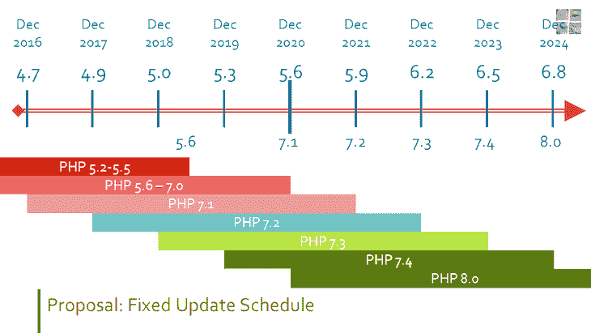
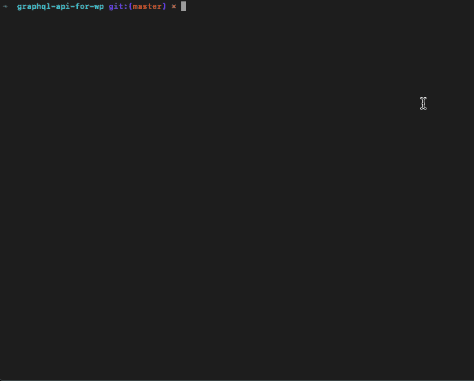

# 通过 Rector 将 PHP 代码从 8.0 移植到 7.x

> 原文：<https://blog.logrocket.com/transpiling-php-code-from-8-0-to-7-x-via-rector/>

PHP 8.0 将于今年年底发布。是否有可能立即将其引入我们的项目？或者，我们会不会因为它使用了带有遗留代码的框架或 CMS 而无法做到这一点？

这种担忧影响到每一个基于 PHP 的项目——无论是基于 Laravel、Symfony、Drupal、vanilla PHP 还是其他——但对于 WordPress 来说尤其紧迫，其社区目前正在试图寻找解决方案。

在今年 12 月即将发布的新版本中，WordPress 应该将其最低要求的 PHP 版本从 5.6 升级到 7.1。然而，已经决定暂时取消 PHP 版本升级，因为几乎 24%的安装仍然运行在 PHP 5.6 或 7.0 上:


September 2020 WordPress usage stats, via wordpress.org/about/stats.

在这种情况下，有人提议开始为最低版本的升级制定一个固定的时间表，在升级到新的 PHP 版本和为旧版本提供安全补丁之间提供一个折衷方案:



Proposed fixed updated schedule.

不管这个固定的时间表是否被批准，对于想要使用 PHP 最新改进的开发者来说，情况看起来很糟糕。主题和插件不受 WordPress PHP 要求的限制，所以它们可能已经要求 7.1 或更高版本。然而，这样做限制了他们的潜在影响力。

例如，目前只有 10.7%的安装运行在 PHP 7.4 上，我们可以预计在 PHP 8.0 发布后会立即运行的会更少。这些数字使得在代码库中引入[类型属性](https://php.watch/versions/7.4/typed-properties)或[联合类型](https://php.watch/versions/8.0/union-types)以及其他有价值的特性变得非常困难。

一位开发人员的评论传达了某种绝望感:

> 因此，这实际上意味着，如果我们想在 2023 年 12 月之前支持所有 WordPress 版本，在它发布三年后，我们不能在主题/插件中使用 PHP 8 语法。这非常令人失望。

有什么办法可以改善今天的情况吗？或者我们需要等三年才能在 WordPress 主题和插件中使用 PHP 8 代码？(届时它将[达到其寿命终点](https://www.php.net/supported-versions.php)！)

## 巴别塔指明了方向

[transpiler](https://en.wikipedia.org/wiki/Source-to-source_compiler) 是“一种翻译器，它以用编程语言编写的程序的源代码作为输入，并以相同或不同的编程语言产生等价的源代码。”

transpiling 的一个典型模型是 [Babel](https://babeljs.io/) ，这是一个工具链，允许我们将 ECMAScript 2015+代码转换为 JavaScript 的向后兼容版本。多亏了 Babel，开发人员可以使用新的 JavaScript 语言特性将他们的源代码转换成可以在旧浏览器上执行的 JavaScript 版本。

例如，Babel 将 ES2015 箭头函数转换为其等效的 ES5 函数:

```
// Babel Input: ES2015 arrow function
[1, 2, 3].map((n) => n + 1);

// Babel Output: ES5 equivalent
[1, 2, 3].map(function(n) {
  return n + 1;
});
```

继 ES2015 之后，PHP 7.4 也引入了[箭头函数](https://www.php.net/manual/en/functions.arrow.php)作为匿名函数的语法糖，这从 PHP 5.3 开始就得到支持:

```
// PHP 7.4: arrow function
$nums = array_map(fn($n) => $n + 1, [1, 2, 3]);

// PHP 5.3: anonymous function
$nums = array_map(
  function ($n) {
    return $n + 1;
  },
  [1, 2, 3]
);
```

有了 PHP 的 transpiling 工具，我们可以编写 PHP 7.4 的 arrow 函数，并将它们转换成等价的匿名函数，这些函数可以运行在从 5.3 开始的任何版本的 PHP 上。

这将使开发者能够将 PHP 7.4 的特性用于他们的 WordPress 主题和插件，同时仍然允许运行旧版本(如 PHP 7.1)的用户安装他们的软件。

## 升级开发工具链

transpiling 的另一个好处是可以访问用于开发的较新版本的库。

测试框架 [PHPUnit](https://phpunit.de/) 就是如此。就目前的 PHP 5.6 而言，WordPress 无法超越 PHPUnit 的 7.x 版本，结果是[测试套件无法针对 PHP 8](https://core.trac.wordpress.org/ticket/46149) 进行测试。

用 PHP 7.3+(或 PHP 7.1+)编码，然后将代码转换成产品，将使我们能够升级到 PHPUnit 的 9.x(或 8.x)版本，并使测试套件现代化。

## 评估新功能是否可以传输

新 PHP 版本中引入的特性可以大致分为以下几类:

*   新语法作为一些现有功能的语法糖
*   全新特性的新语法
*   新函数、类、接口、常数和异常的实现

上面演示的 PHP 7.4 中引入的 arrow 函数是一个现有特性的新语法的例子。从新版本到旧版本的语法转换将执行相同的功能；因此，这些特性可以被编译，结果代码将没有缺点。

我们来分析一下其他案例。

### 为开发提供新功能

类型化属性(在 PHP 7.4 中引入)和联合类型(在 PHP 8.0 中引入)为全新的特性引入了新的语法:

```
class User
{
  // Typed properties
  private int $id;
  private string $name;
  private bool $isAdmin;

  // Union types (in params and return declaration)
  public function getID(string|int $domain): string|int
  {
    if ($this->isAdmin) {
      return $domain . $this->name;
    }
    return $domain . $this->id;
  }
}
```

这些特性不能在以前的 PHP 版本中直接复制。在 transpiled 代码中，我们最接近它们的方式是完全删除它们，并使用 docblock 标签来描述它们的性质:

```
class User
{
  /** @var int */
  private $id;
  /** @var string */
  private $name;
  /** @var bool */
  private $isAdmin;

  /**
   * @param string|int $domain
   * @return string|int
   */
  public function getID($domain)
  {
    if ($this->isAdmin) {
      return $domain . $this->name;
    }
    return $domain . $this->id;
  }
}
```

对于包含这两个特性的代码，其 transpiled 代码将在 PHP 7.3 及以下版本中编译，但新特性将会消失。

然而，更有可能的是，它们的缺失并不重要:这些特性在开发过程中主要用于验证我们代码的正确性(借助于额外的工具，比如用于测试的 PHPUnit 和用于静态分析的 [PHPStan](https://phpstan.org/) )。如果我们的代码有错误，并且在生产中失败，那么不管有没有这些新特性，它都会失败；最多，错误消息会有所不同。

因此，代码的不完美转换仍然足以满足我们的需求，并且该代码可以被编译用于生产。

### 避免运行时需要的特性

在以前的版本中没有对等的新特性，并且在运行时(在生产中)需要的新特性不能被删除，否则应用程序将会有不同的行为。

PHP 7.4 中引入的`[WeakReference](https://www.php.net/manual/en/class.weakreference.php)`类就是一个例子，它支持销毁一个我们仍然持有引用的对象:

```
$obj = new stdClass;
$weakref = WeakReference::create($obj);
var_dump($weakref->get());
unset($obj);
var_dump($weakref->get());
```

这将打印:

```
object(stdClass)#1 (0) {
}
NULL
```

使用 PHP 7.3，除非删除对对象的所有引用，否则对象不会被销毁:

```
$obj = new stdClass;
$array = [$obj];
var_dump($array);
unset($obj);
var_dump($array);
```

这将打印:

```
array(1) {
  [0]=>
  object(stdClass)#412 (0) {
  }
}
array(1) {
  [0]=>
  object(stdClass)#412 (0) {
  }
}
```

因此，我们需要找出新的行为是否可以接受。例如，运行 transpiled `WeakReference`类的应用程序可能会消耗更多的内存，这可能是可以接受的，但是如果我们的逻辑需要在取消设置后断言一个对象是`null`，那么它将失败。

### 反向移植功能

最后，还有新实现的功能:函数、类、接口、常数和异常。

没有必要转运它们；一个简单得多的解决方案是对它们进行反向移植，也就是说，为较低的 PHP 版本提供相同的实现。

例如，PHP 8.0 中引入的函数`str_contains`可以这样实现:

```
if (!defined('PHP_VERSION_ID') || (defined('PHP_VERSION_ID') && PHP_VERSION_ID < 80000)) {
  if (!function_exists('str_contains')) {
    /**
     * Checks if a string contains another
     *
     * @param string $haystack The string to search in
     * @param string $needle The string to search
     * @return boolean Returns TRUE if the needle was found in haystack, FALSE otherwise.
     */
    function str_contains(string $haystack, string $needle): bool
    {
      return strpos($haystack, $needle) !== false;
    }
  }
}
```

方便的是，我们甚至不需要实现反向移植代码，因为 Symfony 已经提供了这些 polyfill 库:

## 通过 Rector 传输 PHP 代码

是时候从理论转向实践，开始编译我们的 PHP 代码了。

[Rector](https://github.com/rectorphp/rector/) 是一个重构工具，可以对代码进行即时升级和重构。它基于流行的 [PHP 解析器](https://github.com/nikic/PHP-Parser)库。

Rector 执行以下操作序列:

1.  将 PHP 代码解析成 AST([抽象语法树](https://en.wikipedia.org/wiki/Abstract_syntax_tree)的缩写),这使得能够操纵其结构和内容
2.  应用规则在 AST 的选定节点上执行转换
3.  将新的 AST 转储回文件，从而存储转换后的 PHP 代码

按照这个顺序，我们将只关注第二步:为 Rector 提供转换规则。

### 描述规则

规则的目标是将节点从 AST 从`A`转换到`B`。为了描述这个操作，我们使用应用于最终结果的 diff 格式:删除(属于状态`A`)显示为红色，添加(属于状态`B`)显示为绿色。

例如，这是规则[降级空合并操作符](https://github.com/rectorphp/rector/blob/master/docs/rector_rules_overview.md#downgradenullcoalescingoperatorrector)的差异，它取代了 PHP 7.4 中引入的`??=`操作符:

```
function run(array $options)
{
-  $options['limit'] ??= 10;
+  $options['limit'] = $array['limit'] ?? 10;

  // do something
  // ...
}
```

### 浏览目录规则列表

Rector 拥有[近 600 条](https://github.com/rectorphp/rector/blob/master/docs/rector_rules_overview.md) [目前可用的](https://github.com/rectorphp/rector/blob/master/docs/rector_rules_overview.md) [规则](https://github.com/rectorphp/rector/blob/master/docs/rector_rules_overview.md)可供应用。然而，他们中的大多数是为了现代化代码(例如，从 PHP 7.1 到 PHP 7.4)，这与我们的目标相反。

我们可以使用的规则是“降级”集合下的规则:

这些集合中的每一个规则都将代码从提到的版本转换成之前版本的等价代码。然后，`DowngradePhp80`下的一切将代码从 PHP 8.0 转换到 7.4。

将它们加起来，目前有 16 条这样的规则，这在某种程度上使我们能够将代码从 PHP 8.0 向下转换到 PHP 7.0。

我们需要解锁 PHP 8.0 和 PHP 7.0 之间所有新特性的剩余转换已经被记录了。欢迎每个人对开源项目做出贡献，并执行这些规则中的任何一条。

### 运行控制器

在[安装了 Rector](https://github.com/rectorphp/rector#install) 之后，我们必须创建文件`rector.php`(默认情况下在项目的根目录下)来定义要执行的规则集，我们[通过在命令行中执行以下命令来运行它](https://github.com/rectorphp/rector#running-rector):

```
vendor/bin/rector process src
```

请注意，源代码——在本例中，位于`src/`下——将被转换覆盖，因此降级代码必须与持续集成相集成，以产生新的资产(例如，在部署期间)。

要预览转换而不应用它们，运行带有`--dry-run`的命令:

```
vendor/bin/rector process src --dry-run
```

我们来看看如何配置`rector.php`。要将代码从 PHP 7.4 降级到 7.1，我们必须执行集合`downgrade-php74`和`downgrade-php72`(目前没有为 PHP 7.3 实现的集合):

```
<?php

declare(strict_types=1);

use Rector\Core\Configuration\Option;
use Symfony\Component\DependencyInjection\Loader\Configurator\ContainerConfigurator;
use Rector\Set\ValueObject\SetList;

return static function (ContainerConfigurator $containerConfigurator): void {
  // get parameters
  $parameters = $containerConfigurator->parameters();

  // paths to refactor; solid alternative to CLI arguments
  $parameters->set(Option::PATHS, [
    __DIR__ . '/src',
  ]);

  // here we can define, what sets of rules will be applied
  $parameters->set(Option::SETS, [
    SetList::DOWNGRADE_PHP74,
    SetList::DOWNGRADE_PHP72,
  ]);

  // is your PHP version different from the one your refactor to? [default: your PHP version]
  $parameters->set(Option::PHP_VERSION_FEATURES, '7.1');
};
```

用`--dry-run`运行命令以 diff 格式显示结果(删除用红色，添加用绿色):



Running Rector with –dry-run.

最终结果是使用 PHP 7.4 的特性编写的代码，但是被转换成可以部署到 PHP 7.1 的代码。

## 结论

我们如何在开发人员访问最新工具和语言特性的愿望和通过制作可以在尽可能多的环境中安装的软件来提高他们的代码质量的需求之间做出妥协？

运输是一种解决方案。这不是一个新的概念:如果我们制作网站，我们很可能已经在使用 Babel 来传输 JavaScript 代码，即使我们没有意识到这一点，因为它可能被集成到某个框架中。

我们可能没有意识到的是，有一个名为 Rector 的工具可以转换 PHP 代码。有了这个工具，我们可以编写包含 PHP 8.0 特性的代码，并将其部署到运行较低版本 PHP 的环境中，一直到 PHP 7.0。太棒了。

祝运输愉快！

## 使用 [LogRocket](https://lp.logrocket.com/blg/signup) 消除传统错误报告的干扰

[](https://lp.logrocket.com/blg/signup)

[LogRocket](https://lp.logrocket.com/blg/signup) 是一个数字体验分析解决方案，它可以保护您免受数百个假阳性错误警报的影响，只针对几个真正重要的项目。LogRocket 会告诉您应用程序中实际影响用户的最具影响力的 bug 和 UX 问题。

然后，使用具有深层技术遥测的会话重放来确切地查看用户看到了什么以及是什么导致了问题，就像你在他们身后看一样。

LogRocket 自动聚合客户端错误、JS 异常、前端性能指标和用户交互。然后 LogRocket 使用机器学习来告诉你哪些问题正在影响大多数用户，并提供你需要修复它的上下文。

关注重要的 bug—[今天就试试 LogRocket】。](https://lp.logrocket.com/blg/signup-issue-free)