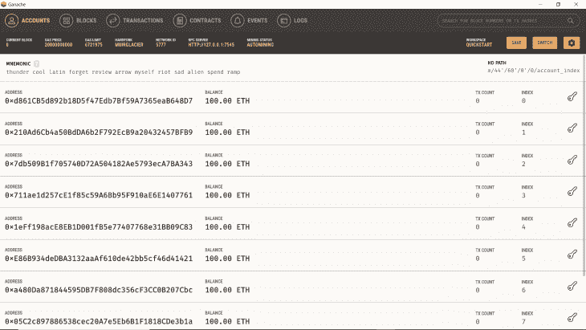
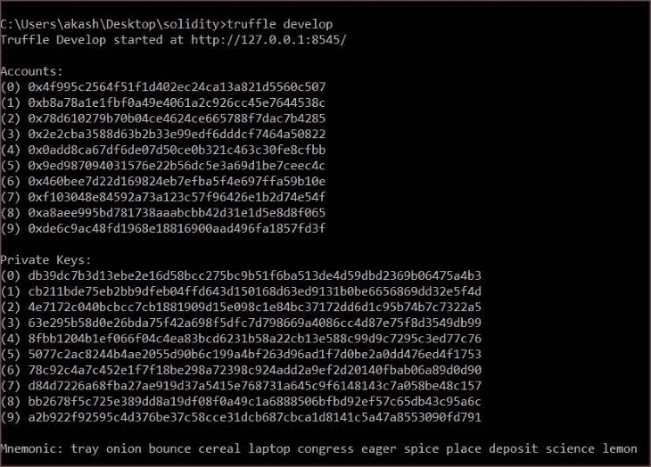
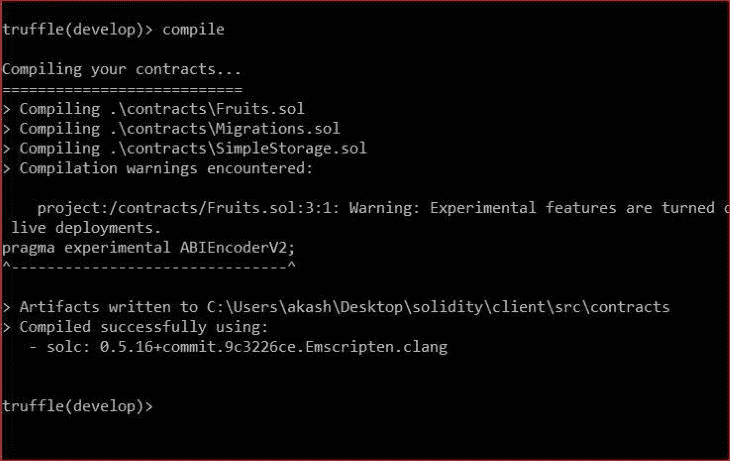
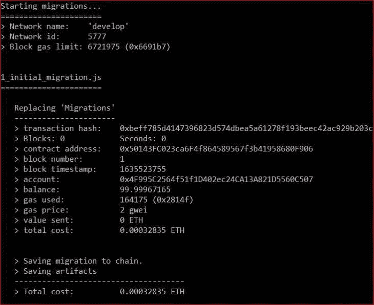
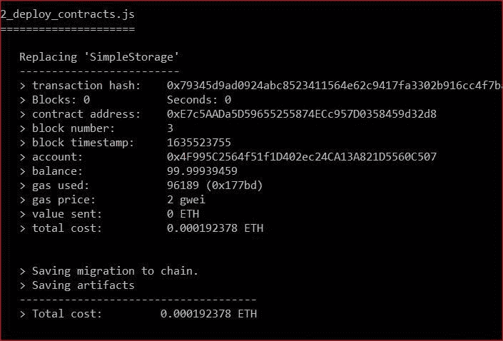
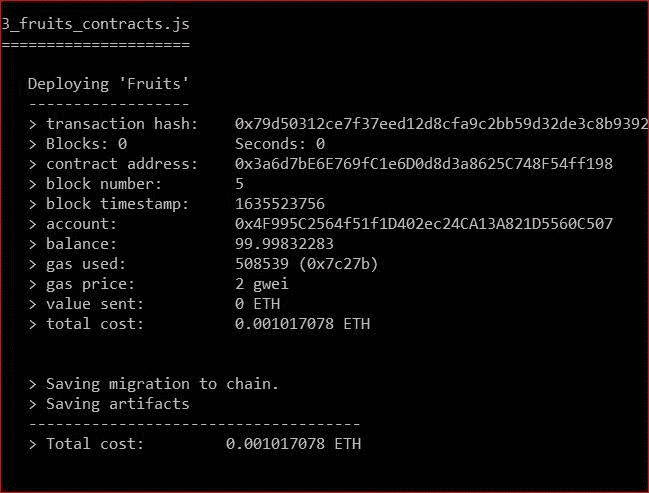
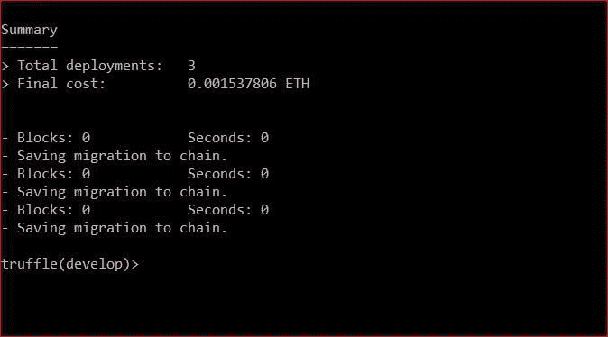

# 松露套件教程:如何开发以太坊智能合约

> 原文：<https://blog.logrocket.com/truffle-suite-tutorial-develop-ethereum-smart-contracts/>

想知道如何创建自己的区块链应用程序吗？说到以太坊，就要从智能合约说起。

在本教程中，我们将关注用 Solidity 语言编写的智能合约。我们将使用 Truffle 套件部署以太坊区块链的本地版本，并使用以太坊虚拟机(EVM)编译智能合同。

如果你不熟悉上面描述的技术，我建议你先阅读我们的[使用 Web3.js](https://blog.logrocket.com/ethereum-blockchain-development-using-web3-js/) 开发以太坊区块链的指南。

## 什么是松露套房？

以太坊是一个允许应用程序在其上运行的区块链。代码以智能合约的形式用 [Solidity](https://docs.soliditylang.org/) 语言编写。为了编译这些契约，我们需要一个以太坊编译器，它将智能契约转换为机器可读的代码。

Truffle 套件是专门为以太坊上的区块链开发制作的工具集。该套件包括三个软件:

1.  智能合约开发框架 Truffle
2.  [Ganache](https://www.trufflesuite.com/ganache) ，可以在本地网络上设置个人以太坊区块链进行测试和开发
3.  [毛毛雨](https://www.trufflesuite.com/drizzle)，用于创建 DApp 用户界面，包括一组现成的组件

## 设置库和软件

对于本教程，我们需要一些节点包和软件，包括以太坊区块链、智能契约编译器和用于通信的 JavaScript 库。

### 安装 Ganache

智能合约在以太坊区块链上运行，所以我们需要一个用于部署和测试。我们也可以部署在一个活动链上，但那会花费我们太多的汽油费。因此，让我们建立一个本地链，并在那里做我们的测试。当你确定了代码并准备好发布你的应用时，你就可以在 live chain 上部署了。

Ganache 是安装在我们的计算机上并在本地主机上运行的本地链。从 [Truffle Suite 网站](https://www.trufflesuite.com/ganache)下载并安装 Ganache。



您可以看到，Ganache 提供了 10 个帐户，每个帐户有 100 个 ETH。这些都是假醚，不要激动。此外，该链在 127.0.0.1 的 7545 端口上运行。我们将使用这些帐户在此链上部署我们的智能合同。乙醚会帮我们付煤气费。

### 安装 Node.js

这个项目需要 Node.js，所以要确保它已经安装在您的系统上。可以从 [Node.js 官网](https://nodejs.org/en/download/)下载。

### 安装 Web3.js

[Web3.js](https://web3js.readthedocs.io/en/v1.5.2/getting-started.html#adding-web3) 是一个 JavaScript 库，通过 JavaScript 实现与以太坊区块链的通信。它有许多在开发中有用的内置函数。

您可以使用`npm`或`yarn`安装 Web3.js:

```
npm install web3 -g

```

### 安装 Truffle

Truffle 提供了智能合约的编译器。我们需要它来将 Solidity 代码转换成机器可读的代码，这些代码可以部署在加纳切区块链上。

使用以下命令安装 Truffle:

```
npm install truffle -g

```

## 创建智能合同

为了创建智能合同，我们首先需要创建一个项目目录，我们将在其中保存所有的 Solidity 文件。让我们创建一个名为`solidity`的文件，并使用`cd solidity`移动到终端中的目录。

现在，我们的项目是空的。为了使用它，我们需要一些样板代码。例如，如果您希望在 React 中创建 UI，您需要安装 React。

松露已经提供了一些包装，它们被称为[盒子](https://www.trufflesuite.com/boxes)。这些包是不同框架的捆绑包，比如 Truffle、Ganache、React、Web3 和 Redux，还有一个是给 Vue.js 开发者的。他们一起完成从客户端 UI 到区块链智能合同的端到端应用程序开发。

在本文中，我们将使用 Truffle 提供的 [React 框。](https://www.trufflesuite.com/boxes/react)

### 安装反应盒

要安装 React box，请运行以下命令:

```
truffle unbox react

```

这将安装 Web3.js、React、Ganache CLI、Truffle 和以太坊。从某种意义上说，我们并不真的需要在第一步安装所有这些实用程序。

出于本教程的目的，我们不会关注 React 或基于浏览器的 UI。相反，我们将创建智能合同，并只使用终端来处理它们。

我们项目的目录结构如下所示:


这里，`client`是一个 React 项目文件夹，我们可以在其中创建应用程序的 UI。里面有一个文件夹(`client` / `src` / `contracts`)保存着编译好的 JSON 格式的智能合约。这些文件是在我们编译智能合同时生成的。它们包含 ABI、字节码和其他信息。


从上图中，你可以看到我们有两个 JSON 文件。这是因为当我们拆箱 React 包时，Truffle 已经提供了两个智能合约。如果你打开其中的任何一个，你会发现这样的代码:

```
{
  "contractName": "SimpleStorage",
  "abi": [
    {
      "constant": false,
      "inputs": [
        {
          "internalType": "uint256",
          "name": "x",
          "type": "uint256"
        }
      ],
      "name": "set",
      "outputs": [],
      "payable": false,
      "stateMutability": "nonpayable",
      "type": "function"
    },
    {
      "constant": true,
      "inputs": [],
      "name": "get",
      "outputs": [
        {
          "internalType": "uint256",
          "name": "",
          "type": "uint256"
        }
      ],
      "payable": false,
      "stateMutability": "view",
      "type": "function"
    }
  ],
  "metadata": "{\"compiler\":{\"version\":\"0.5.16+commit.9c3226ce\"},\"language\":\"Solidity\",\"output\":{\"abi\":[{\"constant\":true,\"inputs\":[],\"name\":\"get\",\"outputs\":[{\"internalType\":\"uint256\",\"name\":\"\",\"type\":\"uint256\"}],\"payable\":false,\"stateMutability\":\"view\",\"type\":\"function\"},{\"constant\":false,\"inputs\":[{\"internalType\":\"uint256\",\"name\":\"x\",\"type\":\"uint256\"}],\"name\":\"set\",\"outputs\":[],\"payable\":false,\"stateMutability\":\"nonpayable\",\"type\":\"function\"}],\"devdoc\":{\"methods\":{}},\"userdoc\":{\"methods\":{}}},\"settings\":{\"compilationTarget\":{\"project:/contracts/SimpleStorage.sol\":\"SimpleStorage\"},\"evmVersion\":\"istanbul\",\"libraries\":{},\"optimizer\":{\"enabled\":false,\"runs\":200},\"remappings\":[]},\"sources\":{\"project:/contracts/SimpleStorage.sol\":{\"keccak256\":\"0x512df1603c5f878921707d236bc53d974afe05b4d9de4b6094249bac5ab60efe\",\"urls\":[\"bzz-raw://0d6de97971b1c387f984fa7ea1d9ec10f8a63d68cc63bf8bd00d8c3a7c9e3ee1\",\"dweb:/ipfs/Qmbt92T34sHzedfJjDsvbisvLhRtghNwS6VW8tqrGkrqTD\"]}},\"version\":1}",
  "bytecode": "0x608060405234801561001057600080fd5b5060c68061001f6000396000f3fe6080604052348015600f57600080fd5b506004361060325760003560e01c806360fe47b11460375780636d4ce63c146062575b600080fd5b606060048036036020811015604b57600080fd5b8101908080359060200190929190505050607e565b005b60686088565b6040518082815260200191505060405180910390f35b8060008190555050565b6000805490509056fea265627a7a7231582044ccb2c2d46346d523107088f3e26a4c8a2ec3ec8b2e3a6edb1bc8574d5c5f5264736f6c63430005100032",
  "deployedBytecode": "0x6080604052348015600f57600080fd5b506004361060325760003560e01c806360fe47b11460375780636d4ce63c146062575b600080fd5b606060048036036020811015604b57600080fd5b8101908080359060200190929190505050607e565b005b60686088565b6040518082815260200191505060405180910390f35b8060008190555050565b6000805490509056fea265627a7a7231582044ccb2c2d46346d523107088f3e26a4c8a2ec3ec8b2e3a6edb1bc8574d5c5f5264736f6c63430005100032",
  "sourceMap": "66:176:1:-;;;;8:9:-1;5:2;;;30:1;27;20:12;5:2;66:176:1;;;;;;;",
  "deployedSourceMap": "66:176:1:-;;;;8:9:-1;5:2;;;30:1;27;20:12;5:2;66:176:1;;;;;;;;;;;;;;;;;;;;;;;;113:53;;;;;;13:2:-1;8:3;5:11;2:2;;;29:1;26;19:12;2:2;113:53:1;;;;;;;;;;;;;;;;;:::i;:::-;;170:70;;;:::i;:::-;;;;;;;;;;;;;;;;;;;113:53;160:1;147:10;:14;;;;113:53;:::o;170:70::-;206:4;225:10;;218:17;;170:70;:::o",
  "source": "// SPDX-License-Identifier: MIT\npragma solidity >=0.4.21 <0.7.0;\n\ncontract SimpleStorage {\n  uint storedData;\n\n  function set(uint x) public {\n    storedData = x;\n  }\n\n  function get() public view returns (uint) {\n    return storedData;\n  }\n}\n",
  "sourcePath": "C:\\Users\\akash\\Desktop\\solidity\\contracts\\SimpleStorage.sol",
  "ast": {
    "absolutePath": "project:/contracts/SimpleStorage.sol",
    "exportedSymbols": {
      "SimpleStorage": [
        59
      ]
    },
    "id": 60,
    "nodeType": "SourceUnit",
    "nodes": [
      {
        "id": 38,
        "literals": [
          "solidity",
          ">=",
          "0.4",
          ".21",
          "<",
          "0.7",
          ".0"
        ],
        "nodeType": "PragmaDirective",
        "src": "32:32:1"
      },
      {
        "baseContracts": [],
        "contractDependencies": [],
        "contractKind": "contract",
        "documentation": null,
        "fullyImplemented": true,
        "id": 59,
        "linearizedBaseContracts": [
          59
        ],
        "name": "SimpleStorage",
        "nodeType": "ContractDefinition",
        "nodes": [
          {
            "constant": false,
            "id": 40,
            "name": "storedData",
            "nodeType": "VariableDeclaration",
            "scope": 59,
            "src": "93:15:1",
            "stateVariable": true,
            "storageLocation": "default",
            "typeDescriptions": {
              "typeIdentifier": "t_uint256",
              "typeString": "uint256"
            },
            "typeName": {
              "id": 39,
              "name": "uint",
              "nodeType": "ElementaryTypeName",
              "src": "93:4:1",
              "typeDescriptions": {
                "typeIdentifier": "t_uint256",
                "typeString": "uint256"
              }
            },
            "value": null,
            "visibility": "internal"
          },
          {
            "body": {
              "id": 49,
              "nodeType": "Block",
              "src": "141:25:1",
              "statements": [
                {
                  "expression": {
                    "argumentTypes": null,
                    "id": 47,
                    "isConstant": false,
                    "isLValue": false,
                    "isPure": false,
                    "lValueRequested": false,
                    "leftHandSide": {
                      "argumentTypes": null,
                      "id": 45,
                      "name": "storedData",
                      "nodeType": "Identifier",
                      "overloadedDeclarations": [],
                      "referencedDeclaration": 40,
                      "src": "147:10:1",
                      "typeDescriptions": {
                        "typeIdentifier": "t_uint256",
                        "typeString": "uint256"
                      }
                    },
                    "nodeType": "Assignment",
                    "operator": "=",
                    "rightHandSide": {
                      "argumentTypes": null,
                      "id": 46,
                      "name": "x",
                      "nodeType": "Identifier",
                      "overloadedDeclarations": [],
                      "referencedDeclaration": 42,
                      "src": "160:1:1",
                      "typeDescriptions": {
                        "typeIdentifier": "t_uint256",
                        "typeString": "uint256"
                      }
                    },
                    "src": "147:14:1",
                    "typeDescriptions": {
                      "typeIdentifier": "t_uint256",
                      "typeString": "uint256"
                    }
                  },
                  "id": 48,
                  "nodeType": "ExpressionStatement",
                  "src": "147:14:1"
                }
              ]
            },
            "documentation": null,
            "id": 50,
            "implemented": true,
            "kind": "function",
            "modifiers": [],
            "name": "set",
            "nodeType": "FunctionDefinition",
            "parameters": {
              "id": 43,
              "nodeType": "ParameterList",
              "parameters": [
                {
                  "constant": false,
                  "id": 42,
                  "name": "x",
                  "nodeType": "VariableDeclaration",
                  "scope": 50,
                  "src": "126:6:1",
                  "stateVariable": false,
                  "storageLocation": "default",
                  "typeDescriptions": {
                    "typeIdentifier": "t_uint256",
                    "typeString": "uint256"
                  },
                  "typeName": {
                    "id": 41,
                    "name": "uint",
                    "nodeType": "ElementaryTypeName",
                    "src": "126:4:1",
                    "typeDescriptions": {
                      "typeIdentifier": "t_uint256",
                      "typeString": "uint256"
                    }
                  },
                  "value": null,
                  "visibility": "internal"
                }
              ],
              "src": "125:8:1"
            },
            "returnParameters": {
              "id": 44,
              "nodeType": "ParameterList",
              "parameters": [],
              "src": "141:0:1"
            },
            "scope": 59,
            "src": "113:53:1",
            "stateMutability": "nonpayable",
            "superFunction": null,
            "visibility": "public"
          },
          {
            "body": {
              "id": 57,
              "nodeType": "Block",
              "src": "212:28:1",
              "statements": [
                {
                  "expression": {
                    "argumentTypes": null,
                    "id": 55,
                    "name": "storedData",
                    "nodeType": "Identifier",
                    "overloadedDeclarations": [],
                    "referencedDeclaration": 40,
                    "src": "225:10:1",
                    "typeDescriptions": {
                      "typeIdentifier": "t_uint256",
                      "typeString": "uint256"
                    }
                  },
                  "functionReturnParameters": 54,
                  "id": 56,
                  "nodeType": "Return",
                  "src": "218:17:1"
                }
              ]
            },
            "documentation": null,
            "id": 58,
            "implemented": true,
            "kind": "function",
            "modifiers": [],
            "name": "get",
            "nodeType": "FunctionDefinition",
            "parameters": {
              "id": 51,
              "nodeType": "ParameterList",
              "parameters": [],
              "src": "182:2:1"
            },
            "returnParameters": {
              "id": 54,
              "nodeType": "ParameterList",
              "parameters": [
                {
                  "constant": false,
                  "id": 53,
                  "name": "",
                  "nodeType": "VariableDeclaration",
                  "scope": 58,
                  "src": "206:4:1",
                  "stateVariable": false,
                  "storageLocation": "default",
                  "typeDescriptions": {
                    "typeIdentifier": "t_uint256",
                    "typeString": "uint256"
                  },
                  "typeName": {
                    "id": 52,
                    "name": "uint",
                    "nodeType": "ElementaryTypeName",
                    "src": "206:4:1",
                    "typeDescriptions": {
                      "typeIdentifier": "t_uint256",
                      "typeString": "uint256"
                    }
                  },
                  "value": null,
                  "visibility": "internal"
                }
              ],
              "src": "205:6:1"
            },
            "scope": 59,
            "src": "170:70:1",
            "stateMutability": "view",
            "superFunction": null,
            "visibility": "public"
          }
        ],
        "scope": 60,
        "src": "66:176:1"
      }
    ],
    "src": "32:211:1"
  },
  "legacyAST": {
    "attributes": {
      "absolutePath": "project:/contracts/SimpleStorage.sol",
      "exportedSymbols": {
        "SimpleStorage": [
          59
        ]
      }
    },
    "children": [
      {
        "attributes": {
          "literals": [
            "solidity",
            ">=",
            "0.4",
            ".21",
            "<",
            "0.7",
            ".0"
          ]
        },
        "id": 38,
        "name": "PragmaDirective",
        "src": "32:32:1"
      },
      {
        "attributes": {
          "baseContracts": [
            null
          ],
          "contractDependencies": [
            null
          ],
          "contractKind": "contract",
          "documentation": null,
          "fullyImplemented": true,
          "linearizedBaseContracts": [
            59
          ],
          "name": "SimpleStorage",
          "scope": 60
        },
        "children": [
          {
            "attributes": {
              "constant": false,
              "name": "storedData",
              "scope": 59,
              "stateVariable": true,
              "storageLocation": "default",
              "type": "uint256",
              "value": null,
              "visibility": "internal"
            },
            "children": [
              {
                "attributes": {
                  "name": "uint",
                  "type": "uint256"
                },
                "id": 39,
                "name": "ElementaryTypeName",
                "src": "93:4:1"
              }
            ],
            "id": 40,
            "name": "VariableDeclaration",
            "src": "93:15:1"
          },
          {
            "attributes": {
              "documentation": null,
              "implemented": true,
              "isConstructor": false,
              "kind": "function",
              "modifiers": [
                null
              ],
              "name": "set",
              "scope": 59,
              "stateMutability": "nonpayable",
              "superFunction": null,
              "visibility": "public"
            },
            "children": [
              {
                "children": [
                  {
                    "attributes": {
                      "constant": false,
                      "name": "x",
                      "scope": 50,
                      "stateVariable": false,
                      "storageLocation": "default",
                      "type": "uint256",
                      "value": null,
                      "visibility": "internal"
                    },
                    "children": [
                      {
                        "attributes": {
                          "name": "uint",
                          "type": "uint256"
                        },
                        "id": 41,
                        "name": "ElementaryTypeName",
                        "src": "126:4:1"
                      }
                    ],
                    "id": 42,
                    "name": "VariableDeclaration",
                    "src": "126:6:1"
                  }
                ],
                "id": 43,
                "name": "ParameterList",
                "src": "125:8:1"
              },
              {
                "attributes": {
                  "parameters": [
                    null
                  ]
                },
                "children": [],
                "id": 44,
                "name": "ParameterList",
                "src": "141:0:1"
              },
              {
                "children": [
                  {
                    "children": [
                      {
                        "attributes": {
                          "argumentTypes": null,
                          "isConstant": false,
                          "isLValue": false,
                          "isPure": false,
                          "lValueRequested": false,
                          "operator": "=",
                          "type": "uint256"
                        },
                        "children": [
                          {
                            "attributes": {
                              "argumentTypes": null,
                              "overloadedDeclarations": [
                                null
                              ],
                              "referencedDeclaration": 40,
                              "type": "uint256",
                              "value": "storedData"
                            },
                            "id": 45,
                            "name": "Identifier",
                            "src": "147:10:1"
                          },
                          {
                            "attributes": {
                              "argumentTypes": null,
                              "overloadedDeclarations": [
                                null
                              ],
                              "referencedDeclaration": 42,
                              "type": "uint256",
                              "value": "x"
                            },
                            "id": 46,
                            "name": "Identifier",
                            "src": "160:1:1"
                          }
                        ],
                        "id": 47,
                        "name": "Assignment",
                        "src": "147:14:1"
                      }
                    ],
                    "id": 48,
                    "name": "ExpressionStatement",
                    "src": "147:14:1"
                  }
                ],
                "id": 49,
                "name": "Block",
                "src": "141:25:1"
              }
            ],
            "id": 50,
            "name": "FunctionDefinition",
            "src": "113:53:1"
          },
          {
            "attributes": {
              "documentation": null,
              "implemented": true,
              "isConstructor": false,
              "kind": "function",
              "modifiers": [
                null
              ],
              "name": "get",
              "scope": 59,
              "stateMutability": "view",
              "superFunction": null,
              "visibility": "public"
            },
            "children": [
              {
                "attributes": {
                  "parameters": [
                    null
                  ]
                },
                "children": [],
                "id": 51,
                "name": "ParameterList",
                "src": "182:2:1"
              },
              {
                "children": [
                  {
                    "attributes": {
                      "constant": false,
                      "name": "",
                      "scope": 58,
                      "stateVariable": false,
                      "storageLocation": "default",
                      "type": "uint256",
                      "value": null,
                      "visibility": "internal"
                    },
                    "children": [
                      {
                        "attributes": {
                          "name": "uint",
                          "type": "uint256"
                        },
                        "id": 52,
                        "name": "ElementaryTypeName",
                        "src": "206:4:1"
                      }
                    ],
                    "id": 53,
                    "name": "VariableDeclaration",
                    "src": "206:4:1"
                  }
                ],
                "id": 54,
                "name": "ParameterList",
                "src": "205:6:1"
              },
              {
                "children": [
                  {
                    "attributes": {
                      "functionReturnParameters": 54
                    },
                    "children": [
                      {
                        "attributes": {
                          "argumentTypes": null,
                          "overloadedDeclarations": [
                            null
                          ],
                          "referencedDeclaration": 40,
                          "type": "uint256",
                          "value": "storedData"
                        },
                        "id": 55,
                        "name": "Identifier",
                        "src": "225:10:1"
                      }
                    ],
                    "id": 56,
                    "name": "Return",
                    "src": "218:17:1"
                  }
                ],
                "id": 57,
                "name": "Block",
                "src": "212:28:1"
              }
            ],
            "id": 58,
            "name": "FunctionDefinition",
            "src": "170:70:1"
          }
        ],
        "id": 59,
        "name": "ContractDefinition",
        "src": "66:176:1"
      }
    ],
    "id": 60,
    "name": "SourceUnit",
    "src": "32:211:1"
  },
  "compiler": {
    "name": "solc",
    "version": "0.5.16+commit.9c3226ce.Emscripten.clang"
  },
  "networks": {
    "5777": {
      "events": {},
      "links": {},
      "address": "0xc21DB75B9B17Cb43Cd983A16BaA6c73b314B1E8f",
      "transactionHash": "0xada7b561df968c3d23485d25cbd22a66d1d4b76a86137dbf1bef858e816ff0c2"
    }
  },
  "schemaVersion": "3.4.3",
  "updatedAt": "2021-10-29T10:14:41.665Z",
  "networkType": "ethereum",
  "devdoc": {
    "methods": {}
  },
  "userdoc": {
    "methods": {}
  }
}

```

上面的大量代码块包含 ABI、字节码、源代码和大量其他信息。从 ABI，我们可以得到可调用函数的列表。该文件包含所有信息，如网络 ID、合同地址、事务散列、编译器细节、链细节等。

您可能想知道为什么这个文件在 UI 目录中？那是因为 Web3.js 使用它进行操作。这个文件使 Web3.js 能够识别链上的智能契约。此外，ABI 有助于获取函数列表。

*   `contracts`是保存 Solidity 文件的目录。你将把所有的源代码放在这里
*   是通知 Truffle 哪些 Solidity 文件需要迁移到链中的文件
*   `test`用于创建测试文件
*   `truffle-config.js`包含松露的一些配置设置。

下面是`truffle-config.js`的内容:

```
const path = require("path");

module.exports = {
  // See <http://truffleframework.com/docs/advanced/configuration>
  // to customize your Truffle configuration!
  contracts_build_directory: path.join(__dirname, "client/src/contracts"),
  networks: {
    develop: {
      port: 8545
    }
  }
};

```

如您所见，`client/src/contracts`被设置为保存编译后的代码。开发网络设置在端口 8545。这是这个机器运行 Ganache 的端口。

如果你看一下我们安装 Ganache 的顶部，你可以看到它运行在 7545 端口，但这个运行在 8545，因为 7545 已经被我们安装的 Ganache 使用。如果你愿意，你可以将这个端口改为 7545，Truffle 将使用我们安装的 Ganache 和帐户，而不是 box 提供的帐户。我把它保持在 8545。

## 在 Solidity 中编写智能合同

现在是时候写一些代码了。我们会做 CRUD 操作，管理一个水果列表。

基本上，我们的应用程序将显示不同水果的列表。您可以添加、更新和删除水果。

* * *

### 更多来自 LogRocket 的精彩文章:

* * *

如果您以前开发过应用程序，我们将遵循您肯定熟悉的流程:

1.  创建一个数组来保存水果的名称
2.  创建一个函数，将新值推送到数组中
3.  创建一个函数来改变给定索引处的值
4.  创建删除值的函数
5.  创建一个函数来返回数组

现在让我们用 Solidity 来写代码。

在`contracts`目录下创建一个新文件，命名为`Fruits.sol`。我们将通过指明我们支持的许可证和 solidity 版本来开始该文件:

```
// SPDX-License-Identifier: MIT
pragma solidity >=0.4.21 <0.7.0;

```

接下来，声明我们将要编写所有代码的`contract`范围:

```
// SPDX-License-Identifier: MIT
pragma solidity >=0.4.21 <0.7.0;

contract Fruits {

}

```

创建一个数组来存放水果:

```
// SPDX-License-Identifier: MIT
pragma solidity >=0.4.21 <0.7.0;

contract Fruits {
  string[] myFruits;
}

```

这是一个带有私有修饰符的字符串数组，这意味着它不能在契约之外被访问，因此我们不能直接改变它的值。

接下来，创建一个函数来添加新值:

```
// SPDX-License-Identifier: MIT
pragma solidity >=0.4.21 <0.7.0;

contract Fruits {
  string[] myFruits;

  function addFruit(string memory fruitName) public {
      myFruits.push(fruitName);
  }
}

```

我们创建了一个名为`addFruit`的函数，它接受一个字符串作为参数`fruitName`。这被声明为公共的，因此它可以被 UI 或终端调用。在函数体中，我们只是将值推送到数组中。

更新值:

```
// SPDX-License-Identifier: MIT
pragma solidity >=0.4.21 <0.7.0;

contract Fruits {
  string[] myFruits;

  function addFruit(string memory fruitName) public {
      myFruits.push(fruitName);
  }

  function updateFruit(uint fruitIndex, string memory newFruitName) public returns (bool) {
      if(myFruits.length > fruitIndex){
          myFruits[fruitIndex] = newFruitName;
          return true;
      }
      return false;
  }
}

```

`updateFruit`接受两个参数，`fruitIndex`和`newFruitName`，并返回一个布尔值。它是这样工作的:如果索引超出了数组的边界，它返回`false`。否则，它在提供的索引处用新提供的水果名称改变数组的值，并返回`true`。

接下来的步骤是创建删除函数:

```
// SPDX-License-Identifier: MIT
pragma solidity >=0.4.21 <0.7.0;

contract Fruits {
  string[] myFruits;

  function addFruit(string memory fruitName) public {
      myFruits.push(fruitName);
  }

  function updateFruit(uint fruitIndex, string memory newFruitName) public returns (bool) {
      if(myFruits.length > fruitIndex){
          myFruits[fruitIndex] = newFruitName;
          return true;
      }
      return false;
  }

  function deleteFruit(uint fruitIndex) public returns (bool) {
      if(myFruits.length > fruitIndex){
          for(uint i=fruitIndex; i < myFruits.length-1; i++){
              myFruits[i] = myFruits[i+1];
          }

          myFruits.pop();

          return true;
      }
      return false;
  }
}

```

在这里，我们检查索引超出边界条件，然后通过用提供的索引中的下一个值替换该值来更新数组。这样，所提供的索引处的值将会丢失。最后，我们弹出最后一个值并返回`true`。

最后一步是返回数组。要读取数组的所有值:

```
// SPDX-License-Identifier: MIT
pragma solidity >=0.4.21 <0.7.0;

contract Fruits {
  string[] myFruits;

  function addFruit(string memory fruitName) public {
      myFruits.push(fruitName);
  }

  function updateFruit(uint fruitIndex, string memory newFruitName) public returns (bool) {
      if(myFruits.length > fruitIndex){
          myFruits[fruitIndex] = newFruitName;
          return true;
      }
      return false;
  }

  function deleteFruit(uint fruitIndex) public returns (bool) {
      if(myFruits.length > fruitIndex){
          for(uint i=fruitIndex; i < myFruits.length-1; i++){
              myFruits[i] = myFruits[i+1];
          }

          myFruits.pop();

          return true;
      }
      return false;
  }

  function getFruits() public view returns (string[] memory) {
      return myFruits;
  }
}

```

## 使用 Truffle 编译智能合约

现在我们已经完成了智能契约的编码，是时候使用 Truffle 编译它了。但是首先我们需要创建一个迁移文件，向 Truffle 表明我们想要将它迁移到链中。

如果您查看`migration`文件夹，您会发现两个 JavaScript 文件:


它们每个都以一个数字开始，所以我们的第三个文件将以 3 开始，依此类推。代码几乎是标准的。对于`2_deploy_contracts`它是:

```
var SimpleStorage = artifacts.require("./SimpleStorage.sol");

module.exports = function(deployer) {
  deployer.deploy(SimpleStorage);
};

```

让我们添加我们的迁移文件，`3_fruits_contracts`:

```
var FruitsList = artifacts.require("./Fruits.sol");

module.exports = function(deployer) {
  deployer.deploy(FruitsList);
};

```

我们准备编译和迁移我们的水果契约。移动到终端并运行以下命令:

```
> truffle develop

```



这个命令将启动 truffle 控制台。它还会显示一些信息，如连锁网络，帐户，助记符等。

Ganache 默认提供 10 个账号。它们对你来说是不同的。请不要在直播链上使用这些私钥，因为这篇文章的所有访问者都可以看到它们，这意味着任何人都可以访问这些帐户。

现在使用以下命令编译合同:

```
> compile

```



您可以在`client/src/contracts`中检查是否创建了`Fruits.json`文件。

我们可以使用以下命令将编译后的文件迁移到链中:

```
> migrate

```

这将把所有三个智能合约迁移到链中。








最后，我们的应用程序在以太坊链上。你可以看到我们在汽油费上花了 0.00153 乙醚，交易是从第一个账户开始的。默认情况下，它总是采用第一个帐户。我们现在可以进行各种操作。

### 获取水果清单

我们可以用 Web3.js 来反应，写各种值。让我们首先将契约的实例存储在一个变量中:

```
let instance = await Fruits.deployed()

```

我们使用`await`是因为区块链的一切都是异步的，并且会返回一个承诺。

现在使用这个实例来获取数组:

```
> let fruits = instance.getFruits()
undefined
> fruits
[]

```

它将返回一个空数组，因为目前我们的水果数组没有值。


### 将水果添加到列表中

我们来补充一些水果:

```
> let result = await instance.addFruit("Apple")
undefined

```

`result`将保存事务。请记住，所有的读取操作都是免费的，但任何导致区块链发生变化的操作都要缴纳燃气费。该操作向数组中添加一个值，从而改变数据。因此，它被记录为一笔交易。


现在我们可以再次读取数组来检查内容:


让我们再增加一些水果:

```
> await instance.addFruit("Mango")
> await instance.addFruit("Banana")
> await instance.addFruit("Orange")
> await instance.addFruit("Guava")
> await instance.addFruit("Pineapple")
> await instance.addFruit("Water Melon")
> await instance.addFruit("Papaya")
> await instance.addFruit("Strawberry")

```

记住，所有这些操作都会让你付出代价。您可以通过在合同中创建一个一次接受多个水果值的函数来节省费用。

现在读取数组:


### 更新水果名称

你可以在上面的图片中看到，我把“Guava”拼错成了“Guavva”让我们使用`updateFruit`功能来纠正它。它将接受索引和新值。指数是 4。

```
> await instance.updateFruit(4, "Guava")

```

现在让我们来读数组:


拼写已成功修复。

### 删除水果名称

最后一个操作是删除一个值:

```
> await instance.deleteFruit(4)

```

读取数值:


如你所见,“番石榴”这个项目从列表中消失了。

## 结论

创建智能合同并在区块链上部署既有趣又强大。它提供了一个不同于传统编程的新视角。你可以创建各种各样的应用程序，如在线投票、数字银行、钱包、拍卖等。，使用这些技术。

在本教程中，我们演示了如何创建智能合约并将其部署在本地链上。现在你可以尝试在以太坊的测试网络上部署。

你可以通过引入更多功能来改进当前的应用程序，例如一次添加多个水果以节省交易成本。你也可以勾选只允许独特的水果。尝试使用映射而不是数组。

编码快乐！

## 加入像 Bitso 和 Coinsquare 这样的组织，他们使用 LogRocket 主动监控他们的 Web3 应用

影响用户在您的应用中激活和交易的能力的客户端问题会极大地影响您的底线。如果您对监控 UX 问题、自动显示 JavaScript 错误、跟踪缓慢的网络请求和组件加载时间感兴趣，

[try LogRocket](https://lp.logrocket.com/blg/web3-signup)

.

[](https://lp.logrocket.com/blg/web3-signup)[https://logrocket.com/signup/](https://lp.logrocket.com/blg/web3-signup)

LogRocket 就像是网络和移动应用的 DVR，记录你的网络应用或网站上发生的一切。您可以汇总和报告关键的前端性能指标，重放用户会话和应用程序状态，记录网络请求，并自动显示所有错误，而不是猜测问题发生的原因。

现代化您调试 web 和移动应用的方式— [开始免费监控](https://lp.logrocket.com/blg/web3-signup)。