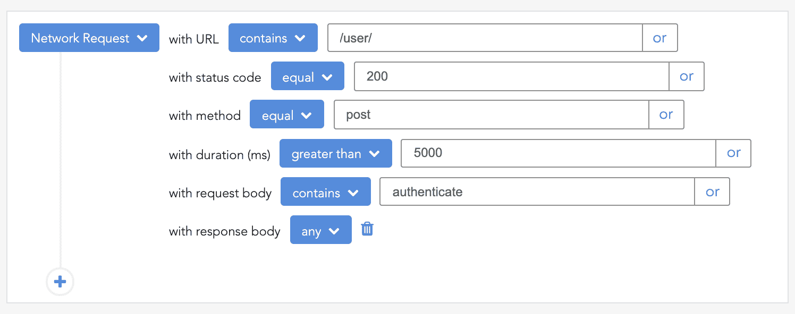

# TypeORM:使用 Node.js 的对象关系映射

> 原文：<https://blog.logrocket.com/typeorm-object-relational-mapping-node-js/>

如果你是后端开发人员，你可能会被数据驱动的 API 开发所困扰。在本文中，您将通过使用 TypeORM 和 TypeScript 创建 Node.js 应用程序来了解最流行的 JavaScript 对象关系映射器之一 type ORM。TypeORM 旨在优化和简化编写长而复杂的 SQL 查询，使任务压力更小。我们开始吧！

## 什么是 JavaScript ORM？

ORM 代表对象关系映射，是一种编程技术，它提供了一种使用面向对象编程语言与数据库进行交互的方法。本质上，ORM 在关系数据库和面向对象编程语言之间转换数据。

ORM 生成虚拟映射到数据库中的表的对象。因此，您可以轻松地检索、操作或删除表中的任何字段，从而以更简单、优化的方式编写复杂的 SQL 查询。

对象关系映射器是一个代码库，它封装了操作数据所需的代码，因此您不再需要使用 SQL。您可以用自己选择的语言编写一个对象关系映射器，并直接与使用相同语言的对象进行交互。

通过隐藏和封装数据源中的变化，每当数据源或其 API 发生变化时，只有 ORM 需要改变，而不是使用 ORM 的应用程序。

## 使用 ORM 的好处

ORM 是促进数据驱动的 API 开发的有用解决方案。首先，ORM 会根据已定义的数据模型自动生成所有数据访问代码，从而减少整体开发时间，并提高所有相关开发人员的生产率。

一个好的 ORM 很可能是由顶级软件架构师设计的。因此，使用 ORM 会产生一个干净的软件架构，具有有效和一致的设计模式。

ORM 通过确保代码库中关注点的分离来实现代码的可重用性。有了有效的设计模式，代码库中就不会有太多的歧义，所以 ORM 可以减少测试的总时间。

有了 ORM，开发人员就有特权主要关注系统的逻辑设计，而 ORM 会处理其余的事情。ORM 库是用您喜欢的语言编写的，它封装了操作数据所需的代码。因此，您可以直接与使用相同语言的对象进行交互，而不再需要使用 SQL。

最后，ORM 将有助于保护您的应用程序免受 SQL 注入攻击，因为库会为您过滤数据。现在我们知道了 ORM 背后的基础知识，让我们更仔细地看看 TypeORM。

## 什么是 TypeORM？

TypeORM 是一个开源工具，在撰写本文时，它拥有超过 28k 的 GitHub stars 和超过 100 万的 npm 周下载量。TypeORM 于 2016 年 2 月 21 日推出，已经发展成为最受欢迎的 JavaScript ORMs 之一，也是为 TypeScript 项目构建的最受欢迎的 ORM 库之一。

TypeORM 支持 JavaScript、ES5、ES6、ES7 和 ES8 的最新功能，可以在许多平台上运行，包括 Node.js、Cordova、PhoneGap、Ionic、React Native、NativeScript、Expo 和 Electron。TypeORM 提供了额外的特性，使开发人员能够构建许多不同种类的使用数据库的应用程序，从只有几个表的小型应用程序到有多个数据库的大型应用程序。

## 为什么 TypeORM 是 JavaScript 的最佳 ORM？

使用 TypeORM，开发人员可以获得类型支持、最新的 JavaScript 特性，以及开发任何使用数据库并在多个平台上运行的应用程序所需的附加特性。

与所有其他 JavaScript ORMs 不同，TypeORM 还支持主要的 ORM 架构模式、数据映射器和活动记录，这意味着开发人员可以以最高效的方式编写高质量、可伸缩、松散耦合、可维护的应用程序。

TypeORM 为开发人员提供了选择他们喜欢的模式的灵活性。作为最流行的 TypeScript ORM，使用 TypeORM 进行开发的挑战性较小，因为很容易找到关于该主题的教程以及有助于故障排除和资源的社区。

TypeORM 非常有效地使用了 TypeScript decorators，从而产生了富有表现力且非常易于阅读的实体类。有了 TypeScript 语法，TypeORM 还可以很好地与 Angular 项目集成。

TypeORM 的文档很容易获得，并且以清晰易懂的方式编写，[包括像迁移、关系和 ORM 架构模式](https://typeorm.io/)这样的基本主题。

## 使用 TypeORM 的 JavaScript 中的 ORM

要在 JavaScript 项目中开始使用 TypeORM，我们需要安装一些 TypeScript 包和数据库适配器。

### 安装 TypeORM 包

要安装所需的软件包，请在终端中运行以下命令:

```
npm install --save typeorm reflect-metadata pg

```

接下来，我们可以通过运行以下代码来安装附加包，这些包是 TypeScript 的开发依赖项:

```
npm install --save-dev typescript @types/node ts-node

```

最后，在`tsconfig.json`文件中配置以下设置，如下所示:

```
"emitDecoratorMetadata": true,
"experimentalDecorators": true,

```

## 启动一个项目

要搭建新的 TypeORM 项目，请在终端中运行以下命令:

```
typeorm init --name <project-name> --database <database-name>

```

我使用`MyTypeormProject`作为我的项目名，使用`database pg`PostgreSQL 作为数据库，但是您可以使用任何您想要的数据库:

```
typeorm init --name MyTypeormProject --database pg

```

上面的命令将在`MyTypeormProject`目录中生成一个新项目，该项目使用一个 PostgreSQL 数据库，其中包含以下文件:

```
MyTypeormProject
├── src                  // The houses your TypeScript code
│   ├── entity           // Here, your entities (database models) are stored
│   │   └── User.ts      // This is a sample entity
│   ├── migration        // Here, your migrations are stored
│   ├── data-source.ts   // This is the data source and to configure connections
│   └── index.ts         // This is starting point of your appl
├── .gitignore           // The gitignore file of your project
├── package.json         // This file holds all node module dependencies
├── README.md            // A readme file for 
└── tsconfig.json        // This holds the TypeScript compiler options

```

接下来，安装新的项目依赖项:

```
cd MyTypeormProject
npm install

```

## 配置 TypeORM 项目

`data-source.ts`是 TypeORM 项目中最重要的文件，您可以在其中指定应用程序的数据库配置，如下所示:

```
import "reflect-metadata"
import { DataSource } from "typeorm"
import { User } from "./entity/User"

export const AppDataSource = new DataSource({
    type: "pg",
    host: "localhost",
    port: 3306,
    username: "test",
    password: "test",
    database: "testdb",
    synchronize: true,
    logging: false,
    entities: [User],
    migrations: [],
    subscribers: [],
})

```

您也可以选择修改提供的默认配置。在`data-source.ts`文件中，`entities`是指您的`entity`类的位置，`migrations`是指您的`migration`类的位置，`subscribers`是指您的`subscriber`类的位置，CLI 是指 TypeORM CLI 用来自动生成代码的选项。

可以使用以下配置重新配置数据库:

```
{ 
   "type": "pg", 
   "host": "localhost", 
   "port": 3306, 
   "username": "db_uname", "password": "db_pw", "database": "db_test" 
}

```

## 运行应用程序

在运行应用程序之前，启动数据库服务器并确保它运行正常。然后，您可以使用以下命令运行该应用程序:

```
npm start

```

随着应用程序的启动，应用程序向数据库中插入一个新用户，从数据库中反向加载它，然后在控制台中显示加载的用户。

* * *

### 更多来自 LogRocket 的精彩文章:

* * *

如果默认情况下数据库中已经存在用户表，则需要更改名称。您可以通过更改配置文件来创建多个连接，以满足您的项目需求。

至此，您已经成功地从头开始创建、配置和运行了一个新的 TypeORM 应用程序。

## 结论

ORM 是一个强大的工具。在本文中，我们探索了用 JavaScript 创建 ORM。我们还了解了 TypeORM，以及为什么它是一个重要的 JavaScript ORM。最后，我们使用 TypeORM 成功构建了 Node.js 和 TypeScript 应用程序。

看到 TypeORM 如何随着时间的推移而发展将是令人兴奋的。在本文中，我们没有涉及诸如迁移、索引、事务、侦听器或订阅者等高级主题。不过，你可以在[官方文档](https://typeorm.io/)中查看它们。

我很想听听你对 TypeORM 的看法，它在 Node.js 生态系统中的位置，以及真实世界的用例。一定要在下面留下评论。感谢阅读！

## 200 只显示器出现故障，生产中网络请求缓慢

部署基于节点的 web 应用程序或网站是容易的部分。确保您的节点实例继续为您的应用程序提供资源是事情变得更加困难的地方。如果您对确保对后端或第三方服务的请求成功感兴趣，

[try LogRocket](https://lp.logrocket.com/blg/node-signup)

.

[](https://lp.logrocket.com/blg/node-signup)[https://logrocket.com/signup/](https://lp.logrocket.com/blg/node-signup)

LogRocket 就像是网络和移动应用程序的 DVR，记录下用户与你的应用程序交互时发生的一切。您可以汇总并报告有问题的网络请求，以快速了解根本原因，而不是猜测问题发生的原因。

LogRocket 检测您的应用程序以记录基线性能计时，如页面加载时间、到达第一个字节的时间、慢速网络请求，还记录 Redux、NgRx 和 Vuex 操作/状态。

[Start monitoring for free](https://lp.logrocket.com/blg/node-signup)

.