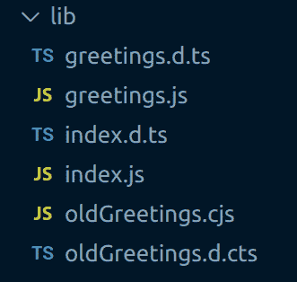

# 了解 TypeScript 4.7 和 ECMAScript 模块支持- LogRocket 博客

> 原文：<https://blog.logrocket.com/typescript-4-7-ecmascript-module-support/>

作为 TypeScript 4.7 版本的一部分，对 Node.js 的 ECMAScript 模块支持进行了重大升级。

## ECMAScript 模块简史

当 ES6 在 2015 年回归时，它带来了 JavaScript 模块的概念。当时它被称为“ES6 模块”。现在它们被称为 ECMAScript 模块。

虽然使用 ECMAScript 模块语义编写代码对于前端来说很快，但对于后端(通常是 Node.js)来说却不是这样。这有很多原因:

1.  Node.js 中已经使用了一个已经建立的模块系统，叫做 [CommonJS](https://en.wikipedia.org/wiki/CommonJS)
2.  Node.js 本身最初并不支持 ECMAScript 模块；很大程度上是因为支持 CommonJS *和 ECMAScript 模块*的相关问题

然而，随着 Node.js 14 的发布，对 ECMAScript 模块(也称为“ESM”)的支持开始了。如果你对该模块支持的细节感兴趣，那么值得阅读这篇关于 ECMAScript 模块的文章。

## 类型脚本支持

TypeScript 团队一直在尝试从 Node.js 的角度为 ECMAScript 模块提供支持的方法，随着 TypeScript 4.7 支持的发布。

在这篇文章中，我们将通过尝试使用新的 ECMAScript 模块支持在 TypeScript 中构建一个简单的模块来测试这种支持。当我们这样做时，我们将讨论在 TypeScript 中为 Node.js 编写 ECMAScript 模块是什么样子。

我们走吧！

## 制作模块

我们将制作一个名为`greeter`的模块—让我们初始化它:

```
mkdir greeter
cd greeter
npm init --yes

```

我们现在有一个看起来像这样的`package.json`:

```
{
  "name": "greeter",
  "version": "1.0.0",
  "description": "",
  "main": "index.js",
  "scripts": {
    "test": "echo \"Error: no test specified\" && exit 1"
  },
  "keywords": [],
  "author": "",
  "license": "ISC"
}

```

Node.js 支持`package.json`中一个名为`type`的新设置。[这可以设置为“模块”或“公共代码”](https://nodejs.org/api/packages.html#type)。引用文档:

> 当最近的父 package.json 文件包含值为`"module"`的顶级字段`"type"`时，以`.js`结尾的文件作为 es 模块加载。

考虑到这一点，我们将为我们的`package.json`添加一个`"type": "module"`。

我们现在支持 ECMAScript 模块，让我们开始添加一些类型脚本。

## 添加 TypeScript 4.7

为了利用 TypeScript ECMAScript 模块支持，我们将安装 TypeScript 4.7(目前处于测试阶段):

```
npm install [email protected] --save

```

准备就绪后，我们将初始化一个 TypeScript 项目:

```
npx tsc --init

```

这将创建一个包含许多选项的`tsconfig.json`文件。我们将把`module`选项调整为`nodenext`，以选择 ECMAScript 模块支持:

```
{
  "compilerOptions": {
    // ...
    "module": "nodenext" /* Specify what module code is generated. */,
    "outDir": "./lib" /* Specify an output folder for all emitted files. */,
    "declaration": true /* Generate .d.ts files from TypeScript and JavaScript files in your project. */

    // ...
  }
}

```

我们还设置了`outDir`选项，这样编译后的 JavaScript 将进入该目录，还设置了`declaration`选项，这样将生成`.d.ts`文件。我们还将更新我们的`package.json`的`"scripts"`部分，以包括`build`和`start`脚本:

```
  "scripts": {
    "build": "tsc",
    "start": "node lib/index.js"
  },

```

## 编写 TypeScript ECMAScript 模块

完成所有这些设置后，我们就可以编写一些 TypeScript ECMAScript 模块了。首先我们将编写一个`greetings.ts`模块:

```
export function helloWorld(): string {
  return 'hello world!';
}

```

这没有什么新的或令人惊讶的；它只是一个模块，导出一个名为`helloWorld`的函数。当我们编写我们的`index.ts`模块时，它变得更加有趣:

```
import { helloWorld } from './greetings.js';

const greeting = helloWorld();

console.log(greeting);

```

上面的代码导入我们的`helloWorld`函数，然后执行它；将输出写入控制台。

不是特别值得注意；但是，我们导入的方式是。

我们从`'./greetings.js'`进口。过去我们会写道:

```
import { helloWorld } from './greetings';

```

现在我们写:

```
import { helloWorld } from './greetings.js';

```

这可能感觉有点奇怪和不自然，因为我们的代码库中没有`greetings.js`；只有`greetings.ts`。我们正在编写的导入反映了最终将被执行的代码；一旦我们的类型脚本被编译成 JavaScript。在 ES 模块中，相对导入路径需要使用扩展。

证明这是合法的最简单的方法是运行以下代码:

```
npm run build && npm start

```

这导致:

```
> [email protected] build
> tsc

> [email protected] start
> node lib/index.js

hello world!

```

所以，它起作用了！

## ECMAScript 和 CommonJS 并排

ECMAScript 模块支持的一部分是能够根据文件后缀指定文件的模块类型。如果您使用`.mjs`，您明确地说一个文件是一个 ECMAScript 模块。如果您使用`.cjs`，您就明确地说一个文件是一个 CommonJS 模块。如果你用 TypeScript 创作，你将分别使用`mts`和`cts`，它们将被传输到`mjs`和`cjs`。

令人高兴的是，Node.js 允许 es 模块导入 CommonJS 模块，就像它们是带有默认导出的 ES 模块一样；这对 interop 来说是个好消息。让我们通过编写一个`oldGreetings.cts`模块来测试一下:

```
export function helloOldWorld(): string {
  return 'hello old world!';
}

```

和之前完全一样的语法。我们将调整我们的`index.ts`来消费这个:

```
import { helloWorld } from './greetings.js';
import { helloOldWorld } from './oldGreetings.cjs';

console.log(helloWorld());
console.log(helloOldWorld());

```

注意，我们是从`'./oldGreetings.cjs'`导入的。

我们来看看它是否有效:

```
npm run build && npm start

```

这导致:

```
> [email protected] build
> tsc

> [email protected] start
> node lib/index.js

hello world!
hello old world!

```

确实管用！

## 发出什么文件？

在我们结束之前，看看运行我们的`npm run build`时 TypeScript 在做什么可能会很有趣。它将我们的类型脚本转换成我们的`lib`目录中的 JavaScript:



注意`greetings.ts`文件产生了`greetings.js`和一个`greetings.d.ts`文件，而`oldGreetings.cts`产生了`oldGreetings.cjs`和一个`oldGreetings.d.cts`文件；反映所代表的不同模块类型。

查看发出的 JavaScript 的差异也很有趣。当你考虑源文件是多么相似的时候。如果你看看`greetings.js`:

```
export function helloWorld() {
  return 'hello world!';
}

```

这是与`greetings.ts`相同的代码，但是去掉了类型。然而，如果我们看一下`oldGreetings.cjs`，我们会看到:

```
'use strict';
Object.defineProperty(exports, '__esModule', { value: true });
exports.helloOldWorld = void 0;
function helloOldWorld() {
  return 'hello old world!';
}
exports.helloOldWorld = helloOldWorld;

```

中间是与`oldGreetings.cts`相同的代码，但是去掉了类型，但是围绕着 TypeScript 为我们在互操作中提供帮助而发出的样板代码。

## 结论

我们已经看到了对 ECMAScript 模块的 TypeScript 支持，以及如何设置一个模块来支持它。

如果你想进一步了解这个主题， [TypeScript 4.7 beta 发行说明](https://devblogs.microsoft.com/typescript/announcing-typescript-4-7-beta/#esm-nodejs)是一个很好的资源。

## [LogRocket](https://lp.logrocket.com/blg/typescript-signup) :全面了解您的网络和移动应用

[](https://lp.logrocket.com/blg/typescript-signup)

LogRocket 是一个前端应用程序监控解决方案，可以让您回放问题，就像问题发生在您自己的浏览器中一样。LogRocket 不需要猜测错误发生的原因，也不需要向用户询问截图和日志转储，而是让您重放会话以快速了解哪里出错了。它可以与任何应用程序完美配合，不管是什么框架，并且有插件可以记录来自 Redux、Vuex 和@ngrx/store 的额外上下文。

除了记录 Redux 操作和状态，LogRocket 还记录控制台日志、JavaScript 错误、堆栈跟踪、带有头+正文的网络请求/响应、浏览器元数据和自定义日志。它还使用 DOM 来记录页面上的 HTML 和 CSS，甚至为最复杂的单页面和移动应用程序重新创建像素级完美视频。

## 200 只显示器出现故障，生产中网络请求缓慢

部署基于节点的 web 应用程序或网站是容易的部分。确保您的节点实例继续为您的应用程序提供资源是事情变得更加困难的地方。如果您对确保对后端或第三方服务的请求成功感兴趣，

[try LogRocket](https://lp.logrocket.com/blg/node-signup)

.

[](https://lp.logrocket.com/blg/node-signup)[https://logrocket.com/signup/](https://lp.logrocket.com/blg/node-signup)

LogRocket 就像是网络和移动应用程序的 DVR，记录下用户与你的应用程序交互时发生的一切。您可以汇总并报告有问题的网络请求，以快速了解根本原因，而不是猜测问题发生的原因。

LogRocket 检测您的应用程序以记录基线性能计时，如页面加载时间、到达第一个字节的时间、慢速网络请求，还记录 Redux、NgRx 和 Vuex 操作/状态。

[Start monitoring for free](https://lp.logrocket.com/blg/node-signup)

.

[Try it for free](https://lp.logrocket.com/blg/typescript-signup)

.