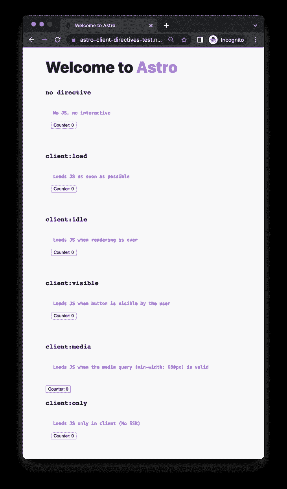

# 了解阿童木岛建筑

> 原文：<https://blog.logrocket.com/understanding-astro-islands-architecture/>

如今，我们都习惯于看到新的框架出现，并承诺彻底改变我们构建 web 的方式。然而，我们大多数时候仍然依赖于特定的 UI 库(React、Vue、Svelte 等)。)来定义我们的组件并为用户构建体验。

这一次，故事不同了！利用 [Vite.js](https://vite.js/) 的力量，我们得到了 Astro:一个不可知的框架，它可以作为 SSG(静态站点生成器)工作，并提供 SSR(服务器端渲染)。

使用 Astro 插件系统，我们可以按照我们想要的方式构建和增强我们的网站，甚至可以将不同的 UI 库合并到一个项目中。

在本帖中，我们将了解 Astro islands 以及它们是如何提供这一功能的。

*向前跳转:*

## Astro 101:简介

当你看他们[官网](https://astro.build/)上的定义，你会发现:

Astro 是一个一体化的 web 框架，用于构建快速、以内容为中心的网站。

最近，他们发布了[第一个稳定版本](https://astro.build/blog/astro-1/)，标志着该框架已经准备好投入生产，这是新兴框架的一个巨大里程碑。网络社区的反应非常积极，每天我们都看到越来越多的项目使用 Astro frontends。

Astro 有许多很酷的特性，让开发者和用户体验很棒。我建议查看另一篇 LogRocket 文章以获得关于 Astro 的更全面的概述。

在我个人看来，Astro 和其他框架的关键区别在于它的架构:孤岛架构。这个概念在 2019 年由[凯蒂·塞勒-米勒](https://twitter.com/ksylor)首次描述，随后由 Preact 的创作者[杰森·米勒](https://twitter.com/_developit)在[本帖](https://jasonformat.com/islands-architecture/)中进一步阐述。


## 什么是阿童木岛？

术语“Astro island”指的是 HTML 静态页面上的交互式 UI 组件。一个页面上可以存在多个岛，一个岛总是孤立地呈现，这意味着每个岛可以使用任何 UI 框架，甚至只是普通的 Astro 代码，与页面上的其他岛一起使用。

需要强调的是，Astro 在默认情况下生成的每个网站都没有客户端 JavaScript。每次我们在页面上渲染一个岛，Astro 都会提前自动渲染成 HTML，然后剥离掉所有的 JavaScript。这通过从页面中移除所有未使用的 JavaScript 来保持每个站点的速度。

我们以 React 中做的一个`Counter`组件的实现为例。第一次渲染时会显示一个按钮，文字为“`Counter: 0`”，用户每点击一次，计数器就会增加`1`。

```
// src/components/Counter.tsx
import { useState } from 'react';

const Counter = () => {
  const [count, setCounter] = useState(0);
  return (
    <button onClick={() => setCounter((number) => number + 1)}>
      Counter: {count}
    </button>
  );
};

export default Counter;

```

然后，让我们在 Astro 中渲染这个组件。

要在 Astro 项目中使用 React 组件，必须将`[@astrojs/react](https://docs.astro.build/en/guides/integrations-guide/react/)`集成添加到项目中。

```
// src/pages/index.astro
---
import Counter from '../components/Counter';
---

<Counter />

```

这段代码将呈现按钮，但是因为 JavaScript 在构建时被 Astro 删除了，所以用户不能增加计数器的值。当我们想让我们的应用程序具有交互性时，我们必须通过使用客户端指令来明确说明(我们将在后面讨论它们)。

这个过程被称为部分或选择性水合。本质上，这意味着发布支持组件的动态运行时需求所需的任何框架代码或运行时。像状态变化和交互性这样的事情就是最好的例子。

```
// src/pages/index.astro
---
import Counter from '../components/Counter.jsx';
--

<Counter client:load />

```

Astro islands 的一个好处是，除了专注于让你的应用程序尽可能轻之外，每个岛都是并行加载的。您甚至可以使用客户机指令为每个岛单独指定装载策略！这意味着我们可以完全控制如何以及何时为客户加载资产，并尽我们所能提供最佳体验。

## 阿斯特罗岛和其他地方相比怎么样？

正如我在这篇文章开头提到的，Astro 团队并没有创造岛屿建筑。相同的技术在许多框架中实现，并作为单独的库发布。

一个很好的例子是 [`is-land`](https://is-land.11ty.dev/) (来自 [`11ty`](https://www.11ty.dev/) 团队)，它在给组件补水时提供了附加条件(也称为客户端指令)，例如:

*   `on:interaction`
*   `on:save-data`

它还允许您在组件尚未水合时指定一个后备:

```
<is-land on:interaction>
  <form>
    <button type="button">Hydrate the island</button>
  </form>

  <p>This content is before hydration.</p>

  <template data-island="replace">
    <vanilla-web-component>My component content after hydration</vanilla-web-component>
  </template>
</is-land>

```

尽管框架之间在语法上有些差异，但主要思想是每个框架最终都实现了部分水合。Astro 编写 UI 的方式确保了用户需求总是定义水合策略，这在其他孤岛框架中是可选的，比如`is-land`。

如果你想了解更多关于岛屿建筑的知识，我发现 GitHub `[awesome-islands](https://github.com/lxsmnsyc/awesome-islands)`是一个很好的资源，它组织了很多与岛屿建筑相关的内容。

## 所有 Astro 客户指令

指令是一个组件属性，它告诉 Astro 你的组件应该如何渲染。在撰写本文时，Astro 总共支持[五种不同的客户端指令](https://docs.astro.build/en/reference/directives-reference/#client-directives)。随着框架增加新的特性，这个数字可能会改变。

假设我们想要呈现名为`MyComponent`的组件，根据我们使用的客户端指令，我们可以修改用户与之交互的方式:

*   `<MyComponent client:load/>`:在页面加载时立即合并组件 JavaScript
*   `<MyComponent client:idle/>`:当页面完成初始加载并且`[requestIdleCallback](https://developer.mozilla.org/en-US/docs/Web/API/Window/requestIdleCallback)`事件被触发时，合并组件 JavaScript
*   `<MyComponent client:visible/>`:一旦组件进入用户的视口，就合并组件 JavaScript。这在内部使用了一个`[IntersectionObserver](https://blog.logrocket.com/lazy-loading-using-the-intersection-observer-api/)`来跟踪可见性
*   `<MyComponent client:media={string}/>`:一旦满足某个 [CSS 媒体查询](https://blog.logrocket.com/choose-between-media-container-queries/)，就合并组件 JavaScript
*   `<MyComponent client:only={string}/>`:跳过 HTML 服务器渲染，只在客户端渲染。该组件将在构建时被跳过，这对于完全依赖于客户端 API 的组件非常有用

## 使用客户端指令

为了说明客户端指令的威力，我创建了一个小的 Astro 项目，在这个项目中，我使用不同的客户端指令来渲染上面显示的相同的`Counter`组件，以便任何人都可以在一个地方尝试它们。请随意[在 Netlify 上看一下现场应用](https://astro-client-directives-test.netlify.app/)。



下面是上面截图中页面的全部代码。页面的内容基本上是相同的`Counter` 组件，总共呈现了六次:第一次没有指定任何客户端指令(该组件根本不是交互式的)，然后其余的部分使用了我们上面提到的所有不同的客户端指令。

```
// src/pages/index.astro
---
import Layout from '../layouts/Layout.astro';
import Counter from '../components/Counter';
---

<Layout title="Welcome to Astro">
  <main>
    <h1>Welcome to <span class="text-gradient">Astro</span></h1>

    <h2><pre>no directive</pre></h2>
    <p class="instructions">
      <code>No JS, no interactive</code>
      <Counter />
    </p>

    <h2><pre>client:load</pre></h2>
    <p class="instructions">
      <code>Loads JS as soon as possible</code>
      <Counter client:load />
    </p>

    <h2><pre>client:idle</pre></h2>
    <p class="instructions">
      <code>Loads JS when rendering is over</code>
      <Counter client:idle />
    </p>

    <h2><pre>client:visible</pre></h2>
    <p class="instructions">
      <code>Loads JS when the button is visible to the user</code>
      <Counter client:visible />
    </p>

    <h2><pre>client:media</pre></h2>
    <p class="instructions">
      <code>Loads JS when the media query (min-width: 680px) is valid</code>
      <Counter client:media="(min-width: 680px)" />
    </p>

    <h2><pre>client:only</pre></h2>
    <p class="instructions">
      <code>Loads JS only in client (No SSR)</code>
      <Counter client:only="react" />
    </p>
  </main>
</Layout>

```

完整的源代码可以在[这个 GitHub 库](https://github.com/EmaSuriano/astro-client-directives-test)里找到。我强烈建议分叉项目并在本地运行项目，以充分理解客户端指令如何修改您的应用程序的行为。

## 临终遗言

我认为 Astro 是一个全新的框架，能够使用零 JavaScript 代码构建超轻网站。它让我们更加意识到，在这个庞大的生态系统中，什么时候我们确实需要 JavaScript，什么时候我们可以向客户交付更少的 KB。

Astro 的另一大优势是它是 UI 不可知的，这意味着你可以自带 UI 框架(BYOF)！React、Preact、Solid、Svelte、Vue 和 Lit 都是 Astro 官方支持的[。您甚至可以在同一个页面上混合搭配不同的框架，使未来的迁移更加容易，并防止项目局限于单一框架。](https://docs.astro.build/en/guides/integrations-guide/#official-integrations)

感谢您的阅读，让我们继续一起努力吧！👷‍♂️

## 您是否添加了新的 JS 库来提高性能或构建新特性？如果他们反其道而行之呢？

毫无疑问，前端变得越来越复杂。当您向应用程序添加新的 JavaScript 库和其他依赖项时，您将需要更多的可见性，以确保您的用户不会遇到未知的问题。

LogRocket 是一个前端应用程序监控解决方案，可以让您回放 JavaScript 错误，就像它们发生在您自己的浏览器中一样，这样您就可以更有效地对错误做出反应。

[](https://lp.logrocket.com/blg/javascript-signup)[https://logrocket.com/signup/](https://lp.logrocket.com/blg/javascript-signup)

[LogRocket](https://lp.logrocket.com/blg/javascript-signup) 可以与任何应用程序完美配合，不管是什么框架，并且有插件可以记录来自 Redux、Vuex 和@ngrx/store 的额外上下文。您可以汇总并报告问题发生时应用程序的状态，而不是猜测问题发生的原因。LogRocket 还可以监控应用的性能，报告客户端 CPU 负载、客户端内存使用等指标。

自信地构建— [开始免费监控](https://lp.logrocket.com/blg/javascript-signup)。

### 参考