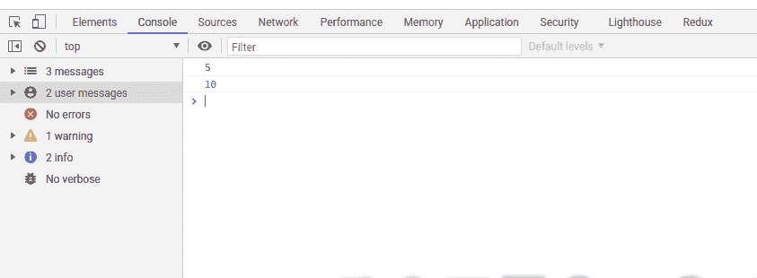
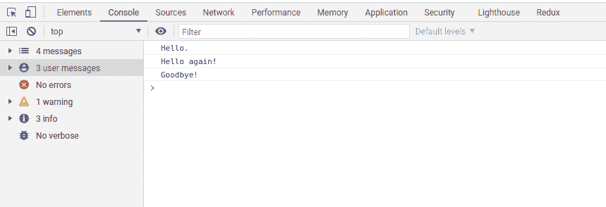
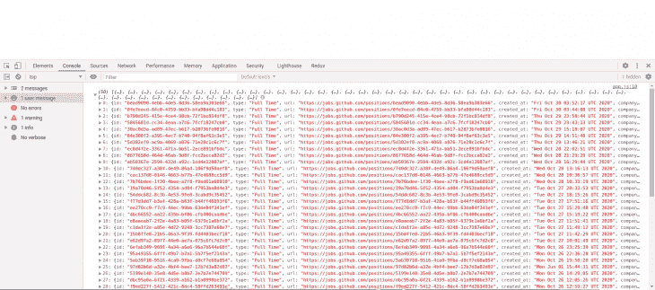

# 理解(并有效地使用)异步 JavaScript 

> 原文：<https://blog.logrocket.com/understanding-asynchronous-javascript/>

JavaScript 已经成为当今世界上最流行的语言之一。它是一种单线程语言，这意味着一次只能做一件事。在异步 JavaScript——使用 promises 和 async/await——被添加到 JavaScript 之前，这一直是一个限制。

在本文中，我们将学习如何更有效地使用异步 JavaScript。

## 介绍

JavaScript 是一种单线程语言，这意味着它一次只允许执行一个逻辑，因此你不能执行会阻塞 JavaScript 主线程的复杂的长函数。为了解决这个问题，回调——即作为参数传递给其他函数的[函数](https://www.javascripttutorial.net/javascript-function/)—被用来执行异步函数。使用异步 JavaScript，可以在不阻塞 JavaScript 主线程的情况下执行大型函数。

为了更好地理解这一点，让我们看看什么是同步和异步 JavaScript。

## 同步 JavaScript

顾名思义，同步 JavaScript 意味着按顺序或次序。在这里，每个函数或程序都是按顺序执行的，在执行下一个函数之前，每个函数或程序都要等待第一个函数执行，同步代码从上到下执行。

为了更好地理解同步 JavaScript，让我们看看下面的代码:

```
let a = 5;
let b = 10;
console.log(a);
console.log(b);
```

这是结果:



这里，JavaScript 引擎执行等式中的第一行，在本例中是 5，然后执行第二行代码，将 10 输出到控制台。如果我们添加任何其他代码行，JavaScript 引擎会根据我们添加它的位置来执行它，这就是同步 JavaScript 所需要的，一种执行代码的顺序方式。

## 异步 JavaScript

现在，我们对同步 JavaScript 的工作原理有了一个概念，让我们来谈谈异步 JavaScript。为了解释这一点，让我们看看下面的代码:

```
console.log("Hello.");
setTimeout(function() {
  console.log("Goodbye!");
}, 3000);
console.log("Hello again!");
```

与我们的另一个例子不同，JavaScript 引擎不会同步执行上面的代码。让我们看看下面的输出:



在代码中，我们将`Hello`记录到我们的控制台，接下来我们编写了一个函数，它将在三秒钟后将`Goodbye`记录到我们的控制台，代码的最后一部分将`Hello again`记录到我们的控制台。这里，JavaScript 引擎遍历第一个函数并执行它，将`Hello`打印到控制台，转到下一个函数，它看到`setTimeout`函数，而不是等待三秒来打印函数，而是转到最后一个函数并执行它，打印`Hello again`，等待三秒，然后执行第二个函数。

因此，对于异步 JavaScript，JavaScript 在执行函数时不会等待响应，而是继续执行其他函数。让我们看看异步 JavaScript 的执行方式。

## 编写异步 JavaScript 的方法

用 JavaScript 编写异步代码有两种方式，promises 和 async/await。

## 承诺

只有当某个标准为真时，承诺才会通过。有了 JavaScript 的承诺，我们可以推迟代码执行，直到异步请求完成，这样其他函数就可以继续运行，而不会阻塞线程。

Promises 是一种编写异步 JavaScript 的新方法，它通常是一个具有三种主要状态的对象，包括:

*   “待定”——承诺通过或失败之前的初始状态
*   决心——成功的承诺
*   拒绝——失败的承诺

为了更好地理解这一点，让我们在下面创建一个承诺:

```
const hungry = true;
const eat = new Promise(function(resolve, reject) {
  if (hungry) {
      const fastfood = {
        activity: 'Cook noodles',
        location: 'Market Square'
      };
  resolve(fastfood)
  } else {
    reject(new Error('Not hungry'))
    }
});
```

在上面的代码中，如果`hungry`为真，解析返回带有`fastfood`的数据的承诺，带有一个表示`Cook noodles`的活动，否则返回一个表示`Not hungry`的错误对象。

## 用承诺

让我们更进一步，使用上面初始化的承诺，我们可以将`.then()`和一个`.catch()`方法链接到下面的承诺:

```
const willEat = function() {
  eat
    .then(function(hungry) {
      console.log('Going to eat noodles!')
      console.log(hungry)
    })
    .catch(function(error) {
        console.log(error.message)
    })
}

willEat();
```

在上面的代码中，我们创建了一个名为`willEat()`的新函数，承诺为`eat`，接下来我们使用`.then()`来添加一个包含我们承诺的解析的函数。然后我们添加了一个`.catch()`方法来返回我们的承诺中的错误消息。

由于饥饿值为真，当我们调用我们的`willEat()`函数时，我们应该得到下面的结果:

```
Going to eat noodles!
{
  activity: 'Cook noodles',
  location: 'Market square'
}
```

如果我们将 hungry 的值更改为 false，我们的承诺将显示一个失败承诺的状态，在我们的例子中是`not hungry`。我们可以通过创建一个新的承诺来进一步推进我们的承诺，这个新的承诺将从我们之前的示例中获取参数:

```
const foodTour = function(fastfood) {
  return new Promise(function(resolve, reject) {
    const response = `I'm going on a food tour at
        ${fastfood.location`;

    resolve(response)
  });
}
```

在上面的代码中，我们创建了一个名为`foodTour`的新承诺，它从前面的示例中获取`fastfood`值，并在前面的示例中使用位于`fastfood`位置的模板字符串来解析响应。

## 异步/等待

Async/await 是在(ES2017+)版本中添加的，是*语法糖*使得用 JavaScript 写承诺更容易。Async/await 帮助您编写异步工作的看起来同步的 JavaScript 代码。

一个异步函数返回一个承诺，如果函数返回一个值，这个承诺就用这个值来解析，但是如果异步函数抛出一个错误，这个承诺就用这个值来拒绝。下面让我们创建一个简单的异步函数:

```
async function favoriteDrink() {
    return 'Monster energy drink'
}
```

这里，我们声明了一个名为`favoriteDrink()`的函数，它返回`Monster energy drink`。如果一个承诺在一个异步函数中被拒绝，它会显示一个拒绝的方法，如下所示:

```
async function() {
  throw 3;
}
```

Await 位于异步函数中，以确保函数中返回的所有承诺都是同步的。对于 async/await，不使用回调。`try`和`catch`方法也用于获得异步函数的拒绝值。让我们使用前面的例子创建一个包装在`try…catch`方法中的异步/等待函数:

```
async function willEat() {
  try {
    let fastfood = await eat;
    let response = await foodTour(fastfood);
  console.log(response);
  } catch(error) {
      console.log(error.message);
    }
}

willEat();
```

在这里，我们将之前的示例转换为使用封装在`try…catch`方法中的 async/await，我们将响应记录为之前的示例，它返回字符串`I'm going on a food tour at Market Square`。

## 用 JavaScript 发出异步请求

最近在 JavaScript 中，`fetch()` API 已经被用于 URL 的 API 请求。在此之前，使用 XMLHttpRequest 发出请求。有了`ES2017+`，使用 fetch API 和 async/await，您可以向 URL 端点发出异步请求，首先您需要将函数定义为异步函数，并在`json`中等待响应，然后返回您的数据。为了更好地解释这一点，让我们看看下面的代码:

```
async function getJobAsync()
{
  let response = await fetch(`https://cors-anywhere.herokuapp.com/https://jobs.github.com/positions.json`);
  let data = await response.json()
  return data;
}
getJobAsync('jobPositionHere')
  .then(data => console.log(data));
```

在上面的代码中，我们编写了一个异步函数`getJobAsync()`,它向一个外部 URL 发出一个获取请求，接下来我们等待一个`json`格式的`response`,然后一旦请求得到解决就返回数据。这就是如何使用异步 JavaScript 发出异步请求。让我们看看下图中函数的结果。



接下来，我们将看看如何从异步 API 调用返回响应。

## 从异步调用返回响应

在 JavaScript、回调和承诺中，有许多方法可以从异步调用返回响应。假设您正在进行一个异步调用，并且您希望调用的结果来自函数，这可以使用 async/await 来完成，让我们在下面的代码中进一步解释这一点:

```
const getResult = async (request) => {
        let response = await new Promise((resolve, reject) => {
                request((err, res, body) => {
                        if (err) return reject(err);
                        try{
                                resolve(JSON.parse(body));
                        } catch(error) {
                                reject(error);
                        }
                });
        });

        try{
                console.log(response);
        }
        catch(err){
                console.error(err);
        }
}

getResult();
console.log('This is how to return async JavaScript');
```

在上面的代码块中，我们将来自请求的响应包装在一个承诺中，然后等待它被解决或拒绝，同时也等待承诺返回一个响应。在 JavaScript 操作中，建议将代码包装在一个`try…catch`方法中，以便处理函数中可能出现的错误。最后，我们在程序结束时调用函数，并在控制台中记录消息`This is how to return async JavaScript`，这是我们在 JavaScript、回调或 async/await 中响应异步调用的方式。

## 结论

在本文中，我们学习了什么是异步 JavaScript，以及如何使用 promises 和 async/await 编写异步 JavaScript。我们还看到了如何使用 fetch API 和 async/await 发送请求，以及如何返回对异步调用的响应。你可以在这里阅读更多关于异步 JavaScript 的内容。

## 通过理解上下文，更容易地调试 JavaScript 错误

调试代码总是一项单调乏味的任务。但是你越了解自己的错误，就越容易改正。

LogRocket 让你以新的独特的方式理解这些错误。我们的前端监控解决方案跟踪用户与您的 JavaScript 前端的互动，让您能够准确找出导致错误的用户行为。

[](https://lp.logrocket.com/blg/javascript-signup)

LogRocket 记录控制台日志、页面加载时间、堆栈跟踪、慢速网络请求/响应(带有标题+正文)、浏览器元数据和自定义日志。理解您的 JavaScript 代码的影响从来没有这么简单过！

[Try it for free](https://lp.logrocket.com/blg/javascript-signup)

.