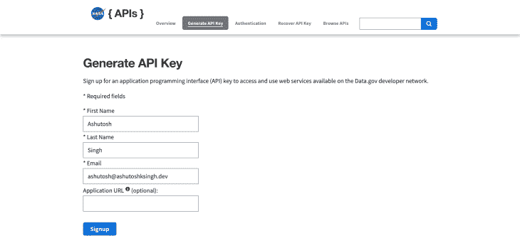
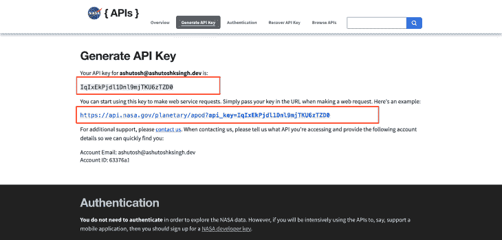

# 了解 Axios GET 请求

> 原文：<https://blog.logrocket.com/understanding-axios-get-requests/>

## 介绍

作为一名开发人员，你需要使用 API，无论是内部的还是第三方的。他们需要将不同的应用程序和服务结合在一起，以构建一个定义良好的应用程序。

有效地与 API 通信是应用程序的性能、可伸缩性和可靠性的重要因素。多年来， [Axios](https://blog.logrocket.com/how-to-make-http-requests-like-a-pro-with-axios/) 已经成为最常见和最受欢迎的 HTTP 客户端，GitHub 上有超过 90k 颗星，它背后有一个最大的开发人员社区。

在本文中，我们将学习如何在 Axios 中发出 GET 请求。我将演示如何使用 Axios GET 向公共 API 发出请求，比如瑞克和莫蒂 API 和 T2 最终空间 API ，以及如何发出并发 GET 请求和处理错误。

如果你想直接进入代码，请点击这里查看 GitHub repo。

## 先决条件

*   HTML、CSS 和 JavaScript 的工作知识
*   Node.js 和 npm 安装在您的本地开发机器上
*   您选择的任何代码编辑器

## Axios 是什么？

Axios 是一个基于 Promise 的 HTTP 客户端，用于浏览器和节点。让我们分解这个定义来理解 Axios 是做什么的。

首先，HTTP 代表超文本传输协议。它是一种客户端-服务器协议，用于获取 HTML 文档等资源。

“客户端”是代表用户的用户代理，并且发起对资源的请求。诸如 Google Chrome 这样的网络浏览器是一个流行的客户端例子。基于承诺的客户端返回[承诺](https://developer.mozilla.org/en-US/docs/Web/JavaScript/Reference/Global_Objects/Promise)。

Axios 是同构的，这意味着它可以用相同的代码在浏览器和 Node.js 中运行。当在服务器端使用时，它使用节点的本机`http`模块，而在客户端，它使用 XMLHttpRequests。在客户端，Axios 还支持针对 [XSRF](https://en.wikipedia.org/wiki/Cross-site_request_forgery) 的保护。

## Axios GET 方法是什么？

HTTP GET 请求用于向服务器请求指定的资源。这些请求不包含任何有效负载，也就是说，请求没有任何内容。Axios GET 是使用 Axios 库发出 HTTP GET 请求的方法。

## 如何在 Node.js 项目中安装 Axios

在本节中，我们将创建一个示例应用程序，它使用 Axios 通过 GET 请求获取数据。

首先，在终端中运行以下命令:

```
mkdir axios-get-examples
cd axios-get-examples
npm init -y
npm install axios

```

命令`npm init -y`在您的项目文件夹中创建一个类似于下图的`package.json`:

```
{
  "name": "axios-get-examples",
  "version": "1.0.0",
  "description": "",
  "main": "index.js",
  "scripts": {
    "test": "echo \"Error: no test specified\" && exit 1"
  },
  "keywords": [],
  "author": "",
  "license": "ISC"
}

```

最后一个命令`npm install axios`，将`axios`包作为一个依赖项安装到您的项目中。项目文件夹中会有一个新的`package-lock.json`文件和一个`node_modules`文件夹。

`package.json`文件也将更新，看起来如下所示:

```
{
  "name": "axios-get-examples",
  "version": "1.0.0",
  "description": "",
  "main": "index.js",
  "scripts": {
    "test": "echo \"Error: no test specified\" && exit 1"
  },
  "keywords": [],
  "author": "",
  "license": "ISC",
  "dependencies": {
    "axios": "^0.25.0"
  }
}

```

你也可以使用`yarn`或`bower`来安装`axios`，就像这样:

```
// Yarn 
yarn add axios
// Bower
bower install axios

```

接下来，创建一个名为`index.js`的文件，您将在其中编写使用`GET`请求获取资源的代码。在项目的根目录下运行以下命令来创建`index.js`文件:

```
touch index.js

```

### 安装 Nodemon

在项目的根目录下运行以下命令，将`nodemon`安装为一个开发依赖项。 [Nodemon](https://blog.logrocket.com/nodemon-tutorial-automatically-restart-node-js-apps-with-nodemon/) 是一款优秀的本地开发工具，每当它检测到目录中的文件发生变化时，就会自动重启节点应用程序:

```
npm install -D nodemon

```

在你的`package.json`里修改`"scripts"`，像这样:

```
"scripts": {
    "start": "node index.js",
    "dev": "nodemon index.js"
  },

```

您的`package.json`应该是这样的:

```
{
  "name": "axios-get-examples",
  "version": "1.0.0",
  "description": "",
  "main": "index.js",
  "scripts": {
    "start": "node index.js",
    "dev": "nodemon index.js"
  },
  "keywords": [],
  "author": "",
  "license": "ISC",
  "dependencies": {
    "axios": "^0.25.0"
  },
  "devDependencies": {
    "nodemon": "^2.0.15"
  }
}

```

运行以下命令启动节点应用程序:

```
npm run dev

```

启动后，您将在终端中看到以下消息:

```
> [email protected] dev
> nodemon index.js

[nodemon] 2.0.15
[nodemon] to restart at any time, enter `rs`
[nodemon] watching path(s): *.*
[nodemon] watching extensions: js,mjs,json
[nodemon] starting `node index.js`
[nodemon] clean exit - waiting for changes before restart

```

更新`index.js`文件以包含以下代码:

```
// index.js
console.log('Hello World!');

```

您会注意到`nodemon`检测到文件更改，重新启动应用程序，并在终端中显示以下消息:

```
Hello World!
[nodemon] clean exit - waiting for changes before restart

```

最后，您可以从`index.js`文件中删除`console.log()`代码。

## 如何使用 Axios 发出 GET 请求

在这一节中，我们将看到如何导入和使用 Axios 向最终的空间 API 发出 GET 请求，以便获取数据。

更新`index.js`文件，使用`require`函数导入`axios`包。Node 遵循 [CommonJS](https://blog.logrocket.com/commonjs-vs-es-modules-node-js/) 模块系统，您可以通过内置的`require`函数使用单独文件中的模块:

```
const axios = require('axios');

```

现在，您可以使用`axios.<method>`来发起任何请求，比如一个`GET`请求。

将下面的代码添加到`index.file`中。以下代码从最终的空间 API 字符端点获取了两个字符:

```
// Axios GET Default
axios
  .get("https://finalspaceapi.com/api/v0/character/?limit=2")
  .then(function (response) {
    console.log(response);
  });

```

您将在终端中看到类似如下的冗长响应(以下响应被截断):

```
 {
  "status": 200,
  "statusText": "OK",
  "headers": {
    "server": "nginx/1.18.0 (Ubuntu)",
    "date": "Sat, 22 Jan 2022 09:38:29 GMT",
    "content-type": "application/json; charset=utf-8",
    "content-length": "2754"
  },
  "config": {
    "transitional": {
      "silentJSONParsing": true,
      "forcedJSONParsing": true,
      "clarifyTimeoutError": false
    },
    "headers": {
      "Accept": "application/json, text/plain, */*",
      "User-Agent": "axios/0.25.0"
    },
    "method": "get",
    "url": "https://finalspaceapi.com/api/v0/character/?limit=2",
    "data": undefined
  },
  "data": [
    {
      "id": 1,
      "name": "Gary Goodspeed",
      "status": "Alive",
      "species": "Human",
      "gender": "Male",
      "hair": "Blonde",
      "alias": [
        "The Gary (by Lord Commander and Invictus)",
        "Thunder Bandit(code name)"
      ],
      "origin": "Earth",
      "abilities": [
        "Piloting",
        "Marksmanship",
        "Hand-to-hand combat",
        "Weapons: Blasters"
      ],
      "img_url": "https://finalspaceapi.com/api/character/avatar/gary_goodspeed.png"
    },
    {
      "id": 2,
      "name": "Mooncake",
      "status": "Unknown",
      "species": "Mooncake's Species",
      "gender": "None (referred to as male)",
      "hair": "None",
      "alias": ["Specimen E - 351", "Little Buddy"],
      "origin": "Outer space",
      "abilities": ["Hovering", "Firing Laser Beams", "Planetary Destruction"],
      "img_url": "https://finalspaceapi.com/api/character/avatar/mooncake.jpg"
    }
  ]
}

```

上面的`axios.get()`实现是在代码库中发出`GET`请求的默认和最流行的方式。

Axios 还提供了执行不同请求的简化方法，比如:

```
axios.request(config)
axios.get(url[, config]) 

```

这里，您将一个带有请求的必要配置的`request`对象作为参数传递给`axios.get()`方法。虽然有几个选项可以传递给这个请求对象，但以下是最常见和最流行的选项:

*   `baseUrl`–当指定时，除非`url`是绝对的，否则该`baseUrl`被加到`url`的前面
*   `headers`–带有自定义标题的对象，与请求者一起发送，如`headers: {'X-Requested-With': 'XMLHttpRequest'},`
*   `params`–其键/值对作为查询字符串附加到`url`的对象
*   `auth`–带有`username`和`password`的对象，用于验证 HTTP 基本验证请求

上述 Axios 请求可以改写如下:

```
// Using the Request Config
axios({
  method: "get",
  url: "https://finalspaceapi.com/api/v0/character/?limit=2",
}).then(function (response) {
  console.log(response.data);
});

```

这个对象必须包含`url`属性来获取数据。当没有指定`method`属性时，请求默认为`GET`请求。

您还可以传递一个`responseType`选项，它指示服务器将返回给请求配置对象的数据类型(默认设置为`json`)。

例如，您可以像这样重写上面的代码:

```
// Using the Request Config
axios
  .get("https://finalspaceapi.com/api/v0/character/?limit=2", {
    responseType: "json",
  })
  .then(function (response) {
    console.log(response.data);
  });

```

`responseType`选项可以设置为`arraybuffer`、`document`、`blob`、`text`或`stream`。当返回的响应或数据不是 JSON 格式时，必须设置`responseType`选项。

例如，下面的代码从 Unsplash 获取一个[自然图像](https://unsplash.com/photos/XxAriUoOOYA)作为节点流。然后，您可以使用内置的`fs`模块的`createWriteStream()`并将获取的流写入一个文件。

以下代码在项目文件夹中创建一个名为`nature.jpg`的文件:

```
// Axios with responseType - stream
// GET request for remote image in node.js
const fs = require('fs');
axios({
    method: 'get',
    url: 'https://images.unsplash.com/photo-1642291555390-6a149527b1fa',
    responseType: 'stream'
  })
    .then(function (response) {
        // console.log(response.data.pipe);
      response.data.pipe(fs.createWriteStream('nature.jpg'))
    });

```

也可以用流行的`async/await`来代替承诺。例如，您可以通过将上面的代码放在异步函数中来重写它:

```
// Using Asyc/Await
async function getCharacters() {
  const response = await axios.get(
    "https://finalspaceapi.com/api/v0/character/?limit=2"
  );
  console.log(response.data);
}
getCharacters();

```

最后，您可以使用[析构赋值](https://developer.mozilla.org/en-US/docs/Web/JavaScript/Reference/Operators/Destructuring_assignment)从响应体获取数据:

```
async function getCharacters() {
  const { data } = await axios.get(
    "https://finalspaceapi.com/api/v0/character/?limit=2"
  );
  console.log(data);
}
getCharacters();

```

## 如何让 Axios 获得带有查询参数的请求

在这一节中，我们将学习如何让 Axios 获得带有查询参数的请求。

首先，将以下代码添加到`index.js`文件中:

```
// Axios GET Query Parameters
const url = require("url");
const queryParams = {
  limit: 1,
  sort: "desc",
};
const params = new url.URLSearchParams(queryParams);
console.log(params);
axios
  .get(`https://finalspaceapi.com/api/v0/character/?${params}`)
  .then(function (response) {
    console.log(response.data);
  });

```

在上面的代码中，我们使用来自`url`模块的`URLSearchParams`方法来转换一个带有查询参数的对象，作为所需 URL 查询格式的键/值对。

下面是`params`的样子:

```
URLSearchParams { 'limit' => '1', 'sort' => 'desc' }

```

下面是返回数据的样子:

```
[
  {
    id: 47,
    name: 'Zargon Tukalishi',
    status: 'Deceased',
    species: 'Unknown',
    gender: 'Male',
    hair: 'None',
    alias: [],
    origin: 'Yarno',
    abilities: [],
    img_url: 'https://finalspaceapi.com/api/character/avatar/zargon_tukalishi.jpg'
  }
]

```

## 如何用 API 键让 Axios 获得请求

人们通常需要通过将 API 密钥与请求一起传递来验证请求。在本节中，我们将学习如何在 Axios 中使用 API 键来发出请求。我们将以 [NASA API](https://api.nasa.gov/) 为例。

首先，在浏览器中导航到[https://api.nasa.gov/](https://api.nasa.gov/)，并填写必填字段以生成 API 密钥。



点击**注册**按钮。在下一页，您的 API 密钥将会显示给您。



API 密钥应该对公众隐藏，并作为环境变量存储在一个`.env`文件中。 [dotenv](https://www.npmjs.com/package/dotenv) 是一个流行的 npm 库，用于从`.env`文件加载环境变量。

运行以下命令安装 dotenv 软件包:

```
npm install dotenv

```

接下来，通过运行以下命令创建一个名为`.env`的新文件:

```
touch .env

```

将 NASA API 密钥粘贴到`.env`文件中，如下所示:

```
NASA_API_KEY = IqIxEkPjdl1Dnl9mjTKU6zTZD0

```

现在，将以下代码添加到`index.js`文件中，以从 NASA API 获取数据:

```
// Using with API Key
require("dotenv").config();
axios
  .get(
    `https://api.nasa.gov/planetary/apod?api_key=${process.env.NASA_API_KEY}`
  )
  .then((response) => {
    console.log(response.data);
  });

```

在上面的代码中，我们导入了`dotenv`包，并使用 URL 中的 API 键作为查询参数。

您将需要重新启动您的应用程序，所以在终端中点击 **CTRL+C** 并运行命令`npm run dev`来启动节点应用程序。

您将从 NASA API 中看到与此类似的响应:

```
{
  copyright: 'Elena Pinna',
  date: '2022-01-22',
  explanation: "On Monday, January's Full Moon rose as the Sun set. Spotted near the eastern horizon, its warm hues are seen in this photo taken near Cagliari, capital city of the Italian island of Sardinia. Of course the familiar patterns of light and dark across the Moon's nearside are created by bright rugged highlands and dark smooth lunar maria. Traditionally the patterns are seen as pareidolia, giving the visual illusion of a human face like the Man in the Moon, or familiar animal like the Moon rabbit. But for a moment the swarming murmuration, also known as a flock of starlings, frozen in the snapshot's field of view lends another pareidolic element to the scene. Some see the graceful figure of a dancer enchanted by moonlight.",
  hdurl: 'https://apod.nasa.gov/apod/image/2201/IMG_4039copia2_2048.jpg',
  media_type: 'image',
  service_version: 'v1',
  title: 'The Full Moon and the Dancer',
  url: 'https://apod.nasa.gov/apod/image/2201/IMG_4039copia2_1024.jpg'
}

```

您还可以使用请求配置的`params`选项来发出相同的请求:

```
// With API Key and params option
require("dotenv").config();
axios({
  method: "get",
  url: `https://api.nasa.gov/planetary/apod`,
  params: {
    api_key: process.env.NASA_API_KEY,
  },
}).then((response) => {
  console.log(response.data);
});

```

您还可以使用其他 HTTP 身份验证方法来验证请求，比如通过在`Authorization`头中传递承载令牌来进行承载身份验证。例如:

```
// Using Authorization Header
axios({
  method: "get",
  url: "<ENDPOINT>",
  headers: {
    Authorization: `Bearer ${process.env.TOKEN}`,
  },
}).then((response) => {
  console.log(response.data);
});

```

## 如何用 Axios 发出并发请求

您可能需要向多个端点发出并发请求。在这一节中，我们将学习如何使用`axios.all()`方法发出多个请求

首先，将以下代码添加到`index.js`文件中:

```
// Axios.all()
const endpoints = [
  "https://rickandmortyapi.com/api/character",
  "https://www.breakingbadapi.com/api/characters",
  "https://www.breakingbadapi.com/api/episodes",
  "https://www.breakingbadapi.com/api/quotes",
];
axios.all(endpoints.map((endpoint) => axios.get(endpoint))).then((allResponses) => {
    allResponses.forEach((response) => {
    console.log(response.data);
  });
});

```

这里，我们在`axios.all()`方法中传递一个`axios.get()`请求数组，然后映射到`endpoints`数组来创建一个`axios.get()`请求数组，然后由`axios.all()`方法进行解析。

响应顺序与`axios.all()`方法中的请求顺序相同:

```
{info: Object, results: Array(20)}
(62) [Object, Object, Object, Object, Object, Object, Object, Object, Object, Object, …]
 (102) [Object, Object, Object, Object, Object, Object, Object, Object, Object, Object, …]
[Object, Object, Object, Object, Object, Object, Object, Object, Object, Object, …]

```

## Axios 中的错误处理

在本节中，我们将讨论如何处理 Axios 的错误。最常见的方法是用`axios.get()`链接一个`.catch()`方法来捕捉任何可能发生的错误。

将以下代码添加到`index.js`文件中:

```
axios
  .get("https://rickandmortyapi.com/api/character/-1")
  .then((response) => {
    console.log(response.data);
  })
  .catch((error) => {
    console.error(error);
  });

```

在上面的代码中，我们试图从 Rick and Morty API 中获取一个字符，它的`id`是`-1`，因为没有这样一个带有负`id`的字符，这个请求将导致一个错误。

上述 catch 块控制可能发生的任何错误。这个错误对象非常大，您可能不会总是显示所有的内容，所以您可以有选择地记录错误消息。

您还可以根据错误的类型来处理错误。将以下代码添加到`index.js`文件中:

```
// Error Handling - Error Specific
axios
  .get("https://rickandmortyapi.com/api/character/-1")
  .then((response) => {
    console.log(response.data);
  })
  .catch((error) => {
    if (error.response) {
      console.error(error.response.data);
      console.error(error.response.status);
      console.error(error.response.headers);
    } else if (error.request) {
      console.error(error.request);
    } else {
      console.error("Error", error.message);
    }
  });

```

如果错误发生在服务器端，那么`error`对象将包含一个`response`属性，该属性可用于访问错误的`status`、`headers`和其他详细信息。

如果发出了请求，但没有收到响应，那么浏览器中的`error`对象将包含`request`属性`XMLHttpRequest`，节点中包含`http.ClientRequest`的一个实例。

如果在发出请求时出现错误，那么`error.message`将会指出此类错误。

因为上面代码中的错误发生在服务器端，`error`对象将有一个`response`属性，在终端上会看到如下消息:

```
{ error: 'Character not found' }
404
{
  'access-control-allow-origin': '*',
  'content-length': '31',
  'content-type': 'application/json; charset=utf-8',
  date: 'Sat, 22 Jan 2022 11:27:05 GMT',
  etag: 'W/"1f-t9l5xVmJZaPHJIukjZQ7Mw4gpG8"',
  server: 'Netlify',
  age: '0',
  'x-nf-request-id': '01FT0RMCAKMA5BWJ8SMHAJ3RVC',
  'x-powered-by': 'Express'
}

```

您也可以通过使用`validateStatus`请求配置选项来抛出一个错误。例如:

```
// Error Handling with validateStatus option
axios
  .get("https://rickandmortyapi.com/api/character/-1", {
    validateStatus: function (status) {
      return status < 500; // Reject only if the status code is less than 500
    },
  })
  .then((response) => {
    console.log(response.data);
  });

```

当响应的`status`满足其中的条件时，该选项将抛出一个错误。您将在终端中看到类似以下内容的消息:

```
{ error: 'Character not found' }

```

## 如何使用 Axios 进行头部请求

头请求是没有消息体的 GET 请求。您可以用`axios.head`方法创建一个 HEAD 请求。对于这样的请求，`response`对象中的`data`属性将为空。

例如:

```
// Axios Head Request
axios.head("https://rickandmortyapi.com/api/character/1").then((response) => {
  console.log(
    `Status: ${response.status} - Server: ${response.headers.server} - Data: ${response.data}`
  );
});

```

以下是您将在终端中看到的消息:

```
Status: 200 - Server: Netlify - Data: 

```

## 结论

在本文中，我们讨论了什么是 Axios，以及如何使用它来发出 GET 请求。我们还学习了如何发出并发请求、处理错误和发出 HEAD 请求。

## 使用 [LogRocket](https://lp.logrocket.com/blg/signup) 消除传统错误报告的干扰

[](https://lp.logrocket.com/blg/signup)

[LogRocket](https://lp.logrocket.com/blg/signup) 是一个数字体验分析解决方案，它可以保护您免受数百个假阳性错误警报的影响，只针对几个真正重要的项目。LogRocket 会告诉您应用程序中实际影响用户的最具影响力的 bug 和 UX 问题。

然后，使用具有深层技术遥测的会话重放来确切地查看用户看到了什么以及是什么导致了问题，就像你在他们身后看一样。

LogRocket 自动聚合客户端错误、JS 异常、前端性能指标和用户交互。然后 LogRocket 使用机器学习来告诉你哪些问题正在影响大多数用户，并提供你需要修复它的上下文。

关注重要的 bug—[今天就试试 LogRocket】。](https://lp.logrocket.com/blg/signup-issue-free)