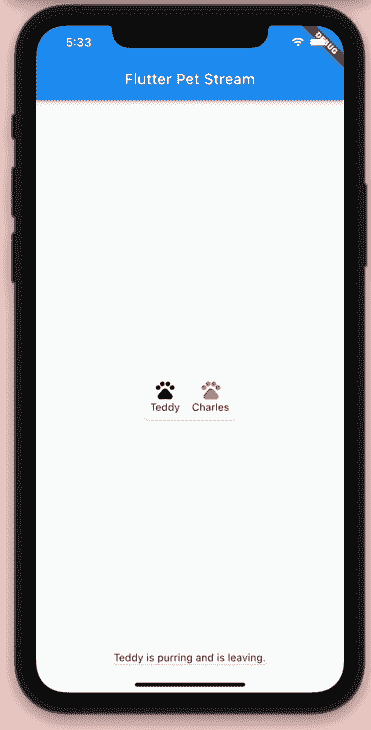
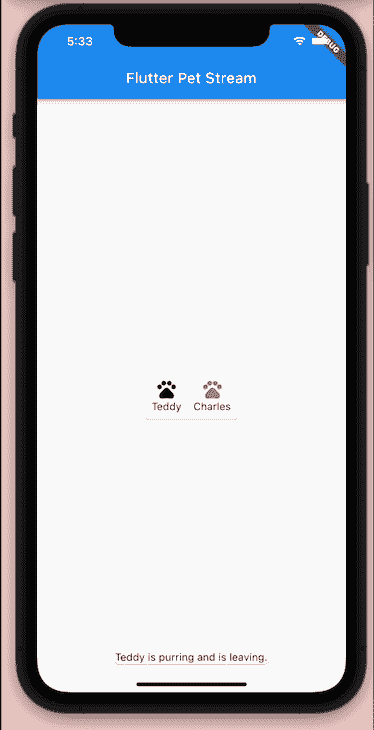

# 了解颤振流-日志火箭博客

> 原文：<https://blog.logrocket.com/understanding-flutter-streams/>

二十年前开发应用程序并在没有后端的计算机上运行时，程序执行的大多数操作是同步的，导致应用程序的其余部分在某些命令或功能完成时等待。

随着时间的推移，应用程序越来越依赖于通过 API 或设备本身无法提供的其他来源访问数据，以同步方式处理数据变得没有吸引力，这是理所当然的。

当用户从 API 请求数据时，我们不能一次锁定 UI 几秒钟。

出于这个和其他许多原因，现代编程语言和框架(如 Dart 和 Flutter)包含了帮助我们处理流的结构。

在本帖中，我们将了解以下概念:

*   什么是溪流
*   我们如何使用一个`StreamController`以及如何向它发出事件
*   我们如何在 Flutter 中使用`StreamBuilder`来更新我们的 UI

在谈论流的时候，有一点几乎应该立刻说出来，那就是当我刚开始了解它们的时候，它们让我眼花缭乱，感到困惑。有可能我只是一个普通的开发者，但是网上有无数关于人的文章，并不是真正理解流。

虽然它们实际上非常简单，但是它们非常强大，随着能力的增强，您可能会不正确地实现它们并导致问题。那么，我们先来说说什么是流。

## 什么是流？

为了理解什么是流，让我们首先从我们理解的东西开始，它们是普通的同步方法。这些一点也不花哨，事实上，这里有一个例子:

```
final time = DateTime.now();
```

在这个例子中，我们从一个同步的方法中检索日期和时间。我们不需要等待它的输出，因为它在不到一毫秒的时间内就完成了这个功能。在这种情况下，我们的程序可以等待输出，因为等待时间非常短。

现在，让我们通过使用关键字`async`和`await`来看一个异步方法。我们将通过获取当前时间，然后使用`Future.delayed`，获取未来 2 秒的时间，如下所示:

```
void main() async {
  print('Started at ${DateTime.now()}');
  final time = await Future.delayed(Duration(seconds: 2)).then((value) => DateTime.now());
  print('Awaited time was at $time');
}

```

运行它的结果如下:

```
Started at 2021-10-28 17:24:28.005
Awaited time was at 2021-10-28 17:24:30.018

```

因此，我们可以看到，在我们的应用程序中，我们收到了我们的初始时间和一个未来 2 秒的时间。事实上，我们可以`await`未来返回的各种数据源，如 API 或文件下载。

通过使用`async` / `await`模式，我们可以检索这些数据，并在数据完成时对其进行操作。

但是，如果我们想每两秒钟检索一次时间，我们该怎么办呢？的确，我们可以将它包装在一个`for`循环中，对于我们的小例子来说，这是可以的。

然而，这本质上与轮询更新是一样的，我们每 2 秒钟就发出一次请求，看看是否有什么变化。轮询对电池寿命或用户体验没有好处，因为它让客户端设备或应用程序承担检查是否有变化的责任。

相反，更好的办法是把这个责任交给服务器，让服务器告诉我们什么时候发生了变化，应用程序订阅这些更新。

这就是溪流的来源。我们可以很容易地订阅一个`stream`，当它产生一个新的结果时，我们可以根据自己的选择处理该数据。

在下面的例子中，我们设置了一个`StreamController`和[，使用](https://blog.logrocket.com/understanding-flutter-timer-class-timer-periodic/) `[Timer.periodic](https://blog.logrocket.com/understanding-flutter-timer-class-timer-periodic/)` [每隔 2 秒](https://blog.logrocket.com/understanding-flutter-timer-class-timer-periodic/)向流中发送一个事件。紧接着，我们订阅流控制器中的`stream`,并在它更新时打印:

```
import 'dart:async';

void main() async {
    final streamController = StreamController<DateTime>();
    Timer.periodic(Duration(seconds: 2), (timer) {
      streamController.add(DateTime.now());
    });

    streamController.stream.listen((event) {
      print(event);
    });
}

```

其输出如下所示:

```
2021-10-28 17:56:00.966
2021-10-28 17:56:02.965
2021-10-28 17:56:04.968
2021-10-28 17:56:06.965
2021-10-28 17:56:08.977
2021-10-28 17:56:10.965

```

### 清理流订阅

因此，现在我们订阅了该流，它会随着时间的推移而发出。太好了。但是我们在这个实现上有一个小错误:我们从来没有处理或清理我们对流的订阅。

这意味着，即使用户转到我们应用程序的另一部分或做其他事情，我们的应用程序仍然会监听这个流并处理结果。

我们花费资源运行与用户相关的进程是没问题的，但是一旦用户离开或使用我们应用程序的不同部分，我们应该取消订阅并清理我们一直使用的组件。

幸运的是，我们可以保留对我们的订阅的引用，并在我们不再使用它时取消它。在这种情况下，我们将在一段时间后取消订阅:

```
import 'dart:async';

void main() async {
   final streamController = StreamController<DateTime>();
    final unsubscribeAt = DateTime.now().add(Duration(seconds: 10));
    StreamSubscription<DateTime>? subscription;

    Timer.periodic(Duration(seconds: 2), (timer) {
      streamController.add(DateTime.now());
    });

    subscription = streamController.stream.listen((event) async {
      print(event);
      if (event.isAfter(unsubscribeAt)) {
        print("It's after ${unsubscribeAt}, cleaning up the stream");
        await subscription?.cancel();
      }
    });
}

```

同样，我们有我们的订阅，但现在我们要取消它。当我们取消它时，应用程序可以释放订阅所涉及的资源，从而防止我们的应用程序内存泄漏。

清理订阅对于在 Flutter 和 Dart 中使用流[是不可或缺的，如果我们想要使用它们，我们必须负责任地使用它们。](https://blog.logrocket.com/introduction-to-using-dart-in-flutter/)

### 处理流错误

我们必须考虑的最后一件事是我们如何处理错误，因为有时我们的流会产生一个错误。

出现这种情况的原因可能很多，但如果您的流连接到服务器进行实时更新，而移动设备与互联网断开连接，那么流也会断开连接并产生错误。

当这种情况发生时，我们没有处理错误，Flutter 将抛出一个异常，应用程序可能会处于不可用的状态。

幸运的是，处理错误相当容易。如果我们的秒可以被 3 整除，让我们的流产生一个错误，为了完整起见，让我们也在流完成时处理该事件:

```
import 'dart:async';

void main() async {
   final streamController = StreamController<DateTime>();
    final unsubscribeAt = DateTime.now().add(Duration(seconds: 10));
    late StreamSubscription<DateTime> subscription;

    final timer = Timer.periodic(Duration(seconds: 2), (timer) {
      streamController.add(DateTime.now());
      if (DateTime.now().second % 3 == 0) {
        streamController.addError(() => Exception('Seconds are divisible by three.'));
      }
    });

    subscription = streamController.stream.listen((event) async {
      print(event);
      if (event.isAfter(unsubscribeAt)) {
        print("It's after ${unsubscribeAt}, cleaning up the stream");
        timer.cancel();
        await streamController.close();
        await subscription.cancel();
      }
    }, onError: (err, stack) {
      print('the stream had an error :(');
    }, onDone: () {
      print('the stream is done :)');
    });
}

```

其输出如下所示:

```
2021-10-28 17:58:08.531
2021-10-28 17:58:10.528
2021-10-28 17:58:12.527
the stream had an error :(
2021-10-28 17:58:14.526
2021-10-28 17:58:16.522
It's after 2021-10-28 17:58:16.518, cleaning up the stream
the stream is done :)

```

我们可以看到，我们正在内部处理错误(在这种情况下，通过打印一条消息，但这里我们将使用一个日志框架来捕获出错的地方)。

让我们回顾一下。我们了解到:

1.  基本流是如何工作的以及它们的用途是什么
2.  如何在使用后清理订阅
3.  如何处理来自流的基本错误，并在流完成时捕获它们

现在让我们把 Flutter 加入进来！😊

## 在 Flutter 应用程序中使用流

为了弄清楚流在 Flutter 应用程序中是如何工作的，我们将创建一个名为`flutter_streams`的简单应用程序，其中包含一个带有`StreamController`的服务。我们将从这个`StreamController`订阅更新，为我们的用户更新 UI。它看起来会像这样:



我们的应用程序将向我们显示什么猫来了，去了，以及当它做这些事情(喵喵叫，内容，或咕噜咕噜)时，它处于什么状态。所以，我们需要一份可供选择的猫的清单。

### 奠定 Flutter 应用的基础

我们将在`services\petservice.dart`创建我们的服务，前几行是我们的服务可以随机选择的猫的列表:

```
const availablePets = <Pet>[
  Pet('Thomas', Colors.grey, PetState.CONTENT),
  Pet('Charles', Colors.red, PetState.MEOWING),
  Pet('Teddy', Colors.black, PetState.PURRING),
  Pet('Mimi', Colors.orange, PetState.PURRING),
];

```

接下来，我们将使用一个`enum`来定义我们的猫可能处于的各种状态。它可以在满足、喵喵叫或咕噜咕噜叫时进出。现在让我们来设置这些`enum`:

```
enum PetState {
  CONTENT,
  MEOWING,
  PURRING,
}

enum PetAction {
  ENTERING,
  LEAVING,
}

```

最后，对于我们的数据，让我们声明一个包含宠物的名称、颜色和状态的`Pet`类。我们还必须覆盖这个类的`toString`方法，这样当我们在一个`Pet`对象上调用`toString()`时，我们会收到关于这个对象的详细信息:

```
class Pet {
  @override
  String toString() {
    return 'Name: $name, Color: ${color.toString()}, state: $state';
  }

  final String name;
  final Color color;
  final PetState state;

  const Pet(
    this.name,
    this.color,
    this.state,
  );
}

```

因为我们的猫可以随机来来去去，所以我们设置了一个函数，从我们的`availablePets`列表中随机选择猫，就像这样:

```
Pet randomCat() => availablePets[rand.nextInt(availablePets.length)];

```

### 设置流

虽然我们仍然在同一个文件中，但是让我们创建我们的`PetService`,它公开了一个`StreamController`,供应用程序中的其他部分监听:

```
final petStream = StreamController<PetEvent>();

```

然后，在构造函数中，我们可以设置一个定期计时器，当宠物到达或离开时，每三秒钟向`StreamController`发送一次。这是一段相当长的代码，所以我们先总结一下我们在做什么。

首先，每三秒钟我们生成一个介于`0`和`1`之间的随机数。如果是`0`，我们:

*   从猫的列表中随机选择一只猫
*   向`petStream`发出一个事件，告诉它猫来了
*   将猫添加到内部列表中，以跟踪它当前的存在

如果是`1`并且当前宠物列表不为空，我们:

*   从列表中随机选择一只宠物
*   向`petStream`发出一个事件，说猫走了
*   从内部列表中删除该猫，因为它不再存在

这方面的代码如下所示:

```
// We add or remove pets from this list to keep track of the pets currently here
final pets = <Pet>[]; 
// Set up a periodic timer to emit every 3 seconds
Timer.periodic(
  const Duration(seconds: 3),
  (timer) {
    // If there are less than 3 pets in the list
    // then we always want to add pets to the list
    // (otherwise a pet and come and leave over and
    // over again)
    //
    // Otherwise we're flipping a coin between 0 and 1
    final number = pets.length < 3 ? 0 : rand.nextInt(2);
    print(number);

    switch (number) {
      // 0 = A cat has arrived
      case 0:
        {
          print('Pet Service: A new cat has arrived');
          // Get a random cat
          final pet = randomCat();
          // Emit an event that a cat has arrived
          petStream.add(PetEvent(
            pet,
            PetAction.ENTERING,
            pets,
          ));
          // Add the pet to the internal list
          pets.add(pet);
          break;
        }
      // 1 = A cat is leaving
      case 1:
        {
          // Only remove pets from the list if there are any pets
          // to remove in the first place
          if (pets.isNotEmpty) {
            print('Pet Service: A cat has left.');
            // Get a random pet from the internal list
            final petIndex = rand.nextInt(pets.length);
            final pet = pets[petIndex];
            // Emit an event that the cat has left
            petStream.add(
              PetEvent(
                pet,
                PetAction.LEAVING,
                pets,
              ),
            );
            // Remove from the internal list
            pets.removeAt(petIndex);
          }
          break;
        }
    }
  },
);

```

现在我们有了可以让我们的宠物来来去去的服务，我们可以连接我们的视觉层来响应流中的变化。

### 创建我们的颤动流屏幕

我们必须创建的第一个东西是一个`StatefulWidget`。这意味着我们的小部件可以从我们的`PetService`订阅更新:

```
@override
void initState() {
  final petService = PetService();
  _petStream = petService.petStream.stream;
  super.initState();
}

```

接下来，我们必须响应这个流上的更新，并分别更新我们应用程序的屏幕。同样，这是一个有点长的代码片段，所以让我们在进入代码之前回顾一下发生了什么。

首先，[我们将使用一个](https://blog.logrocket.com/async-callbacks-with-flutter-futurebuilder/#streambuilderwidget) `[StreamBuilder](https://blog.logrocket.com/async-callbacks-with-flutter-futurebuilder/#streambuilderwidget)` [来对流](https://blog.logrocket.com/async-callbacks-with-flutter-futurebuilder/#streambuilderwidget)中的变化做出反应。然后，在`StreamBuilder`的`build`方法中，我们必须检查流是否产生了任何数据。如果没有，我们将显示一个`CircularProgressIndicator`；如果有，我们将显示流中的最新更新:

```
@override
Widget build(BuildContext context) {
  return Scaffold(
    appBar: AppBar(
      title: Text('Flutter Pet Stream'),
    ),
    body: StreamBuilder<PetEvent>(
      stream: _petStream,
      builder: (context, state) {
        // Check if the stream has data
        if (!state.hasData) {
          // If not, show a loading indicator
          return Center(
            child: Column(
              mainAxisAlignment: MainAxisAlignment.center,
              crossAxisAlignment: CrossAxisAlignment.center,
              children: [
                CircularProgressIndicator(),
                Text('Waiting for some pets...')
              ],
            ),
          );
        }
        // Otherwise, show the output of the Stream
        return Stack(
          children: [
            Center(
              child: AnimatedSize(
                duration: Duration(milliseconds: 300),
                clipBehavior: Clip.antiAlias,
                child: Card(
                  child: Wrap(
                    alignment: WrapAlignment.center,
                    children: [
                      ...?state.data?.activePets.map(
                        (e) => Padding(
                          padding: const EdgeInsets.all(8.0),
                          child: Column(
                            mainAxisSize: MainAxisSize.min,
                            children: [
                              Icon(
                                Icons.pets,
                                size: 30,
                                color: e.color,
                              ),
                              Text(e.name)
                            ],
                          ),
                        ),
                      )
                    ],
                  ),
                ),
              ),
            ),
            SafeArea(
                child: Align(
              alignment: Alignment.bottomCenter,
              child: Card(
                child: Text(
                  state.data!.pet.name +
                      ' is ' +
                      describeEnum(state.data!.pet.state).toLowerCase() +
                      ' and is ' +
                      describeEnum(state.data!.action).toLowerCase() +
                      '.',
                ),
              ),
            ))
          ],
        );
      },
    ),
  );
}

```

我们的成品会是这样的，它会随着猫的来来去去而定期更新🐱。



## 结论

流是处理异步数据的必要部分。有可能你第一次在任何语言中遇到它们时，你会花相当多的时间去适应，但是一旦你知道如何利用它们，它们会非常有用。

Flutter 还通过`StreamBuilder`让我们在检测到更新时轻松地重新构建我们的小部件。很容易认为这是理所当然的，但它实际上为我们消除了很多复杂性，这总是一件好事。

和往常一样，[可以从这里随意派生或克隆示例应用程序](https://github.com/flutterfromscratch/flutter_streams)，享受使用流的乐趣！