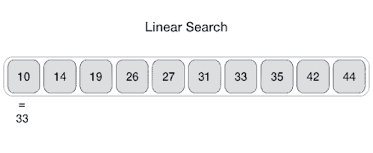
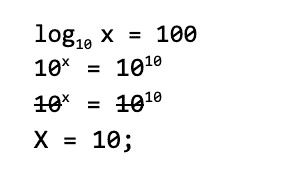

# 在 JavaScript 中理解线性和二分搜索法

> 原文：<https://blog.logrocket.com/understanding-linear-and-binary-search-in-javascript/>

在本教程中，我将首先解释几个有助于我们理解这个概念的术语。

那么，首先:一个**算法**是给计算机执行特定任务的一组指令。

根据您需要执行的任务，算法会更快或更有效地执行它。工程师在为给定任务创建算法时会考虑这种权衡。

当我们讨论线性(简单)搜索和二分搜索法时，我们将会看到这是如何发生的。

## 线性搜索

有时称为简单搜索，线性搜索是一种在列表中查找元素的方法。

假设我们有一个数字列表——比方说，从 1 到 1000——我们在寻找这些参数之间的一个数字。通过简单搜索，我们可以一个接一个地查找每个号码，直到找到匹配的号码。

这意味着——最坏的情况——我们必须查看整个列表，才能确定是否匹配。



下面是线性搜索的 JavaScript 实现:

```
const linearSearch = (list, target) => {
  for (let i = 0; i < list.length; i++){
    if( list[i] === target) return i
  }
  return null;
}

const list = [1,2,3,4,5,6,7,8,9,10]
let result = linearSearch(list, 8);
console.log(result); // 8
result = linearSearch(list, 19);
console.log(result); // null
```

## 二进位检索

另一方面，二分搜索法是一个更好的搜索方式。

假设我们正在字典中寻找单词`Organic`的意思。

我们会从中间开始搜索，而不是从第一个以`A`开头的单词开始。我们可以这样做，因为我们知道字典中的单词是按字母顺序排列的`(sorted)`，当我们从中间开始时，我们就不需要搜索字典的特定一半。

这就是我们如何看待二分搜索法的同义词。

它接受一个排序列表并搜索一个目标。如果目标存在，就返回它。如果没有，则返回 null。

因为它是一个排序列表，我们可以假设一些事情，并得出如下伪代码:

*   从列表`middle`中的值开始，将其与目标值进行比较
*   如果目标值等于`middle`的值，则返回中间值
*   如果目标值小于`middle`的值，重新计算`middle`使其增加
*   如果目标值大于`middle`的值，重新计算`middle`使其减小
*   在仍有项目要搜索时继续此操作，或返回`null`

让我们用二分搜索法的 JavaScript 实现来看一下:

```
const binarySearch = (list, target) => {
 let low = 0;
 let high = list.length - 1;
 let guess, mid;

 while (low <= high) {
   mid = Math.floor((low + high) / 2);
   guess = list[mid];
   if (guess === target) return mid;
   if (guess < target) low = mid + 1
   else high = mid - 1;
 }
 return null;
}
```

本质上，当我们使用二分搜索法时，我们做的每一个猜测都排除了一半的列表。

假设我们有一个 240，000 个数字的列表，我们想要搜索一个特定的数字。最多，我们要经历 18 个步骤:

```
240K  
→ 120k ------- 1
→ 60k -------- 2
→ 30 ---------- 3
→ 15k --------- 4
→ 7.5k -------- 5
→ 3.75k ------- 6
→ 1875 --------- 7
→ 938  --------- 8
→ 469 ---------- 9
→ 235 ---------- 10
→ 118 ---------- 11
→ 59 ----------- 12
→ 30 ----------- 13
→ 15 ----------- 14
→ 8 ------------ 15 
→ 4 ------------16
→ 2 ------------17
→ 1\. ------- 18
```

对于一个简单的搜索，我们将被要求通过名单上的每一个号码。

## 大 O 符号

大 O 符号是我们描述算法有多快或多复杂的一种方式。

当我们为一个特定的问题采用一种算法时，我们经常把它作为一种工具来理解可用的权衡。

它的名字来源于通常用对数表示的运算次数前的 O。

对数可以被认为是指数——也就是说，一个数乘以多少才能得到另一个数，等等。



### 简单搜索

让我们假设列表上有`n`个项目。简单的搜索需要遍历列表中的每一项，因此我们有`n`操作。结果大 O 记数法的运行时间是 O(n)；

### 二进位检索

二分搜索法的大 O 符号是 O(log n)。这是以 2 为基数的，这是因为对于每个操作，我们都将列表分成两部分。

## 结论

我们决定采用的算法可以提高或阻碍我们的应用程序的性能，因此在采用某个算法时，不时地适当考虑权衡是很重要的。

你可以在这里更深入地研究线性和二分搜索法[。](https://www.amazon.com/Grokking-Algorithms-illustrated-programmers-curious/dp/1617292230)

## 通过理解上下文，更容易地调试 JavaScript 错误

调试代码总是一项单调乏味的任务。但是你越了解自己的错误，就越容易改正。

LogRocket 让你以新的独特的方式理解这些错误。我们的前端监控解决方案跟踪用户与您的 JavaScript 前端的互动，让您能够准确找出导致错误的用户行为。

[](https://lp.logrocket.com/blg/javascript-signup)

LogRocket 记录控制台日志、页面加载时间、堆栈跟踪、慢速网络请求/响应(带有标题+正文)、浏览器元数据和自定义日志。理解您的 JavaScript 代码的影响从来没有这么简单过！

[Try it for free](https://lp.logrocket.com/blg/javascript-signup)

.