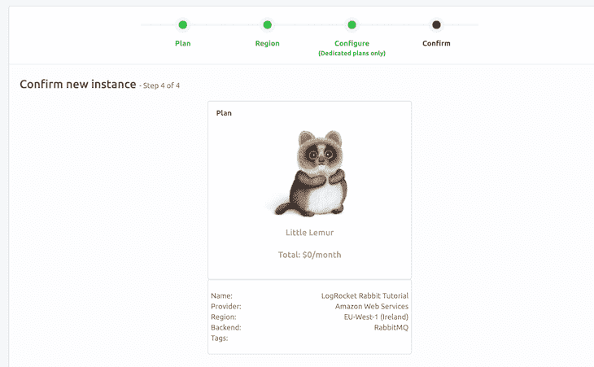
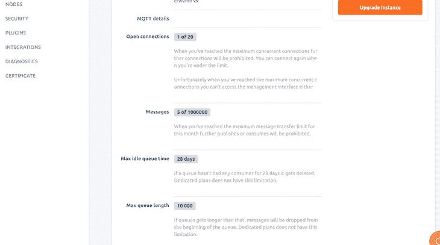
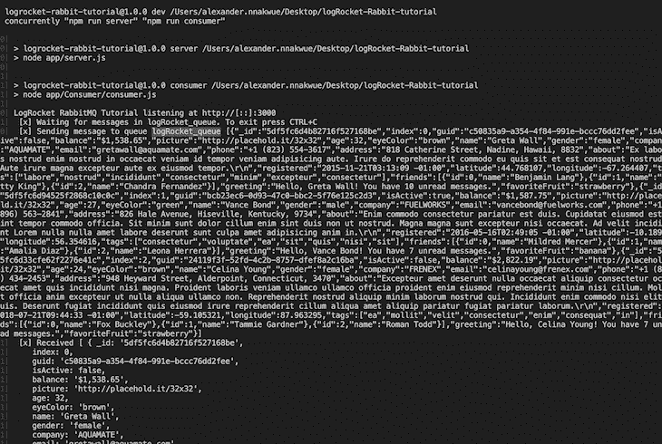

# 使用 RabbitMQ - LogRocket 博客了解消息队列系统

> 原文：<https://blog.logrocket.com/understanding-message-queuing-systems-using-rabbitmq/>

## 介绍

如今，由于基于微服务的架构的广泛采用，企业级应用被构建为具有特定功能的解耦模块/服务。[排队系统](https://en.wikipedia.org/wiki/Message_queue)为这些服务提供了一种[机制，通过从一个点(源/输出)到另一个点(目的地)以缓冲区的形式交换或传输数据来进行通信](https://blog.logrocket.com/methods-for-microservice-communication/)。这可以是在同一个应用程序/进程中，也可以是在不同的服务中，视情况而定。

消息代理是允许应用程序通过排队机制进行通信的工具。它们为数据提供一种临时或间歇性的存储，防止数据在整个链条中丢失。这些系统可以充当发布者/订阅者类型的系统，其中一个应用程序或进程是消息/数据的发布者或生产者，而另一个是消息/数据的订阅者或消费者。

随着我们的继续，我们将探索使用 [RabbitMQ](https://www.rabbitmq.com/#getstarted) 的排队系统，这是一个高性能、开源的消息代理，支持多种[消息协议](https://www.rabbitmq.com/protocols.html)。这里，我们将使用[高级消息队列协议(AMQP)](https://en.wikipedia.org/wiki/Advanced_Message_Queuing_Protocol) ，因为它是本机内置的，并且是代理支持的核心协议。此外，用不同的编程语言为客户集成或实现也很容易。

在本文中，我们将涵盖以下内容:

*   RabbitMQ 入门
*   使用 RabbitMQ 时需要了解的重要概念
*   使用云托管版本设置我们的 RabbitMQ 实例
*   示例应用程序使用一个流行的 Node.js 客户端库来演示消息排队， [amqplib](https://www.npmjs.com/package/amqplib)

## 先决条件

为了便于理解本教程，建议安装 Node.js 和 npm。节点的[官方文件](https://nodejs.org/en/download/)中提供了相关说明。请注意，虽然我们可以在本地机器上设置我们的 rabbtmq 服务器，但在本教程中，我们将设置我们的 rabbtmq 实例或服务器的云托管版本。

为什么？托管实例或服务通常是抽象维护，因为它们已经配置好了。它们还通过仪表板提供简单的监控，拥有经过良好优化的集群，当然，通常还提供用于开发目的的免费计划。

## RabbitMQ 入门

根据 RabbitMQ 网站的消息，rabbit MQ 是最受欢迎的开源消息代理之一。使用 RabbitMQ，我们可以定义队列，将消息推送到这些队列，然后从这些队列中消费消息。消息代理是这里的关键，因为它们提供了生产和消费应用程序或流程之间的联系点或接口。

在现实生活中，我们可以通过定义一个队列(通常是一个字符串)，通过交换将消息发送到预定义的队列，然后从队列中消费消息，来利用 RabbitMQ 的强大功能。但是在我们继续之前，我们需要了解一些我们在处理 Rabbit 和一般排队系统时可能会遇到的术语。

## 使用 RabbitMQ 时需要注意的重要概念

*   **生产者:**生产者根据队列名向队列发送或推送消息
*   队列:队列是一种媒介，通过它我们可以传输和存储消息或缓冲区
*   **消费者:**消费者订阅、接收或消费来自代理的消息，然后在另一个流程或应用程序中处理或使用它们
*   **交换:**[交换](https://www.rabbitmq.com/tutorials/amqp-concepts.html#amqp-model)是代理的入口点，它接收来自发布者的消息，并将它们路由到适当的队列
*   **代理:**消息代理基本上为一个应用程序产生的数据提供一种存储机制。这些数据通常由另一个应用程序使用，该应用程序使用给定的参数或连接字符串连接到代理
*   **通道:** [通道](https://www.rabbitmq.com/tutorials/amqp-concepts.html#amqp-channels)通过单一共享的 [TCP](https://en.wikipedia.org/wiki/Transmission_Control_Protocol) 连接向代理提供一种轻量级连接。这是因为创建到代理的多个开放连接是一项开销很大的操作
*   **虚拟主机(Vhost):** [虚拟主机](https://www.rabbitmq.com/vhosts.html)让一个代理托管几个隔离的环境成为可能

> **注意:**关于绑定、接受和拒绝消息(确认)等其他重要概念的细节，在这里有[。随着我们的深入，我们还将学习如何将数据或消息推入队列，以及如何从队列中消费。](https://www.rabbitmq.com/tutorials/amqp-concepts.html)

要在本地运行我们的设置，我们可以按照提供的说明在我们的机器上下载各种操作系统的 [RabbitMQ](https://www.rabbitmq.com/download.html) 。然而，如前所述，我们将使用一个流行的云托管版本 [CloudAMPQ](https://www.cloudamqp.com/) 来设置一个托管的 RabbitMQ 实例。

要开始我们的设置，我们可以点击主页上的[**S**](https://customer.cloudamqp.com/signup)[**ign up**](https://customer.cloudamqp.com/signup)按钮并配置我们的帐户。我们将利用免费计划来创建我们的新[实例](https://customer.cloudamqp.com/instance#)。在我们完成了整个一步一步的设置之后，我们应该可以继续我们创建的实例了。



Our newly created instance on the CloudAMPQ platform.

我们可以列出我们当前的实例，以便直观地了解从我们的应用程序连接到我们的集群所需的参数。提供的`AMPQ url`由`Host`、`User & Vhost`和`Password`组成。稍后，我们将使用这些参数从我们的应用程序连接到我们的集群。请注意，我们可以直接从仪表板复制这个 URL。URL 的格式如下所示:

```
amqp://user:[email protected]:port/vhost
```

此外，从界面中，我们可以看到其他字段的可视提示，包括打开的连接数、消息数等。，如下图所示:



Other provided fields in the UI for the CloudAMPQ dashboard.

对于云和本地设置，RabbitMQ 提供了一个 web 浏览器，帮助管理队列、连接、通道、用户权限等。我们的[管理界面](https://stingray.rmq.cloudamqp.com/#/queues/dscrwvmh/logRocket_queue)的截图如下所示:


RabbitMQ’s management interface.

## RabbitMQ 的特性和用例

如前所述，消息队列基本上允许不同的应用程序(如微服务)通过相互发送消息来进行通信。RabbitMQ 的特性包括:

*   支持多种可配置的消息协议
*   多种编程语言中的大量库
*   支持完全分布式和高度可伸缩的系统，混合负载平衡。这意味着消息以优化的方式被路由到适当的队列
*   为发布/订阅系统和消息广播提供多种交换类型
*   支持[多个插件](https://www.rabbitmq.com/plugins.html)
*   通过仪表板提供管理和监控
*   易于部署(在不同地区具有高可用性),通过高度可扩展的集群设计实现企业就绪。要了解更多信息，您可以[查看文档的这一部分](https://www.rabbitmq.com/#features)


RabbitMQ’s architecture.

## 用 RabbitMQ 和 Node.js 设置应用程序

现在，为了更好地理解如何向队列发送消息和从队列中消费消息，让我们来充实我们的应用程序。在开始之前，我们可以为我们的项目创建一个文件夹。然后，我们可以在项目目录中运行`npm init`来初始化一个`package.json`文件。然后，我们可以继续为我们的项目安装所有必需的依赖项:

```
npm install amqplib restify dotenv concurrently --save
```

如前所述，我们已经使用了 RabbitMQ 的 Node.js 客户端库，`amqplib`。我们还安装了`[restify](https://www.npmjs.com/package/restify)`，它将为我们的应用程序设置一个基本服务器。此外，我们已经安装了`[dotenv](https://www.npmjs.com/package/dotenv)`包来加载我们的环境变量。最后，`[concurrently](https://www.npmjs.com/package/concurrently)`包将帮助我们同时运行多个命令。完成后，我们的`package.json`文件应该是这样的:

```
{
  "name": "logrocket-rabbit-tutorial",
  "version": "1.0.0",
  "description": "",
  "main": "index.js",
  "scripts": {
    "server": "node app/server.js",
    "consumer": "node app/Consumer/consumer.js",
    "dev": "concurrently \"npm run server\" \"npm run consumer\""
  },
  "author": "Alexander Nnakwue",
  "license": "MIT",
  "dependencies": {
    "amqplib": "^0.5.5",
    "concurrently": "^5.0.1",
    "dotenv": "^8.2.0",
    "restify": "^8.5.0"
  }
}
```

正如我们在上面看到的，`concurrently`包帮助我们启动我们的服务器，它调用生产者脚本，向指定的队列发送一个随机的 JSON 对象。然后，使用者订阅队列中的消息。在我们的用例中，我们使用默认的交换(直接交换)，这意味着消息将基于我们指定的队列名进行路由。

> **注意:**为了让应用程序向绑定到其队列的多个或不同的消费者应用程序或微服务发送(发布)消息，我们可以指定不同类型的交换—通常是扇出。要了解更多关于扇出交换的信息，请访问[文档的这一部分](https://www.rabbitmq.com/tutorials/amqp-concepts.html#exchange-fanout)。

要连接到我们之前设置的集群，我们可以继续复制通过仪表板提供给我们的连接参数，并创建一个`env`文件来存储它们。下面是它的一个示例(没有真实凭证):

```
APP_PORT=3000
USER_= user
PASS= pass
HOST= host
VHOST= vhost
QUEUE_NAME= queue_name
```

然后我们可以引用上面的`env`文件来配置我们的 RabbitMQ 集群连接字符串、端口和队列，如下所示:

```
const path = require('path');
require('dotenv').config({path:path.resolve(__dirname, '../.env')})
const config= {
    port: process.env.APP_PORT,
    rabbit: {
    connectionString: `amqp://${process.env.USER_}:${process.env.PASS}@${process.env.HOST}/${process.env.VHOST}`,
    queue: process.env.QUEUE_NAME
    }
}
module.exports = config;
```

完成上面的设置后，我们可以根据提供的队列名称向我们的队列发送消息。这方面的代码可以在`producer.js`文件中找到，如下所示:

```
#!/usr/bin/env node

const amqp = require('amqplib');
const config = require('../config');

const publishToQueue = async (queue, message, durable = false) => {
    try {
    const cluster = await amqp.connect(config.rabbit.connectionString);
    const channel = await cluster.createChannel();
    await channel.assertQueue(queue, durable= false);
    await channel.sendToQueue(queue, Buffer.from(message));

    console.info(' [x] Sending message to queue', queue, message);

    } catch (error) {
        // handle error response
        console.error(error, 'Unable to connect to cluster!');  
        process.exit(1);
    }

}
module.exports = publishToQueue;
```

这里，我们导出一个函数，`publishToQueue`。顾名思义，它接受一个队列名、要推送到队列的消息内容(在本例中，路由关键字是队列名)和一个可选参数`durable`。当设置为 true 时，该参数确保在代理重新启动或失败时消息不会丢失。

要了解更多信息，我们可以看看队列的[属性](https://www.rabbitmq.com/queues.html#properties)。在上面的代码中，我们连接到我们的集群，创建了一个[通道](https://www.squaremobius.net/amqp.node/channel_api.html#channel)，用我们想要的属性断言/创建了我们的队列(使用`assertQueue`方法)，最后，向队列发送消息。

这个方法被导出并在我们的`server.js`文件中调用，这样一旦应用程序启动，我们就可以开始将消息推送到我们指定的队列。这很好地反映了它在现实生活中的工作方式，在现实生活中，我们根据发生的一些事件将消息推送到队列中，或者立即对应用程序生成的消息进行排队。`server.js`文件如下所示:

```
const restify = require('restify');
const server = restify.createServer({
    name: 'LogRocket RabbitMQ Tutorial',
    version: '1.0.0'
});
const config = require('./config');
const produce = require('./Producer/producer');
const rawdata = require('./sample.json');

const sampleData = JSON.stringify(rawdata);

produce(config.rabbit.queue, sampleData, durable = false);

server.listen(config.port, function () {
  console.log('%s listening at %s', server.name, server.url);
});
```

正如我们在上面的服务器文件中看到的，我们已经设置了一个简单的 Restify 服务器，并导入了我们的生产者脚本和我们的随机 JSON 数据。然后，我们调用带有所有必需参数的生产者函数，如上所示。最后，我们的服务器监听我们之前在`.env`文件中指定的端口。

我们可以继续使用消费者脚本，它从我们的队列中读取和使用消息。在真实的用例中，当我们从队列中消费时，我们可以确认同样的情况，让代理知道消费者已经完成了它的工作。

此外，我们可以将数据写入数据库以备将来使用，甚至在做我们想做的事情之前动态地重新处理数据，视情况而定。`consumer.js`文件如下所示:

```
#!/usr/bin/env node

const amqp = require('amqplib');
const config = require('../config');

const consumeFromQueue = async (queue, isNoAck = false, durable = false, prefetch = null) => {
    const cluster = await amqp.connect(config.rabbit.connectionString);
    const channel = await cluster.createChannel();
    await channel.assertQueue(queue, durable=false);
    if (prefetch) {
        channel.prefetch(prefetch);
    }
    console.log(` [x] Waiting for messages in ${queue}. To exit press CTRL+C`)

    try {
        channel.consume(queue, message => {
      if (message !== null) {
        console.log(' [x] Received', JSON.parse(message.content.toString()));
        channel.ack(message);
        return null;
      } else {
        console.log(error, 'Queue is empty!')
        channel.reject(message);
      }
    }, {noAck: isNoAck})
    } catch (error) {
        console.log(error, 'Failed to consume messages from Queue!')
        cluster.close(); 
    }
}
consumeFromQueue(config.rabbit.queue);
```

在上面的`consumer.js`文件中，让我们先了解一下传递给函数的参数。`[prefetch](https://www.rabbitmq.com/tutorials/amqp-concepts.html#messages-prefetch)`参数主要控制在一个队列有多个消费者连接的情况下有多少消息被路由到消费者(一个例子是扇出队列)。顾名思义，消息确认用于确认消费者的消息传递或处理。

这对于出现网络问题或应用程序崩溃的情况确实很重要，因为代理知道消息还没有被订阅它的消费者确认，因此知道要为下一个消费者连接重新排队。更详细的信息可以查看这个[链接](https://www.rabbitmq.com/tutorials/amqp-concepts.html#acknowledgements)。

本教程的代码库[在这个 GitHub](https://github.com/firebase007/logRocket-rabbit-tutorial) 上。它还包含一个解释如何运行应用程序的 [readme](https://github.com/firebase007/logRocket-rabbit-tutorial/blob/master/README.md) 文件。启动服务器后的输出如下所示:



Output from the application console when we start the application.

## 结论

在本教程中，我们学习了如何向队列发送消息，以及如何使用队列中的消息。虽然还有其他更高级和更复杂的用例，例如，如果我们有多个消费者订阅通过定义的交换从队列中提取消息，我们当前的示例用例反映了理解排队系统在实践中如何工作所需的基本概念。

使用 RabbitMQ，您可以了解更多关于排队系统的其他用例以及更高级的概念。如需参与或提供反馈，请通过我的 [Twitter](https://twitter.com/alex_nnakwue) 联系我。谢谢。

## 200 只显示器出现故障，生产中网络请求缓慢

部署基于节点的 web 应用程序或网站是容易的部分。确保您的节点实例继续为您的应用程序提供资源是事情变得更加困难的地方。如果您对确保对后端或第三方服务的请求成功感兴趣，

[try LogRocket](https://lp.logrocket.com/blg/node-signup)

.

[](https://lp.logrocket.com/blg/node-signup)[https://logrocket.com/signup/](https://lp.logrocket.com/blg/node-signup)

LogRocket 就像是网络和移动应用程序的 DVR，记录下用户与你的应用程序交互时发生的一切。您可以汇总并报告有问题的网络请求，以快速了解根本原因，而不是猜测问题发生的原因。

LogRocket 检测您的应用程序以记录基线性能计时，如页面加载时间、到达第一个字节的时间、慢速网络请求，还记录 Redux、NgRx 和 Vuex 操作/状态。

[Start monitoring for free](https://lp.logrocket.com/blg/node-signup)

.