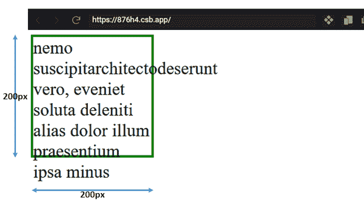
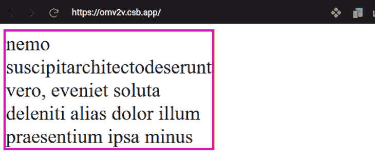
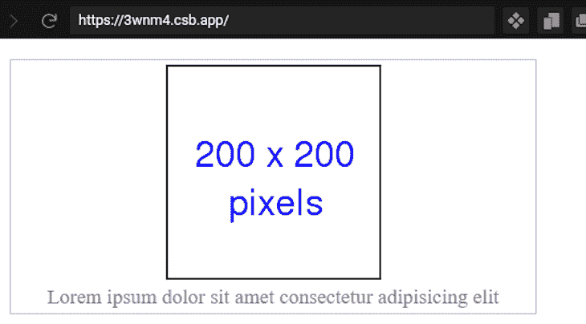
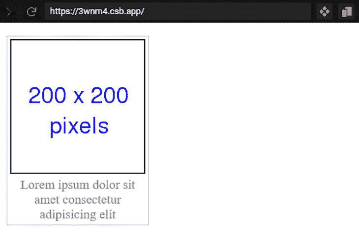
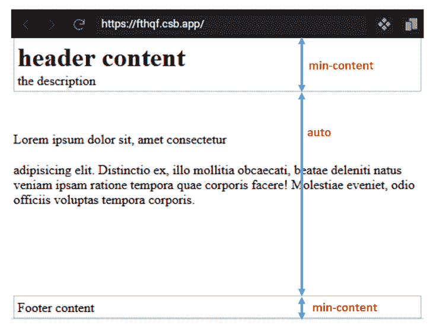
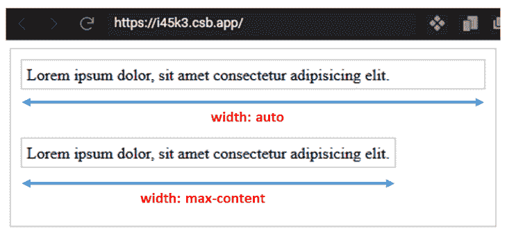
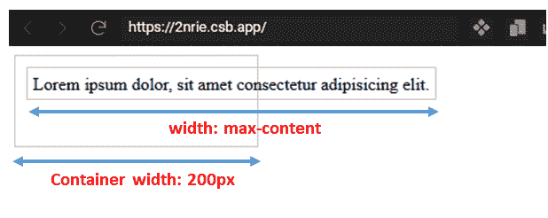
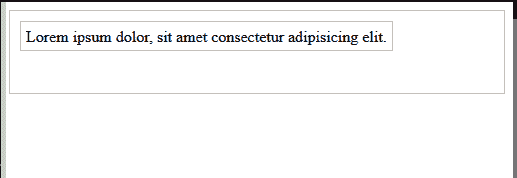

# 理解 CSS 中的最小内容、最大内容和适合内容

> 原文：<https://blog.logrocket.com/understanding-min-content-max-content-fit-content-css/>

对于希望灵活地适当呈现网页内容的开发人员来说，理解 CSS 尺寸属性是必要的。

在 CSS 中，我们使用长度(`px`、`em`)、百分比和关键字值来定义元素大小。虽然长度和百分比值类型经常用于网页布局，但它们并不总是完美的组合。

在某些上下文中，我们使用关键字值类型，包括`fit-content`、`min-content`和`max-content`。

在本指南中，我们将介绍这些关键字值是什么，它们的区别，以及它们如何应用到现实世界的项目中。

在我们继续之前，请确保您对 CSS 有基本的了解。

## 内在和外在规模

考虑一个包含内容的`div`元素，它具有固定的`width`和`200px`的`height`:

```
<div class="s_1">
  nemo suscipitarchitectodeserunt vero, eveniet soluta deleniti alias dolor
  illum praesentium ipsa minus
</div>

```

这里我们给了[和`div`一个边界来查看大小](https://codesandbox.io/s/stoic-fermat-876h4?file=/index.html)的范围。



当我们通过对元素应用特定值来改变元素的自然大小时，如上图所示，我们将该大小称为外部大小。

另一方面，当内容的大小定义了元素的大小时，我们称之为固有或自然大小。

通过将块的维度限制为特定的大小，我们会遇到内容溢出，这是外部大小调整的一个缺点。

但是，我们可以通过使用关键字值从内容中确定元素的固有大小来纠正不希望的行为，从而产生更好的布局。

## `min-content`关键字值

根据 W3C 规范的规定，`min-content`是一个盒子在不溢出其内容的情况下所能容纳的最小尺寸。

对于水平内容，`min-content`使用元素框中最宽内容位的长度，并自动将该长度值设置为框宽。

在这种情况下，内容包括文本和资产，如图像和视频。

如果我们再看一下上面的 box 例子，我们可以将`min-content`应用于 box 元素，如下所示:

```
.s_2 {
  /* ... */
  width: min-content;
  /* ... */
}

```

而[我们](https://codesandbox.io/s/dawn-microservice-omv2v?file=/index.html) [应该](https://codesandbox.io/s/dawn-microservice-omv2v?file=/index.html) [得到](https://codesandbox.io/s/dawn-microservice-omv2v?file=/index.html) [这个布局](https://codesandbox.io/s/dawn-microservice-omv2v?file=/index.html):



这里用`min-content`，内容内最长的单词定义了盒子的大小；这是盒子固有的最小宽度。

### `min-content`关键字值的实际例子

为了在现实世界的项目中实现`min-content`关键字，让我们考虑以下用例。

#### 给图像添加标题

如果我们想要用一个标题来标记一个图像，这个标题是按照图像的宽度来的，我们可以使用`min-content`来无缝地实现想要的结果。

让我们来看看下面的代码:

```
<figure>
  
  <figcaption>
    Lorem ipsum dolor sit amet consectetur adipisicing elit
  </figcaption>
</figure>

```

这给了`figure`元素一个边界来查看大小的范围。



由于`figure`是一个块元素，它的宽度自然会占据它的容器元素。

通过将`min-content`的`width`分配给`figure`元素，其大小由最宽的内容位定义。在这种情况下，最宽的位是图像:

```
figure {
  /* ... */
  width: min-content;
}

```

这个[用定义宽度的图像呈现下面的输出](https://codesandbox.io/s/elastic-mirzakhani-3wnm4?file=/index.html):



#### 调整网格和 flexbox 项目的大小

`min-content`也是网格和伸缩尺寸属性的有效值。在 CSS 中，flexbox 系统的`flex-basis`属性设置内容框的大小。这使得`min-content`关键字成为自动获取盒子最小尺寸的理想值。

在这种情况下，我们使用`flex-basis: min-content`。

同样，在网格系统中，我们可以将关键字`min-content`分配给`grid-template-rows`或`grid-template-columns`属性，以获得固有的最小盒子大小。

让我们考虑下面的代码:

```
<div class="grid">
  <header class="header">
    <!-- ... -->
  </header>
  <div class="content">
    <!-- ... -->
  </div>
  <div class="footer">
    <!-- ... -->
  </div>
</div>

```

注意，为了简洁起见，我们删除了元素的内容。

让我们将结构转换为网格布局，并应用一个`min-content`关键字:

```
.grid {
  display: grid;
  grid-template-rows: min-content auto min-content;
  height: 100vh;
}

```

这样，我们得到了内容高度的固有最小值[，而不会导致溢出。](https://codesandbox.io/s/ecstatic-lucy-fthqf?file=/index.html)



如果我们不应用`min-content`，我们会得到不同的行为。为了形象化这种行为，我们可以暂时移除`grid-template-rows`并对`header`应用一个固定的高度:

```
.grid {
  ...
  /* grid-template-rows: min-content auto min-content; */
  ...
}
.header {
  ...
  height: 40px;
}

```

这样，我们不再得到自然的内容大小。在这种情况下，元素框对于它们的内容来说可能太大，导致内容溢出这些框。

## `max-content`关键字值

根据 W3C 规范，`max-content`表示给定无限可用空间时，一个盒子在给定轴上的理想尺寸。

换句话说，`max-content`代表了一个盒子在不被包装或者溢出盒子的情况下容纳所有内容所需的大小。

这样，让我们对元素大小应用一个`max-content`:

```
<div id="container">
  <div class="item1">Lorem ipsum dolor, sit amet consectetur adipisicing elit.</div>
  <div class="item2">Lorem ipsum dolor, sit amet consectetur adipisicing elit.</div>
</div> 

```

随着这一呈现，[我们接收到这个输出](https://codesandbox.io/s/zen-northcutt-i45k3?file=/index.html:308-514):



在这里，第一个 box 元素采用默认的宽度值`auto`,从而容纳容器允许的最大空间。但是，当将`max-content`值应用于同一个盒子时，我们得到了盒子的确切内容大小。

在我们需要内容的最大宽度来决定盒子的大小时，`max-content`关键字值是理想的。

### `max-content`值关键字的实际例子

考虑一个网格布局结构，其中我们将一个`max-content`应用于网格列:

HTML 包括以下内容:

```
<div class="container">
  <div>Lorem</div>
  <div>
    Lorem ipsum dolor sit amet
  </div>
  <div>Lorem ipsum dolor</div>
</div>

```

然后，添加 CSS:

```
.container {
  display: grid;
  grid-template-columns: 1fr max-content max-content;
  /* ... */
}

```

这个[呈现具有`max-content`值](https://codesandbox.io/s/amazing-mountain-m4tdj?file=/index.html)的列占用内容大小，而具有`fr`单元的列占用剩余的可用空间。


### `max-content`的不良影响

正如我们所知，对于无限的可用空间来说，box 元素可以包含它的所有内容，而不会被包装和溢出它的父容器。

但是，在父元素或祖先元素不能容纳盒子大小的情况下，盒子会溢出:

```
<div id="container">
  <div class="item1">Lorem ipsum dolor, sit amet consectetur adipisicing elit.</div>
</div> 

```

添加 CSS 设置`width`:

```
#container {
  /* ... */
  width: 200px;
}

.item1 {
  width: max-content;
  /* ... */
}

```

使用此代码， [t](https://codesandbox.io/s/restless-framework-2nrie?file=/index.html) [he 盒子的固有最大宽度比容器](https://codesandbox.io/s/restless-framework-2nrie?file=/index.html)长，导致溢出。



在这种情况下，我们必须调整盒子内容，以适应容器的可用空间。这就是`fit-content`关键字的用武之地。

## `fit-content`关键字值

根据容器元素的大小，当将`fit-content`应用于容器中的 box 元素时，box 要么使用`max-content`大小、`min-content`大小，要么使用可用容器作为其理想大小。

当给定无限的可用空间时，`max-content`定义了盒子的理想大小。然而，当视口变窄时，可用空间变成盒子的大小，以防止溢出，直到盒子使用`min-content`。

如果我们重温上一个例子，通过对 box 元素应用一个`fit-content`,我们得到如下结果:

```
.item1 {
  width: -moz-fit-content;
  width: fit-content;
  /* ... */
}

```

注意，我们必须使用一个`-moz-`供应商前缀来在 Mozilla Firefox 上使用这个关键字值。

[如下面的 GIF 图](https://codesandbox.io/s/nifty-currying-2t84u?file=/index.html)所示，盒子使用了可用空间，但从未扩展超过`max-content`，当视窗变窄时，盒子从未缩小超过`min-content`。



### `fit-content()`功能

W3C 规范也提到了`fit-content()`函数允许开发者定义一个元素大小的最大允许宽度。这个 CSS 函数经常分别使用`grid-template-columns`和`grid-template-rows`来调整网格列和行的大小。

使用`fit-content()`接受一个`percentage`或`length`单位作为参数:

```
fit-content(percentage | length)

```

类似于`fit-content`关键字，当分配这个函数值来确定网格布局中的大小时，它使用指定的参数作为最大允许的框大小，同时确保框永远不会超过`max-content`。

让我们考虑一个网格布局结构，并对网格列应用一个`fit-content()`:

```
<div class="container">     
  <div>Lorem ipsum dolor</div>
  <div>
    Lorem ipsum dolor, sit consectetur adipisicing elit.!
  </div>
  <div>Lorem</div>
</div>

```

在 CSS 中，我们添加了`fit-content()`:

```
.container {
  display: grid;
  grid-template-columns: fit-content(200px) fit-content(250px) auto;
  /* ... */
}

```

传递给`fit-content()`的参数区分了这两个函数。

在网格布局的第一列中，我们将`200px`作为参数传递，因此，该列的最大允许宽度为`200px`，第二列的最大允许宽度为`250px`。第三列占用剩余的容器空间，因为它被赋值为`auto`。

由 [`fit-content()`定义尺寸的盒子不会扩展超过指定的宽度](https://codesandbox.io/s/modern-thunder-cobt0?file=/index.html)，也不会超出`max-content`。但是，当视窗变窄时，框可以收缩以适应内容。


## 结论

有了固有的关键字值，我们可以灵活地以最合适的方式呈现页面内容。在本教程中，我们通过实例讲述了如何使用`min-content`、`max-content`和`fit-content`关键字值，因此您可以开始在您的项目中使用它们。

如果你喜欢这个教程，确保你在网上分享这个内容。如果你有问题或贡献，请在评论区分享你的想法。

## 你的前端是否占用了用户的 CPU？

随着 web 前端变得越来越复杂，资源贪婪的特性对浏览器的要求越来越高。如果您对监控和跟踪生产环境中所有用户的客户端 CPU 使用、内存使用等感兴趣，

[try LogRocket](https://lp.logrocket.com/blg/css-signup)

.

[](https://lp.logrocket.com/blg/css-signup)[https://logrocket.com/signup/](https://lp.logrocket.com/blg/css-signup)

LogRocket 就像是网络和移动应用的 DVR，记录你的网络应用或网站上发生的一切。您可以汇总和报告关键的前端性能指标，重放用户会话和应用程序状态，记录网络请求，并自动显示所有错误，而不是猜测问题发生的原因。

现代化您调试 web 和移动应用的方式— [开始免费监控](https://lp.logrocket.com/blg/css-signup)。