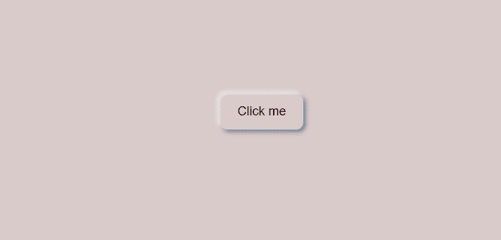

# 理解 CSS 中的神经形态

> 原文：<https://blog.logrocket.com/understanding-neumorphism-css/>

神经形态是一种相对较新的设计趋势，最近开始流行。它结合了 skeuomorphism 和平面设计的元素，创建了一个独特的现代和微妙的 3D 外观，可以添加到所有的 CSS web 元素。

本文将探讨什么是神经形态，如何在您的 CSS 项目中使用它，它的可访问性问题，等等。从创建按钮和其他元素到理解神经形态设计的最佳实践，我们将涵盖你需要了解的关于这一令人兴奋的新趋势的一切。

向前跳:

## 什么是神经形态？

Neumorphism 是一种设计风格，涉及创建具有柔软三维外观的用户界面元素。它是“新”和“skeuomorphism”两个词的组合，指的是模仿现实世界物体(即 3D 物体)外观的设计风格。

Neumorphism 通常涉及使用渐变和光影效果来赋予元素深度感，并使它们看起来像是从屏幕上突出来的。Neumorphism 是一个相对较新的设计趋势，但它并不是一个新的想法。

neumorphism 的概念，也被称为软 UI 设计，已经存在了近十年。由设计师兼教育家 Michal Malewicz 创造的 neumorphism 起源于 21 世纪初，是对日益流行的平面设计美学的回应。它是由寻求为数字界面创造更微妙和精致外观的设计师开发的，他们厌倦了[的 skeuomorphism](https://www.interaction-design.org/literature/topics/skeuomorphism) 。

神经形态有一定的局限性，包括:

*   在特定设备和浏览器上的可用性有限
*   设计和实施的复杂性
*   不同要素之间难以实现一致性
*   过度使用和丧失新颖性的风险
*   设计中出现混乱或视觉混乱的可能性
*   颜色和款式选择有限

然而，这些限制并没有从神经变形中带走任何东西，因为它们很容易用一点技巧来解决。

现在我们知道了什么是神经形态，让我们来谈谈如何在你的 CSS 设计中应用它。

## 用 CSS 创建神经形态

用 CSS 创建一个新的效果就像给目标元素添加阴影一样简单。请记住，神经变形背后的主要思想是通过以特定的方式使用渐变、照明和阴影来为数字界面创建一个更加有机和三维的外观。

设计者在创建神经形态界面时通常会遵循一些规则:

*   使用渐变来创造深度和维度的错觉
*   确保背景永远不会全白或全黑
*   使用灯光和阴影给元素一个“推动”或“弹出”的外观
*   使用有限的调色板，通常基于单一基色
*   避免使用硬线和尖角，而是使用圆形和圆角
*   对于过渡，总是使用微妙的过渡和动画来增加流畅感和动感

重要的是要记住，neumorphism 不是一个一刀切的设计解决方案，它可能只适合某些类型的接口或应用程序。与任何设计趋势一样，必须深思熟虑地使用它，并以增强用户体验的方式使用它。

现在我们知道了规则，让我们将它们应用到测试中。首先，我们将创建一个简单的 HTML 文件，并向其中添加一个`div`:

```
<html lang="en">
<head>
    <meta charset="UTF-8">
    <meta http-equiv="X-UA-Compatible" content="IE=edge">
    <meta name="viewport" content="width=device-width, initial-scale=1.0">
    <title>Document</title>
    <link rel="stylesheet" href="style.css">
</head>
<body>
    <div class="container"></div>
</body>
</html>

```

接下来，我们将使用我们的 CSS 来定位那个`div`,并使它更加可见:

```
body{
    display: grid;
    justify-content: center;
    align-items: center;
    background: rgb(218, 203, 203);
}

.container {
    width: 150px;
    height: 150px;
    background: rgb(230, 182, 182);
    border-radius: 15px;
}

```

这应该会给我们一些非常简单的东西，看起来像这样:


接下来，我们将遵循上述第三条规则，使用灯光给`div`一个“弹出”和“推动”的效果。

### 爆裂效应

就像我之前说的，神经形态的魔力在于`[box-shadow](https://developer.mozilla.org/en-US/docs/Web/CSS/box-shadow)`属性。用`box-shadow`，我们将添加两个阴影到上面的`div`，一个浅色阴影(正值)和一个深色阴影(负值)。

考虑到这一点，我们将在测试`div`中添加以下代码:

```
box-shadow:  -3px -3px 7px #ffffffb2,
  3px 3px 7px rgba(94, 104, 121, 0.945);

```

正如你所看到的，我们在顶部和左侧使用了较浅的颜色，而在底部和右侧使用了较深的颜色。这将给我们的`div`一个弹出效果，就像这样:


通过反转`box-shadow`中的值并将`inset`值添加到我们的元素中，我们可以生成一种不同的弹出效果:

```
box-shadow: inset 3px 3px 7px #ffffffb0,
    inset -3px -3px 7px rgba(94, 104, 121, 0.692);

```

上述代码将导致以下结果:


### 推动效应

使用`inset`值也可以实现神经变形中的推送效果。这里，我们只是将该值添加到我们之前使用的第一个`box-shadow`值中:

```
box-shadow:  inset -3px -3px 7px #ffffffb2,
        inset 3px 3px 7px rgba(94, 104, 121, 0.945);

```

上述代码将导致以下结果:


这里有一个 [CodePen](https://codepen.io/Fimbosky1/pen/KKeLyXP) 给这三个例子，以防你想玩玩它们。

现在我们知道了如何在 CSS 中使用 neumorphism，让我们看看如何将它应用到按钮和卡片上。

### 小跟班

在这个简短的例子中，我们将构建一个具有弹出效果的 neumorphic 按钮，并在悬停时给它一个推送效果。

首先，让我们来设计按钮的样式:

```
button{
    height: 50px;
    font-weight: 500;
    outline: none;
    border: none;
    padding: 12px 24px 12px 24px;
    font-size: 18px;
    border-radius: 10px;
    background: rgb(218, 203, 203);
    box-shadow:  -3px -3px 7px #ffffffb2,
        3px 3px 7px rgba(94, 104, 121, 0.945);
}

```

这将为我们提供一个如下所示的按钮:



接下来，我们将用下面的代码添加一个当鼠标悬停在按钮上时的推动神经形态效果:

```
button:hover{
    box-shadow:  inset -3px -3px 7px #ffffffb2,
    inset 3px 3px 7px rgba(94, 104, 121, 0.945);       
}

```

这将导致:


如果您想进一步向按钮添加一些 JavaScript，您可以使用`on-click`事件使按钮在被点击时保持按下状态。这里有一个[代码打开](https://docs.google.com/spreadsheets/u/0/d/1_rBKrDaruaHKuCEvHqQWlNNHHooYtk_79ipom2TMFo8/edit)按钮，如果你想复制代码或摆弄它。

如果你想看到更多的神经形态的应用，这个代码笔和[这个代码笔](https://codepen.io/ricardoolivaalonso/pen/YzyaRPN)都是很棒的应用。

## 无障碍问题

虽然神经形态可以创造一种独特的现代美学，但它也提出了几个可访问性的挑战。事实是，神经形态设计未能满足一些重要的[网络内容可访问性指南](https://www.w3.org/WAI/WCAG21/quickref/)。

neumorphism 的一个主要问题是，它很难从背景中看到和区分按钮和其他交互元素。以下图为例:


异形元素通常被设计成与背景融为一体，因此，它们在视觉上很微妙，很容易被忽略。这可能会使有视觉障碍的用户难以导航和与界面交互。

神经形态的另一个可访问性挑战是它会使文本难以阅读。因为神经形态元素通常使用渐变和阴影来创建深度感，所以这些元素上面的文本可能会变得难以阅读，尤其是对于视力低下或色盲的用户。这使得用户很难访问和理解屏幕上的信息。

此外，神经变形会给有运动障碍的用户带来挑战。因为神经形态元素通常具有类似 3D 的外观，所以它们可能需要精确和精细的移动来进行交互。这给有运动障碍的用户在按按钮或选择选项时造成困难。

总的来说，神经形态论的缺点并没有压倒它的优点。这些可访问性的挑战可以通过使用正确的调色板和对比度来克服。

## 结论

如果你成功了，恭喜你！你现在知道了所有关于神经形态和如何用 CSS 制作神经形态的设计。虽然异形设计可能在美学上令人愉悦，但是在你的页面上使用太多的异形元素会迷惑你的读者，并导致糟糕的 UX。这一切都是为了创造一个良好的平衡！

神经形态元素最适合应用于表单和按钮，但是稍加创新，它们也可以应用于其他组件。适度使用它们。

如果你对在 React 中创建神经形态设计感兴趣，可以看看这篇文章。

希望这篇文章有所帮助。下一集见。

## 你的前端是否占用了用户的 CPU？

随着 web 前端变得越来越复杂，资源贪婪的特性对浏览器的要求越来越高。如果您对监控和跟踪生产环境中所有用户的客户端 CPU 使用、内存使用等感兴趣，

[try LogRocket](https://lp.logrocket.com/blg/css-signup)

.

[](https://lp.logrocket.com/blg/css-signup)[https://logrocket.com/signup/](https://lp.logrocket.com/blg/css-signup)

LogRocket 就像是网络和移动应用的 DVR，记录你的网络应用或网站上发生的一切。您可以汇总和报告关键的前端性能指标，重放用户会话和应用程序状态，记录网络请求，并自动显示所有错误，而不是猜测问题发生的原因。

现代化您调试 web 和移动应用的方式— [开始免费监控](https://lp.logrocket.com/blg/css-signup)。