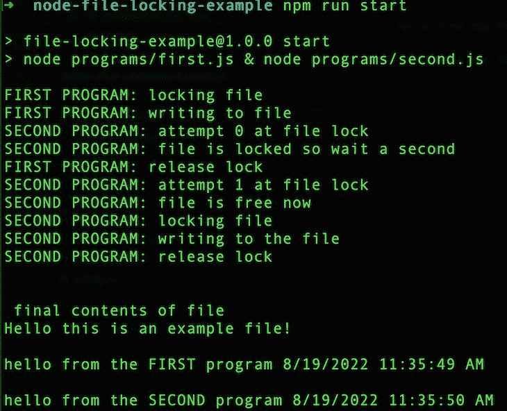

# 了解 Node.js 文件锁定

> 原文：<https://blog.logrocket.com/understanding-node-js-file-locking/>

当构建任何软件系统时，数据完整性总是很重要的。任何软件工程师都必须处理传统的竞争情况，这种情况发生在两个用户或系统试图修改同一个数据对象时。

在 web 开发中，我们经常会遇到锁定数据库记录或进程的问题。这包括数据对象和实际文件，取决于您正在处理的内容。在 Node.js 中，文件锁定使用类似于软件开发中锁定其他数据对象的概念。

在本文中，我将带您了解如何在 Node.js 中实现文件锁定，将它与您在锁定中看到的更一般的概念联系起来，比如数据库记录和进程。我还包含了一些利用 [proper-lockfile](https://www.npmjs.com/package/proper-lockfile) npm 包的示例代码。最后，我在 GitHub 上创建了一个[示例项目，您可以使用它来跟进。我们开始吧！](https://github.com/andrewevans0102/node-file-locking-example)

## Node.js 如何支持文件锁定？

Node.js 包含许多文件管理功能，包括执行传统 CRUD 功能的能力以及同步和异步操作的能力。

在下面的代码中，我们同时使用了异步和同步函数来读取文件:

```
// example originally copied from https://nodejs.dev/learn/reading-files-with-nodejs

const fs = require('fs')

// asynchronous
fs.readFile('/Users/joe/test.txt', 'utf8' , (err, data) => {
  if (err) {
    console.error(err)
    return
  }
  console.log(data)
})

// synchronous
try {
  const data = fs.readFileSync('/Users/joe/test.txt', 'utf8')
  console.log(data)
} catch (err) {
  console.error(err)
}

```

Node.js `fs`包中最常用于文件的其他函数包括:

*   `writeFile`和`writeFileSync`
*   `appendfile`和`appendFileSync`
*   删除带有`unlinkSync`和`unlink`的文件
*   使用`state`和`stateSync`获取操作系统中文件的状态
*   使用`mkdir`和`mkdirSync`创建文件夹

Node.js 中的`fs`和`path`包中还有许多其他的包。

具体到在 Node.js 中锁定文件，我们使用`fs.stat()`功能来获取关于文件创建和最后更新时间的信息，类似于下面的代码:

```
// this code was copied from https://attacomsian.com/blog/nodejs-get-file-last-modified-date

const fs = require('fs');

// fetch file details
try {
    const stats = fs.statSync('file.txt');

    // print file last modified date
    console.log(`File Data Last Modified: ${stats.mtime}`);
    console.log(`File Status Last Modified: ${stats.ctime}`);
} catch (error) {
    console.log(error);
}

```

## 如何在 Node.js 中锁定一个文件？

使用 Node.js 可以通过多种方式锁定系统中的文件。文件锁定面临的最大挑战是不同的操作系统以不同的方式锁定文件。

在处理文件时，Node.js 将控制权交给操作系统。因此，要在软件中锁定您的文件，您必须使用中介服务来监听和控制您的文件。一种方法是利用数据库记录来记录谁可以访问文件。

在 npm 包 proper-lockfile 处理它的方式中可以看到一种更细粒度的方法，使用`mkdir`生成`.lock`文件，并使用`fs.stat()`跟踪状态。

查看 proper-lockfile 源代码，您会看到它使用`fs.mkdir()`来创建一个`.lock`文件:

```
// aquire the lock
// code was copied from https://github.com/moxystudio/node-proper-lockfile/blob/master/lib/lockfile.js

const lockfilePath = getLockFile(file, options);

// Use mkdir to create the lockfile (atomic operation)
options.fs.mkdir(lockfilePath, (err) => {
    if (!err) {
        // At this point, we acquired the lock!
        // Probe the mtime precision
        return mtimePrecision.probe(lockfilePath, options.fs, (err, mtime, mtimePrecision) => {
            // If it failed, try to remove the lock..
            /* istanbul ignore if */
            if (err) {
                options.fs.rmdir(lockfilePath, () => {});

                return callback(err);
            }

            callback(null, mtime, mtimePrecision);
        });
    }

```

然后，proper-lockfile 使用`fs.stat()`来跟踪文件更新并验证文件是否被锁定:

```
// check if file is still locked
// code was copied from https://github.com/moxystudio/node-proper-lockfile/blob/master/lib/lockfile.js

// Resolve to a canonical file path
resolveCanonicalPath(file, options, (err, file) => {
    if (err) {
        return callback(err);
    }

    // Check if lockfile exists
    options.fs.stat(getLockFile(file, options), (err, stat) => {
        if (err) {
            // If does not exist, file is not locked. Otherwise, callback with error
            return err.code === 'ENOENT' ? callback(null, false) : callback(err);
        }

        // Otherwise, check if lock is stale by analyzing the file mtime
        return callback(null, !isLockStale(stat, options));
    });
});

```

最后，当需要移除锁时，proper-lockfile 使用`fs.rmdirSync()`移除创建的`.lock`文件并释放它以供使用:

```
// free lock
// code was copied from https://github.com/moxystudio/node-proper-lockfile/blob/master/lib/lockfile.js

// Resolve to a canonical file path
resolveCanonicalPath(file, options, (err, file) => {
    if (err) {
        return callback(err);
    }

    // Skip if the lock is not acquired
    const lock = locks[file];

    if (!lock) {
        return callback(Object.assign(new Error('Lock is not acquired/owned by you'), { code: 'ENOTACQUIRED' }));
    }

    lock.updateTimeout && clearTimeout(lock.updateTimeout); // Cancel lock mtime update
    lock.released = true; // Signal the lock has been released
    delete locks[file]; // Delete from locks

    removeLock(file, options, callback);
});

```

## 文件锁定正在进行

作为一个实际的例子，我们将利用 proper-lockfile 来查看 Node.js 文件的锁定。在我的示例项目中，我有两个超级简单的程序。两者都试图写入同一个文件，但利用适当的锁定文件来控制文件访问。在这两种情况下，程序都会执行以下操作:

1.  锁定要处理的文件
2.  完成工作；在这种情况下，我们只是追加一个值
3.  打开锁

下面的代码显示了尝试访问和写入文件的第一个程序:

```
'use strict';
const lockfile = require('proper-lockfile');
const lockingUtility = require('../utility');
(async () => {
    try {
        // apply lock
        console.log('FIRST PROGRAM: locking file');
        await lockfile.lock(lockingUtility.exampleFile);
        // sleep to create condition where file is locked while second program running
        await lockingUtility.sleep(5000);
        // do work
        console.log('FIRST PROGRAM: writing to file');
        lockingUtility.writeFile(lockingUtility.exampleFile, 'FIRST');
        // release lock
        console.log('FIRST PROGRAM: release lock');
        await lockfile.unlock(lockingUtility.exampleFile);
    } catch (error) {
        console.log(error);
    }
})();

```

然后，第二个程序尝试访问同一个文件，在文件被锁定时最多重试十次:

```
'use strict';
const lockfile = require('proper-lockfile');
const lockingUtility = require('../utility');
(async () => {
    let checkFile = false;
    // sleep to create condition where file is locked by first program
    await lockingUtility.sleep(5000);
    // attempt to do this 10 times
    for (let i = 0; i < 9; i++) {
        console.log(`SECOND PROGRAM: attempt ${i} at file lock`);
        const checkFile = await lockfile.check(lockingUtility.exampleFile);
        try {
            if (checkFile) {
                console.log('SECOND PROGRAM: file is locked so wait a second');
                await lockingUtility.sleep(1000);
            } else {
                console.log('SECOND PROGRAM: file is free now');
                // aquire lock
                console.log('SECOND PROGRAM: locking file');
                await lockfile.lock(lockingUtility.exampleFile);
                // do work
                console.log('SECOND PROGRAM: writing to the file');
                lockingUtility.writeFile(lockingUtility.exampleFile, 'SECOND');
                // release lock
                console.log('SECOND PROGRAM: release lock');
                await lockfile.unlock(lockingUtility.exampleFile);
                // break out of loop
                break;
            }
        } catch (error) {
            console.log(error);
        }
    }
    // write out file contents to screen
    lockingUtility.outputFile(lockingUtility.exampleFile);
})();

```

如果您在控制台中运行`start` npm 脚本，您将通过两个程序的日志记录注意到该行为:



如果您注意到 console 语句中发生了以下情况:

1.  `first program`锁定文件
2.  `first program`在文件上做了工作
3.  `second program`试图锁定文件，但遇到锁定时不得不等待
4.  然后`first program`释放锁，从而释放文件以供访问
5.  `second program`看到文件是空闲的，锁定它，并完成它的工作，释放文件

如果您注意到最后的输出，您会看到文件中的条目只相差一秒钟。`first program`结束，然后`second program`结束。

需要注意的是，只有在两个程序中都使用了 proper-lockfile 时，这种方法才有效。在 Node.js 中，您仍然可以使用`fs`包直接访问文件。这里的想法是，proper-lockfile 提供了一种机制来监控文件访问，从而实现锁定。

正如我前面提到的，您可以使用类似的机制实现类似的行为，比如查询哪些记录被锁定的数据库表等。

在这两种情况下，您都利用中间机制来控制访问，以避免竞争情况。

## 包扎

在这篇文章中，我们讨论了用 Node.js 锁定文件的方法。我们讲述了为什么控制资源和文件很重要的基础知识和推理，然后我们讲述了一个在 Node.js 中使用 [proper-lockfile](https://www.npmjs.com/package/proper-lockfile) 锁定文件的例子。

有许多方法可以实现文件锁定，从而在 Node.js 项目中提供更好的资源控制。想法是一样的，您希望在系统中实现数据完整性，而锁定文件是实现这一点的一种方法。

作为一名 web 开发人员，我很少直接使用文件锁定。然而，我经常不得不处理资源分配，这是一个非常类似于我们在这里处理文件的概念。

npm 包 [proper-lockfile](https://www.npmjs.com/package/proper-lockfile) 提供了一个关于如何在项目中实现资源分配的方法的很好的例子。我建议查看 GitHub repo，以及文件系统上的 [Node.js 文档。](https://nodejs.dev/en/learn/writing-files-with-nodejs/)

感谢您阅读我的帖子！在[rhythmandbinary.com](https://rhythmandbinary.com/)和[推特@AndrewEvans0102](https://twitter.com/AndrewEvans0102) 上关注我。

## 200 只显示器出现故障，生产中网络请求缓慢

部署基于节点的 web 应用程序或网站是容易的部分。确保您的节点实例继续为您的应用程序提供资源是事情变得更加困难的地方。如果您对确保对后端或第三方服务的请求成功感兴趣，

[try LogRocket](https://lp.logrocket.com/blg/node-signup)

.

[](https://lp.logrocket.com/blg/node-signup)[https://logrocket.com/signup/](https://lp.logrocket.com/blg/node-signup)

LogRocket 就像是网络和移动应用程序的 DVR，记录下用户与你的应用程序交互时发生的一切。您可以汇总并报告有问题的网络请求，以快速了解根本原因，而不是猜测问题发生的原因。

LogRocket 检测您的应用程序以记录基线性能计时，如页面加载时间、到达第一个字节的时间、慢速网络请求，还记录 Redux、NgRx 和 Vuex 操作/状态。

[Start monitoring for free](https://lp.logrocket.com/blg/node-signup)

.