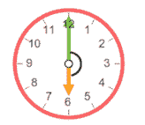
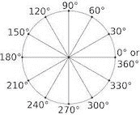
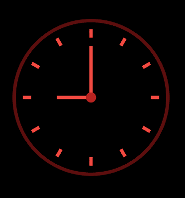
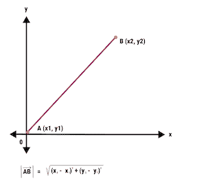
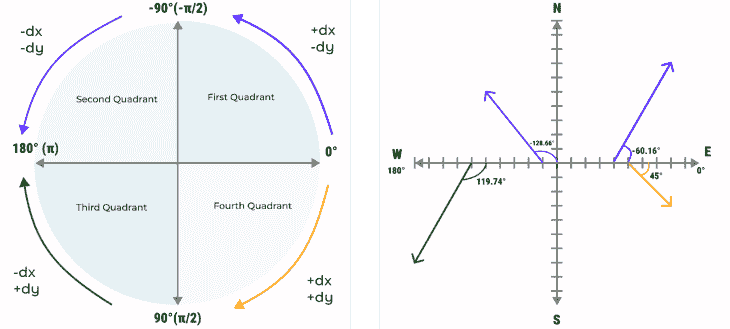
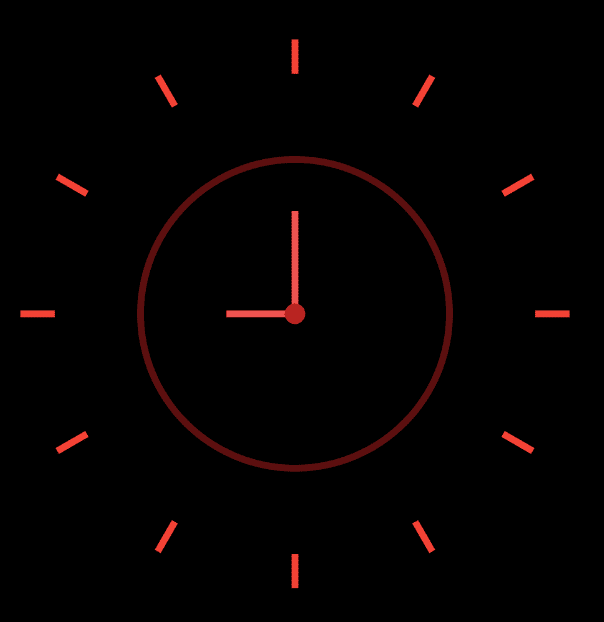
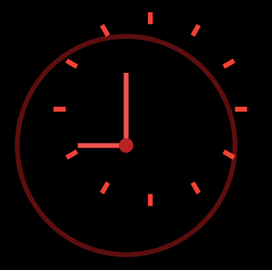
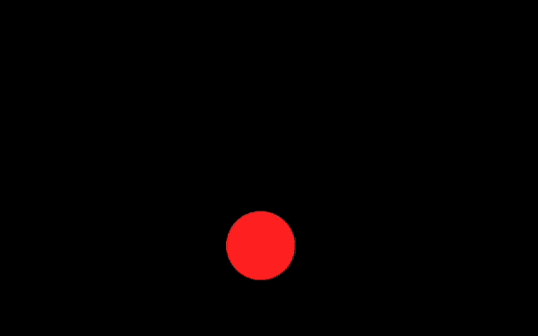

# 了解颤振日志火箭博客中的偏移

> 原文：<https://blog.logrocket.com/understanding-offsets-flutter/>

## 什么是抵消？

在用 Flutter 构建应用程序时，您可能见过或使用过偏移量，但是您有没有考虑过它们到底是什么？

从本质上讲，偏移只是从原点开始的 xy 坐标的表示，但也可以解释为向量。正因为如此，在这篇文章的整个过程中，我将交替使用术语“矢量”和“偏移”。矢量只是一个以给定大小向特定方向运动的量或力。

恭喜，现在你知道什么是抵消，感谢阅读！

我只是在开玩笑；本文的目的不仅仅是定义什么是 Offset，而是揭示 Offset 类中包含的有用的属性和方法。我们还将学习可以在偏移量上执行的操作，同时用一些代码示例来实践。

## 内容

虽然还有其他可以应用偏移量的情况，但是为了理解这些属性是什么以及这些方法如何影响偏移量，我们将使用`CustomPainter`以便我们可以直观地看到这个动作。

## 设置

要设置我们的样本颤振项目，首先运行`flutter create offset_demo`。然后，用下面的代码片段替换`main.dart`文件:

```
void main() {
  runApp(const MyApp());
}

class MyApp extends StatelessWidget {
  const MyApp({Key? key}) : super(key: key);

  // This widget is the root of your application.
  @override
  Widget build(BuildContext context) {
    return const MaterialApp(
    title: 'Offsets Demo',
    home: Home(),
    );
  }
}

class Home extends StatelessWidget {
  const Home({Key? key}) : super(key: key);

  @override
  Widget build(BuildContext context) {
    final size = MediaQuery.of(context).size;

    return CustomPaint(
    size: size,
    painter: PlaygroundPainter(),
    );
  }
}

```

`CustomPaint`小部件用于显示一个`CustomPainter`子类，在这里完成了绘画魔术。

接下来，我们通过子类化`CustomPainter`并实现所需的方法来创建`PlaygroundPainter`:

```
import 'package:flutter/material.dart';

class PlaygroundPainter extends CustomPainter {
  @override
  void paint(Canvas canvas, Size size) {
    /// We shift the coordinates of the canvas
   /// so that the point of origin moves to the center of the screen
    canvas.translate(size.width / 2, size.height / 2);
  }

  /// Since this is a static drawing, we set this to false
  @override
  bool shouldRepaint(PlaygroundPainter oldDelegate) => false;
}

```

## 在颤振中构造偏移

在 Flutter 中，有两种方法来构造偏移量。

第一种方法是使用偏移量构造函数，并像这样传入`x`和`y`值:

```
Offset(double dx, double dy)

```

为了演示如何用偏移量定位一个实体，我们将画一个红色的圆，并将其定位在离原点右侧 20 像素的位置。注意，原点的中心默认是屏幕的左上角，但是为了方便起见，我们通过调用`canvas.translate(width/2, height/2)`移动了画布坐标，使原点位于屏幕的中心。

让我们将下面的代码添加到`play_ground_painter.dart`文件中的`paint()`下，以实现红色圆圈:

```
const circlePosition = Offset(20, 0);

canvas.drawCircle(circlePosition, 20, Paint()..color = Colors.red);

```

在 Flutter 中构造偏移量的第二种方法是使用`fromDirection()`构造函数传入`direction` 和`distance`。我们很快就会谈到这些概念，但现在，让我们看看如何从下面的`direction`和`distance`创建一个偏移:

```
 Offset.fromDirection(double direction, [ double distance = 1.0 ])

```

为了演示这一点，让我们画一个非常简单的时钟，以获得每个五分钟标记的偏移量。我们将利用`Offset.fromDirection`并传入每个标记的角度和大小，如下图所示:





[Source](https://www.smartick.com/blog/math/geometry/relationship-clocks-and-angles/)

要使用`fromDirection` Offset 构造函数，我们需要将角度从度转换成弧度。我们将通过使用公式``来做到这一点。

代码如下:

```
class ClockPainter extends CustomPainter {
  @override
  void paint(Canvas canvas, Size size) {
    /// We shift the coordinates to the center of the screen
    canvas.translate(size.width / 2, size.height / 2);

     // Total angle of a circle is 360
    const totalDegree = 360;

     // Total ticks to display
    const totalTicks = 12;

     /// The angle between each tick
    const unitAngle = totalDegree / totalTicks;

    final clockPaint = Paint()
    ..color = Colors.red[900]!.withOpacity(.5)
    ..style = PaintingStyle.stroke
    ..strokeWidth = 4;

    /// Draws the clock circle frame
    canvas.drawCircle(
    Offset.zero,
    90,
    clockPaint,
    );

    /// Draws the clock hour hand
    canvas.drawLine(
    Offset.zero,
    Offset.fromDirection(math.pi, 40),
    Paint()
        ..color = Colors.red[400]!
        ..strokeWidth = 4,
    );

    /// Draws the clock minute hand
    canvas.drawLine(
    Offset.zero,
    Offset.fromDirection(-math.pi / 2, 60),
    Paint()
        ..color = Colors.red[400]!
        ..strokeWidth = 4,
    );

    /// Draws the center smaller circle
    canvas.drawCircle(
    Offset.zero,
    6,
    clockPaint
        ..style = PaintingStyle.fill
        ..color = Colors.red[900]!,
    );

 for (int i = 0; i <= 11; i++) {
    /// calculates the angle of each tick index
    /// reason for adding 90 degree to the angle is
    /// so that the ticks starts from
    final angle = -90.radians + (i * unitAngle).radians;

    /// Draws the tick for each angle
    canvas.drawLine(
        Offset.fromDirection(angle, 70),
        Offset.fromDirection(angle, 80),
        Paint()
        ..color = Colors.red
        ..strokeWidth = 4,
    );
    }
  }

  @override
  bool shouldRepaint(ClockPainter oldDelegate) => false;
}  

```

该扩展是向现有库和类添加新功能的一种方式:

```
extension on num {
 /// This is an extension we created so we can easily convert a value  /// to a radian value
 double get radians => (this * math.pi) / 180.0;

}

```

当上面的代码运行时，下图是结果。



下面是上面代码中发生的情况。

首先，我们绘制圆形框架(一个半径为 90°的圆)，并通过给它一个零偏移量将其定位在屏幕的中心。我们通过调用`canvas.drawLine()`绘制时针，并传入零偏移的起点，偏移方向为-3.142rad (π)，距离(大小)为 40px 作为终点。

我们通过调用`canvas.drawLine()`绘制时钟分针，传入一个零偏移的起点，一个-1.571rad (π/2)的偏移方向，一个 60px 的距离作为终点。

然后我们画一个半径为 6 的小圆，并把它放在中间。为了绘制五分钟标记，我们使用一个`for`循环从 0 到 11 进行循环。我们得到每个标记的角度，并通过向`canvas.drawLine()`传递一个`start`和`end`偏移量来画线。最后，我们使用`Offset.direction()`构造函数传入角度和距离。

## 探索偏移属性

本节将重点介绍偏移属性。希望你能开始欣赏 Flutter 团队提供的偏移量，因为它们在这些易于使用的属性中隐藏了许多令人兴奋的实现。

### 偏移`dx`

在水平轴上，该属性保存从原点偏移多远的值。

### 偏移`dy`

在垂直轴上，该属性保存从原点偏移多远的值。

### 偏移`distance`

记住，偏移量也可以解释为向量，所以我们可以正确地说，两个偏移量之间的距离就是向量的大小。但这意味着什么呢？

向量的大小是两个坐标之间的距离(初始和结束偏移)。看看下面的图片。



在其他情况下，要获得 A 点和 B 点之间的大小或距离，使用以下公式:``。

这里，`x[1]`和`x[2]`是 x 轴上的起点和终点，`y[1]`和`y[2]`是 y 轴上的起点和终点。

调用`offset.distance`会在内部为您计算并返回结果。请注意，距离是一个标量，这意味着它没有方向，因此，无论偏移的方向如何，距离的值始终为正。

当您需要利用所绘制矢量的距离时，这个属性会派上用场。

### 偏移`distanceSquared`

顾名思义，这就是矢量距离的平方。

### 偏移`direction`

处理极坐标系时，方向是以弧度表示的从-π到π (-3.142rad 到 3.142rad) **的偏移角度。**

请注意，在处理颤振偏移时:

*   在 x 轴上，正值从原点向右移动，负值从原点向左移动
*   在 y 轴上，正值从原点向下移动，负值从原点向上移动

值得注意的是，向量的方向是它与水平面所成的角度，因此，该角度不能超过π弧度或 180 度。

为了直观地理解什么是偏移方向，让我们考虑下图。



第一个图像显示了向量沿象限移动的方向。第二幅图像显示了水平面上的四个不同矢量。假设 x 轴和 y 轴上的每个标记相距 10px。

分别是:紫色矢量的方向为-128.66 (-2.25 rad)，蓝色矢量为-60.16 (-1.052 rad)，绿色矢量为 119.74 (2.09 rad)，橙色为 45 (0.79 rad)。

为了计算偏移的方向(或角度),我们必须记住以下几点:

*   向量方向在-π和π弧度或-180 和 180 的范围内
*   当 dy 为零且 dx 为负时，偏移方向为π (180)
*   当 dx 为零且 dy 为正(向下)时，偏移方向为π/2 (90)
*   当 dx 为零且 dy 为负(向上)时，偏移方向为–π/2(-90)

为了得到偏移的方向，我们使用切线法则:

or 

对于指向右上方向的蓝色向量，等式看起来是这样的:

因此这个向量的方向是

对于指向左上角的紫色矢量，等式为

. However, the angle from right to left is 180°, and because the purple vector is within the upper left quadrant, we subtract the result from the total angle like so: 

因此这个向量的方向是

对于向右下方的橙色向量，等式为

最后，对于指向左下方的绿色向量，我们有

然而，从右到左需要 180 °,因为绿色向量在左下象限，我们然后从总角度中减去结果。因此这个向量的方向是

获取偏移角度所涉及的数学很麻烦，但好消息是您不必担心所涉及的计算。这一部分强调数学的原因是为了让你能理解当你调用`Offset.direction`时发生了什么。这个方法的内部实现是 `double get direction => math.atan2(dy, dx);`。

## 探索偏移方法

在这一节中，我们将探索 Offset 类包含的有用的方法。

### 偏置尺

`scale()`方法接受两个参数，`scaleX`和`scaleY`。它通过将 x 分量乘以`scaleX`并将 y 分量乘以`scaleY`来缩放偏移的 x 分量和 y 分量，并将值作为新的偏移返回。

要了解这一点，请用下面的代码替换在时钟上绘制五分钟标记的代码:

```
/// Draws the tick for each angle  
canvas.drawLine(
        Offset.fromDirection(angle, 70).scale(2, 2),
        Offset.fromDirection(angle, 80).scale(2, 2),
        Paint()
        ..color = Colors.red
        ..strokeWidth = 4,
    );

```

这将导致下图。请注意，这些线的位置是之前位置的两倍，因为我们将 x 分量和 y 分量都缩放了两倍。



### 偏移`translate`

`translate()`方法接受两个参数:`translateX`和`translateY`。它将`translateX`加到偏移量的 x 分量上，将`translateY`加到 y 分量上，并返回新值。将`translate()`应用于偏移只是基于平移值移动 x 或 y 分量。

要查看此方法的运行情况，请用下面的代码替换绘制五分钟时钟标记的代码。我们将 x 分量增加 20px，y 分量增加-30px:

```
/// Draws the tick for each angle
canvas.drawLine(
        Offset.fromDirection(angle, 70).translate(20, -30),
        Offset.fromDirection(angle, 80).translate(20, -30),
        Paint()
        ..color = Colors.red
        ..strokeWidth = 4,
    );

```

结果如图所示。



最终的效果看起来不是很好，但它解释了当你将`translate()`方法应用于偏移时会发生什么。

### 偏移`lerp`

`lerp()`是偏移的静态方法，接受三个参数:`Offset a`、`Offset b`和`double t`。该方法在`Offset a`和`b`之间进行插值，根据`t`的当前值返回一个新的偏移量。值`t`通常从`AnimationController`中检索。

为了看到这一点，我们将通过添加一个名为`animationValue`的构造函数字段来修改我们的`PlaygroundPainter`类。

然后，我们将使用`Offset.lerp(Offset(0, -120)`、`Offset(0, 120)`和`animationValue`将`circlePosition`变量赋给一个偏移量。我们希望圆圈从 120 像素向上移动到 120 像素向下:

```
 class PlaygroundPainter extends CustomPainter {
  PlaygroundPainter({required this.animationValue});

  final double animationValue;

  @override
  void paint(Canvas canvas, Size size) {
    /// We shift the coordinates to the center of the screen
    canvas.translate(size.width / 2, size.height / 2);

    final circlePosition = Offset.lerp(
        const Offset(0, -120), const Offset(0, 120), animationValue)!;

    /// draws a circle of radius 40 and give it the position above
    canvas.drawCircle(circlePosition, 40, Paint()..color = Colors.red);
  }

  /// We expect this to re-paint when there's a change in animation value
  @override
  bool shouldRepaint(PlaygroundPainter oldDelegate) => true;

} 

```

接下来，我们通过将`Home`小部件从无状态改为有状态来设置动画控制器。我们将 `[SingleTickerProviderStateMixer](https://api.flutter.dev/flutter/widgets/SingleTickerProviderStateMixin-mixin.html)`应用于`HomeState`，这样我们就可以使用`AnimationController`。

然后，我们使用 [CurvedAnimation](https://api.flutter.dev/flutter/animation/CurvedAnimation-class.html) 将非线性曲线应用到动画中。

曲线影响数值`t`从 0 到 1 的变化率。在这种情况下，我们将应用一条`Curve.bounceOut`曲线。下面是`Home`小部件的代码片段:

```
class Home extends StatefulWidget {
  const Home({Key? key}) : super(key: key);

  @override
  _HomeState createState() => _HomeState();
}

class _HomeState extends State<Home> with SingleTickerProviderStateMixin {

  late final AnimationController animationController;
  late final Animation animation;

  @override
  void initState() {
    super.initState();
    animationController = AnimationController(
        vsync: this, duration: const Duration(milliseconds: 2500));

    animation =
        CurvedAnimation(parent: animationController, curve: Curves.bounceOut);
    animation.addListener(() {
    setState(() {});
    });

    animationController.repeat();
  }

  @override
  void dispose() {
    animationController.dispose();
    super.dispose();
  }

  @override
  Widget build(BuildContext context) {
    final size = MediaQuery.of(context).size;

    return CustomPaint(
    size: size,
    painter: PlaygroundPainter(animationValue: animation.value),
    );
  }
}

```

如果您按照正确的步骤操作，您应该会看到下面的效果。你可以清楚地看到值`t`如何影响从`Offset a`到`Offset b`的插值。



## 可以对偏移量执行的操作

本节重点介绍可以在偏移上执行的操作。您将会看到，这些操作提供了一种实现某些偏移任务的便捷方式。

### 乘法运算符

要将偏移的 x 分量和 y 分量乘以特定的因子，使用乘法运算符(`*`)。当`scaleX`和`scaleY`的值相同时，这是一个比`scale()`更好的替代方法:

```
/// This will result in Offset(40, 60)
final offset = const Offset(20, 30) * 2;

```

### 除法算符

要将偏移量的 x 分量和 y 分量相除，请使用除法运算符(/):

```
/// This will result in Offset(10, 30)
final offset = const Offset(20, 30) / 2;
```

### 模算子

模运算符由百分号(`%`)表示。该运算符提供两个数相除后的余数。例如:`5 / 2 = 2.5`余数为 1，因此 5 % 2 = 1。

将此模运算符应用于偏移时，它会分配一个新的偏移值，其中 x 分量和 y 分量是原始偏移值的除法余数:

```
/// This will result in Offset(0, 3)
final offset = const Offset(25, 53) % 5;
```

### 加法算子

加法运算符将一个偏移量的 x 分量和 y 分量与另一个偏移量相加:

```
// This will result in Offset(45, 55)
final offset = const Offset(20, 30) + Offset(25, 25);
```

### 减法运算符

要从一个偏移量中减去另一个偏移量的 x 分量和 y 分量，请使用减法运算符:

```
/// This will result in Offset(-5, 5)
final offset = const Offset(20, 30) -Offset(25, 25);

```

### 等式运算符

当两个偏移量的 x 分量和 y 分量的值相同时，称这两个偏移量相等，如下所示:

```
/// true
final isEqual = const Offset(20, 30) == const Offset(20, 30); 

/// false
final isEqual = const Offset(20, 30) == const Offset(20, 36); 

```

### 大于或小于运算符

如果左操作数的 x 分量和 y 分量都大于右操作数的 x 分量和 y 分量，则称左操作数的偏移量大于右操作数的偏移量:

```
/// true
final isGreater = const Offset(20, 30) > const Offset(10, 20);
/// false
final isLesser = const Offset(40, 60) < const Offset(20, 36);
```

### 一元运算符

一元运算符允许您对偏移量求反。您可以通过在偏移量前插入减号(`-`)来应用该运算符，如下所示:

```
/// This will result in Offset(-20, -30)
final offset = -Offset(20, 30); 

/// This will result in Offset(60, -45) 
final offset = -Offset(-60, 45);

```

### 矩形构造函数运算符

`Rect`类构造了一个矩形。就偏移量而言，该操作符帮助您根据偏移量和大小创建一个矩形，下面是演示使用该操作符的代码片段。

```
final offset = const Offset(-30, 50);
final size  = const Size(80, 60);
canvas.drawRect(offset & size, Paint()..color = Colors.red); 

```

## 结论

Offset 是一个简单而强大的类。在这篇文章的过程中，您不仅考虑了什么是偏移量，而且还了解了在 Flutter 中可以使用偏移量的属性、方法和操作。

我们还参与了一些实际任务，直观地观察这些方法或操作如何影响偏移。下次你使用 Offset 时，我相信你不会仅仅把它看作一个存储 x 和 y 分量的类，而是一个装载了有用实体的强大工具。

## 使用 [LogRocket](https://lp.logrocket.com/blg/signup) 消除传统错误报告的干扰

[](https://lp.logrocket.com/blg/signup)

[LogRocket](https://lp.logrocket.com/blg/signup) 是一个数字体验分析解决方案，它可以保护您免受数百个假阳性错误警报的影响，只针对几个真正重要的项目。LogRocket 会告诉您应用程序中实际影响用户的最具影响力的 bug 和 UX 问题。

然后，使用具有深层技术遥测的会话重放来确切地查看用户看到了什么以及是什么导致了问题，就像你在他们身后看一样。

LogRocket 自动聚合客户端错误、JS 异常、前端性能指标和用户交互。然后 LogRocket 使用机器学习来告诉你哪些问题正在影响大多数用户，并提供你需要修复它的上下文。

关注重要的 bug—[今天就试试 LogRocket】。](https://lp.logrocket.com/blg/signup-issue-free)