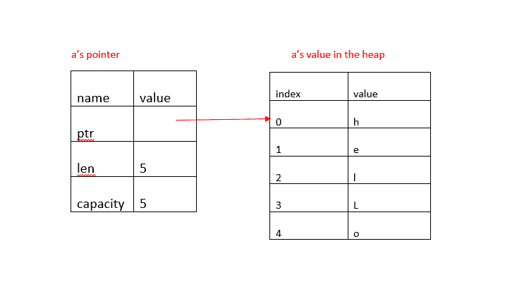

# 理解 Rust - LogRocket 博客中的所有权

> 原文：<https://blog.logrocket.com/understanding-ownership-in-rust/>

在 Stack Overflow 进行的开发者调查中，Rust 已经连续第五年成为最受欢迎的编程语言。开发者爱 Rust 有各种各样的原因，其中之一就是它的内存安全保障。

Rust 通过一个叫做所有权的特性来保证内存安全。所有权的工作方式不同于其他语言中的垃圾收集器，因为它只是由一组规则组成，编译器需要在编译时检查这些规则。如果不遵循所有权规则，编译器将不会编译。[借用检查器](https://blog.logrocket.com/introducing-the-rust-borrow-checker/)是一个编译器组件，确保你的代码遵循所有权。

对于没有的 垃圾收集器，需要显式分配和释放内存空间。当涉及到大型 代码库 时，这很快就会变得乏味且具有挑战性。

谢天谢地， 内存 管理 是由 Rust 编译器处理使用 所有权 型号 。Rust 编译器会自动插入一个 drop 语句来释放内存。它使用所有权模型来决定在哪里释放内存；当所有者超出范围时，内存被释放。

```
fn main(){

{

let x =5;

// x is dropped here since it goes out of the scope

}

}
```

## 什么是栈和堆？

堆栈和堆都是可供代码在运行时使用的内存存储段。对于大多数编程语言，开发人员通常不关心堆栈和堆上的内存分配情况。然而，因为 Rust 是一种[系统编程语言](https://en.wikipedia.org/wiki/System_programming_language)，值如何存储(在堆栈或堆中)对语言的行为至关重要。

这里有一个关于内存如何存储在堆栈中的例子:让我们想象桌子上有一摞书。这些书的排列方式是最后一本书放在书架的上面，第一本书放在下面。理想情况下，我们不会想把最下面的书从书架下拿出来，从上面拿一本书来读会更容易。

这正是内存在堆栈中的存储方式；它使用后进先出的方法。这里，它按照获取值的顺序存储值，但是按照相反的顺序删除值。同样重要的是要注意，所有存储在堆栈中的数据在编译时都有一个已知的大小。

堆中的内存分配不同于堆栈中的内存分配。想到要去给朋友买一件衬衫。你不知道你朋友穿的衬衫的确切尺寸，但经常看到他，你认为他可能是中号或大号。虽然你不能完全确定，但你还是会买大号的，因为即使他是中号的，他的身体也能穿得进去。这就是堆中内存分配的工作方式。当您有一个值(您的朋友)而您不知道它需要的确切内存量(t 恤衫的大小)时，您为该值请求一个特定的空间量。分配器在堆中找到一个足够大的位置，并将该位置标记为正在使用。这是堆栈和堆之间的一个重要区别:我们不需要知道存储在堆中的值的确切大小。

与堆栈相比，堆中没有组织。将数据推入栈中和从栈中取出很容易，因为一切都是有组织的，并遵循特定的顺序。系统知道，当你把一个值压入栈中时，它会留在栈顶，当你需要从栈中取出一个值时，你是在检索最后存储的值。

然而，堆中的情况并非如此。在堆上分配包括搜索一个足够大的空闲空间，以匹配您所请求的内存量，并返回一个地址到将存储在堆栈中的位置。从堆中检索一个值需要您跟随一个指针到该值在堆中存储的位置。

在堆上分配看起来像图书索引，其中存储在堆中的值的指针存储在堆栈中。然而，分配器还需要搜索一个足够大的空间来容纳这个值。

函数的局部变量存储在函数栈中，而数据类型，如`String`、`Vector`、`Box`等。存储在堆上。理解 Rust 的内存管理以确保应用程序按预期运行是很重要的。

## 所有权规则

所有权有三个基本规则来预测内存在堆栈和堆中的存储方式:

1.  每个 Rust 值都有一个称为其“所有者”的变量:

    ```
    let x = 5; // x is the owner of the value "5"
    ```

2.  每个值一次只能有一个所有者
3.  当所有者超出范围时，该值将被丢弃:

    ```
    fn main() { {// scope begins let s = String::from("hello"); // s comes into scope }// the value of s is dropped at this point, it is out of scope }
    ```

请随意使用这个代码示例。

## 所有权是如何运作的

在我们的介绍中，我们建立了一个事实，即所有权不像垃圾收集器系统，事实上，Rust 不处理垃圾收集器系统。大多数编程语言要么使用垃圾收集器，要么要求开发人员自己分配和释放内存。

在所有权中，我们为自己请求内存，当所有者超出范围时，值将被丢弃，内存被释放。这正是第三个所有权规则所解释的。为了更好地理解这是如何工作的，让我们看一个[例子](https://play.rust-lang.org/?version=stable&mode=debug&edition=2018&gist=6fb7cc3ad702abef8b0c8a215f110653):

```
<// memory allocation in the stack
fn main() {
{ // a is not valid here
let a = 5; // a is valid here
// do stuff with a
}// println!("{}", a)a is no longer valid at this point, it is out of scope
}
```

这个例子非常简单；这就是堆栈中内存分配的工作方式。内存块(`a`)被分配到堆栈上，因为我们知道它的值`5`将占用的确切空间。然而，情况并非总是如此。有时，你需要为一个在编译时不知道大小的可增长值分配内存空间。

对于这种情况，内存是在堆上分配的，您首先必须请求内存，如下面的[示例](https://play.rust-lang.org/?version=stable&mode=debug&edition=2018&gist=beb44369d0dcab52b4c0c6c18edee25a)所示:

```
fn main() {
    {
    let mut s = String::from("hello"); // s is valid from this point forward

    s.push_str(", world!"); // push_str() appends a literal to a String

    println!("{}", s); // This will print `hello, world!` 
    }// s is no longer valid here
}

```

我们可以向`s`追加任意多的字符串，因为它是可变的，这使得很难知道编译时所需的确切大小。因此，我们在程序中需要一个字符串大小的内存空间:

```
let mut s = String::from("hello") // requesting for space in the heap, the size of a String.

```

当变量超出范围时，Rust 所有权特性允许返回(释放)内存。

## 克隆和复制

在这一节中，我们将从`clone`和`copy`特性开始，看看所有权如何影响 Rust 中的某些特性。

对于像`integers`这样大小已知的值，更容易将该值复制到另一个值中。以[为例](https://play.rust-lang.org/?version=stable&mode=debug&edition=2018&gist=d7d41739cc7bf30609d345695ba88ce7):

```
fn main() {
    let a = "5";
    let b = a; // copy the value a into b
    println!("{}", a) // 5
    println!("{}", b) // 5
}

```

因为`a`存储在堆栈中，所以复制它的值来为`b`制作另一个副本更容易。对于存储在堆中的[值，情况并非如此:](https://play.rust-lang.org/?version=stable&mode=debug&edition=2018&gist=d7d41739cc7bf30609d345695ba88ce7)

```
fn main() {
    let a = String::from("hello");
    let b = a; // copy the value a into b
    println!("{}", a) // This will throw an error because a has been moved or ownership has been transferred
    println!("{}", b) // hello
}

```

当您运行该命令时，您会得到一个错误`error[[E0382]](https://doc.rust-lang.org/stable/error-index.html#E0382): borrow of moved value: "a"`。前面，我解释了堆中的值如何像索引过程一样存储，其中指针存储在堆栈中。在 Rust 术语中`move`的意思是内存的所有权转移给了另一个所有者。



当您复制存储在堆上的值时，系统自动只复制指针，而忽略堆数据。由于数据可以有一个所有者，字符串的所有权从`a`转移到`b`。


这使得 Rust 渲染`a`不再有效，所以`double free error`不会发生。当您试图释放已被释放的内存时，会出现此错误。由于`a`和`b`正在用它们的指针访问堆中的一个内存，很可能当`a`超出范围并清空内存时，`b`也会想要清空同一个内存，因此`double free error`。

要访问`a`和`b`，你必须使用一个叫做 [`clone`方法](https://play.rust-lang.org/?version=stable&mode=debug&edition=2018&gist=5711d583e1612cb2dcc20626d8a30fd7)的特性:

```
fn main() {
    let a = String::from("hello");
    let b = a.clone(); // creates a copy of data on the heap and return pointer to it

    println!("a = {}, b = {}", a, b);// a=hello, b=hello
}

```

## 所有权和职能

向函数传递值遵循相同的所有权规则，这意味着它们一次只能有一个所有者，一旦超出范围就释放内存。让我们来看看[这个例子](https://carols10cents.github.io/book/ch04-01-what-is-ownership.html#return-values-and-scope):

```
fn main() {
    let s1 = givesOwnership();         // givesOwnership moves its return
                                        // value into s1

    let s2 = String::from("hello");     // s2 comes into scope

    let s3 = takesAndGivesBack(s2);  // s2 is moved into
                                        // takesAndGivesBack, which also
                                        // moves its return value into s3
} // Here, s3 goes out of scope and is dropped. s2 goes out of scope but was
  // moved, so nothing happens. s1 goes out of scope and is dropped.

fn givesOwnership() -> String {             // givesOwnership will move its
                                             // return value into the function
                                             // that calls it

    let someString = String::from("hello"); // someString comes into scope

    someString                              // someString is returned and
                                             // moves out to the calling
                                             // function
}

// takesAndGivesBack will take a String and return one
fn takesAndGivesBack(aString: String) -> String { // aString comes into
                                                      // scope

    aString  // aString is returned and moves out to the calling function
}

```

第二个所有权规则(每个值一次只能有一个所有者)使得编写函数变得过于冗长，因为无论何时想要使用函数，都需要返回它们的所有权，如上例所示。

每当传递给一个函数时，复制数据是非常浪费内存的。 最好的方法是使用[锈引用](https://doc.rust-lang.org/book/ch04-02-references-and-borrowing.html)特征 并借用数据。

## 参考和借用

通过引用，您可以使用引用对象作为参数的函数，而不是获取值的所有权。使用&符号(`&`)你可以引用一个值，而不需要获得它的所有权。我们的[示例函数](https://play.rust-lang.org/?version=stable&mode=debug&edition=2018&gist=80aeed49b19fe0970a58e0e13b4021c6)现在可以这样写:

```
fn main() {
    let s1 = &givesOwnership();         // moves its return value into s1 that borrows the value

    let s2 = String::from("hello");     // s2 comes into scope

    let s3 = takesAndGivesBack(s2);  // s2 is moved into s3
    println!("{}", s1);
    println!("{}", s3);         // takesAndGivesBack, which moves its return value into s3

} // Here, s3 goes out of scope and is dropped. s2 goes out of scope but was
  // moved, so nothing happens. s1 goes out of scope and is dropped.

fn givesOwnership() -> String {          // givesOwnership will transfer ownership of its
                                            // return value to the caller of the function

    let someString = String::from("hello"); // someString comes into scope

    someString                              // someString is returned and
                                            // moves out to the calling
                                            // function
}

// takesAndGivesBack will take a String and return one
fn takesAndGivesBack(aString: String) -> String { // aString comes
                                                    // scope

    aString  // aString is returned and moves out to the calling function
}

```

如何使用引用的另一个好例子是在 [Rust 文档](https://doc.rust-lang.org/book/ch04-02-references-and-borrowing.html)中显示的例子:

```
fn main() {
    let s1 = String::from("hello");

    let len = calculate_length(&s1);

    println!("The length of '{}' is {}.", s1, len);
}

fn calculate_length(s: &String) -> usize {
    s.len()
}

```

## 薄片

您可以引用序列中相邻的元素，而不是引用整个集合。为此，您可以使用 Rust 中的`slice type`。但是，这个特性不像引用和借用那样具有所有权。

让我们看看下面的[例子](https://play.rust-lang.org/?version=stable&mode=debug&edition=2018&gist=bf8d1ad5054ce9ca1af34aa983831aea)。在这个例子中，我们将使用`slice type`来引用连续序列中的值的元素:

```
fn main() {
    let s = String::from("Nigerian");

 // &str type
    let a = &s[0..4]; // doesn't transfer ownership, but references/borrow the first four letters.
    let b = &s[4..8]; // doesn't transfer ownership, but references/borrow the last four letters.
    println!("{}", a); // prints Nige
    println!("{}", b); // prints rian

    let v=vec![1,2,3,4,5,6,7,8];

    // &[T] type
    let a = &v[0..4]; // doesn't transfer ownership, but references/borrow the first four element.
    let b = &v[4..8]; // doesn't transfer ownership, but references/borrow the last four element.
    println!("{:?}", a); // prints [1, 2, 3, 4]
    println!("{:?}", b); // prints [5, 6, 7, 8]

}

```

## 结论

所有权是 Rust 的一个重要特征。Rust 开发人员越了解所有权，他或她就越容易编写可伸缩的代码。许多开发人员喜欢 Rust 的原因是因为这个特性，一旦你掌握了它，你就可以编写高效的代码并预测结果，而不会让 Rust 欺骗你！

在这篇文章中，我们已经看到了所有权的基础，它的规则，以及如何在我们的程序中应用它们。我们还研究了 Rust 的一些没有所有权的特性，以及如何完美地使用它们。要获得关于 Rust 所有权特性的更多提示，请查看他们的[文档](https://doc.rust-lang.org/book/ch04-00-understanding-ownership.html)。

## [log rocket](https://lp.logrocket.com/blg/rust-signup):Rust 应用的 web 前端的全面可见性

调试 Rust 应用程序可能很困难，尤其是当用户遇到难以重现的问题时。如果您对监控和跟踪 Rust 应用程序的性能、自动显示错误、跟踪缓慢的网络请求和加载时间感兴趣，

[try LogRocket](https://lp.logrocket.com/blg/rust-signup)

.

[](https://lp.logrocket.com/blg/rust-signup)

LogRocket 就像是网络和移动应用程序的 DVR，记录你的 Rust 应用程序上发生的一切。您可以汇总并报告问题发生时应用程序的状态，而不是猜测问题发生的原因。LogRocket 还可以监控应用的性能，报告客户端 CPU 负载、客户端内存使用等指标。

现代化调试 Rust 应用的方式— [开始免费监控](https://lp.logrocket.com/blg/rust-signup)。