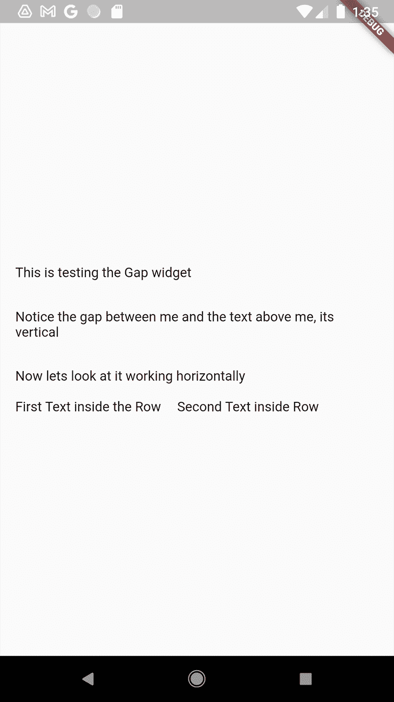

# 了解 Flutter 中的 RenderObjects

> 原文：<https://blog.logrocket.com/understanding-renderobjects-flutter/>

## 介绍

你可能在某个时候听过这句话，“一切都是飘动的小部件”。事实上，顶层显示的所有内容——您在屏幕上看到的所有内容——都是小部件。

然而，你有没有想过幕后发生了什么？这些小工具是如何形成我们在屏幕上看到的各种形状、文本和图像的？

这些问题至关重要，它们的答案将有助于你成为更好的 Flutter 开发者。正确理解将 Flutter 小部件转换成我们看到并与之交互的 UI 屏幕的步骤，将进一步帮助我们正确使用可用资源来满足特殊需求，如创建自定义布局、超级自定义绘画等。

这篇文章旨在带你一步一步地了解隐藏在 Flutter 表面(部件)下的秘密。

## 在 Flutter 中渲染是如何工作的？

在我们开始介绍 RenderObjects 及其用途、功能和重要性之前，让我们快速了解一下在 Flutter 中渲染是如何发生的。

Flutter 使用小部件，这些小部件将配置信息保存在传递给小部件的字段或参数中。这里的小部件充当各种“容器”:它保存这些配置参数，但不使用它们。小部件实例化并膨胀成一个元素。

这个元素被插入到元素树中，表示小部件，元素树中的每个元素都有一个 RenderObject 附加到它上面。这些 RenderObjects 负责控制这些配置参数，如大小、布局和屏幕上小部件的绘制，形成我们看到的 UI。


Source: [Academind](https://academind.com/)

查看从小部件到元素再到 RenderObjects 的流程，您可能会注意到主要工作发生在 RenderObjects 中——像调整大小、将小部件绘制到屏幕上以及操纵各种参数都发生在 RenderObjects 内部。

理解 RenderObjects 肯定会帮助你构建高质量的移动应用程序。那么这些 RenderObjects 到底是什么呢？

## 什么是 RenderObjects？

RenderObjects 是那些负责控制尺寸、布局和逻辑的特殊“对象”,用于将小部件绘制到屏幕上并形成应用程序的 UI。你可以说实际的渲染发生在 [RenderObjects](https://api.flutter.dev/flutter/rendering/RenderObject-class.html) 中。

但是它们很少被使用，因为开发人员十有八九不需要使用它们。小部件足以满足大多数开发人员的需求。

然而，在一些特殊的情况下，超级复杂的设计需要精确的实现。使用小部件或者通过添加更多的香料从头开始构建某个特定的小部件来使其更容易使用，这可能是不完全可能的。在这种情况下，RenderObjects 将是合适的工具。

## 了解运行中的 RenderObjects:不透明度小部件作为案例研究

让我们来看一下[不透明度小部件](https://api.flutter.dev/flutter/widgets/Opacity-class.html)，以便更好地理解从小部件到元素再到 RenderObject 的链接。不透明度小部件调整其子部件的透明度。

关于小部件将扩展的 RenderObject 类型，需要注意一些关键事项:

由于我们正在研究的不透明度小部件接受其透明度正在调整的子部件，因此它必须扩展 SingleChildRenderObjectWidget。

反过来，SingleChildRenderObjectWidget 扩展了 RenderObjectWidget。最后，RenderObjectWidget 扩展了 Widget 类。

```
//Opacity extends SingleChildRenderObjectWidget
class Opacity extends SingleChildRenderObjectWidget {

// SingleChildRenderObjectWidget extends RenderObjectWidget
abstract class SingleChildRenderObjectWidget extends RenderObjectWidget {

// RenderObjectWidget extends Widget
abstract class RenderObjectWidget extends Widget {

```

那么，我们为什么要看谁扩展了什么呢？SingleChildRenderObjectWidget 类有一个负责创建元素的方法。回想一下，特定小部件的元素是它的实例化，并指向它在元素树上的位置。它附加在小部件上。这个元素是 SingleChildRenderObjectElement，是树中不透明度小部件的实例。

```
abstract class SingleChildRenderObjectWidget extends RenderObjectWidget {
 const SingleChildRenderObjectWidget({Key? key, this.child}) : super(key: key);

 final Widget? child;

 @override
 SingleChildRenderObjectElement createElement() =>
   SingleChildRenderObjectElement(this);
}

```

回到不透明度小部件，它公开了为这个特定小部件创建和更新 RenderObject 的两个基本方法。

```
 @override
 RenderOpacity createRenderObject(BuildContext context) {
  return RenderOpacity(
   opacity: opacity,
   alwaysIncludeSemantics: alwaysIncludeSemantics,
  );
 }
 @override
 void updateRenderObject(BuildContext context, RenderOpacity renderObject) {
  renderObject
   ..opacity = opacity
   ..alwaysIncludeSemantics = alwaysIncludeSemantics;
 }

```

`createRenderObject`方法返回`RenderOpacity`类。`RenderOpacity`类接受配置参数，即 0.0 到 1.0 之间的不透明度。

RenderOpacity 扩展了 [RenderProxyBox 类](https://api.flutter.dev/flutter/rendering/RenderProxyBox-class.html)，它提供了在子部件上执行不同操作的方法——其中最重要的是`paint()`方法。

```
 @override
 void paint(PaintingContext context, Offset offset) {
  if (child != null) {
   if (_alpha == 0) {
    layer = null;
    return;
   }
   if (_alpha == 255) {
    layer = null;
    context.paintChild(child!, offset);
    return;
   }
   assert(needsCompositing);
   layer = context.pushOpacity(offset, _alpha, super.paint, oldLayer: layer as OpacityLayer?);
  }
 }

```

paint 方法执行必要的检查和断言，然后使用`context.pushOpacity`绘制子对象。这是主要操作发生的地方，因此即使我们有不透明度小部件及其相应的元素，绘制也发生在 RenderObjects 中。它们在颤动表面下发生的事情的过程中是极其重要的。

现在我们已经了解了 RenderObjects，让我们看看如何使用自定义 RenderObjects 创建小部件来满足我们的需求。

* * *

### 更多来自 LogRocket 的精彩文章:

* * *

## 如何创建自己的 RenderObject

本节将介绍创建自定义小部件的逐步过程——我们将创建一个 Gap 小部件——以及它的 RenderObject，它将负责在屏幕上绘制布局。

Gap 小部件是在树中的小部件之间创建空间或间隙的小部件。与 [SizedBox 类](https://api.flutter.dev/flutter/widgets/SizedBox-class.html)不同，Gap 不需要不断设置大小，而是推断应该是什么大小。它通过检查其父对象的布局，然后基于该布局创建间隙来实现这一点。

Gap 小部件只接受一个属性`mainAxisExtent`，即小部件之间需要的空间量。

我们需要做的第一件事是创建 RenderObject，它将执行实际的布局，`_RenderGap`。它扩展了`RenderBox`，后者扩展了 RenderObject。(另一种是`RenderSliver`，当我们需要滚动内容时使用。)

```
abstract class RenderBox extends RenderObject {  

```

`_RenderGap`接受传递的值，并将其设置为`mainAxisExtent`参数；它还调用了`markNeedsLayout()`方法，该方法告诉 Flutter 一个特定的值已经改变，Flutter 需要再次运行`performLayout()`方法。

```
class _RenderGap extends RenderBox {
_RenderGap({
 double? mainAxisExtent,
 }) : _mainAxisExtent = mainAxisExtent!;
 double get mainAxisExtent => _mainAxisExtent;
 double _mainAxisExtent;
 set mainAxisExtent(double value) {
  if (_mainAxisExtent != value) {
   _mainAxisExtent = value;
   markNeedsLayout();
  }
 }
 @override
 void performLayout() {
  final AbstractNode flex = parent!;
  if (flex is RenderFlex) {
   if (flex.direction == Axis.horizontal) {
    size = constraints.constrain(Size(mainAxisExtent, 0));
   } else {
    size = constraints.constrain(Size(0, mainAxisExtent));
   }
  } else {
   throw FlutterError(
    'Gap widget is not inside a Flex Parent',
   );
  }
 }
}

```

`performLayout`方法做了两件重要的事情:

1.  检查父项的布局方向
2.  基于这些结果，它通过在垂直或水平方向调用约束来设置 Gap 小部件的大小

然后我们可以继续创建 Gap 小部件，它将利用这个 RenderObject。

```
class Gap extends LeafRenderObjectWidget {
 const Gap(
  this.mainAxisExtent, {
  Key? key,
 }) : assert(mainAxisExtent >= 0 && mainAxisExtent < double.infinity),
    super(key: key);
 final double mainAxisExtent;
}

```

回想一下，我们之前提到过应该根据孩子的数量扩展哪些小部件；因为 Gap 小部件不接受任何子部件，所以它扩展了 LeafRenderObjectWidget，接受`mainAxisExtent value`并对其执行两项检查:

1.  检查它是否大于零——我们不希望应用程序中出现负间距，这种检查排除了这种可能性。如果我们有一个小于零的值，Flutter 会抛出一个异常
2.  检查该值是否小于`double.infinity` —我们不想要一个永远存在的间隙空间

Gap 小部件还公开了两个负责创建和更新 RenderObject 的方法(对我们来说是`_RenderGap`):

*   `createRenderObject`方法返回 RenderObject，即`_RenderGap`，并传递我们想要的`mainAxisExtent`值
*   `updateRenderObject`方法接受`_RenderGap`并更新`mainAxisExtent`的值

```
@override
RenderObject createRenderObject(BuildContext context) {
return _RenderGap(mainAxisExtent: mainAxisExtent);
}
@override
void updateRenderObject(BuildContext context, _RenderGap renderObject) {
renderObject.mainAxisExtent = mainAxisExtent;
}

```

我们已经成功设置了 Gap 小工具！现在，让我们构建一个简单的 UI 来在实践中展示它。

## 在实践中使用我们的 Gap 小工具

Gap 小部件使用我们指定的尺寸向我们的 UI 添加间距。例如，如果我们当前在一个列小部件中，Gap 小部件将推断其父部件(列小部件)具有垂直方向，因此，在绘制期间，它在垂直方向上布局，这意味着它创建了一个垂直空间。如果父部件有一个水平方向，它在水平方向布局。

让我们构建一个简单的屏幕来展示它的操作。我们的屏幕将有行和列小部件，我们将在每个小部件中有一个 Gap 小部件，这样我们可以看到它如何响应垂直和水平布局。

```
import 'package:flutter/material.dart';
class HomePage extends StatelessWidget {
 /// Creates a [HomePage].
 const HomePage({
  Key? key,
 }) : super(key: key);
 @override
 Widget build(BuildContext context) {
  return Scaffold(
   body: SafeArea(
    child: Padding(
     padding: const EdgeInsets.all(16.0),
     child: Column(
      crossAxisAlignment: CrossAxisAlignment.start,
      mainAxisAlignment: MainAxisAlignment.center,
      mainAxisSize: MainAxisSize.max,
      children: <Widget>[
       const Text('This is testing the Gap widget'),
       const Gap(30),
       const Text(
         'Notice the gap between me and the text above me, its vertical'),
       const Gap(30),
       const Text('Now lets look at it working horizontally'),
       const Gap(16),
       Row(
        children: const [
         Text('First Text inside the Row'),
         Gap(16),
         Text(
          'Second Text inside Row',
          maxLines: 3,
         ),
        ],
       ),
      ],
     ),
    ),
   ),
  );
 }
}

```

我们传入我们想要的间距值，而不指定它是水平还是垂直间距；gap 小部件应该检查父小部件的方向，并相应地将 Gap 空间呈现为水平或垂直。

保存并运行您的应用程序。你应该看到差距以及它对应用程序布局的影响。



在我的 GitHub 上查看完整的代码。

如果你不想自己写一个，你也可以下载一个提供 Gap widget 的[包。然而，从头开始构建一个可以让你在结构上有更好的灵活性，因为你可以调整它来适应你想要的。它还可以帮助您更好地理解整个过程，以及它是如何组合在一起形成小部件的。](https://pub.dev/packages/gap)

## 结论

唷，我们成功了！我们成功地创建了 RenderObject，并使用它构建了一个小部件来满足我们的需求(嗯，这让生活变得更容易了——你会同意的)。希望你已经成功地学习了 Flutter 中的 RenderObject，它的用途是什么，以及它们如何帮助构建小部件，为我们的应用程序提供我们需要的特殊功能。

最重要的是，你已经了解了在 widgets 的世界里，在 Flutter 应用程序的表面下发生了什么。本文为您提供了成为世界级开发人员所需的又一个工具。好好利用它，你会看到它的影响。祝你愉快。

## 使用 [LogRocket](https://lp.logrocket.com/blg/signup) 消除传统错误报告的干扰

[](https://lp.logrocket.com/blg/signup)

[LogRocket](https://lp.logrocket.com/blg/signup) 是一个数字体验分析解决方案，它可以保护您免受数百个假阳性错误警报的影响，只针对几个真正重要的项目。LogRocket 会告诉您应用程序中实际影响用户的最具影响力的 bug 和 UX 问题。

然后，使用具有深层技术遥测的会话重放来确切地查看用户看到了什么以及是什么导致了问题，就像你在他们身后看一样。

LogRocket 自动聚合客户端错误、JS 异常、前端性能指标和用户交互。然后 LogRocket 使用机器学习来告诉你哪些问题正在影响大多数用户，并提供你需要修复它的上下文。

关注重要的 bug—[今天就试试 LogRocket】。](https://lp.logrocket.com/blg/signup-issue-free)