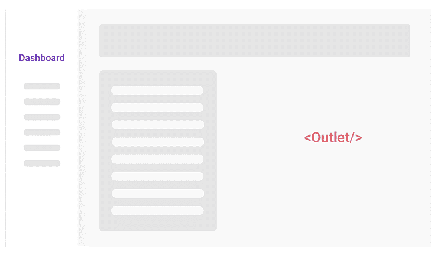
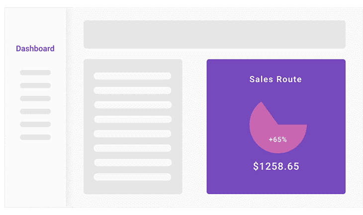
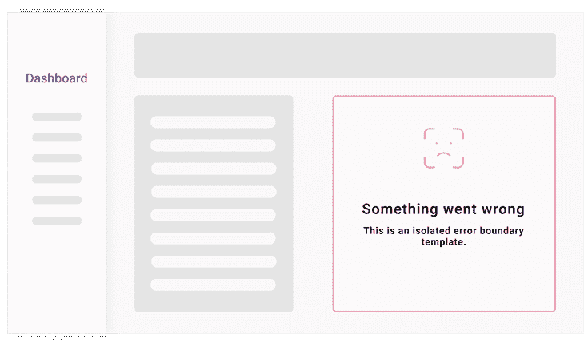

# 了解 Remix - LogRocket 博客中的路线和路线嵌套

> 原文：<https://blog.logrocket.com/understanding-routes-route-nesting-remix/>

remix——用于构建服务器端渲染应用程序的全栈、基于 React 的框架——最近一直在兴风作浪，特别是自从它开源以来。作为一个新成员，Remix 推出了一些很酷的内置功能，旨在构建更好的网站，提供快速、灵活和有弹性的用户体验，同时通过将 web 基础置于其主干来提供出色的开发人员体验。

Remix 的内置特性之一是其独特的路由系统。和所有新事物一样，它的嵌套路由概念一开始可能很难理解，有些令人困惑——尤其是对新开发人员而言。在本帖中，我们将着眼于 Remix 独特的路由系统，以便更彻底地理解它和它的嵌套路由概念。

## 重新混合路由系统基础和文件夹结构

当构建具有多个页面路由的传统 React 应用程序时，您可能习惯于使用 React Router 之类的工具来为您的应用程序手动设置这些路由。

然而，Remix 使用基于文件的路由系统。

换句话说，一个路由会自动与在指定的`routes`目录中创建的任何文件相关联。这个指定的路由目录位于您的应用程序的根`App`文件夹中。

```
📦app
┣ 📂routes
┃ ┣ 📂blog
┃ ┃ ┗ 📜index.jsx
┃ ┗ 📜index.jsx
┗ 📜root.jsx
```

此外，Remix 还支持基于文件夹结构的索引文件路由，即文件将自动按照它们出现在`routes`目录中的方式路由。

*   `routes/index.js` → `/`
*   `routes/blog.js` → `/blog`
*   `routes/blog/index.js` → `/blog`

但是当用户访问任何相关的 URL 时，仅仅定义你的路由并不会触发 Remix 加载这些路由。相反，Remix 使用在 app 目录中找到的`root.jsx`文件作为渲染每条路线的默认基础条目文件；您可以将`root.jsx`文件视为您的应用程序的全局容器，Remix 随后使用它来加载或呈现相应的路线。

然而，`root.jsx`文件中需要一个`outlet`组件，以便 Remix 能够计算出加载什么路径。

## `outlet`组件及其工作原理

`outlet`组件是 Remix 中嵌套路由的关键。它使组件能够在其中嵌套和呈现匹配的子路由，即，它用于告诉父路由或组件将嵌套的子路由放在哪里。

让我们看看这在实践中是如何工作的。我们将首先在我们的`root.jsx`文件中导入并放置`outlet`组件:

```
import {Outlet} from "remix";

export default function App() {
  return (
    <html>
      <head>{/* title, meta info, etc. */}</head>
      <body>
        <h2>Global App Container</h2>
        <Outlet />
      </body>
    </html>
  );
}
```

既然我们已经将`outlet`组件放在这个组件中，它将负责根据访问的 URL 计算出在这个组件中加载什么路由。如果我们访问了任何匹配某个路由的 URL，这个`outlet`组件将会找出并加载相应的路由。

让我们考虑下面的示例路线来看看这一点:

*   `routes/index.js` → `/`
*   `routes/blog.js` → `/blog`
*   `routes/blog/index.js` → `/blog`

我们将返回一个简单的“你好，世界！”从`routes/index.jsx`文件中提取文本，并尝试访问它的路线，这是我们的应用程序的主页(`/`):

```
export default function Index() {
  return <h1>Hello World</h1>;
}
```

输出将是:


正如预期的那样，我们的全局`root.jsx`文件被呈现到 DOM 中，并且通过使用`outlet`组件，相应的被访问的路径被安装(嵌套)在其中。

对于任何其他被访问的路由也会发生同样的情况:`root.jsx`文件充当我们的路由的基本容器，而`outlet`组件根据被访问的 URL 计算出应该加载什么路由。

## 嵌套路由在 Remix 中的工作原理

Remix 最强大的内置特性之一是它的[嵌套路由机制](https://remix.run/docs/en/v1/guides/routing#what-are-nested-routes)；您可以使用`outlet`组件构建一个嵌套路线的层次结构，形成一个嵌套布局。在上面的例子中，当我们在 `root.jsx`组件中嵌套了`index.js`文件时，我们使用了一点嵌套路由，但这只是触及了其功能的表面。

想象一下，我们正在构建某种销售仪表板，并且在我们的 routes 目录中创建了一个`dashboard.jsx`文件。

```
📦routes
 ┣ 📜dashboard.jsx
 ┗ 📜index.jsx
```

默认情况下，如果我们访问了`/dashboard`路线，Remix 会渲染这个文件。现在，假设我们创建了一个与仪表板文件同名的新目录，在这个新的仪表板目录中，我们创建了另一个名为`sales.jsx`的新文件。

```
📦routes
 ┣ 📂dashboard
 ┃ ┗ 📜sales.jsx
 ┣ 📜dashboard.jsx
 ┗ 📜index.jsx
```

Remix 会自动将这个新的`/dashboard`文件夹路径关联到现有的`dashboard.jsx`文件路径，并尝试在`dashboard.jsx`布局中嵌套放置在这个`/dashboard`文件夹中的每个路径。

为此，您必须将`<Outlet/>`组件放在您希望 Remix 在`dashboard.jsx`布局中放置嵌套子路由的位置。

让我们通过使用`dashboard.jsx`文件返回一个简单的仪表板模板来看看这一点:

```
import { Outlet } from "remix";

export default function dashboard() {
  return (
    <div>
      <h1>Dashboard</h1>
      <Outlet />
    </div>
  );
}
```

注意，我们把`outlet`组件放在了我们想要嵌套的地方。

现在，让我们在仪表板目录中的`sales.jsx`文件中创建一个简单的模板。

```
export default function Sales() {
  return (
    <div>
      <h3>Nested Sales route</h3>
    </div>
  );
}
```

现在，如果我们试图只访问 `/dashboard` URL，Remix 将呈现`routes/dashboard.jsx`文件。


如果我们试图访问`/dashboard/sales`路线，Remix 会将这个销售路线作为子路线嵌套在`dashboard.jsx`布局中(就像一个嵌套组件)。这就创建了父仪表板和嵌套销售路线的嵌套布局。


还在迷茫？让我们用一个实际仪表板的例子来重申一下我们刚才所做的事情。

如果我们只访问了`/dashboard` URL，我们会得到没有嵌套路由的初始`dashboard.jsx`布局:


但是一旦我们点击了`/dashboard/sales`路线，`outlet`组件会自动在仪表板布局中呈现嵌套的`/dashboard/sales.jsx`路线，创建如下所示的嵌套布局:


## 创建没有嵌套布局的嵌套布线

能够通过`outlet`组件创建嵌套布局是非常棒的，但是我们可能并不总是想要这样做。有时，我们可能只需要创建一个嵌套布线，而不需要将其嵌套为布局层次结构，也就是说，嵌套布线应呈现为独立布线。

再看看我们之前的例子，假设我们希望`/routes/dashboard/sales.jsx`路由是一个独立的路由，在`/dashboard/sales`简单地呈现为一个独立的页面路由。为此，我们并没有在`/dashboard`目录下创建`sales.jsx` 文件，而是简单地在`routes`目录下创建一个独立的文件，但是使用了`.`命名约定。

```
📦routes
 ┣ 📜dashboard.jsx
 ┣ 📜dashboard.sales.jsx
 ┗ 📜index.jsx
```

路由如下所示:

*   `routes/index.jsx` → `/`
*   `routes/dashboard.jsx` → `/dashboard`
*   `routes/dashboard.sales.jsx` → `/dashboard/sales`(独立路线)

如果我们现在访问`/dashboard/sales`路线，它将呈现为一条独立的路线:


如您所见，销售路线不再嵌套在仪表板的布局中，而是作为嵌套的独立路线在我们的全局根包装器中。

## 动态路由如何在 Remix 中工作

当构建复杂的应用程序时，只有静态的、预定义的路由可能不是最好的主意。我们可能希望有一个动态路由(也被认为是通配符),用于呈现不同的路由，这取决于访问的 URL 参数或 slug。

例如，我们可能在一个数据库中有几篇博客文章，我们希望有单独的路由，但是为这些博客文章中的每一篇创建一个静态路由是不切实际的。这就是动态路由发挥作用的地方。我们可以根据用户访问的 URL 创建一个负责加载所有博客文章的动态路由。

### 在 Remix 中创建动态路线

为了在 Remix 中创建动态路由，命名约定以美元符号($)开始路由名称，即`$filename.jsx`。让我们这样做，并创建一个示例博客目录，其中包含一个动态的`postId`路由，负责从我们的虚拟数据库中加载我们的虚拟博客文章。

```
📦routes
┣ 📂blog
┃ ┗ 📜$postid.jsx
┗ 📜index.jsx
```

然后，我们将从这个`$postid.jsx`动态路由返回一个简单的文本:

```
export default function Postid() {
  return (
    <div>
      <h2>A Blog Post</h2>
    </div>
  );
}
```

现在，如果我们试图访问`/blog`目录中的任何 URL，即`/blog/randomPost1`，Remix 会检查/blog 目录，以查看明确定义的路由是否与该路径匹配。当它找不到时，它就使用动态路由来匹配这条路由，如下所示:
T3

如上所述，参观`/blog/randomPost1`将我们带到与`routes/blog/$postid.jsx`相同的地方。

### 用`useParams`钩子设置动态路线参数

当我们创建动态路由时，我们还想从动态路由加载的 URL 访问动态路径(也称为参数或 params)。因为 Remix 是建立在 React Router 上的，所以我们可以访问 React Router 的大部分钩子，其中有一个钩子`useParams`，它为渲染的路线返回一个参数对象。

让我们重构我们的动态路由来使用这个钩子:

```
import { useParams } from "remix";

export default function Postid() {
  const params = useParams();
  return (
    <div>
      <h2>A Blog Post titled {params.postid}</h2>
    </div>
  );
}
```

输出将是:


## Remix 中的根错误和嵌套错误边界

当涉及到处理路线中的错误时，Remix 使用 React 的`ErrorBoundary`组件的概念，该组件用于在渲染或数据加载期间捕捉错误，并显示一个后备 UI 而不是实际的组件。

这意味着当一条路线出了问题，发生了错误，Remix 允许我们创建`ErrorBoundaries`，它会代替渲染。可以把它想象成在一个路径中有两个 UI 组件模板:一个是默认组件，如果一切按预期进行，它将呈现；第二个是后备组件，当出现错误时，它将呈现。

让我们通过创建另一个“Hello，World！”模板，但是在这个模板内部，我们将通过手工抛出一个来触发`ErrorBoundary`来模拟一个实际的错误。

```
export default function Index() {
  throw new Error("Fake Error");
  return <h1>Hello World</h1>;
}

export function ErrorBoundary({ error }) {
  return (
    <div>
      <h2>An Error Occurred</h2>
      <p>There was a {error.message}</p>
    </div>
  );
}
```

如上所示，我们可以通过向路由组件添加一个`ErrorBoundary`函数来实现一个错误边界。

正如您所料，默认的“Hello，World！”由于我们抛出的错误，组件不再渲染，如下所示:


让`ErrorBoundaries`有趣的是，它们会冒泡到最近的误差边界。因此，我们不必为每个路由手动设置一个——在根父路由中有一个就足以捕捉子路由或嵌套路由中发生的每个潜在错误，因为它们会冒泡直到到达父路由的`ErrorBoundary`。

## 关于重新混合嵌套路由中错误处理的一个注记

关于 Remix 中的错误处理，一个有趣的事情是，当错误发生时，它们被孤立地处理。嵌套子路由中的错误不会破坏整个页面或布局，但只会影响该特定路由。

为了形象化，让我们假设我们之前创建的仪表板中的`/dashboard/sales`路线在我们访问它的路线时出现了错误。这个错误不会影响整个仪表板，而只会影响嵌套的销售路线，如下所示。


## 结论

正如我们所看到的，Remix 提供了一种非常有趣的新方法来为完全动态的应用程序构建路由系统。像组件一样嵌套路线的能力让您可以创建基于路线变化的高级布局，这是目前只有 Remix 支持的强大功能。