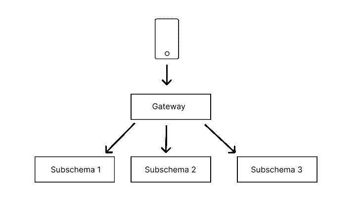

# 理解 GraphQL - LogRocket 博客中的模式拼接

> 原文：<https://blog.logrocket.com/understanding-schema-stitching-graphql/>

GraphQL 的主要好处之一是可以通过一个模式查询所有需要的数据。这可能假设大多数系统是一个大的整体服务。然而，随着模式的增长，它可能需要被分割成更小的模式以便于维护。此外，随着微服务架构的流行，许多系统由较小的服务组成，这些服务负责它们提供的数据。

在这种情况下，需要提供统一的 GraphQL 模式供客户端查询。否则，我们将回到传统 API 请求的劣势，您需要查询几个 API 来获得您需要的数据。

这就是模式拼接的用武之地。模式拼接使我们能够将多个图组合成一个可以从中提取数据的图。

在本文中，我们将使用一个实际的例子来讨论模式拼接，它是如何工作的，以及如何跨多个模式合并类型。

## 什么是模式拼接？

模式拼接组合了多个子模式，并创建了一个称为网关的组合代理层，客户端可以使用它来发出请求。这意味着您可以将来自不同模块甚至不同远程服务的较小的 GraphQL 模式组合成一个称为网关的模式。

当客户端向网关发出请求时，网关将该请求委托给负责提供所请求字段的子模式。



网关如何知道将请求委托给哪个子模式？当请求进入网关时，网关查找缝合的模式配置，以了解哪个子模式负责解析请求的字段，并将请求委派给子模式。

然后，它组合从模式中获得的各种解析字段，并将它们发送给客户端。当请求发出时，客户通常不知道发生了什么。

模式拼接的大部分好处都在后端。大图可以分割成小图，每个团队负责维护他们的模式和他们解析的字段，而不会影响开发人员处理其他图。

现在，让我们用一个例子来说明模式拼接是如何工作的。要理解这一点，您需要掌握 GraphQL 的基础知识和 JavaScript 知识。

## 项目概述和设置

因为我们的重点是模式拼接，所以我们将使用一个入门项目。在这个项目中，我们有两个子图及其模式和一个用于网关服务的文件夹。我们将看到如何将一个模式缝合到不同模块中的网关。请记住，大多数时候微服务通常让它们的子模式在不同的服务器上运行，我们还将看到如何将远程模式连接到网关。我们还将看看如何合并那些部分定义存在于不同子模式中的类型。

让我们开始吧:

首先，在这里克隆[项目](https://github.com/sarahchima/schema-stitching.git)。

这是我们将在本文中使用的总体项目结构和重要文件:

```
schema-stitching
  - start // where we will be making most changes
    - gateway
      - index.js // where the schema stitching takes places
    - book
      - book.graphql
      - resolvers.js
      - index.js
      - datasources
        - books.json // mocked data for books
        - BooksAPI.js
    - review
      - review.graphql
      - resolvers.js
      - datasources
        - reviews.json // mocked reviews
        - ReviewsAPI.js
  - final // Find the complete project here which you can make reference to

```

接下来，让我们安装网关的依赖项。在`start`目录中，运行以下命令:

```
cd start/gateway
npm install

```

让我们构建我们的网关服务器，看看模式拼接的效果。我们将在 gateway 文件夹中的`index.js`文件中这样做。这是现在基本文件的样子。它只是一个没有任何模式的基本 GraphQL 节点服务器:

```
const { createServer } = require( '@graphql-yoga/node');

async function main()  {
    const server = createServer({
    })

    await server.start()
}

main().catch(error => console.error(error))

```

接下来，让我们将评论子模式添加到网关服务器。首先，我们导入创建 reviews 子模式所需的方法:

```
const { loadSchema } = require('@graphql-tools/load');
const { GraphQLFileLoader } =  require('@graphql-tools/graphql-file-loader');
const { addResolversToSchema } = require('@graphql-tools/schema');
const { stitchSchemas } = require('@graphql-tools/stitch');

```

由于 reviews 模式来自不同的来源，我们需要这些`loadSchema`和`GraphQLFileLoader`来加载它。`stitchSchemas`方法是我们将用来缝合模式的方法。我们还需要导入 reviews resolver 文件及其数据源文件:

```
const ReviewsAPI = require("./../review/datasources/ReviewsAPI");
const reviewsResolvers = require('./../review/resolvers.js');

```

接下来，我们在主函数中创建子模式:

```
async function main()  {
    const reviewsSchema = await loadSchema('./../review/reviews.graphql',       {
        loaders: [new GraphQLFileLoader()]
      }
    )

    const reviewsSchemaWithResolvers = addResolversToSchema({
        schema: reviewsSchema,
        resolvers: reviewsResolvers
    })
    const reviewsSubschema = { schema: reviewsSchemaWithResolvers };

```

我们现在将使用`reviewsSubschema`创建我们的网关模式，并将其连接到我们的主网关模式:

```
    // build the combined schema
    const gatewaySchema = stitchSchemas({
      subschemas: [
        reviewsSubschema
      ]
    });

    const server = createServer({
        context: () => { 
            return {
                dataSources: {
                    reviewsAPI: new ReviewsAPI()
                }
            }
        },
        schema: gatewaySchema,
        port: 4003
    })

```

所以我们的文件应该是这样的:

```
const { stitchSchemas } = require('@graphql-tools/stitch');
const { loadSchema } = require('@graphql-tools/load');
const { GraphQLFileLoader } =  require('@graphql-tools/graphql-file-loader');
const { addResolversToSchema } = require('@graphql-tools/schema');
const { createServer } = require( '@graphql-yoga/node');

const ReviewsAPI = require("./../review/datasources/ReviewsAPI");
const reviewsResolvers = require('./../review/resolvers.js');

async function main()  {
    const reviewsSchema = await loadSchema('./../review/reviews.graphql',       {
        loaders: [new GraphQLFileLoader()]
      }
    )

    const reviewsSchemaWithResolvers = addResolversToSchema({
        schema: reviewsSchema,
        resolvers: reviewsResolvers
    })
    const reviewsSubschema = { schema: reviewsSchemaWithResolvers };

    // build the combined schema
    const gatewaySchema = stitchSchemas({
      subschemas: [
        reviewsSubschema
      ]
    });

    const server = createServer({
        context: () => { 
            return {
                dataSources: {
                    reviewsAPI: new ReviewsAPI()
                }
            }
        },
        schema: gatewaySchema,
        port: 4003
    })
    await server.start()
}

main().catch(error => console.error(error))

```

让我们用`npm start`启动这个服务器，尝试查询一些评论字段。单击服务器的链接，并运行以下查询:

```
query {
  reviews {
    bookIsbn
    comment
    rating
  }
}

```

您应该会看到带有请求字段的评论列表。

现在我们已经看到了如何在不同的模块中缝合模式。但是如上所述，情况并不总是如此。大多数时候，我们必须缝合远程 GraphQL 模式。因此，我们将使用 book 子模式来展示如何缝合远程 GraphQL 模式。

## 缝合远程子模式

让我们为`book`子模式启动 GraphQL 服务器。`index.js`文件已经包含了启动服务器的代码:

```
cd ../book
npm install
npm start

```

服务器应该在`[http://0.0.0.0:4002/graphql](http://0.0.0.0:4002/graphql)`运行。

为了缝合远程模式，我们需要一个不可执行的模式和一个执行器。

该模式可以通过自省获得，或者作为一个平面 SDL 字符串从服务器或 repo 获得。在我们的例子中，我们将使用内省。自省使您能够查询 GraphQL 服务器的模式信息。因此，通过自省，您可以了解类型、字段、查询和变异。但是请注意，并不是所有的模式都支持自省。在这种情况下，你可以回到使用平面 SDL。

执行器是一个简单的通用方法，它执行对远程模式的请求。

让我们为正在运行的 book GraphQL 服务器执行此操作。我们将回到网关目录中的`index.js`文件。

* * *

### 更多来自 LogRocket 的精彩文章:

* * *

让我们导入必要的依赖项:

```
const { introspectSchema } = require('@graphql-tools/wrap');
const { fetch } =  require('cross-undici-fetch')
const { print } = require('graphql')

```

接下来，我们将为 books 模式添加执行器:

```
async function remoteExecutor({ document, variables }) {
  const query = print(document)
  const fetchResult = await fetch('http://0.0.0.0:4002/graphql', {
    method: 'POST',
    headers: { 'Content-Type': 'application/json' },
    body: JSON.stringify({ query, variables })
  })
  return fetchResult.json()
}

```

GraphQL 端点在这里是硬编码的。但是如果您要将它用于多个远程模式，您将希望使执行器更加通用。

最后，让我们构建我们的模式并将其添加到网关模式中:

```
  const booksSubschema = {
    schema: await introspectSchema(remoteExecutor),
    executor: remoteExecutor,
  };
  const gatewaySchema = stitchSchemas({
    subschemas: [booksSubschema, reviewsSubschema],
  });

```

在不同的终端中，启动网关服务器(如果它已停止),并使用提供的服务器链接查询以下内容:

```
query{
  reviews {
    bookIsbn
    comment
    rating
  }

  books {
    isbn
    title
  }
}

```

你应该同时得到评论和书籍。

太好了！我们已经看到了如何将模式连接到网关。现在，让我们考虑如何合并在多个模式中定义的类型。

## 缝合模式的类型合并

在缝合模式中，一个类型拥有由多个服务提供的字段是很常见的。在这种情况下，网关使用拼接的模式配置来了解哪个服务解析特定的字段。我们将用一个例子来解释它是如何工作的。

让我们扩展`Review`类型以包含关于`Book`的信息。因此，在 reviews 服务中找到的`reviews.graphql`文件中，我们向 review 添加了`book`字段，并定义了`Book`类型:

```
type Review {
    id: Int!
    bookIsbn: String!
    rating: Int!
    comment: String
    book: Book! 
}

type Book {
    isbn: String
}

```

这是一种单向类型关系，这意味着 reviews 服务不会为`Book`类型提供任何唯一的字段。所以在这种情况下，我们只需要向`Book`子模式添加一个合并配置，因为它为`Book`类型提供了所有唯一的字段。我们需要做的就是确保正确地提供了解析`Book`类型所需的键字段`isbn`。我们将通过添加一个返回图书的`isbn`的解析器来实现。

在 reviews 服务的`resolvers.js`文件中，我们为`book`字段添加了解析器:

```
const resolvers = {
  Query: {
    reviews(_, __, { dataSources }) {
      return dataSources.reviewsAPI.getAllReviews();
    },
    reviewsForBook(_, { isbn }, { dataSources }) {
      const reviews = dataSources.reviewsAPI.getReviewsForBook(isbn);
      return { isbn, reviews };
    },
  },
  Review: { 
    book: (review) => {
      return { isbn: review.bookIsbn };
    },
  },
};
module.exports = resolvers;

```

接下来，我们需要在网关中为 book 子模式添加一个合并配置。这是必要的，因为我们在多个模式中定义了`Book`类型。将`booksSubschema`更新如下:

```
  const booksSubschema = {
    schema: await introspectSchema(remoteExecutor),
    executor: remoteExecutor,
    merge: {
      Book: {
        selectionSet: "{ isbn }",
        fieldName: "book",
        args: ({ isbn }) => ({ isbn }),
      },
    },
  };

```

这就是我们为这个单向类型合并所需要做的一切；我们不需要将`merge`配置添加到`Reviews`子模式中，因为它不提供任何唯一的字段。如果您对`merge`配置所需的属性感到困惑，请等一下——很快就会解释清楚。

如果运行以下查询:

```
{
  reviews {
    id
    rating
    comment
    book {
      author
    }
  }
}

```

您应该得到:

```
{
  "data": {
    "reviews": [
      {
        "id": 1,
        "rating": 4,
        "comment": "A great introduction to Javascript",
        "book": {
          "author": "Marijn Haverbeke"
        }
      },

```

如果想了解更多关于网关如何解析这些字段的信息，可以参考[合并流程文档](https://www.graphql-tools.com/docs/schema-stitching/stitch-type-merging#merging-flow)。

这是一个简单的类型合并的例子。然而，在许多情况下，唯一的字段是由多个服务提供的。例如，我们可能希望能够获得某本书的所有评论，评论服务将负责解析该字段。在这种情况下，我们需要向网关服务添加一个合并配置，使其能够解析这些字段。就这么办吧。

首先，我们将`reviews`字段添加到在`reviews.graphql`中定义的`Book`类型中:

```
type Book {
  isbn: String
  reviews: [Review]
}

```

我们还将添加一个接受 ISBN 并返回`Book`类型的查询。我们将在合并配置中使用它作为解析`Book`类型的添加字段所需的字段名:

```
type Query {
  reviews: [Review!]!
  reviewsForBook(isbn: String): Book
}

```

接下来，让我们添加它的解析器:

```
const resolvers = {
  Query: {
    reviews(_, __, { dataSources }) {
      return dataSources.reviewsAPI.getAllReviews();
    },
    reviewsForBook(_, { isbn }, { dataSources }) {
      const reviews = dataSources.reviewsAPI.getReviewsForBook(isbn);
      return { isbn, reviews };
    },
  },

```

接下来，我们将向网关服务添加合并配置。因此，在网关目录中的`index.js`文件中，我们将合并配置添加到`reviewsSubschema`定义中:

```
    const reviewsSubschema = { 
      schema: reviewsSchemaWithResolvers,        
      merge: {
        Book: {
          selectionSet: "{ isbn }",
          fieldName: "reviewsForBook",
          args: ({ isbn }) => ({ isbn }),
        }
      } 
    };

```

在合并配置中，我们指定了`Book`类型的字段将由`reviewsForBook`解析，也就是这里定义的`fieldName`。这是在解析`Reviews`子模式中定义的`Book`字段时要参考的顶级查询。

`selectionSet`表示需要从`Book`对象中选择的`fields`，以获得`reviewsForBook`所需的参数。

`args`将`selectionSet`转换成`reviewsForBook`使用的参数。如果我们想在传递给`fieldName`之前对`selectionSet`进行任何转换，这是很有用的。

现在，让我们用这个查询获取一本书的评论:

```
{
  book(isbn: "9781491943533") {
    isbn
    author
    reviews {
      comment
      rating
    }
  }
}

```

你应该知道这个:

```
{
  "data": {
    "book": {
      "isbn": "9781491943533",
      "author": "Nicolás Bevacqua",
      "reviews": [
        {
          "comment": "Dive into ES6 and the Future of JavaScript",
          "rating": 5
        }
      ]
    }
  }
}

```

## 摘要

在本教程中，我们讨论了什么是模式拼接，为什么模式拼接是必要的，并且我们使用了一个实际的例子来看我们如何拼接来自不同模块的模式和运行在不同服务器上的远程模式。我们还看到了如何合并多个子模式中定义的类型。关于类型合并更详细的解释，你可以参考文档。

我们可以看到模式拼接对于由较小服务组成的大型系统非常有用。它还帮助团队独立于其他团队中的其他开发人员来维护他们的模式。

组合多个子模式的另一种流行方式是 Apollo 联邦。你可以阅读[这篇文章](https://product.voxmedia.com/2020/11/2/21494865/to-federate-or-stitch-a-graphql-gateway-revisited)来找出它与模式拼接的不同之处。

## 监控生产中失败和缓慢的 GraphQL 请求

虽然 GraphQL 有一些调试请求和响应的特性，但确保 GraphQL 可靠地为您的生产应用程序提供资源是一件比较困难的事情。如果您对确保对后端或第三方服务的网络请求成功感兴趣，

[try LogRocket](https://lp.logrocket.com/blg/graphql-signup)

.

[](https://lp.logrocket.com/blg/graphql-signup)[https://logrocket.com/signup/](https://lp.logrocket.com/blg/graphql-signup)

LogRocket 就像是网络和移动应用的 DVR，记录下你网站上发生的每一件事。您可以汇总并报告有问题的 GraphQL 请求，以快速了解根本原因，而不是猜测问题发生的原因。此外，您可以跟踪 Apollo 客户机状态并检查 GraphQL 查询的键值对。

LogRocket 检测您的应用程序以记录基线性能计时，如页面加载时间、到达第一个字节的时间、慢速网络请求，还记录 Redux、NgRx 和 Vuex 操作/状态。

[Start monitoring for free](https://lp.logrocket.com/blg/graphql-signup)

.