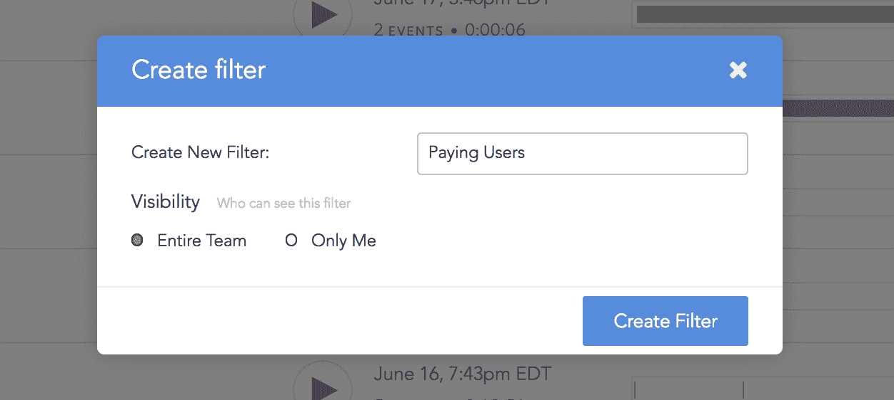
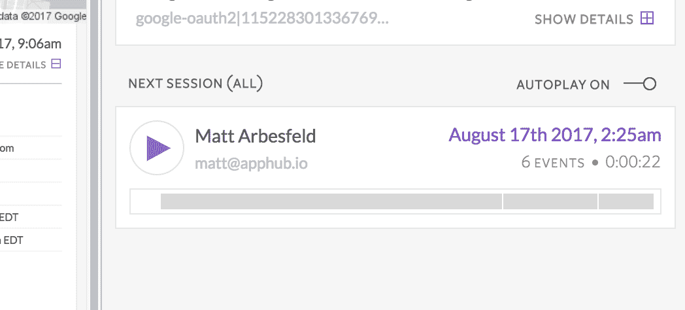

# 了解 LogRocket 中的片段、漏斗和流

> 原文：<https://blog.logrocket.com/understanding-segments-funnels-and-flows-in-logrocket-b18854adb771/>

# 了解 LogRocket 中的片段、漏斗和流

## 

2017 年 8 月 17 日 1 分钟阅读 522

#### 使用 LogRocket 强大的搜索工具来了解功能使用、用户行为、表单放弃、错误等等…


观看 LogRocket 视频是了解真实用户如何体验你的应用的最快方式。只需几分钟，您就可以深入了解 UX 的不足之处以及如何改进。

但是如果你在 LogRocket 中记录了超过几百个会话，那么有效地利用搜索就成了展现洞察力的关键。你可以根据简单的特征进行搜索，如电子邮件、用户名或位置，但也可以构建更高级的查询，深入了解应用程序中的特定渠道、部分或流程。

在这篇文章中，我将向你展示如何利用搜索来更好地了解你的用户，并深入了解你的应用 UX 的重要部分。

### 片段

LogRocket 允许你创建相似用户的细分，这样你就可以观察他们如何与你的应用程序交互。您可以使用电子邮件、用户名、位置、在网站上的时间以及第一次看到/最后一次看到等特征。


您还可以通过 LogRocket SDK 添加自定义特征，如下所示:

```
LogRocket.identify('123456', {
  name: 'John Smith',
  email: '[email protected]',

  // custom traits
  subscriptionType: 'premium',
  companyName: 'FooBar, Inc'
  companySize: 'enterprise',
});
```

然后使用它们通过“用户特征”过滤器来划分用户:


### 流量/漏斗

流和漏斗代表了用户在你的应用中对你做的一系列动作。这可能是遍历一个多部分表单、完成入职或在结账流程中购买商品。LogRocket search 可以让您了解任何此类路径，例如，在这里，我们使用“已访问的 URL”过滤器来查看通过我们的入职流程的用户的会话:


然而，漏斗和片段之间的区别实际上是一个错误的二分法。LogRocket 允许您使用两种用户特征，*和*用户行为来展现洞察力。例如，我们可能希望将上述入职流程仅限于拥有某些特征的用户，比如前几天首次注册的用户:


### 自定义事件

构建漏斗和流时，使用特定于您的应用程序的自定义事件通常会很有帮助。如果你使用我们的 [Redux integration](https://docs.logrocket.com/docs/redux-middleware) ，或者另一个 flux integration，比如 [ngrx](https://docs.logrocket.com/docs/ngrx-middleware) 、 [Vuex](https://docs.logrocket.com/docs/vuex-plugin) 或者 [MobX](https://docs.logrocket.com/docs/mobx-plugin) ，你可以立即访问你的所有动作进行过滤。


您还可以使用 LogRocket SDK 来添加自定义事件，如下所示:

```
LogRocket.track('CLICK SIGNUP BUTTON')
```

然后像这样过滤:


### 保存搜索

当您构建了一个您计划将来再次访问的细分市场、漏斗或流程时，您可以通过单击仪表板右上角的“保存过滤器…”按钮来保存它。这将召唤一个模式，让你命名你的搜索，并决定是否与你的队友分享或保留给自己。



### 现在坐下来看一些会议！

一旦你创建了一个你满意的搜索，是时候坐下来看一些会议来深入了解如何提高你的 UX 了。只需点击会话列表中的一个会话，即可开始观看。确保自动播放已打开，一旦第一个会话结束，下一个会话将自动开始播放。

