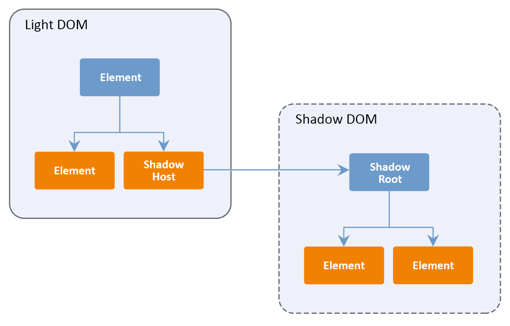
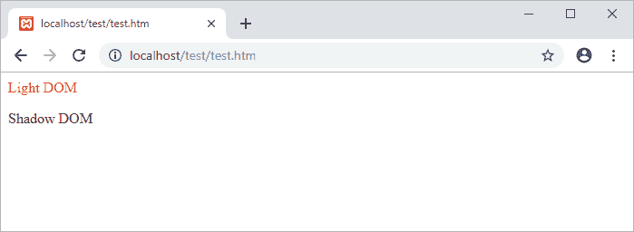
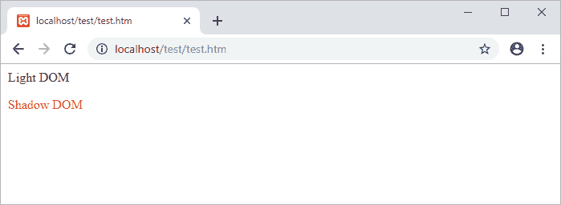
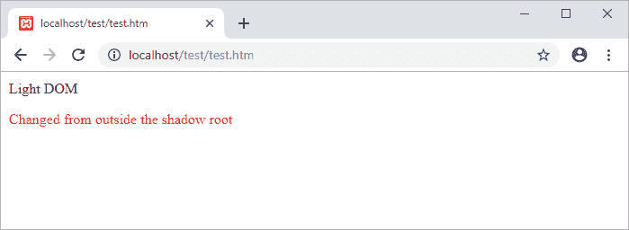
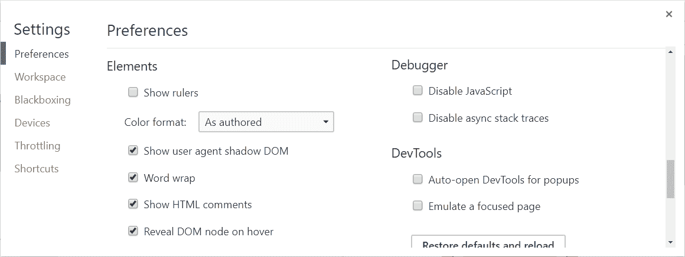
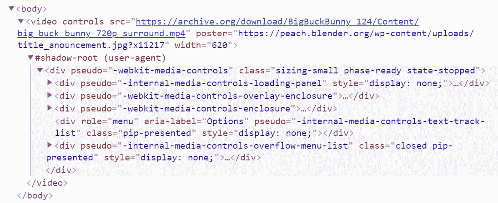

# 了解 Shadow DOM v1 - LogRocket 博客

> 原文：<https://blog.logrocket.com/understanding-shadow-dom-v1-fa9b81ebe3ac/>

### 什么是 DOM？

在我们深入研究如何创建影子 DOM 之前，理解 DOM 是什么很重要。W3C 文档对象模型(DOM)提供了一个平台和语言中立的应用程序编程接口(API ),用于表示和操作存储在 HTML 和 XML 文档中的信息。

使用 DOM，程序员可以访问、添加、删除或更改元素和内容。DOM 将网页视为树结构，每个分支以一个节点结束，每个节点保存一个对象，可以使用 JavaScript 等脚本语言修改该对象。考虑下面的 HTML 文档:

```
<html>
  <head>
    <title>Sample document</title>
  </head>
  <body>
    <h1>Heading</h1>
    <a href="https://example.com">Link</a>
  </body>
</html>
```

这个 HTML 的 DOM 表示如下:


All boxes in this figure are nodes.

用于描述 DOM 各部分的术语类似于现实世界中的家谱:

*   给定节点上一级的节点是该节点的父节点
*   给定节点下一级的节点是该节点的子节点
*   具有相同父节点的节点是兄弟节点
*   给定节点之上的所有节点，包括父节点和祖父节点，都被称为该节点的祖先
*   最后，给定节点下的所有节点都称为该节点的后代

节点的类型取决于它所代表的 HTML 元素的种类。HTML 标签被称为元素节点。嵌套标签形成了一个元素树。元素中的文本称为文本节点。文本节点可能没有子节点；你可以把它想象成一片树叶。

为了访问树，DOM 提供了一组方法，程序员可以用这些方法修改文档的内容和结构。例如，当您编写`document.createElement('p');`时，您正在使用 DOM 提供的方法。没有 DOM，JavaScript 就无法理解 HTML 和 XML 文档的结构。

以下 JavaScript 代码显示了如何使用 DOM 方法创建两个 HTML 元素，将一个元素嵌套在另一个元素中，设置文本内容，并将它们追加到文档正文中:

```
const section = document.createElement('section');
const p = document.createElement('p');

p.textContent = 'Hello!';

section.appendChild(p);

document.body.appendChild(section);
```

以下是运行这段 JavaScript 代码后得到的 DOM 结构:

```
<body>
  <section>
    <p>Hello!</p>
  </section>
</body>
```

### 什么是影子 DOM？

封装是面向对象编程的一个基本特性，它使程序员能够限制对对象组件的未授权访问。

根据这个定义，对象以可公开访问的方法的形式提供一个接口，作为与其数据交互的一种方式。这样，就不能从对象定义的外部直接访问对象的内部表示。

影子 DOM 将这个概念带到了 HTML 中。它使您能够将一个隐藏的、分离的 DOM 链接到一个元素，这意味着您可以对 HTML 和 CSS 进行本地作用域。您现在可以使用更通用的 CSS 选择器，而不用担心命名冲突，并且样式不再泄漏或应用于它们不应该应用的元素。

实际上，Shadow DOM API 正是库和小部件开发人员将 HTML 结构、样式和行为与代码的其他部分分开所需要的。

影像根是影像树中最顶端的节点。这是创建影子 DOM 时附加到常规 DOM 节点的内容。与影子根相关联的节点称为影子主机。

您可以像对待普通 DOM 一样将元素附加到影子根。链接到影子根的节点形成影子树。一张图应该能让这一点更清楚:



术语光 DOM 通常用于区分正常 DOM 和阴影 DOM。阴影 DOM 和光 DOM 合起来称为逻辑 DOM。灯光 DOM 与阴影 DOM 分离的点称为阴影边界。DOM 查询和 CSS 规则不能到达阴影边界的另一边，从而创建封装。

### 创建阴影 DOM

要创建一个影子 DOM，您需要使用`Element.attachShadow()`方法将一个影子根附加到一个元素上。下面是语法:

```
var shadowroot = element.attachShadow(shadowRootInit);
```

让我们看一个简单的例子:

```
<div id="host"><p>Default text</p></div>

<script>
  const elem = document.querySelector('#host');

  // attach a shadow root to #host
  const shadowRoot = elem.attachShadow({mode: 'open'});

  // create a <p> element
  const p = document.createElement('p');

  // add <p> to the shadow DOM
  shadowRoot.appendChild(p);

  // add text to <p> 
  p.textContent = 'Hello!';
</script>
```

这段代码将一个阴影 DOM 树附加到一个`id`为`host`的`div`元素上。这个树与`div`的实际子树是分开的，添加到树中的任何东西都是宿主元素的本地内容。


*Shadow root in Chrome DevTools.*

注意`#host`中的现有元素是如何被影子根替换的。不支持影子 DOM 的浏览器将使用默认内容。

现在，当向主文档添加 CSS 时，样式规则不会影响影子 DOM:

```
<div><p>Light DOM</p></div>
<div id="host"></div>

<script>
  const elem = document.querySelector('#host');

  // attach a shadow root to #host
  const shadowRoot = elem.attachShadow({mode: 'open'});

  // set the HTML contained within the shadow root
  shadowRoot.innerHTML = '<p>Shadow DOM</p>';
</script>

<style>
  p {color: red}
</style>
```

light DOM 中定义的样式不能跨越阴影边界。因此，只有浅色 DOM 中的段落会变成红色。

* * *

### 更多来自 LogRocket 的精彩文章:

* * *



相反，添加到影子 DOM 中的 CSS 是宿主元素的本地元素，不会影响 DOM 中的其他元素:

```
<div><p>Light DOM</p></div>
<div id="host"></div>

<script>
  const elem = document.querySelector('#host');
  const shadowRoot = elem.attachShadow({mode: 'open'});
```

```
  shadowRoot.innerHTML = `
    <p>Shadow DOM</p>
    <style>p {color: red}</style>`;

</script>
```



您也可以将样式规则放在外部样式表中，如下所示:

```
shadowRoot.innerHTML = `
  <p>Shadow DOM</p>
  <link rel="stylesheet" href="style.css">`;
```

要获取对附加了`shadowRoot`的元素的引用，可以使用`host`属性:

```
<div id="host"></div>

<script>
  const elem = document.querySelector('#host');
  const shadowRoot = elem.attachShadow({mode: 'open'});

  console.log(shadowRoot.host);    // => <div id="host"></div>
</script>
```

要做相反的事情并获得对由元素托管的影子根的引用，请使用元素的`shadowRoot`属性:

```
<div id="host"></div>

<script>
  const elem = document.querySelector('#host');
  const shadowRoot = elem.attachShadow({mode: 'open'});

  console.log(elem.shadowRoot);    // => #shadow-root (open)
</script>
```

### 影网尝尝

当调用`Element.attachShadow()`方法来附加一个影子根时，必须通过传递一个对象作为参数来指定影子 DOM 树的封装模式，否则会抛出一个`TypeError`。该对象必须有一个值为`open`或`closed`的`mode`属性。

开放的影像根允许您使用主机元素的`shadowRoot`属性从根外部访问影像根的元素，如下例所示:

```
<div><p>Light DOM</p></div>
<div id="host"></div>

<script>
  const elem = document.querySelector('#host');

  // attach an open shadow root to #host
  const shadowRoot = elem.attachShadow({mode: 'open'});

  shadowRoot.innerHTML = `<p>Shadow DOM</p>`;

  // Nodes of an open shadow DOM are accessible
  // from outside the shadow root
  elem.shadowRoot.querySelector('p').innerText = 'Changed from outside the shadow root';
  elem.shadowRoot.querySelector('p').style.color = 'red';
</script>
```



但是如果 mode 属性的值为`closed`，试图从根之外使用 JavaScript 来访问影子根的元素会抛出一个`TypeError`:

```
<div><p>Light DOM</p></div>
<div id="host"></div>

<script>
  const elem = document.querySelector('#host');

  // attach a closed shadow root to #host
  const shadowRoot = elem.attachShadow({mode: 'closed'});

  shadowRoot.innerHTML = `<p>Shadow DOM</p>`;

  elem.shadowRoot.querySelector('p').innerText = 'Now nodes cannot be accessed from outside';
  // => TypeError: Cannot read property 'querySelector' of null 
</script>
```

当模式设置为`closed`时，`shadowRoot`属性返回`null`。因为一个`null`值没有任何属性或方法，对它调用`querySelector()`会导致一个`TypeError`。浏览器通常使用封闭的影子根来使一些元素的实现内部从 JavaScript 中不可访问和不可更改。

要确定阴影 DOM 是处于打开模式还是关闭模式，可以参考阴影根的`mode`属性:

```
<div id="host"></div>

<script>
  const elem = document.querySelector('#host');
  const shadowRoot = elem.attachShadow({mode: 'closed'});

  console.log(shadowRoot.mode);    // => closed
</script>
```

表面上，对于不想暴露组件影子根的 Web 组件作者来说，封闭的影子 DOM 显得非常方便；然而，在实践中，绕过封闭的阴影穹顶并不难。一般来说，完全隐藏一个影子 DOM 所需的努力是不值得的。

### 并非所有 HTML 元素都可以承载影子 DOM

只有有限的元素集可以承载影子 DOM。下表列出了支持的元素:

```
+----------------+----------------+----------------+
|    article     |      aside     |   blockquote   |
+----------------+----------------+----------------+
|     body       |       div      |     footer     |
+----------------+----------------+----------------+
|      h1        |       h2       |       h3       |
+----------------+----------------+----------------+
|      h4        |       h5       |       h6       |
+----------------+----------------+----------------+
|    header      |      main      |      nav       |
+----------------+----------------+----------------+
|      p         |     section    |      span      |
+----------------+----------------+----------------+
```

试图将阴影 DOM 树附加到任何其他元素都会导致一个`DOMException`错误。例如:

```
document.createElement('img').attachShadow({mode: 'open'});    
// => DOMException
```

使用一个``元素作为影子主机是不合理的，所以这段代码抛出一个错误也就不足为奇了。您可能会得到一个`DOMException`错误的另一个原因是浏览器已经使用该元素来托管一个影子 DOM。

### 浏览器会自动将阴影 DOM 附加到一些元素上

影子 DOM 已经存在了相当一段时间，浏览器一直用它来隐藏`<input>`、`<textarea>`、`<video>`等元素的内部结构。

当您在 HTML 中使用`<video>`元素时，浏览器会自动为该元素附加一个阴影 DOM，其中包含默认的浏览器控件。但是在 DOM 中唯一可见的是`<video>`元素本身:


要使这些元素的影子根在 Chrome 中可见，请打开 Chrome DevTools 设置(按 F1)，并在“元素”部分选中“显示用户代理影子 DOM”:



选中“显示用户代理影子 DOM”选项后，影子根节点及其子节点变得可见。以下是启用该选项后相同代码的样子:



### 在自定义元素上承载阴影 DOM

由自定义元素 API 创建的自定义元素可以像任何其他元素一样承载影子 DOM。考虑下面的例子:

```
<my-element></my-element>

<script>
  class MyElement extends HTMLElement {
    constructor() {

      // must be called before the this keyword
      super();

      // attach a shadow root to <my-element>
      const shadowRoot = this.attachShadow({mode: 'open'});

      shadowRoot.innerHTML = `
        <style>p {color: red}</style>
        <p>Hello</p>`;
    }
  }

  // register a custom element on the page
  customElements.define('my-element', MyElement);
</script>
```

这段代码创建了一个托管影子 DOM 的自治自定义元素。为此，它调用`customElements.define()`方法，将元素名作为第一个参数，将一个类对象作为第二个参数。该类扩展了`HTMLElement`并定义了元素的行为。

在构造函数内部，`super()`用来建立原型链，一个影子根附加在自定义元素上。现在，当您在页面上使用`<my-element>`时，它会创建自己的影子 DOM:


请记住，有效的自定义元素不能是一个单词，其名称中必须有一个连字符(-)。例如， *myelement* 不能用作定制元素的名称，并且会抛出一个`DOMException`错误。

### 设置主体元素的样式

通常，要设计主机元素的样式，需要将 CSS 添加到 light DOM 中，因为主机元素就位于那里。但是，如果需要在影子 DOM 中设计主机元素的样式，该怎么办呢？

这就是`host()`伪类函数的用处。该选择器允许您从影子根目录中的任何位置访问影子主机。这里有一个例子:

```
<div id="host"></div>

<script>
  const elem = document.querySelector('#host');
  const shadowRoot = elem.attachShadow({mode: 'open'});

  shadowRoot.innerHTML = `
    <p>Shadow DOM</p>
    <style>
      :host {
        display: inline-block;
        border: solid 3px #ccc;
        padding: 0 15px;
      }
    </style>`;

</script>
```

值得注意的是`:host`只在一个影子根内有效。还要记住，在影子根之外定义的样式规则比在`:host`中定义的规则具有更高的特异性。

例如，`#host { font-size: 16px; }`击败了影子 DOM 的`:host { font-size: 20px; }`。这实际上很有用，因为它允许您为组件定义默认样式，并让组件的用户覆盖您的样式。唯一的例外是`!important`规则，它在影子 DOM 中有更高的特异性。

您还可以将一个选择器作为参数传递给`:host()`，这允许您仅当主机与指定的选择器匹配时才将其作为目标。换句话说，它允许您针对同一主机的不同状态:

```
<style>
  :host(:focus) {
    /* style host only if it has received focus */
  }

  :host(.blue) {
    /* style host only if has a blue class */
  }

  :host([disabled]) {
    /* style host only if it's disabled */
  }
</style>
```

### 基于上下文的样式

要选择特定祖先内部的影子根主机，可以使用`:host-context()`伪类函数。例如:

```
:host-context(.main) {
  font-weight: bold;
}
```

只有当影子主机是`.main`的后代时，这个 CSS 代码才选择它:

```
<body class="main">
  <div id="host">
  </div>
</body>
```

`:host-context()`对主题化特别有用，因为它允许作者根据组件使用的上下文来设计组件的样式。

### 风格挂钩

shadow DOM 的一个有趣的方面是它能够创建“样式占位符”并允许用户填充它们。这可以通过使用 [CSS 自定义属性](https://developer.mozilla.org/en-US/docs/Web/CSS/Using_CSS_variables)来完成。让我们看一个简单的例子:

```
<div id="host"></div>

<style>
  #host {--size: 20px;}
</style>

<script>
  const elem = document.querySelector('#host');
  const shadowRoot = elem.attachShadow({mode: 'open'});

  shadowRoot.innerHTML = `
    <p>Shadow DOM</p>
    <style>p {font-size: var(--size, 16px);}</style>`;

</script>
```

这个阴影 DOM 允许用户覆盖其段落的字体大小。使用自定义属性符号(`— size: 20px`)设置该值，shadow DOM 使用`var()`函数(`font-size: var( — size, 16px)`)检索该值。就概念而言，这类似于`<slot>`元素的工作方式。

### 可继承的风格

Shadow DOM 允许您创建从外部看不到选择器的独立 DOM 元素，但这并不意味着继承的属性不会通过 Shadow 边界。

某些属性，如`color`、`background`和`font-family`，通过阴影边界并应用于阴影树。因此，与 iframe 相比，影子 DOM 不是一个很强的障碍。

```
<style>
  div {
    font-size: 25px;
    text-transform: uppercase;
    color: red;
  }
</style>

<div><p>Light DOM</p></div>
<div id="host"></div>

<script>
  const elem = document.querySelector('#host');
  const shadowRoot = elem.attachShadow({mode: 'open'});

  shadowRoot.innerHTML = `<p>Shadow DOM</p>`;
</script>
```

解决方法很简单:通过声明`all: initial`将可继承的样式重置为初始值，如下所示:

```
<style>
  div {
    font-size: 25px;
    text-transform: uppercase;
    color: red;
  }
</style>

<div><p>Light DOM</p></div>
<div id="host"></div>

<script>
  const elem = document.querySelector('#host');
  const shadowRoot = elem.attachShadow({mode: 'open'});

  shadowRoot.innerHTML = `
    <p>Shadow DOM</p>
    <style>
      :host p {
        all: initial;
      }
    </style>`;
</script>
```

在本例中，元素被强制返回到初始状态，因此跨越阴影边界的样式没有效果。

### 事件重定向

在阴影 DOM 中触发的事件可能会越过阴影边界，并冒泡到光 DOM 中；然而，`Event.target`的值是自动改变的，所以看起来好像事件是从包含影像树的主机元素而不是实际元素中产生的。

这种变化被称为事件重定向，其背后的原因是为了保留影子 DOM 封装。考虑下面的例子:

```
<div id="host"></div>

<script>
  const elem = document.querySelector('#host');
  const shadowRoot = elem.attachShadow({mode: 'open'});

  shadowRoot.innerHTML = `
    <ul>
      <li>One</li>
      <li>Two</li>
      <li>Three</li>
    <ul>
    `;

  document.addEventListener('click', (event) => {
    console.log(event.target);
  }, false);
</script>
```

当您单击 shadow DOM 中的任意位置时，这段代码会将`<div id="host">…</div>`记录到控制台，因此侦听器看不到调度事件的实际元素。

但是，重定目标不会在 shadow DOM 中发生，您可以很容易地找到与事件关联的实际元素:

```
<div id="host"></div>

<script>
  const elem = document.querySelector('#host');
  const shadowRoot = elem.attachShadow({mode: 'open'});

  shadowRoot.innerHTML = `
    <ul>
      <li>One</li>
      <li>Two</li>
      <li>Three</li>
    </ul>`;

  shadowRoot.querySelector('ul').addEventListener('click', (event) => {
    console.log(event.target);
  }, false);  
</script>
```

请注意，并非所有事件都从影子 DOM 传播出去。那些做的被重定目标，但是其他的被简单地忽略。如果你正在使用[自定义事件](https://developer.mozilla.org/en-US/docs/Web/Guide/Events/Creating_and_triggering_events#Creating_custom_events)，你将需要使用`composed: true`标志，否则事件将不会出现在阴影边界之外。

### 阴影 DOM v0 与 v1

Shadow DOM 规范的最初版本是在 Chrome 25 中实现的，当时被称为 Shadow DOM v0。该规范的更新版本改进了 Shadow DOM API 的许多方面。

例如，一个元素不能再承载多个影子 DOM，有些元素根本不能承载一个影子 DOM。违反这些规则会导致错误。

此外，Shadow DOM v1 提供了一组新特性，比如开放阴影模式、回退内容等等。你可以在这里找到 v0 和 v1 [的全面并列比较，作者之一是该规范的作者。Shadow DOM v1 的完整描述可以在](https://hayato.io/2016/shadowdomv1/#multiple-shadow-roots) [W3C](https://www.w3.org/TR/shadow-dom/) 找到。

### 浏览器对影子 DOM v1 的支持

在撰写本文时，Firefox 和 Chrome 完全支持 Shadow DOM v1。可惜 Edge 还没有实现 v1，Safari 部分支持。在[我可以使用……](https://caniuse.com/#feat=shadowdomv1)上可以找到支持的浏览器的最新列表。

要在不支持 shadow DOM v1 的浏览器上实现 Shadow DOM，可以使用 [shadydom](https://github.com/webcomponents/shadydom) 和[shady CSS](https://github.com/webcomponents/shadycss)poly fill。

### 包扎

DOM 缺乏封装一直是 web 开发人员面临的问题。Shadow DOM API 为我们提供了创建作用域 DOM 的能力，从而为这个问题提供了一个优雅的解决方案。

现在，风格冲突不再是一个令人担忧的问题，选择器也不会失去控制。shadow DOM 是小部件开发者的游戏改变者。能够创建从页面的其余部分封装出来的小部件，并且不受其他样式表和脚本的影响，这是一个巨大的优势。

如前所述，Web 组件由三种主要技术组成，影子 DOM 是其中的关键部分。希望在读完这篇文章后，你会更容易理解这三种技术是如何一起构建 Web 组件的。

有什么小技巧可以分享吗？请在评论中告诉我们！

## 200 只显示器出现故障，生产中网络请求缓慢

部署基于节点的 web 应用程序或网站是容易的部分。确保您的节点实例继续为您的应用程序提供资源是事情变得更加困难的地方。如果您对确保对后端或第三方服务的请求成功感兴趣，

[try LogRocket](https://lp.logrocket.com/blg/node-signup)

.

[](https://lp.logrocket.com/blg/node-signup)[https://logrocket.com/signup/](https://lp.logrocket.com/blg/node-signup)

LogRocket 就像是网络和移动应用程序的 DVR，记录下用户与你的应用程序交互时发生的一切。您可以汇总并报告有问题的网络请求，以快速了解根本原因，而不是猜测问题发生的原因。

LogRocket 检测您的应用程序以记录基线性能计时，如页面加载时间、到达第一个字节的时间、慢速网络请求，还记录 Redux、NgRx 和 Vuex 操作/状态。

[Start monitoring for free](https://lp.logrocket.com/blg/node-signup)

.