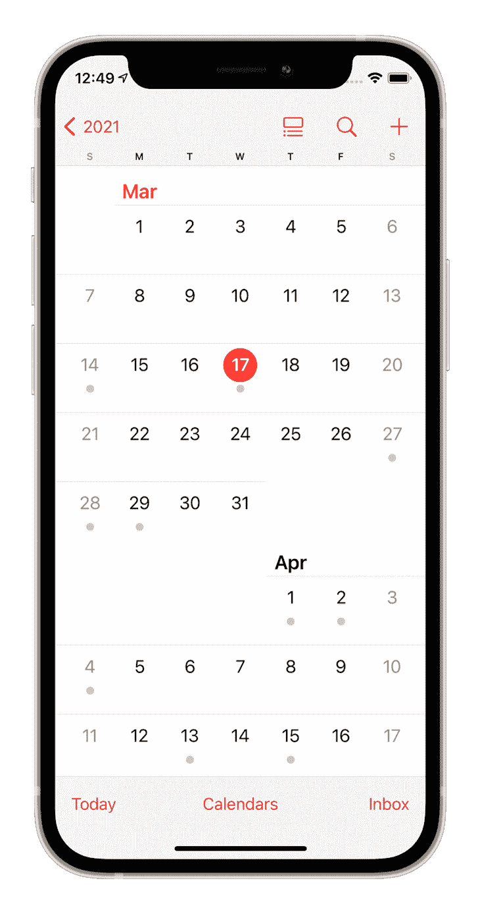
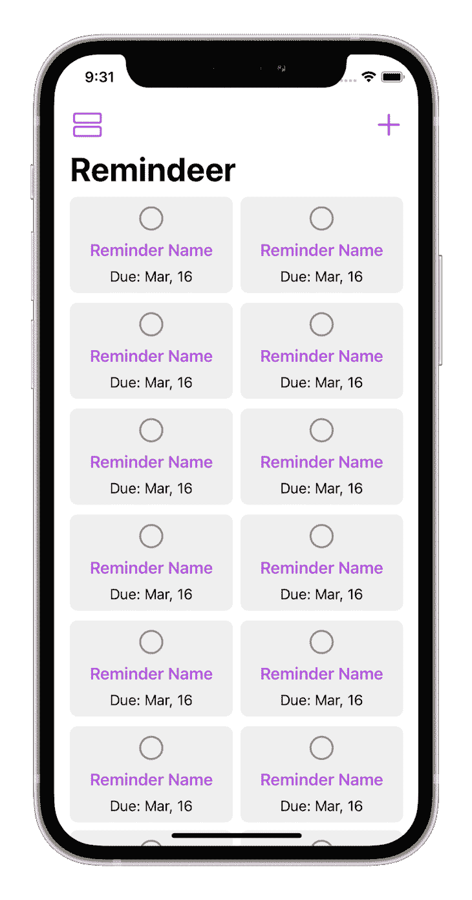
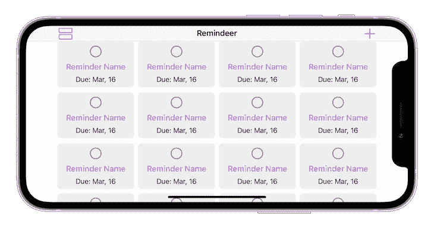
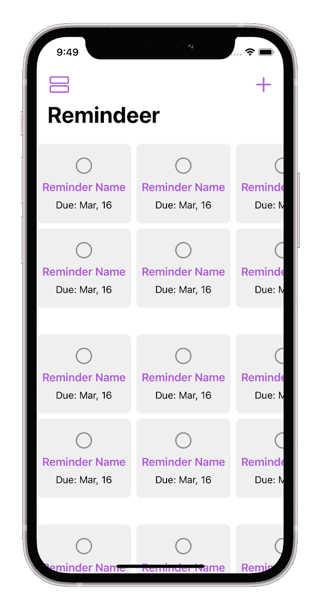
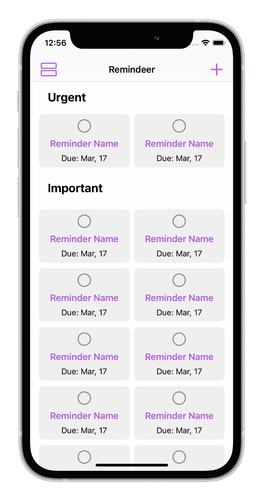

# 了解 SwiftUI 网格布局

> 原文：<https://blog.logrocket.com/understanding-the-swiftui-grid-layout/>

在[苹果 2020 年全球开发者大会](https://developer.apple.com/wwdc20/)期间推出网格之前，网格是 [SwiftUI](https://developer.apple.com/xcode/swiftui/) 中最受欢迎的功能之一。到目前为止，许多开发人员在 SwiftUI 中实现了近似`UICollectionView`的功能。然后，Swift 团队在 2020 年 WWDC 奥运会上正式推出了`LazyVGrid`和`LazyHGrid`布局。

在本教程中，我们将回顾 SwiftUI 网格布局的基础。我们将通过开发一个提醒应用程序来演示如何使用 SwiftUI 创建网格，该应用程序可以帮助您根据到期日期对提醒进行分类，并将它们标记为完成。

我们将重点关注以下内容:

为了跟上进度，您应该具备以下基本知识:

*   斯威夫特伊
*   大量
*   可观察物体
*   滚动视图

## Swift 中的网格布局

几乎所有的苹果应用程序中都可以看到网格布局。你可能已经在照片应用或日历应用中注意到了。通过将视图分成行和列，它有助于将更重要的数据容纳到相同的空间中。

看看下面的例子:


## 

## SwiftUI 网格布局示例

## 为了演示 SwiftUI 网格布局如何工作，我们将构建一个提醒应用程序。我们将从一个已经写好所有[锅炉代码](https://www.dropbox.com/sh/ub3b234c1c443g9/AABu9aqoKq4eiNYr-rz46NTua?dl=0)的项目开始。

该应用程序包含一个主屏幕，在其上实现网格。要添加新的提醒或类别，您可以点击右上角的**添加**按钮。左上角的按钮将在垂直和水平布局之间切换，让用户可以控制显示。

该应用程序已经包含了一个类别和提醒的模型，其中包含名称、截止日期和一个布尔值，以将它们标记为已完成。视图模型有添加更多提醒或更新提醒状态的方法。为了方便起见，该应用程序使用测试数据。

记住所有这些，让我们进入 Swift 中网格如何工作以及它们与标准列表有何不同的理论。

`GridItem`

## 在 SwiftUI 的网格布局中，每个元素被称为`GridItem`。我们可以通过更改它的大小、间距以及将其与父视图对齐来定制它。

`GridItem`有三种类型:

**固定** **—** 无论设备的方向或屏幕大小，元素的大小都是固定的

1.  **灵活** —元素足够灵活，可以根据可用空间调整自身大小
2.  **自适应** —元素可以适应屏幕大小或方向，并提供最小的宽度或高度。例如，在 iPhone 上可以是两列，但在 iPad 上，它会适应给定的大小，变成三列
3.  这些类型根据它们在垂直网格或水平网格中的使用方式而有所不同。

我们从具有两列和两行的固定网格项的简单数组开始。现在让我们在`ReminderView`中的`style`下添加以下代码:

这在一行或一列中创建了两个固定大小为`120`的网格项，这取决于我们所使用的内容。

```
var items: [GridItem] = Array(repeating: .init(.fixed(120)), count: 2)

```

同样，您也可以创建灵活的项目。这些项目占用了两列或两行的可用空间:

同样，您可以创建自适应项目:

```
var items: [GridItem] = Array(repeating: .init(.flexible()), count: 2)

```

如果最小尺寸为`120`的可用空间足以容纳三或四行/列，则项目会自动调整。

```
var items: [GridItem] = Array(repeating: .init(.adaptive(minimum: 120)), count: 2)

```

基础工作完成后，就该在网格中填充这些项目了！

`LazyVGrid`

## `[LazyVGrid](https://developer.apple.com/documentation/swiftui/lazyvgrid)`是一个容器视图，它在一个垂直增长的网格中排列其子视图，只在需要时创建项目。

垂直网格可以根据您的要求分成多列。API 提供了固定元素大小的灵活性，或者使其灵活或自适应。

`LazyVGrid`包含以下用于定制的参数:定位每个项目的列、视图中的对齐、视图中网格和下一个项目之间的间距以及绑定到滚动视图的固定视图。

我们将从添加一个包含网格的垂直滚动视图开始。然后，我们将添加列作为第一个参数的`LazyVGrid`。

```
init(columns: [GridItem], alignment: HorizontalAlignment = .center, spacing: CGFloat? = nil, pinnedViews: PinnedScrollableViews = .init(), @ViewBuilder content: () -> Content)

```

将`ReminderView`中`style`下面的内容替换为:

这产生了一个只有几行代码的简单网格:

```
var items: [GridItem] {
  Array(repeating: .init(.adaptive(minimum: 120)), count: 2)
}

var body: some View {
  ScrollView(.vertical, showsIndicators: false) {
    ForEach(viewModel.reminderCategories, id: \.id) { category in
      LazyVGrid(columns: items, spacing: 10) {
        ReminderListView(category: category)
      }
      .padding(.horizontal)
    }
  }
}

```



转到横向，网格会自动适应两列以上的内容:



现在我们有了一个漂亮的垂直网格，是时候修改它来创建一个漂亮的水平网格了。

`LazyHGrid`

## 水平网格可以分成多行。该视图执行与`LazyVGrid`类似的功能。

`LazyHGrid`包含用于定制的类似参数:定位每个项目的行、视图中的对齐、视图中网格和下一个项目之间的间距，以及绑定到滚动视图的固定视图。

在`ForEach()`下方的`style`上增加一个开关箱，以区分垂直和水平布局；

我们为水平布局创建了固定大小的项目。将旧的`items`实现替换为:

```
ScrollView(.vertical, showsIndicators: false) {
  ForEach(viewModel.reminderCategories, id: \.id) { category in
    switch style {
    case .horizontal:
      Text("LazyHGrid content goes here")
    case .vertical:
      LazyVGrid(columns: items, spacing: 10) {
        ReminderListView(category: category)
      }
      .padding(.horizontal)
    }
  }
}

```

现在让我们添加一个包含网格的水平滚动视图。然后，添加`LazyHGrid`，将行作为第一个参数。

```
var items: [GridItem] {
  switch style {
  case .vertical:
    return Array(repeating: .init(.adaptive(minimum: 120)), count: 2)
  case .horizontal:
    return Array(repeating: .init(.fixed(120)), count: 2)
  }
}

```

将开关盒中`case .horizontal`下面的内容替换为以下内容:

运行应用程序会显示可以水平滚动的网格列表:

```
ScrollView(.horizontal, showsIndicators: false) {
  LazyHGrid(rows: items) {
    ReminderListView(category: category)
  }
  .padding(.vertical)
}

```



尝试在不同类别的紧急、重要和临时下添加新的提醒。我们发现它们都被添加在一个简单的网格下，没有标题来区分它们。现在，我们需要类别的标题。

`PinnedScrollableViews`是滚动时“钉”在导航标题下面的标题列表。它可以用来为页眉创建粘性效果。

作为一个实际的例子，如果你在一个特定的类别中有很多提醒，滚动时将提醒类别固定在顶部会很酷，这样用户就知道他们正在查看哪种类型的提醒。

类似地，您可以锁定视图的页脚，这些页脚在滚动时会粘在底部。

让我们在应用程序中实现标题的固定。

将`pinnedViews`参数添加到`LazyVGrid`和`LazyHGrid`中，这提供了固定可滚动视图的数组。在这种情况下，应该是`[.sectionHeaders]`。

现在，我们将`remindersView(category:)`包装在`Section`中，并为其创建一个`headerView`。`headerView`以提醒类别名称为参数。

我们的`LazyVGrid`实现的完整代码如下所示:

```
private func categoryVHeader(with header: String) -> some View {
  Text(header)
    .font(.title2)
    .bold()
    .padding()
    .frame(maxWidth: .infinity, maxHeight: .infinity, alignment: .leading)
    .background(RoundedRectangle(cornerRadius: 0)
      .fill(Color.headerBackground))
}

```



```
LazyVGrid(columns: items, spacing: 10, pinnedViews: [.sectionHeaders]) {
  Section(header: categoryVHeader(with: category.header.name)) {
    RemindersView(category: category)
  }
}

```

现在，让我们说，希望水平网格的标题翻转 90 度并贴在屏幕的前侧，这样会更引人注目。

现在，我们的`LazyHGrid`实现的代码如下所示:

```
private func categoryHHeader(with header: String) -> some View {
  Text(header)
    .bold()
    .frame(minWidth: 70)
    .rotationEffect(Angle(degrees: -90))
    .frame(maxWidth: .infinity, maxHeight: .infinity)
    .background(RoundedRectangle(cornerRadius: 0)
      .fill(Color.headerBackground))
}

```


```
ScrollView(.horizontal, showsIndicators: false) {
  LazyHGrid(rows: items, pinnedViews: [.sectionHeaders]) {
    Section(header: categoryHHeader(with: category.header.name)) {
      RemindersView(category: category)
    }
  }
  .padding(.vertical)
}

```

尝试轻按屏幕左上角的布局按钮，以不同的网格布局查看即将到来的提醒事项。

为了方便起见，该应用程序使用测试数据。为了在您自己的工作中使用它，在`RemindersViewModel`中初始化一个空数组`reminderCategories`:

结论

```
@Published var reminderCategories: [ReminderCategory] = []

```

## 网格适用于在较小的空间内显示更重要的数据，如照片或专辑封面。SwiftUI 2.0 使得创建简单的网格布局更加容易。我希望将来能有更复杂的功能。

下一步，你可以尝试重新创建照片应用程序的网格布局，或者创建类似于提醒应用程序的东西来取乐。

使用 [LogRocket](https://lp.logrocket.com/blg/signup) 消除传统错误报告的干扰

## [LogRocket](https://lp.logrocket.com/blg/signup) 是一个数字体验分析解决方案，它可以保护您免受数百个假阳性错误警报的影响，只针对几个真正重要的项目。LogRocket 会告诉您应用程序中实际影响用户的最具影响力的 bug 和 UX 问题。

[](https://lp.logrocket.com/blg/signup)

然后，使用具有深层技术遥测的会话重放来确切地查看用户看到了什么以及是什么导致了问题，就像你在他们身后看一样。

LogRocket 自动聚合客户端错误、JS 异常、前端性能指标和用户交互。然后 LogRocket 使用机器学习来告诉你哪些问题正在影响大多数用户，并提供你需要修复它的上下文。

关注重要的 bug—[今天就试试 LogRocket】。](https://lp.logrocket.com/blg/signup-issue-free)

Focus on the bugs that matter — [try LogRocket today](https://lp.logrocket.com/blg/signup-issue-free).