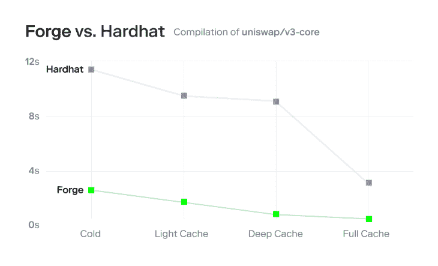
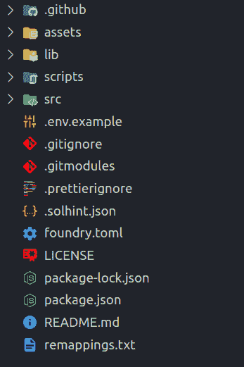
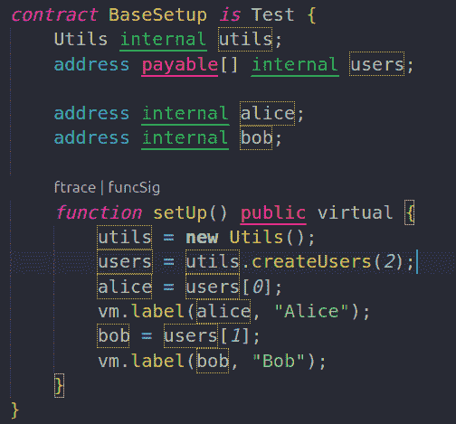
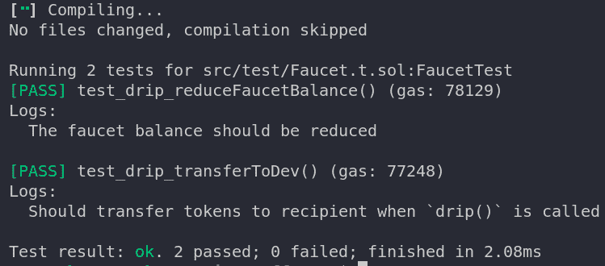
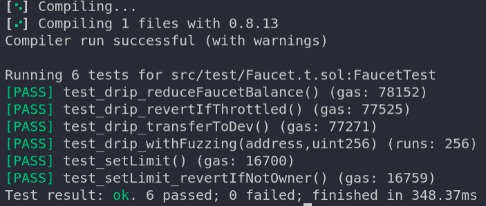

# 用 Forge 进行单元测试和部署智能合约

> 原文：<https://blog.logrocket.com/unit-testing-smart-contracts-forge/>

2021 年 12 月，世界上最大的原生加密投资公司， [Paradigm Lab 的首席技术官圣乔治](https://twitter.com/gakonst)发布了一篇博客，内容是关于(基于 evm 的)智能合约开发的新框架 Foundry 的发布。

它席卷了加密社区，并很快成为开发和测试智能合约的行业标准，这在很大程度上归功于它与其他框架相比的效率。

为了理解铸造的意义，我们需要首先研究它试图解决的问题。

Hardhat 和 Truffle 等框架的主要问题是，它们要求开发人员了解 JavaScript/TypeScript 等脚本语言，以便使用该框架。

由于这些脚本语言是 web 开发的重中之重，solidity 开发人员不需要了解智能合约开发的这种语言，因为它被认为是更加面向后端的。

另一个问题是，hardhat 本身是使用 TypeScript 实现的，因此它比 Foundry 慢，因为后者是使用 Rust 实现的。

(注:如果您有兴趣检查基准，请查看[这个模拟](https://github.com/mds1/convex-shutdown-simulation#convex-system-shutdown-benchmarks))



除此之外，Foundry 还有很多很酷的功能，比如:

*   调用堆栈跟踪
*   交互式调试器
*   内置模糊
*   可靠性脚本

现在，我希望你对 Foundry 和使用 Solidity 测试智能合约的必要性有一个大致的了解。Foundry 附带了两个开箱即用的惊人 CLI 工具:

*   Forge:用于测试和部署智能合约
*   Cast:用于与部署的智能合约进行交互

在本文中，我们将涵盖以下内容:

让我们开始吧。

## 安装铸造车间

安装 Foundry 简单明了。

打开您的终端并运行:

```
curl -L https://foundry.paradigm.xyz | bash && foundryup

```

一旦安装了铸造，你就可以开始使用锻造和铸造了。

对于某些操作系统，你可能想在安装 Foundry 之前[安装 rust](https://www.rust-lang.org/tools/install) 。

## 建立铸造项目

通过运行以下命令，您可以立即设置一个铸造项目

```
forge init <PROJECT_NAME>

```

为了让你的生活更轻松，我创建了一个[模板库](https://github.com/PraneshASP/forge-template)，有了它你可以更轻松地入门。它包含所需的库、脚本和目录设置。因此，您需要做的只是在终端中运行以下命令:

上面的命令创建了一个名为`foundry-faucet`的新目录，并使用我的模板初始化了一个新的 Foundry 项目。这将是目录结构。我们想要关注的重要目录和文件有:



*   **lib:** 这包含了我们将要使用的所有依赖/库。例如，如果我们想使用 Solmate，它将作为 git 子模块驻留在这个文件夹中
*   **脚本:**这个文件夹有所有的脚本，比如部署和验证合同
*   **src:** 该文件夹包含所有合同以及与合同相关的测试
*   **foundry.toml:** 该文件包含当前 foundry 项目的配置选项

我们还应该更新和安装所使用的库；为此，请运行以下命令:

```
git submodule update --init --recursive
forge install

```

## 创建一个简单的水龙头合同

现在，我们将为我们的 ERC20 令牌实现一个水龙头合同，它可以在请求时滴下令牌。我们还可以通过设置一个`limit`来限制每个请求的令牌数量，在我们的契约中，这个值默认为`100`。

打开`*src/Faucet.sol*`文件并添加以下代码:

```
// SPDX-License-Identifier: UNLICENSED
pragma solidity 0.8.13;

import {Ownable} from "openzeppelin-contracts/access/Ownable.sol";
import {IERC20} from "openzeppelin-contracts/token/ERC20/IERC20.sol";

contract Faucet is Ownable {
   /// Address of the token that this faucet drips
   IERC20 public token;

   /// For rate limiting
   mapping(address => uint256) public nextRequestAt;
   /// Max token limit per request
   uint256 public limit = 100;

   /// @param _token The address of the faucet's token
   constructor(IERC20 _token) {
       token = _token;
   }

   /// Used to send the tokens
   /// @param _recipient The address of the tokens recipient
   /// @param _amount The amount of tokens required from the faucet
   function drip(address _recipient, uint256 _amount) external {
       require(_recipient != address(0), "INVALID_RECIPIENT");

       require(_amount <= limit, "EXCEEDS_LIMIT");

       require(nextRequestAt[_recipient] <= block.timestamp, "TRY_LATER");
       nextRequestAt[_recipient] = block.timestamp + (5 minutes);

       token.transfer(_recipient, _amount);
   }

   /// Used to set the max limit per request
   /// @dev This method is restricted and should be called only by the owner
   /// @param _limit The new limit for the tokens per request
   function setLimit(uint256 _limit) external onlyOwner {
       limit = _limit;
   }
}

```

我们的水龙头合同已经添加。现在，我们可以通过运行以下命令来编译合同:

```
forge `build`
```

如果一切顺利，您应该会看到类似的输出:

```
[⠒] Compiling...
[⠒] Compiling 14 files with 0.8.13
Compiler run successful

```

太棒了。我们已经成功地建立了我们的铸造项目，并编制了我们的合同，没有任何错误！干得好，阿农🎉

现在，我们可以开始测试我们的水龙头合同。

## 使用 Forge 的单元测试

如你所知，与 Hardhat 不同，Forge 帮助我们使用 Solidity 编写单元测试。

如果您打开`src/test/Faucet.t.sol`文件，您将会看到一些 utils 的导入和一个 BaseSetup 契约。



它有一些初始设置，初始化一些我们可以在测试中使用的变量。此外，`setUp()`功能类似于 hardhat 中的`beforeEach`,它在每次测试前运行。

`setUp()`函数创建了两个地址，并将它们标记为`Alice`和`Bob`。当您尝试通过调用跟踪进行调试时，这很有帮助，因为标签与地址一起出现在跟踪中。

(注意:vm.label 被称为 cheatcode，它是特定于 Forge 的；它通过在测试环境中与虚拟机交互来帮助我们做一些特殊的操作。在本文的过程中，我们将会看到更多的欺骗代码。关于完整的代码列表，你可以[参考这个链接](https://github.com/sambacha/foundry-docs/blob/master/FORGE.md#cheat-codes)

用下面的代码替换`Faucet.t.sol`,开始单元测试；

* * *

### 更多来自 LogRocket 的精彩文章:

* * *

```
// SPDX-License-Identifier: MIT
pragma solidity >=0.8;

import {console} from "forge-std/console.sol";
import {stdStorage, StdStorage, Test} from "forge-std/Test.sol";
import {IERC20} from "openzeppelin-contracts/token/ERC20/IERC20.sol";

import {Utils} from "./utils/Utils.sol";
import {Faucet} from "../Faucet.sol";
import {MockERC20} from "../MockERC20.sol";

contract BaseSetup is Test {
   Utils internal utils;
   Faucet internal faucet;
   MockERC20 internal token;

   address payable[] internal users;
   address internal owner;
   address internal dev;
   uint256 internal faucetBal = 1000;

   function setUp() public virtual {
       utils = new Utils();
       users = utils.createUsers(2);
       owner = users[0];
       vm.label(owner, "Owner");
       dev = users[1];
       vm.label(dev, "Developer");

       token = new MockERC20();
       faucet = new Faucet(IERC20(token));
       token.mint(address(faucet), faucetBal);
   }
}

```

你可以看到，我们现在已经创建了新的状态变量，如`faucet`、`token`，并且为了便于解释，我们还将`alice`和`bob`重命名为`owner`和`dev`。在这个上下文中，`dev`是向水龙头请求令牌的人，而`owner`是水龙头本身的所有者。

在`setUp()`方法的最后三行中，我们为水龙头部署了一个模拟令牌，在`new Faucet()`(水龙头部署)的构造函数中传递它的地址，然后调用并铸造一些令牌到部署的水龙头契约中。

现在，我们将继承`BaseSetup`合同，为我们的水龙头合同编写单元测试。

在`BaseSetup`契约下，添加以下代码:

```
contract FaucetTest is BaseSetup {
   uint256 amountToDrip = 1;

   function setUp() public override {
       super.setUp();
   }

```

如前所述，`setUp()`方法在所有测试用例之前运行，这里我们通过`super.setUp()`调用基础契约的`setUp()`方法，也就是`BaseSetup`契约。

好了，现在让我们开始为我们的合同添加单元测试。在 FaucetTest 契约的`setUp()`方法的正下方，添加以下代码:

```
   function test_drip_transferToDev() public {
       console.log(
           "Should transfer tokens to recipient when `drip()` is called"
       );
       uint256 _inititalDevBal = token.balanceOf(dev);

       /// Make sure that initial dev balance is Zero
       assertEq(_inititalDevBal, 0);

       /// Request some tokens to the dev wallet from the wallet
       faucet.drip(dev, amountToDrip);

       uint256 _devBalAfterDrip = token.balanceOf(dev);

      /// The difference should be equal to the amount requested from the faucet
       assertEq(_devBalAfterDrip - _inititalDevBal, amountToDrip);
   }

```

上面的代码帮助我们测试`drip()`方法。工作流程很简单。

1.  首先，将 dev 的初始余额存储在一个变量中(_ inititalDevBal)
2.  确保它是 0，因为我们没有为 dev 铸造任何令牌。这就是行`assertEq(_inititalDevBal, 0);`的作用
3.  然后从`faucet`契约实例中调用`drip()`方法
4.  调用`drip()`后，取`dev`的余额
5.  在`drip()`之前和之后的`dev`账户余额之间的差应该等于`amountToDrip`，其作为状态变量存储在 FaucetTest 契约中

现在，让我们保存文件并运行测试:`forge **test**`。

您应该会在终端中看到类似如下的输出:


酷！让我们再增加一些测试。

上面的测试验证了`drip()`方法将令牌传递给了`dev`。因此，我们还应该检查转移是否有效，这意味着水龙头的令牌余额应该减少。

在下面添加以下测试——`test_drip_transferToDev()`方法。

```
 function test_drip_reduceFaucetBalance() public {
       console.log("The faucet balance should be reduced");
       faucet.drip(dev, amountToDrip);
       assertEq(token.balanceOf(address(faucet)), faucetBal - amountToDrip);
   }

```

这确保了 dev 收到的令牌实际上是从水龙头发出的——如果是这样，水龙头的余额应该减少。

我们可以通过再次运行测试套件来确认:`forge test`

如果一切顺利，那么您的输出应该类似于以下内容:


太棒了。如果你已经注意到，我们在测试用例中有`console.log`语句，但是它们没有显示在控制台中。原因是 Forge 默认不显示日志。为了显示日志，我们需要运行 verbosity 2 : `forge test -vv`命令来显示日志。



此外，如果您的契约发出了任何事件，您可以在详细程度为三(-vvv)的测试中查看它们。您可以为您的测试获得详细的调用跟踪，详细程度高达五级，这有助于更好地调试。

好吧，让我们继续添加更多的测试。现在我们将测试我们的速率限制机制。在使用相同的收件人地址呼叫`drip()`之前，应至少间隔五分钟。

```
   function test_drip_revertIfThrottled() public {
       console.log("Should revert if tried to throttle");
       faucet.drip(dev, amountToDrip);

       vm.expectRevert(abi.encodePacked("TRY_LATER"));
       faucet.drip(dev, amountToDrip);
   }

```

`vm.expectRevert(bytes32)`是另一个欺骗代码，它检查下一个调用是否返回给定的错误消息。在这种情况下，错误消息是`TRY_LATER`。它接受字节形式的错误信息，而不是字符串，因此我们使用了`abi.encodePacked`。

如果你还记得的话，我提到过锻造船要有现成的引信。让我们试一试。

我们将测试`test_drip_transferToDev`和`test_drip_reduceFaucetBalance`结合起来，而不是手动传递输入，我们将允许 fuzzer 输入值，这样我们就可以确保我们的契约处理不同的输入。

```
   function test_drip_withFuzzing(address _recipient, uint256 _amount) public {
       console.log("Should handle fuzzing");
       /// inform the constraints to the fuzzer, so that the tests don't revert on bad inputs.
       vm.assume(_amount <= 100);
       vm.assume(_recipient != address(0));
       uint256 _inititalBal = token.balanceOf(_recipient);
       faucet.drip(_recipient, _amount);
       uint256 _balAfterDrip = token.balanceOf(_recipient);
       assertEq(_balAfterDrip - _inititalBal, _amount);
       assertEq(token.balanceOf(address(faucet)), faucetBal - _amount);
   }

```

模糊化是基于属性的测试。Forge 将对任何至少需要一个参数的测试应用模糊化。

当您执行测试套件时，您可以在输出中找到以下行:

```
[PASS] test_drip_withFuzzing(address,uint256) (runs: 256)
```

从上面的输出我们可以推断出，Forge fuzzer 调用了 test _ drip _ withFuzzing()方法`256`次，使用了随机输入。然而，我们可以使用`FOUNDRY_FUZZ_RUNS`环境变量覆盖这个数字。

现在，让我们为所有者专用的方法`setLimit()`添加几个测试

```
function test_setLimit() public {
       console.log("Should set the limit when called by the owner");
       faucet.setLimit(1000);

       /// the limit should be updated assertEq(faucet.limit(), 1000); } function test_setLimit_revertIfNotOwner() public { console.log("Should revert if not called by Owner"); /// Sets the msg.sender as dev for the next tx vm.prank(dev); vm.expectRevert(abi.encodePacked("Ownable: caller is not the owner")); faucet.setLimit(1000); }
```

在`test_setLimit_revertIfNotOwner()`方法中，使用了新的 cheatcode `vm.prank(address)`。它通过用给定的地址覆盖 msg.sender 来欺骗 VM；在我们的例子中是`dev`。因此，当我们的水龙头合同继承了`Ownable`合同时，`setLimit()`应该恢复为`caller is not the owner`消息。

好的，让我们通过再次运行`forge test`来确保没有测试失败。



亲爱的🥳，现在是部署的时候了。

## 合同部署到科万测试网

从`.env.example`文件创建一个新文件，命名为`.env`。请填写您的 INFURA_API_KEY 和 PRIVATE_KEY(用 Kovan testnet 基金)。

一旦填充了所有字段，就可以部署到 Kovan 了。在部署水龙头之前，我们需要部署我们的 ERC20 令牌。

您可以在`scripts`目录中找到部署脚本，并通过执行`./scripts/deploy_token_kovan.sh` bash 脚本将 MockERC20 令牌部署到 Kovan testnet。

输出如下所示:

```
*Deployer: (YOUR_DEPLOYMENT_ADDRESS)*

*Deployed to: 0x1a70d8a2a02c9cf0faa5551304ba770b5496ed80*

*Transaction hash: 0xa3780d2e3e1d1f9346035144f3c2d62f31918b613a370f416a4fb1a6c2eadc77*
```

为了确保事务确实通过了，您可以在[https://kovan . etherscan . io](https://kovan.etherscan.io)中搜索事务散列

复制`Deployed to:`地址，因为它是我们应该用于部署水龙头契约的 MockERC20 令牌的地址。要部署水龙头，您可以执行`*./scripts/deploy_faucet_kovan.sh*`脚本。

它将提示您输入令牌地址；然后输入之前部署的复制的 MockERC20 令牌地址。

输出应该如下所示:


哇哦🚀🚀我们已经使用 Forge 成功地编译、测试和部署了我们的合同到 Kovan testnet

我们仍然需要在 Etherscan 上验证合同，并在水龙头上铸造一些 MockERC20 令牌(您可以使用 cast 来完成这项工作！)使其按预期工作。我把这个留给你们，作为自己尝试的一个练习！

和往常一样，您可以在这里找到本文[的 GitHub 资源库。](https://github.com/PraneshASP/foundry-faucet)

## 结论

在这篇文章中，我们只涉及了一些伪造。Foundry 是智能合约的一个非常强大的框架，它也在快速发展。

还有更酷的特性，如代码覆盖、契约验证、gas 快照、调用跟踪和交互式调试。通过测试更多的功能，您可以随意地玩回购。快乐编码🎊

## 加入像 Bitso 和 Coinsquare 这样的组织，他们使用 LogRocket 主动监控他们的 Web3 应用

影响用户在您的应用中激活和交易的能力的客户端问题会极大地影响您的底线。如果您对监控 UX 问题、自动显示 JavaScript 错误、跟踪缓慢的网络请求和组件加载时间感兴趣，

[try LogRocket](https://lp.logrocket.com/blg/web3-signup)

.

[](https://lp.logrocket.com/blg/web3-signup)[https://logrocket.com/signup/](https://lp.logrocket.com/blg/web3-signup)

LogRocket 就像是网络和移动应用的 DVR，记录你的网络应用或网站上发生的一切。您可以汇总和报告关键的前端性能指标，重放用户会话和应用程序状态，记录网络请求，并自动显示所有错误，而不是猜测问题发生的原因。

现代化您调试 web 和移动应用的方式— [开始免费监控](https://lp.logrocket.com/blg/web3-signup)。