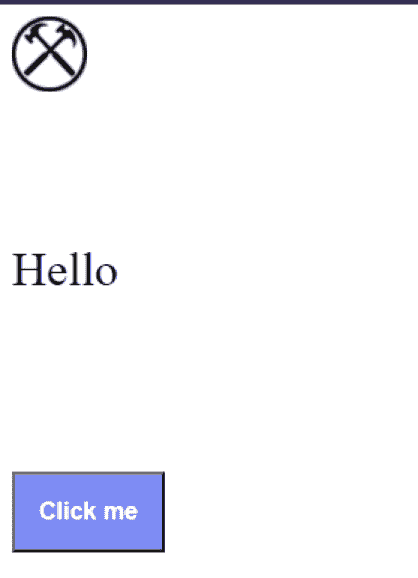
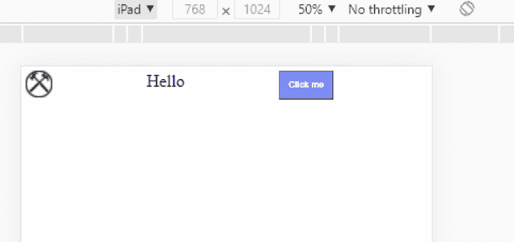
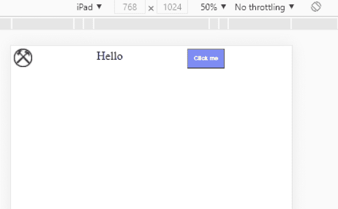

# 用原子布局升级你的 CSS 布局

> 原文：<https://blog.logrocket.com/upgrade-your-css-layouts-with-atomic-layout/>

Material UI、Bootstrap 和 Ant Design 等前端库通过简化布局和提高开发速度，使开发人员的工作变得更加轻松。然而，Atomic Layout，一个新的库，使用一种完全不同的方法来创建可重用的布局单元。

当我们使用现有的前端库创建特定的布局时，组件和间距取决于上下文，反之亦然。这种相互依赖使得布局样式不灵活，当开发人员试图进行任何改进或修改时，这让他们很头疼。

原子布局遵循[原子设计原则](https://atomicdesign.bradfrost.com/chapter-2/)，并使用 [CSS 网格](https://blog.logrocket.com/how-to-use-css-grid-to-build-a-responsive-web-layout/)来创建可重用的布局单元。它通过分离空间和组件来避免相互依赖，从而为创建布局创建上下文无关的单元。

在本文中，我们将安装原子布局，并用适当的例子来探索这些概念。我们开始吧！

## 装置

原子布局是一个基于 React 的库，它使用样式化的组件。首先创建一个 React 应用程序并安装所需的包。

安装创建 React 应用程序:

```
$ npx create-react-app atomic-layout

```

安装样式组件:

```
$ npm i styled-components atomic

```

## 履行

原子布局中的一切都遵循组合，组合是由多个子元素组成的实际物理实体。例如，标题是徽标、菜单和导航操作的组合。

我们将创建一个带有图像、一些文本和一个按钮的响应式 card 元素。创建一个名为`Card.js`的新文件，并将以下代码粘贴到其中:

```
import React from 'react'

export default function Card() {
    return (
        <div>
            <p>Hello</p>
        </div>
    )
}

```

现在我们的 React 元素已经创建好了，让我们从原子布局中导入`composition`组件，并将其包装在 React 组件周围，如下所示:

```
import React from 'react'
import { Composition } from 'atomic-layout'

export default function Card() {
    return (
        <Composition>
            <p>Hello</p>
        </Composition>
    )
}

```

`composition`组件接受一个`area`道具，该道具定义了我们布局的蓝图。我们将该区域定义为一个字符串，并将其传递给我们的`composition`组件:

```
import React from 'react'
import { Composition } from 'atomic-layout'

const areasPhone = `
  image
  text
  button
`
export default function Card() {
    return (
        <Composition areas={areasPhone}>
            <p>Hello</p>
        </Composition>
    )
}

```

`area` prop 接受该值，使 React `area`组件可用。可以通过子渲染函数访问它们，如下所示:

```
import React from 'react'
import { Composition } from 'atomic-layout'

const areasPhone = `
  Image
  Text
  Button
`
export default function Card() {
    return (
        <Composition areas={areasPhone}>
        {(Areas) => (
      <> 
        <Areas.Image>Image</Areas.Image>
        <Areas.Text>Text</Areas.Text>
        <Areas.Button>Button</Areas.Button>
      </>
    )}       
     </Composition>
    )
}

```

现在，我们已经准备好接受内容的基本卡组件。概括地说，我们制作了几个样式化的组件，并将它们导入到我们的`Card.js`中。

现在，使用以下脚本运行项目:

```
$ npm start 
```

我们将得到以下输出:


在这张图片中，你会看到三个不同的区域。我们可以通过为我们的作品提供额外的道具来定义它们之间的空间关系。让我们通过向`composition`组件添加一个名为`gap`的道具来指定网格元素之间 100px 的间距:

```
<Composition areas={areasMobile} gap={100}>
{(Areas) => (
<Areas.Image><Image src="https://www.clker.com/cliparts/R/S/Z/4/t/f/crossed-hammers-bw-100x100-md.png"></Image></Areas.Image>

        <Areas.Text><Text>Hello</Text></Areas.Text>
        <Areas.Button><Button>Click me</Button></Areas.Button>

)}
</Composition>

```

您将看到以下内容:



## 响应道具

我们可以通过定义一个新的蓝图来使我们的卡组件具有响应性。假设我们想为平板电脑调整我们的卡组件。创建另一个字符串模板:

```
const areasTablet = `
Image Text Button
`

```

我们这里有个问题。我们不能将 card 组件传递给我们的`areas` prop，因为它已经有了一个电话显示的值，这是原子布局中的默认设置。

为了解决这个问题，我们将使用 responsive props，它的结构是`Prop name +Breakpoint + Behavior` 。

### 断点

断点是我们的布局获得新状态的特定条件，我们可以使用断点给`area`属性分配不同的值。合成的道具采用不同的断点，默认情况下，原子布局使用移动设备的断点`xs`。

原子布局使用[引导 4 个断点](https://getbootstrap.com/docs/4.0/layout/grid/#grid-options):

| 名字 | `xs` | `sm` | `md` | `lg` | `xl` |
| --- | --- | --- | --- | --- | --- |
| 荧光屏宽度 | < 576 像素 | ≥576px | ≥768 像素 | ≥992px | ≥1200px |

### 行为

行为简单地定义了如何应用道具。它具有以下值:

*   `up`:将 prop 应用到指定断点及以上。这是默认行为。例如，如果 up 与`md`一起使用，道具将从`md`应用到`xl`
*   `down`:将 prop 应用到指定断点并向下。例如，如果 down 与`md`一起使用，道具将从`md`应用到`xs`
*   `only`:仅将道具应用于指定的断点

对于中等尺寸的屏幕，我们可以在构图中使用`areaTablet`:

```
<Composition areas={areasMobile} gap={100} areasMd={areasTablet} gapMd={10}

>
{(Areas) => (
  <Areas.Image><Image src="https://www.clker.com/cliparts/R/S/Z/4/t/f/crossed-hammers-bw-100x100-md.png"></Image></Areas.Image>

        <Areas.Text><Text>Hello</Text></Areas.Text>
        <Areas.Button><Button>Click me</Button></Areas.Button>

)}
</Composition>

```

让我们再次运行我们的项目，检查布局是否已经针对平板电脑进行了调整:



我们使用`Md`断点来获得由`areaTablet`为 iPad 设置的精确输出。原子布局中的每个道具都可以响应，这可以将开发速度提升到一个全新的水平。

## 内容可见性

原子布局允许我们使用 [`Visible`组件](https://redd.gitbook.io/atomic-layout/api/components/visible)来设置内容的可见性，这是一个包装子元素的实用组件，允许它们在满足某些条件时变得可见，比如特定的断点或窗口宽度。我们可以使用没有 CSS 的`Visible`组件。

从包中导入`Visible`组件并用它包装你的区域。`Visible`组件接受断点作为道具。我们的代码现在应该看起来像下面的代码片段:

```
import React from 'react'
import { Composition, Visible } from 'atomic-layout'
import Button from './Button'
import Text from './Text'
import Image from './Image'

const areasPhone = `
  Image
  Text
  Button
`
const areasTablet = `
Image Text Button

`
export default function Card() {
    return (
        <Composition areas={areasPhone} areasMd={areasTablet} gap={0} gapMd={0}>
        {(Areas) => (
      <> 
        <Areas.Image><Image src="https://www.clker.com/cliparts/R/S/Z/4/t/f/crossed-hammers-bw-100x100-md.png"></Image></Areas.Image>

        <Visible for='md'>
            <Areas.Text><Text>Hello</Text></Areas.Text>
  </Visible>

        <Areas.Button><Button>Click me</Button></Areas.Button>

      </>
    )}       
     </Composition>
    )
}

```

文本只能在中等大小的屏幕上看到。让我们再次运行我们的项目，检查我们是否可以在移动屏幕上看到文本:


当我们使用移动显示器时，文本是隐藏的。切换到平板电脑将使其可见:



## 结论

让我们回顾一下原子布局与其他前端库的不同之处。

### 独立组件

组合中的区域是独立的，因为它们的间距不受特定上下文的约束，有助于创建平滑和可重用的布局。

### 提升 CSS 网格

CSS 网格功能强大。在我看来，这是未来的布局位置。虽然其他库大多是基于 Flexbox 的，但 Atomic Layout 对 CSS Grid 的使用使其能够适应未来。

### 间隔

原子布局的主要焦点是以可能的最佳方式分配间距。原子布局有效地定义了布局组成，而不是使用行和列。

### 快速生产

由于像 responsive props 和 Visibility 组件这样的特性，在原子布局中处理动态内容既简单又快速。开发人员无需编写一行 CSS 就可以制作出产品级的布局，并且仍然可以获得响应结果。

### 一致

使用原子布局创建的布局响应速度非常快，并且共享全局设置，使整个应用程序统一起来。

与其他库不同，原子布局只关注一件事:处理间距和布局结构。Atomic Layout 通过提供无与伦比的开发体验而表现出色。

现在，您已经拥有了开始使用原子布局所需的一切。编码快乐！

* * *

### 更多来自 LogRocket 的精彩文章:

* * *

## 你的前端是否占用了用户的 CPU？

随着 web 前端变得越来越复杂，资源贪婪的特性对浏览器的要求越来越高。如果您对监控和跟踪生产环境中所有用户的客户端 CPU 使用、内存使用等感兴趣，

[try LogRocket](https://lp.logrocket.com/blg/css-signup)

.

[](https://lp.logrocket.com/blg/css-signup)[https://logrocket.com/signup/](https://lp.logrocket.com/blg/css-signup)

LogRocket 就像是网络和移动应用的 DVR，记录你的网络应用或网站上发生的一切。您可以汇总和报告关键的前端性能指标，重放用户会话和应用程序状态，记录网络请求，并自动显示所有错误，而不是猜测问题发生的原因。

现代化您调试 web 和移动应用的方式— [开始免费监控](https://lp.logrocket.com/blg/css-signup)。