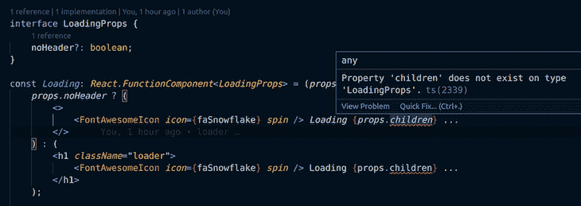

# 使用 TypeScript 升级到 React 18-log rocket 博客

> 原文：<https://blog.logrocket.com/upgrading-react-18-typescript/>

React 类型定义升级到支持 React 18 涉及一些重大的突破性变化。这篇文章深入探讨了这个问题，并分析了升级的途径。

## 反应 18，明确打字

经过相当长一段时间的 alpha 和 beta 测试，React 18 [于 2022 年 3 月 29 日](https://reactjs.org/blog/2022/03/29/react-v18.html)发货。自从第一个 alpha 版本发布以来，TypeScript 中的[已经提供了支持。](https://blog.logrocket.com/how-to-use-typescript-with-react-18-alpha/)

这已经通过在[明确类型化的类型定义](https://github.com/DefinitelyTyped/DefinitelyTyped)成为可能，这是一个高质量类型脚本类型定义的存储库。这尤其归功于[塞巴斯蒂安·西尔伯曼](https://twitter.com/sebsilbermann)的出色工作，他为 React 18 定义做了大量工作。

现在 React 18 已经发布，在 Sebastian 的 pull 请求中，React 18 的类型定义已经被更新。许多项目已经并将会因为这种变化而中断。这篇文章将会看看这种破损会是什么样子以及如何解决它。

在此之前，我们先来考虑一下明确类型化和[语义版本化](http://semver.org/)的问题。

## 明确类型化和语义版本化

人们习惯于在他们消费的软件中使用语义版本化的概念。他们期望一个主要的版本冲击来指示突破性的改变。这正是 React 刚刚通过从 v17 增加到 v18 所做的。

明确类型化不支持语义版本控制。

这不是出于恶意。这是因为 DT 有意在`@types`的范围下向 npm 发布类型定义。所以，例如，React 的类型定义被发布到 [`@types/react`](https://www.npmjs.com/package/@types/react) 。

值得注意的是，npm 是建立在语义版本化之上的。为了使类型定义的使用更容易，类型定义包的版本将试图模拟它所支持的 npm 包的版本。所以对于 [`react`](https://www.npmjs.com/package/react) `18.0.0`，对应的类型定义会是[`@types/react`](https://www.npmjs.com/package/@types/react)`18.0.0`。

如果对`@types/react`类型定义(或任何其他类型定义)有重大改变，那么发布的新版本将不会增加主版本号或次版本号。

增量将仅应用于补丁号。这样做是为了通过 npm 维护更简单的类型消费模型。

## 反应 18:中断类型更改

也就是说，对于广泛使用的类型定义来说，尽可能地减少破坏性的改变并不罕见。

作为一个题外话，有趣的是知道明确类型化的自动化工具将类型定义分成三类:“每个人都喜欢的”、“受欢迎的”和“关键的”。感谢[安德鲁·布兰奇](https://twitter.com/atcb/status/1438559981838626817)的分享！React 被广泛使用，被认为是“关键的”。

当 Sebastian 提交[一个 pull 请求](https://github.com/DefinitelyTyped/DefinitelyTyped/pull/56210)来升级 TypeScript React 类型定义时，这个机会被用来进行突破性的更改。这些并不都与反应 18 直接相关。许多人正在修复 React 类型定义的长期问题。

Sebastian 写的关于拉动请求的文章非常好，我鼓励您阅读。以下是重大变化的摘要:

1.  去除隐含的孩子
2.  从`ReactFragment`中移除`{}`(与 1 相关。)
3.  `this.context`变成了`unknown`
4.  使用`noImplicitAny`现在强制一个类型由`useCallback`提供
5.  移除不推荐使用的类型，以与官方的 React 类型保持一致

其中，去除含蓄的孩子是最具突破性的变化，塞巴斯蒂安[写了一篇博客文章来解释原因。他也写了一个](https://solverfox.dev/writing/no-implicit-children)[代码来帮助](https://github.com/eps1lon/types-react-codemod)。

考虑到这一点，让我们去升级一个代码库来实现 React 18 吧！

## 升级

为了演示升级是什么样子，我将升级我阿姨的网站。这是一个相当简单的网站，升级请求[可以在这里](https://github.com/johnnyreilly/poor-clares-arundel-koa/pull/69)找到。

首先要做的是在`package.json`中升级 React 本身:

```
-    "react": "^17.0.0",
-    "react-dom": "^17.0.0",
+    "react": "^18.0.0",
+    "react-dom": "^18.0.0",

```

接下来，我们将升级我们的类型定义:

```
-    "@types/react": "^17.0.0",
-    "@types/react-dom": "^17.0.0",
+    "@types/react": "^18.0.0",
+    "@types/react-dom": "^18.0.0",

```

当你安装你的依赖项时，检查你的锁文件(`yarn.lock` / `package-lock.json`等)。重要的是，你只有`@types/react`和`@types/react-dom`包是 18+版上市。

现在您的安装已经完成，我们开始看到以下错误消息:

> 类型“LoadingProps”上不存在属性“children”。ts(2339)

…在以下代码中:

```
interface LoadingProps {
  // you'll note there's no `children` prop here - this is what's prompting the error message
  noHeader?: boolean;
}

// if props.noHeader is true then this component returns just the icon and a message
// if props.noHeader is true then this component returns the same but wrapped in an h1
const Loading: React.FunctionComponent<LoadingProps> = (props) =>
  props.noHeader ? (
    <>
      <FontAwesomeIcon icon={faSnowflake} spin /> Loading {props.children} ...
    </>
  ) : (
    <h1 className="loader">
      <FontAwesomeIcon icon={faSnowflake} spin /> Loading {props.children} ...
    </h1>
  );

```



我们在这里看到的是“去除隐性儿童”在起作用。在我们升级之前，所有的`React.Component`和`React.FunctionComponent`都有一个`children`属性，这使得 React 用户可以在不声明的情况下使用它。

现在情况不再是这样了。如果你有一个带有`children`的组件，你必须显式地声明它们。

在我的例子中，我可以通过直接添加一个`children`属性来解决这个问题:

```
interface LoadingProps {
  noHeader?: boolean;
  children: string;
}

```

但是当你可以让别人替你写代码的时候，为什么还要写代码呢？

让我们用 Sebastian 的 codemod 来代替吧。为此，我们只需输入以下命令:

```
npx types-react-codemod preset-18 ./src

```

当它运行时，您应该会看到这样的提示:

```
? Pick transforms to apply (Press <space> to select, <a> to toggle all, <i> to invert selection, and <enter> to proceed)
❯◉ context-any
 ◉ deprecated-react-type
 ◉ deprecated-sfc-element
 ◉ deprecated-sfc
 ◉ deprecated-stateless-component
 ◉ implicit-children
 ◉ useCallback-implicit-any

```


我将选择`a`并让 codemod 运行。对于我自己的项目，更新了 37 个文件。对所有文件都是一样的修改。在每种情况下，组件的道具都由`React.PropsWithChildren`包装。让我们看看我们的`Loading`组件是什么样子的:

```
-const Loading: React.FunctionComponent<LoadingProps> = (props) =>
+const Loading: React.FunctionComponent<React.PropsWithChildren<LoadingProps>> = (props) =>

```

`PropsWithChildren`很简单；它只是把`children`加了回来，就像这样:

```
type PropsWithChildren<P> = P & { children?: ReactNode | undefined };

```

这解决了我们之前遇到的编译问题；不再报告任何类型问题。

## 结论

我们现在明白了 React 18 中的突破性类型变化是如何出现的，并且我们知道如何使用方便的 codemod 来升级我们的代码库。

感谢 Sebastian Silbermann 不仅将这项工作投入到类型定义的最佳状态中，而且使得社区升级更加容易。

## 使用 LogRocket 消除传统反应错误报告的噪音

[LogRocket](https://lp.logrocket.com/blg/react-signup-issue-free)

是一款 React analytics 解决方案，可保护您免受数百个误报错误警报的影响，只针对少数真正重要的项目。LogRocket 告诉您 React 应用程序中实际影响用户的最具影响力的 bug 和 UX 问题。

[ ](https://lp.logrocket.com/blg/react-signup-general) [  ](https://lp.logrocket.com/blg/react-signup-general) [LogRocket](https://lp.logrocket.com/blg/react-signup-issue-free)

自动聚合客户端错误、反应错误边界、还原状态、缓慢的组件加载时间、JS 异常、前端性能指标和用户交互。然后，LogRocket 使用机器学习来通知您影响大多数用户的最具影响力的问题，并提供您修复它所需的上下文。

关注重要的 React bug—[今天就试试 LogRocket】。](https://lp.logrocket.com/blg/react-signup-issue-free)