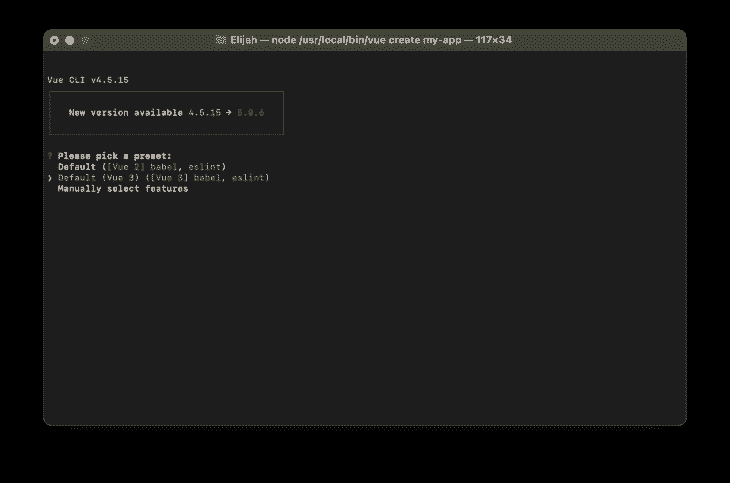
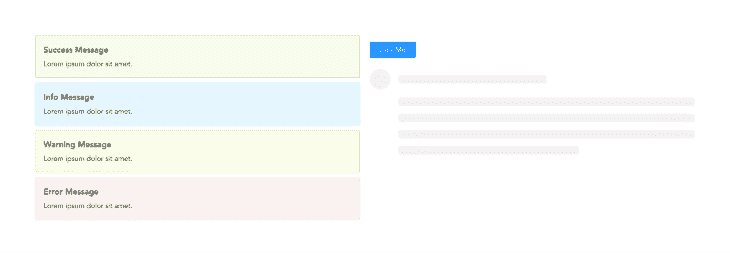
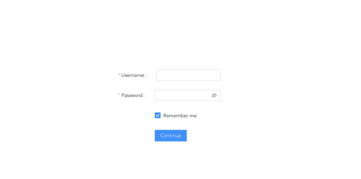
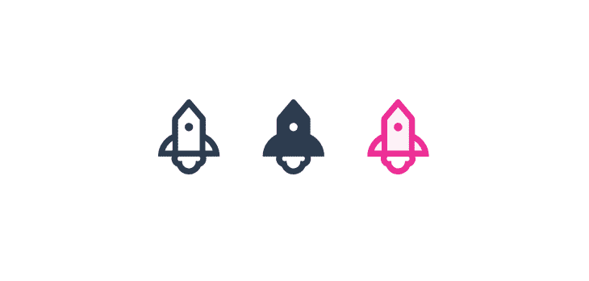
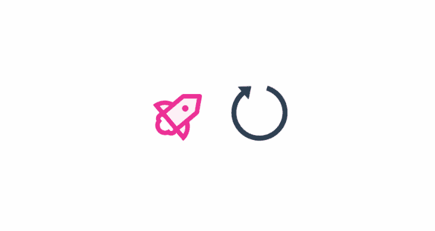

# 如何使用蚂蚁设计与 Vue 3 

> 原文：<https://blog.logrocket.com/use-ant-design-vue-3/>

Ant Design 是一个开源库，允许您创建有吸引力、有响应的网站。如果您想使用一个既经过良好测试又易于学习的框架，这是您下一个项目的绝佳选择。

另一方面，Vue.js 是一个用于创建用户界面的渐进式框架。它旨在简单易学，同时具有灵活性和可定制性。结合使用这两者，你可以比以前更快地创建响应性网站。

Ant 设计和 Vue 3 中包含的 Composition API 使得在编写有限代码的同时创建美观、响应迅速且可伸缩的应用程序变得简单。

在这个简短的指南中，我们将了解如何在 Vue 3 应用程序中使用 ant-design-vue 包，以及如何使用 ant 图标系统。

## 入门指南

还值得一提的是，这里描述的所有方法都可以用于由 Vue CLI 和 Vite 生成的 Vue 3 项目。

### 创建新的 Vue 3 应用程序

让我们从运行以下命令创建一个新的 Vue 3 应用程序开始:

```
vue create my-app
# OR Vite
npm init [email protected]
```

如果您使用的是 Vue CLI，请确保选择 Vue 3 作为您的首选预设，如下图所示:



### 安装 ant-design-vue

您可以使用以下命令轻松地将 ant-design-vue 包添加到您的 Vue 3 项目中:

```
npm install ant-design-vue
# OR 
yarn add ant-design-vue
```

一旦安装完成，我们就可以开始在我们的项目中注册它。

一种方法是在我们的项目中全局注册这个包，这样我们可以从任何地方引用它的组件。这可以通过用下面的代码更新条目`src/main.js`文件来实现:

```
import { createApp } from "vue";
import App from "./App.vue";

import Antd from "ant-design-vue";
import "ant-design-vue/dist/antd.css";

const app = createApp(App);
app.use(Antd).mount("#app");
```

这样，我们就可以开始在我们的应用程序中使用它的组件，而不必进行任何额外的导入:

```
<!-- components/Sample.vue -->
<template>
  <a-button type="primary">Primary Button</a-button>
  <a-button>Default Button</a-button>
  <a-button type="dashed">Dashed Button</a-button>
</template>
```

您也可以根据需要导入单个组件:

```
<!-- components/Sample.vue -->
<template>
  <div>
    <Button type="primary">Primary Button</Button>
    <Button>Default Button</Button>
    <Button type="dashed">Dashed Button</Button>
  </div>
</template>

<script setup>
import { Button } from "ant-design-vue";
import "ant-design-vue/dist/antd.css";
</script>
```

正如您可能已经注意到的，我们还将 Ant Design CSS 文件导入到这个单一的文件组件中，对我们所有的组件文件进行同样的操作是没有意义的。要解决这个问题，只需将 Ant Design CSS 文件导入到`src/main.js`文件中，文件内容如下所示:

```
import { createApp } from "vue";
import App from "./App.vue";

import "ant-design-vue/dist/antd.css";

createApp(App).mount("#app");
```

为了避免进行额外的导入，我们将假设 ant-design-vue 已经在本文前面的代码示例中进行了全局注册。

## Ant 设计组件

Ant Design 组件包包括几个元素，如按钮、列表、卡片等等，它们都有不同的颜色和大小。图标也可以在主界面和其他组件中使用。但是，让我们从探索基础开始，同时将自定义 Vue 方法和反应数据附加到它们:

```
<template>
  <div>
    <a-row>
      <a-col span="12">
        <div v-for="(alert, i) in alerts" :key="i">
          <a-alert
            :message="alert + ' message'"
            description="Lorem ipsum dolor sit amet."
            :type="alert"
          />
        </div>
      </a-col>
      <a-col span="12">
        <a-button type="primary" @click="message = 'Hello!'">
          {{ message }}
        </a-button>
        <a-skeleton avatar :paragraph="{ rows: 4 }" />
      </a-col>
    </a-row>
  </div>
</template>

<script setup>
import { ref } from "vue";

const alerts = ref(["success", "info", "warning", "error"]);
const message = ref("Click Me!");
</script>

```

上面的代码示例演示了如何使用 Vue 3 setup sugar 语法进行简单的迭代，以及将自定义事件附加到 ant-design-vue 组件。我们开发了一个两列网格系统，其中第一列显示一个按钮和一个框架加载器组件，而第二列基本上遍历我们的警报数组，并使用它们的数据来呈现定制的警报组件。

如果运行我们的应用程序，我们将得到以下结果:



## 表单处理

处理表单数据是任何应用程序中的基本操作。以下是如何使用 ant-design-vue 创建基本表单组件并处理其数据的示例:

```
<template>
  <div>
    <a-form
      :model="formData"
      name="basic"
      autocomplete="off"
      @finish="onSubmit"
      @finishFailed="onError"
    >
      <a-form-item
        label="Username"
        name="username"
        :rules="[{ required: true, message: 'Please input your username!' }]"
      >
        <a-input v-model:value="formData.username" />
      </a-form-item>

      <a-form-item
        label="Password"
        name="password"
        :rules="[{ required: true, message: 'Please input your password!' }]"
      >
        <a-input-password v-model:value="formData.password" />
      </a-form-item>

      <a-form-item name="remember" :wrapper-col="{ offset: 8, span: 16 }">
        <a-checkbox v-model:checked="formData.remember">
          Remember me
        </a-checkbox>
      </a-form-item>

      <a-form-item :wrapper-col="{ offset: 8, span: 16 }">
        <a-button type="primary" html-type="submit">Continue</a-button>
      </a-form-item>
    </a-form>
  </div>
</template>

<script setup>
import { ref } from "vue";

const formData = ref({
  username: "",
  password: "",
  remember: true,
});

const onSubmit = async (_formData) => {
  console.log("Form Submitted!:", _formData);
  const response = await fetch("https://some.api/process-form", {
    method: "POST",
    body: _formData,
  });
};

const onError = (errorInfo) => {
  console.log("Failed:", errorInfo);
};
</script>
```

在上面的代码中，我们用一些默认的空字符串定义了一个反应对象`formData`，并且我们还使用了`v-model`表单绑定来将这些数据绑定到我们的 ant-design-vue 表单输入组件。我们还创建了一个自定义函数`onSubmit`，并将其附加到我们的 ant-design-vue 表单组件，以将我们的表单数据提交给某个虚拟的 API 进行处理，以及一个`onError`函数来处理验证表单时发生的任何错误。

此外，该代码示例显示了 ant-design-vue 组件中包含的自定义属性如何简化验证表单的过程，以及如何使表单可访问。

下面是我们运行应用程序时表单的输出:



如果你想在 Vue 3 中创建复杂的表单，你也应该阅读[这篇关于 v-model](https://blog.logrocket.com/using-v-model-vue-3-build-complex-forms/#creating-the-checkoutform) 的文章。

## 蚂蚁设计图标

图标在使应用程序设计更加丰富和吸引人方面起着重要的作用。蚂蚁设计系统知道。

Ant 设计团队还开发了一个外部包，允许您快速向应用程序添加丰富的图标，包括轮廓图标、实心图标，甚至双色图标。

您可以使用以下工具在 Vue 项目中轻松安装图标包:

```
npm install @ant-design/icons-vue
```

以下是我们如何导入三种不同的火箭图标样式的示例:

```
<template>
  <div>
    <rocket-outlined />
    <rocket-filled />
    <rocket-two-tone two-tone-color="#eb2f96" />
  </div>
</template>

<script setup>
import {
  RocketOutlined,
  RocketFilled,
  RocketTwoTone,
} from "@ant-design/icons-vue";
</script>
```

运行这段代码会产生以下结果:



为了增加额外的交互，我们还可以对任何图标应用自定义的旋转属性。

```
<template>
  <div class="center">
    <rocket-two-tone two-tone-color="#eb2f96" :rotate="50" />
    <reload-outlined spin />
  </div>
</template>

<script setup>
import { RocketTwoTone, ReloadOutlined } from "@ant-design/icons-vue";
</script>
```

这将产生以下输出:



## 结论

蚂蚁设计是一个非常好的工具，可以用最少的努力创建一个网站。这是一个适应性很强的框架，允许你非常灵活地创建简单的网站。在整篇文章中，我们研究了如何在 Vue 3 中使用 ant-design-vue 包。我们还讨论了如何使用 ant-icon 以及如何处理基本的表单提交。

ant-design-vue 包的[文档页面](https://antdv.com/components/overview)是了解所有提供的组件的一个很好的起点。

## 像用户一样体验您的 Vue 应用

调试 Vue.js 应用程序可能会很困难，尤其是当用户会话期间有几十个(如果不是几百个)突变时。如果您对监视和跟踪生产中所有用户的 Vue 突变感兴趣，

[try LogRocket](https://lp.logrocket.com/blg/vue-signup)

.

[](https://lp.logrocket.com/blg/vue-signup)[https://logrocket.com/signup/](https://lp.logrocket.com/blg/vue-signup)

LogRocket 就像是网络和移动应用程序的 DVR，记录你的 Vue 应用程序中发生的一切，包括网络请求、JavaScript 错误、性能问题等等。您可以汇总并报告问题发生时应用程序的状态，而不是猜测问题发生的原因。

LogRocket Vuex 插件将 Vuex 突变记录到 LogRocket 控制台，为您提供导致错误的环境，以及出现问题时应用程序的状态。

更新您调试 Vue 应用程序的方式- [开始免费监控](https://lp.logrocket.com/blg/vue-signup)。