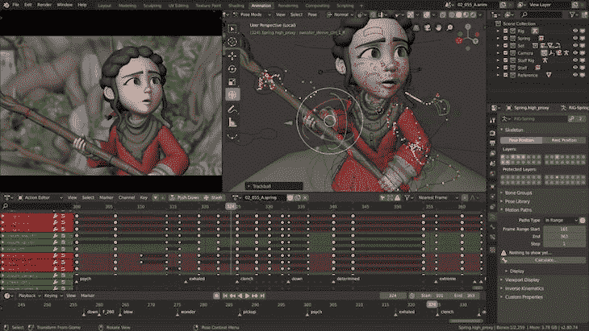
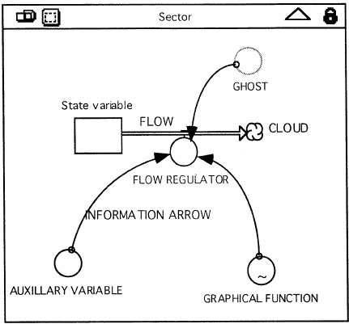
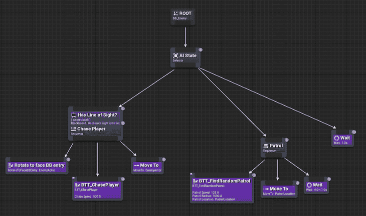
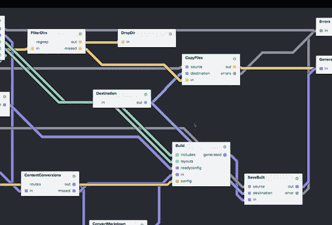
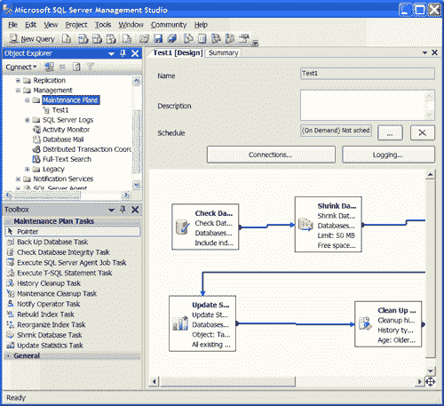

# 当今可视化编程环境的用例

> 原文：<https://blog.logrocket.com/use-cases-visual-programming-environments-today/>

可视化编程环境已经存在了一段时间，有时会与具有用户界面的编程语言相混淆。

当我们谈论可视化编程环境(VPEs)时，我们指的是一种使用图形和图像与计算机进行交流的方式。代替文本，它们在机器代码之上提供了另一个抽象层。

VPE 最常见的用例是用于教育，特别是帮助孩子们学习如何编程。原因应该很明显——它允许使用可视化表达式进行编程，不需要语言或语法知识。

在本文中，我将解释这些环境的用法，以及它们如何帮助孩子进行计算思维，然后继续讨论其他用例以及一些流行的 VPL。

## 为什么在教育中使用可视化编程环境？

即使有了最近的发展，VPEs 的主要目标一直是让计算机通信对每个人来说更容易和更容易，尤其是孩子。在教育背景下，VPEs 为 K-12 学生提供了一个界面，让他们更好地理解编程，或者更好地了解计算思维。

让我们以 Scratch 为例。它专为 K-12 学生设计，允许儿童通过图形化操作元素来创建程序。这让他们对使用视觉表达而不是文本表达的编程概念有了基本的理解。

这些程序提供了一系列可视块，其中每个块包含指令。这种环境允许学生开发算法来解决难题，同时还能获得乐趣。每一系列积木都包含指令，学生可以用这些指令来连接它们。这里的要点是你使用图形而不是文本编程。

由于其可视化、说明性的本质，VPE 是儿童学习如何编码的最佳途径之一；学生更容易将逻辑形象化。与学习和编写大量的语法相反，VPE 提供了一个更为柔和的介绍，介绍逻辑结构应该如何交互。

## 可视化编程的其他用例

虽然可视化编程在历史上主要用于教育目的，但现在已经不是这样了。

VPEs 确实还有其他应用，特别是物联网(IoT)，它仍然落后于其他领域。物联网专注于对象之间的互连，以提供数字和物理对象之间更智能、更高效的通信方法。

很少有人关注物联网编程语言的开发和设计。VPEs 作为增强物联网领域的工具将大有作为，通过缩短开发生命周期来缩短上市时间。

与传统编程语言相比，VPEs 还加快了生物过程研究的定制控制功能的开发。[研究人员确定](https://pubmed.ncbi.nlm.nih.gov/7764735/)在开发生物过程控制的新应用时，LabVIEW VPE 更容易、更灵活、速度更快。

除此之外，VPLs 的新用例还包括多媒体、模拟和自动化、视频游戏开发和商业智能(BI)。下面我们就来探讨这些。

### 多媒体

在过去的几年中，围绕多媒体的开发取得了巨大的发展，包括音乐制作和作曲、3D 动画、交互式 3D 演示、图像处理、视觉效果、3D 打印模型等等。

创建多媒体的工具是交互式的，非常不同于基于文本的编码，尤其是创建音乐和声音的工具。

Blender’s 3D creation suite.

### 模拟

在机器人和模拟行业，模拟和控制工具正在使用可视化和[数据流](https://en.wikipedia.org/wiki/Dataflow_programming) [编程](https://en.wikipedia.org/wiki/Dataflow_programming)语言进行设计。例如，2006 年开发的[微软机器人工作室](https://en.wikipedia.org/wiki/Microsoft_Robotics_Studio)，使用拖放方法来处理其机器人硬件。

VPL 也出现在[系统动力学](https://en.wikipedia.org/wiki/System_dynamics)建模中，这是一种抽象的建模方法，使用数学技术来帮助简化复杂的问题。一个这样的工具是 STELLA(系统思维，带动画的实验学习实验室)，它是一种可视化编程语言。

STELLA model showing the use of its symbols

### 视频游戏

最近的视频游戏已经利用[行为树](https://en.wikipedia.org/wiki/Behavior_tree_(artificial_intelligence,_robotics_and_control)) [s](https://en.wikipedia.org/wiki/Behavior_tree_(artificial_intelligence,_robotics_and_control)) 来模拟 NPC(不可玩角色)的行为。行为树能够通过编程 NPC 的动作或任务来构建复杂的行为模式。使用拖放方法在图形编辑器中创建树形结构。

Behavior tree overview for Unreal Engine.

### 自动化

可视化编程在使用像 Flow 或 Automator 这样的工具创建自动化方面提供了很多帮助。在图形部分，程序员能够制作、排列和链接代表各种任务或概念的图像。该程序然后被编译成可执行程序。

Visual programming using NoFlo.

### 商业智能

在数据集成、数据处理、数据分析等方面。可视化编程语言通过使用图形符号来构建数据集成系统，使得过程更加直观。

这个过程感觉就像是一个流程图，必须在信息之间移动。像 SQL Server Integration Services(SSIS)这样的工具已经被用于迁移、准备、提取数据以及将数据加载到存储中。

Microsoft SQL Server Integration Services (SSIS).

## VPE 的例子

这种环境还挺多的；您可以看到下面的选择，按其使用情形分类:

#### 教育

#### 视频游戏

#### 自动化

#### 模拟

#### 商业智能

特别是对于商业智能工具，每个工具都有自己特定的用例。例如，SSIS 擅长数据迁移，而 IBM Cognos 则帮助进行分析。如果不提供具体的背景，就很难提出最好的建议；每个人都有自己特定的该做和不该做的事情。

## 简要说明什么是虚拟企业

Visual Basic，Visual C#，Visual J#，处理等。不是 VPE，尽管它们提供了一个用户界面来执行诸如调试和编辑之类的活动。

它们都创建可视化，但是它们不应该与 VPE 混淆，因为块、算法等的表示。实际上不是图形，而是文字。这些只是使用一个 GUI 生成器来简化编程。

## 结论

在许多方面，学习基于文本的编程语言和学习口语一样困难。可视化编程语言允许用户创建插图来直观地解释某些编程概念。

可视化编程不仅有助于学习编程概念，还为多媒体制作、模拟、商业智能甚至视频游戏开发等用例提供了重要的解决方案。

这些环境的未来看起来很光明，因为 Amazon 已经决定加入这场游戏，与流行的低代码和无代码平台竞争。

## 使用 [LogRocket](https://lp.logrocket.com/blg/signup) 消除传统错误报告的干扰

[LogRocket](https://lp.logrocket.com/blg/signup) 是一个数字体验分析解决方案，它可以保护您免受数百个假阳性错误警报的影响，只针对几个真正重要的项目。LogRocket 会告诉您应用程序中实际影响用户的最具影响力的 bug 和 UX 问题。

然后，使用具有深层技术遥测的会话重放来确切地查看用户看到了什么以及是什么导致了问题，就像你在他们身后看一样。

LogRocket 自动聚合客户端错误、JS 异常、前端性能指标和用户交互。然后 LogRocket 使用机器学习来告诉你哪些问题正在影响大多数用户，并提供你需要修复它的上下文。

关注重要的 bug—[今天就试试 LogRocket】。](https://lp.logrocket.com/blg/signup-issue-free)