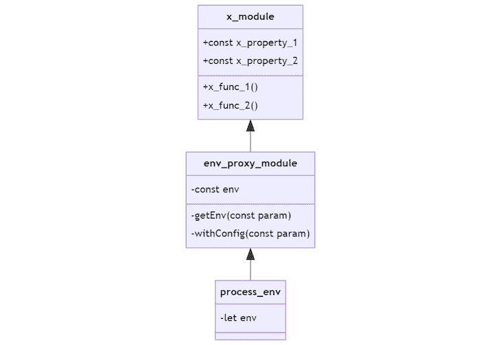

# 如何在 NestJS v9 中使用可配置模块生成器

> 原文：<https://blog.logrocket.com/use-configurable-module-builders-nest-js-v9/>

NestJS 是专门用 TypeScript 构建的 web 框架。大多数有经验的开发人员会在 NestJS 中发现一些熟悉的东西；这是一个强大的面向对象的编程模型，它的语法与另一个框架 Angular 非常相似。

NestJS 代码经常迫使您创建一个最佳的设计模式。从 Java 或 ASP.NET 背景过渡到 Node.js 和 TypeScript 的开发人员将很快理解 NestJS 是如何构造的。像依赖注入、封装、类和类注释或装饰器这样的概念在 NestJS 中都是可用的。

在 NestJS 中，创建一个可重用的定制模块非常简单，而且最重要的是，我们鼓励这样做。将模块封装成小的、可重用的块将有助于提高 NestJS 应用程序的开发速度。而且，如果您决定将这些模块作为开源包发布，您会得到一些好感。

在本文中，我们将探索 NestJS 中的模块，创建我们自己的基本的、可配置的模块。为了跟进，您可以在 GitHub 上访问[的完整代码。我们开始吧！](https://github.com/agustinustheo/configurable-module-builder-example/tree/step-4)

## 什么是 NestJS 模块？

一个模块是一组代码,封装后注入到一个 NestJS 应用程序中。您可以使用模块来创建旨在执行特定任务的定制服务。例如， [TypeORM](https://github.com/nestjs/typeorm) 就是一个基于类型脚本的 ORM。NestJS 团队创建了一个模块，该模块将注入一个开放的数据库连接，允许来自注入模块的数据库命令和查询。

NestJS 模块是框架健壮的依赖注入机制的支柱。依赖注入是一种应用程序开发模式，旨在分离两个类或模块之间的依赖关系。

不用为每个类都严格定义依赖关系，您可以使用一个接口来指定一种契约，说明依赖关系应该如何表现，同时没有它应该如何运行的文字定义。最后，解耦架构支持多种应用，并为应用中的每个模块创建了即插即用的行为。

## NestJS 模块状态管理

默认情况下，NestJS 模块是单例的，这意味着您只需要初始化一个模块一次。虽然从工程的角度来看，为每个模块创建单例似乎有些过分，但是 NestJS [在组件级别](https://github.com/nestjs/nest/issues/47#issuecomment-300283919)初始化单例。

### NestJS 中的模块范围

在 NestJS 中，模块有三个注入范围:

1.  请求级模块
2.  组件级模块或瞬态模块
3.  共享应用程序级模块

默认情况下，大多数 NestJS 模块是应用程序级模块，也称为全局共享模块。但是，不是每个模块都可以是全局模块。其中一些需要保持瞬态或请求级模块。

例如，如果您需要一个应用程序级的只读模块，您最好的选择是使用全局共享模块。存储在模块中的数据不会经常改变，所以它可以作为应用程序级的单例对象被延迟，以节省内存并创建一个全局可访问的类。带有`@Global`装饰器的模块消除了代码和组件级的冗余，因为你不需要重新初始化模块。

为了更好地理解模块级的状态保持，如果在一个具有瞬态或请求范围的模块中有一个常量，它将是一个不可变的变量，直到模块在垃圾收集时销毁它。但是，当使用跨整个应用程序的全局模块时，它只会在应用程序的生命周期结束时被销毁。

## 使用单例时防止数据竞争

使用单例时要小心的另一件事是数据竞争问题。 [Node.js 不能免受](https://stackoverflow.com/questions/21438207/can-node-js-code-result-in-race-conditions)数据竞争条件的影响，NestJS 也是如此。

当两个独立的进程试图同时更新同一个数据块时，就会出现数据争用情况。因为对象是全局可访问的，同时执行数据可能会导致执行时丢失数据点。

避免数据竞争情况的最佳实践包括创建一个全局只读模块，并对每个模块的注入范围更加谨慎。全局模块最容易受到数据竞争条件的影响，使用全局模块在组件之间通信或管理状态将导致反模式。

但是，为什么瞬态组件级模块不能这样说呢？在组件级别，封装障碍只扩展到组件的需求。每个瞬态模块提供程序都有一个专用的实例。组件级的关注点分离通常更细粒度，这使得它比大规模应用程序更容易预测。请求级的单例也是如此，尽管规模较小。

### NestJS 模块注入范围

总之，在 NestJS 中有三种模块注入范围:

1.  请求级模块
2.  组件级模块:瞬态
3.  共享应用程序级模块:全局

每一种都有其优点和缺点，数据竞争是全局模块最常见的问题。大多数全局模块应该是只读的，NestJS 在初始化时只会设置一次原始状态。

组件级模块有更多的细微差别。更具体地说，由于它们的可预测性，您可以将它们用于较小规模的状态管理。单例在组件级提供的粒度封装使其成为组件级状态管理的完美选择。

请记住，数据竞争条件只限于每个独立模块的状态。修改数据库等外部应用程序中的数据应该不成问题，因为数据库有自己的数据竞争解决方案。

## NestJS 中的动态模块

默认的 NestJS 模块是静态的，不可配置。可配置模型构建器本质上是动态模块工厂，可以根据初始化时传递的变量生产不同的模块。

在开始使用可配置模块之前，您需要了解动态模块的基础知识。它们的用例通常围绕创建非静态模块，这些模块可以从外部 API 接收参数，以改变模块的行为方式，特别是每个模块处理数据的方式。

例如，假设您创建了一个从数据库中查询数据的模块，但是您不想为特定的数据库提供者硬编码它。你如何解决这个问题？

首先，您需要创建一个具有配置功能的模块。配置函数将有一个数据库提供者接口作为参数，它拥有应用程序连接和查询数据库所需的所有基本功能。因为使用接口作为参数，所以只要提供者扩展了接口，就可以注入不同的数据库提供者。

底层的业务逻辑仍然是相同的，但是数据库提供者将根据您在初始化时提供的而改变。因此，您的模块将不再是静态的，而是动态的。这就是为什么所有的可配置模块都是动态模块的原因。

## 构建一个基本的可配置 NestJS 模块

例如，我们将创建一个定制的 NestJS 模块，它使用`dotenv`包中的`process.env` API 从`.env`文件中读取数据。该模块将作为可配置的代理，您可以在您的项目中使用:



[模块架构](https://mermaid.live/edit#pako:eNqNkUFuwyAQRa-CZpWo8SJZWt21OUG3SAjB2EGywYIhtZX67h2FOHXTVior-P_BH2YuYIJFqMF0OqVXp9uoe-kFr1H1weYOxfNHVQn0ZzXEME43tTCPamFZMZiSYvfhqVo8meATscLQgJEmtf8Hc_jOMDKqJnuj9pvtX9Zhsa5f-1HqpZhCVCXtXiwrLdLRnzfFGDS3ZHv33h2dXoJvXPuLP68TV234CutwFTUvclmwgx5jr53lgVyvSKAT9iih5q3FRueOJEg_M5oHqwmP1lGIUFPMuAOdKbxN3iznwtzGWsT5E4s7pd8)

代理模块的架构似乎是多余的，因为您可以直接访问`process.env`变量，而无需依赖注入。但是，为了简单起见，您将使用这个架构来完全掌握 NestJS 模块是如何工作的。

您的代理模块将在初始化时检索`process.env`，并将其存储在其`env`属性中。默认情况下，NestJS 模块是单例的，所以只需要初始化一次。您可以执行`getEnv`函数来检索您的`env`变量。它将作为动态`env`属性的获取器。

您可以在初始化时添加一个函数来接受参数并创建一个动态模块，使其可配置。在这种情况下，`withConfig`功能将是可配置的`init`功能。

## 如何创建一个基本的可配置 NestJS 模块

使用以下命令全局安装`@nest/cli`:

```
npm i -g @nest/cli

```

然后，生成新的 NestJS 应用程序:

```
nest new configurable-module-builder-examples

```

你可以选择你喜欢的包管理器，但是在本教程中，我们将主要使用 Yarn。通过进入 [`step-1`分支](https://github.com/agustinustheo/configurable-module-builder-example/tree/step-1)，你可以看到你已经生成的代码。

新的 NestJS 项目在一个层次上包含了所有的模块；您需要在继续之前重构它。将模块、控制器和服务复制到名为`api-modules`和[的文件夹中，并将所有文件和变量名](https://github.com/agustinustheo/configurable-module-builder-example/tree/step-2/src/api-module)从`App`重命名为`Api`。

创建一个新的`AppModule`文件，并在导入中注入`ApiModule`，如下所示:

```
import { Module } from '@nestjs/common';
import { ApiModule } from './api-module/api.module';
@Module({
  imports: [ApiModule],
})
export class AppModule {}

```

如果你没有跟上，检查存储库中的 [`step-2`分支](https://github.com/agustinustheo/configurable-module-builder-example/tree/step-2)。现在，您可以开始创建`process.env`代理模块了。您需要`dotenv`包来访问`.env`文件，所以通过运行下面的命令来安装依赖项:

```
yarn add dotenv

```

创建一个名为`src/env-proxy-module`的新文件夹，并从`env-proxy.module.ts`开始创建两个文件:

```
import { Global, Module } from '@nestjs/common';
import { EnvProxyService } from './env-proxy.service';
@Global()
@Module({
  providers: [EnvProxyService],
  exports: [EnvProxyService],
})
export class EnvProxyModule {}

```

注意,`@Global` decorator 用于自动将模块的输出注入到注入组件的任何子组件中。您不必在每个模块上重复导入`EnvProxyModule`。相反，您只需要将它作为导入添加到主`AppModule`中:

```
import { EnvProxyModule } from './env-proxy-module/env-proxy.module';
@Module({
  imports: [ApiModule, EnvProxyModule],
})
export class AppModule {}

```

然后，创建服务文件，`env-proxy.service.ts`:

```
import { Injectable } from '@nestjs/common';
require('dotenv').config(); // eslint-disable-line
@Injectable()
export class EnvProxyService {
  public readonly env: NodeJS.ProcessEnv;
  constructor() {
    this.env = process.env;
  }
}

```

为了测试`EnvProxyModule`，您可以创建一个`.env`文件，其中包含一个`DATA`参数:

```
DATA=Hello World

```

通过在`GET`请求中返回环境变量来试用该模块:

```
import { EnvProxyService } from '../env-proxy-module/env-proxy.service';
@Injectable()
export class ApiService {
  constructor(private readonly envProxy: EnvProxyService) {}
  getHello(): string {
    return this.envProxy.env.DATA;
  }
}

```

现在，运行开发服务器:

```
yarn start:dev

```

打开浏览器并转到`localhost:3000`。你应该得到一句“你好，世界！”回短信。你可以在 [`step-3`分支](https://github.com/agustinustheo/configurable-module-builder-example/tree/step-3)中看到这一步的完整代码。

我们已经创建了一个简单的模块，但它还不可配置。你可以使用 [`ConfigurationModuleBuilder`](https://docs.nestjs.com/fundamentals/dynamic-modules#configurable-module-builder) 来这样做。`ConfigurableModuleBuilder`是 NestJS v9 中提供的新特性，其目的是减少创建可配置动态模块所需编写的样板代码的数量。

在`src/env-proxy-module`中，创建一个名为`env-proxy.definition.ts`的新文件:

```
import { ConfigurableModuleBuilder } from '@nestjs/common';
export interface EnvProxyModuleOptions {
  exclude: string[];
}
export const { ConfigurableModuleClass, MODULE_OPTIONS_TOKEN } =
  new ConfigurableModuleBuilder<EnvProxyModuleOptions>({
    moduleName: 'EnvProxy',
  })
    .build();

```

`EnvProxyModuleOptions`接口表示您在初始化时通过配置文件传递的对象。在这种情况下，您将传递一个要从模块中排除的环境变量数组。

使`EnvProxyModule`伸出`ConfigurableModuleBuilder`，如下所示:

```
@Global()
@Module({
  providers: [EnvProxyService],
  exports: [EnvProxyService],
})
export class EnvProxyModule extends ConfigurableModuleClass {}

```

继续到`EnvProxyService`类并实现下面的代码:

```
@Injectable()
export class EnvProxyService {
  public readonly env: NodeJS.ProcessEnv;
  constructor(@Inject(MODULE_OPTIONS_TOKEN) private options: EnvProxyModuleOptions) {
    this.env = process.env;
    options.exclude.forEach(val => {
      delete this.env[val];
    });
  }
}

```

我们从构造函数和`@Inject`装饰器中检索`EnvProxyModuleOptions`对象。然后，我们将排除环境变量的主要业务逻辑添加到`EnvProxyService`构造函数中。为了进行测试，您可以创建第二个名为`DATA2`的环境变量:

```
DATA=Hello World
DATA2=Hello World2

```

在`AppModule`导入上，添加一个`register`函数并插入一个`EnvProxyModuleOptions`:

```
imports: [ApiModule, EnvProxyModule.register({
  exclude: [
    "DATA"
  ]
})],

```

模块将排除`DATA`变量，以检查排除是否有效。如下编辑`ApiService`:

```
getHello(): string {
  return this.envProxy.env.DATA ?? this.envProxy.env.DATA2;
}

```

当你访问`localhost:3000`时，你会得到`Hello World2`。

至此，您已经使用可配置模块生成器创建了您的第一个可配置模块！你可以在这里查看[最终代码库。](https://github.com/agustinustheo/configurable-module-builder-example/tree/step-4)

如果您的配置比前一个示例更复杂，您可以依赖工厂模式:

```
import { EnvProxyModule } from './env-proxy-module/env-proxy.module';
@Module({
  imports: [ApiModule, EnvProxyModule.registerAsync({
    useFactory: async () => {
      return {
        exclude: [
          "DATA"
        ]
      }
    }
  })],
})
export class AppModule {}

```

`useFactory`允许你调用异步代码来帮助你配置你的构建器。你可以在 GitHub 上找到最终的异步例子[。](https://github.com/agustinustheo/configurable-module-builder-example/tree/step-4-async)

## 摘要

NestJS 是一个内置于 TypeScript 中的面向对象的 web 框架。NestJS 使用了强大的面向对象原则，并提供了许多功能，包括依赖注入、类、通过 decorators 的类注释和强大的封装。

NestJS 中的状态管理在模块级别上有所不同。大多数模块的封装仅限于组件级，而很少有模块在应用程序级具有全局共享状态。所有的 NestJS 模块都使用单件。如果处理不当，拥有可以全局使用的共享模块会导致数据竞争。

大多数共享模块应该是只读的，但是也有一些情况下共享模块是实用的，记录和连接到消息队列。否则，您将只需要组件级的模块。

动态模块是非静态的可配置模块。本质上，所有可配置的模块都是动态的。可配置模块使用工厂模式根据初始化期间给定的参数创建不同的模块。

编写定制的 NestJS 模块非常简单。您可以访问 GitHub 上的代码示例，并且您可以使用不同的分支[来导航项目](https://github.com/agustinustheo/configurable-module-builder-example)的每个阶段。我希望你喜欢这篇文章，如果你有任何问题，请留下评论。编码快乐！

## 使用 [LogRocket](https://lp.logrocket.com/blg/signup) 消除传统错误报告的干扰

[](https://lp.logrocket.com/blg/signup)

[LogRocket](https://lp.logrocket.com/blg/signup) 是一个数字体验分析解决方案，它可以保护您免受数百个假阳性错误警报的影响，只针对几个真正重要的项目。LogRocket 会告诉您应用程序中实际影响用户的最具影响力的 bug 和 UX 问题。

然后，使用具有深层技术遥测的会话重放来确切地查看用户看到了什么以及是什么导致了问题，就像你在他们身后看一样。

LogRocket 自动聚合客户端错误、JS 异常、前端性能指标和用户交互。然后 LogRocket 使用机器学习来告诉你哪些问题正在影响大多数用户，并提供你需要修复它的上下文。

关注重要的 bug—[今天就试试 LogRocket】。](https://lp.logrocket.com/blg/signup-issue-free)