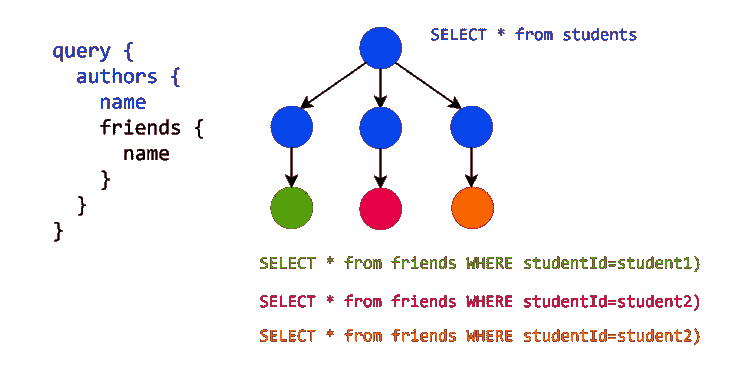
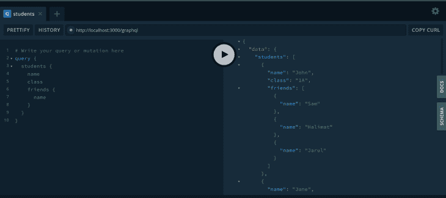

# 如何在 NestJS - LogRocket 博客中使用 DataLoader

> 原文：<https://blog.logrocket.com/use-dataloader-nestjs/>

在任何全栈 web 应用程序中，最小化我们对数据源(通常是数据库)的访问次数可以显著提高应用程序的速度。 [DataLoader](https://github.com/graphql/dataloader) 包是一个通用的实用程序，它提供了一个一致的 API，我们可以用它来加速从任何远程数据源加载数据。它通过提供批处理和缓存功能来实现这一点。

在本文中，我将展示 DataLoader 包如何帮助我们最大限度地减少访问数据源的次数。我将解释它提供的特性，以及我们如何使用它来解决 GraphQL 服务器的一个常见问题，即 N+1 问题。

### 内容

## 使用数据加载器进行批处理和缓存

批处理是数据加载器的主要功能。这有助于我们同时加载多个资源，而默认情况下它们是独立加载的。当我们需要加载多个相似的资源，但是它们的加载是相互独立的时，就会发生这种情况。这些资源可以来自数据库、REST API 或任何其他地方。

DataLoader 的工作方式是合并发生在同一执行帧(事件循环的一个节拍)中的所有单个加载，并将这些加载批处理到一个操作中。

DataLoader 还为应用程序的单个请求中发生的所有加载提供了内存化缓存。这并不能取代 Redis、Memcache 等共享的应用级缓存。以下是数据加载器文档中对此的免责声明:

> DataLoader 首先是一种数据加载机制，它的缓存只是为了在对应用程序的单个请求的上下文中不重复加载相同的数据。

DataLoader 最出色的地方之一是使用了 [GraphQL](https://blog.logrocket.com/implementing-pagination-graphql-nestjs/) 查询，但是它面临的一个常见问题是 N+1 问题。我们将在下一节讨论这个问题。

## GraphQL 中的 N+1 问题是什么？

GraphQL 解决了 REST API 中的一个重要问题:过度提取。它通过使定义模式成为可能来做到这一点，并且客户可以请求他们需要的特定字段。

假设我们有一个 GraphQL API 服务器，它允许客户机查询存储在数据库中的一个`students`表中的记录。并且说为了解释方便，还有一个`friends`表，存储了每个学生的非学生朋友的详细信息:

```
{
  students {
    name
  }
}

```

该查询要求必须由 GraphQL 服务器定义的`student`对象上的`name`字段。GraphQL 通过调用附加到字段的`Resolver`函数来解析每个字段。模式中声明的每个字段都必须有相应的`Resolver`函数。

用于学生的`Resolver`可以对数据库进行单个查询来获取学生。现在假设，我们有这个 GraphQL 查询:

```
   query {                      
     students {                 
       name       
       friends {                
         name
       }
     }
   }  

```

我们在`students`查询中嵌套了数据。为了执行这个，执行一个数据库查询来获取列表`students`，因为 GraphQL 模式中的每个字段都有一个解析器用来解析它的值，所以执行一个数据库查询来获取每个学生的朋友。

因此，如果有 N 个学生，我们必须执行一个查询来获取学生列表，然后执行 N 个查询(针对每个学生)来获取朋友。N+1 这个名字就是这么来的。

在下图中，我们假设数据库中有三个学生正在被`students`解析器解析。获取它们所需的单个数据库查询被标为蓝色。对于每个学生，获取他们朋友的三个数据库查询被赋予不同的颜色。在这种情况下，我们有四个。



当我们总共只有三个学生记录时，N+1 问题可能看起来微不足道，但是假设我们有数千个学生，额外的数据库查询会显著降低 GraphQL 查询的速度。

## DataLoader 如何解决 N+1 问题

N+1 问题源于 GraphQL 服务器的直观实现:每个字段都应该有自己的解析器函数。继续上面介绍的`students`查询示例，如果我们能够以某种方式推迟解析每个学生的`friends`字段，直到我们有了最后一个学生对象，那么我们可以进行单个数据库查询来获取每个学生的朋友，这将会很有帮助。

如果我们使用的是`SQL`，我们可以像这样进行查询:

```
SELECT * from friends WHERE studentId IN (firststudentId, secondstudentId, ...) 

```

DataLoader 可以通过其批处理功能帮助我们实现这一点。让我们通过一个示例 NestJS 项目来看看这一点。

## 用 GraphQL 设置 NestJS

我按照 NestJS [文档](https://docs.nestjs.com/graphql/quick-start#code-first)中描述的“代码优先”方法建立了一个 GraphQL 项目。以下是我创建的文件的结构(你可以在 GitHub [这里](https://github.com/Olusamimaths/nestjs-dataloder-article/tree/without-dataloader)查看):


这是`friend.entity.ts`的内容:

```
import { Field, ObjectType } from '@nestjs/graphql';

@ObjectType()
export class Friend {
  @Field()
  id: number;

  @Field()
  name: string;

  studentId: number;
}

```

和`student.entity.ts`的内容:

```
import { Field, ObjectType } from '@nestjs/graphql';
import { Friend } from 'src/friend/friend.entity';

@ObjectType()
export class Student {
  @Field()
  id: number;

  @Field()
  name: string;

  @Field()
  class: string;

  @Field(() => [Friend])
  friends?: Friend[];
}

```

我使用了内存中的数据存储而不是实际的数据库，这样可以更容易地运行项目，而不用担心数据库的设置，正如您在`data.ts`文件中看到的:

```
import { Friend } from './friend/friend.entity';
import { Student } from './student/student.entity';

export const students: Student[] = [
  { id: 1, name: 'John', class: '1A' },
  ...
  { id: 10, name: 'Mary', class: '1J' },
];

export const friends: Friend[] = [
  { id: 1, name: 'Sam', studentId: 1 },
  ...
  { id: 7, name: 'Seyi', studentId: 4 },
];

```

存储库访问这个数据存储并执行模拟数据库操作。例如，在`student.repository.ts`中，我们有:

```
import { Injectable } from '@nestjs/common';
import { students } from '../data';
import { Student } from './student.entity';

@Injectable()
export class StudentRepository {
  public async getAll(): Promise<Student[]> {
    console.log('SELECT * FROM students');
    return students;
  }
}

```

我正在记录如果我们使用实际的数据库，数据库查询会是什么样子。
`friend.repository.ts`的内容如下:

```
import { Injectable } from '@nestjs/common';
import { friends } from '../data';
import { Friend } from './friend.entity';

@Injectable()
export class FriendRepository {
  public async getStudentFriends(studentId: number): Promise<Friend[]> {
    console.log(`SELECT * FROM friends WHERE studentId = ${studentId}`);
    return friends.filter((friend) => friend.studentId === studentId);
  }
}

```

`student.resolver.ts`包含解析查询的方法:

```
import { Parent, Query, ResolveField, Resolver } from '@nestjs/graphql';
import { Friend } from '../friend/friend.entity';
import { FriendService } from 'src/friend/friend.service';
import { Student } from './student.entity';
import { StudentService } from './student.service';

@Resolver(Student)
export class StudentResolver {
  constructor(
    private readonly studentService: StudentService,
    private readonly friendService: FriendService,
  ) {}
  @Query(() => [Student])
  async students() {
    return await this.studentService.getAll();
  }

  @ResolveField('friends', () => [Friend])
  async getFriends(@Parent() student: Student) {
    const { id: studentId } = student;
    return await this.friendService.getStudentFriends(studentId);
  }
}

```

使用`@ResolveField`装饰器，我们指定如何解析父`Student`对象上的`friends`字段。

我们可以用`npm run start:dev`运行这个应用程序，并访问将在[http://localhost:3000/graph QL](http://localhost:3000/graphql)上发布的游乐场来测试它:



该查询返回每个学生及其朋友。这是来自终端的日志:


我们可以看到展示的 N+1 问题。第一个查询`SELECT * FROM students`获取学生，因为数据存储中有十个学生，所以执行一个查询来获取他们的每个朋友。所以我们总共有 11 个查询！

## 设置数据加载器

现在我们将设置 DataLoader，以便我们可以使用它的批处理特性来解决这个 N+1 问题。首先，我们这样安装它:

```
npm install dataloader -S

```

为了更好地封装事物，让我们创建一个`dataloader`模块:

```
nest g mo dataloader

```

我们还将创建一个数据加载器服务和接口`dataloader.interface.ts`，以指定我们将使用的加载器。

`dataloader`模块文件夹中`dataloader.interface.ts`的内容如下:

```
import DataLoader from 'dataloader';
import { Friend } from '../friend/friend.entity';

export interface IDataloaders {
  friendsLoader: DataLoader<number, Friend>;
}

```

这里，我们已经声明了`IDataloaders`接口，并将`friendsLoader`指定为其中的一个字段。如果我们需要更多的加载程序，我们可以在这里声明它们。

首先，我们需要一个从学生 id 数组中批量获取`friends`的方法。让我们更新`friend.repository.ts`来包含一个新方法:

```
export class FriendRepository {
  ...
  public async getAllFriendsByStudentIds(
    studentIds: readonly number[],
  ): Promise<Friend[]> {
    console.log(
      `SELECT * FROM friends WHERE studentId IN (${studentIds.join(',')})`,
    );
    return friends.filter((friend) => studentIds.includes(friend.studentId));
  }
}

```

`getAllFriendsByStudentIds`方法接收一个`studentIds`数组，并返回所提供的所有学生的朋友的数组。

让我们也更新一下`friend.service.ts`文件:

```
export class FriendService {
  ...
  public async getAllFriendsByStudentIds(
    studentIds: readonly number[],
  ): Promise<Friend[]> {
    return await this.friendRepository.getAllFriendsByStudentIds(studentIds);
  }

  public async getStudentsFriendsByBatch(
    studentIds: readonly number[],
  ): Promise<(Friend | any)[]> {
    const friends = await this.getAllFriendsByStudentIds(studentIds);
    const mappedResults = this._mapResultToIds(studentIds, friends);
    return mappedResults;
  }

  private _mapResultToIds(studentIds: readonly number[], friends: Friend[]) {
    return studentIds.map(
      (id) =>
        friends.filter((friend: Friend) => friend.studentId === id) || null,
    );
  }
}

```

`getStudentsFriendsByBatch`是执行我们刚刚在`friend.repository.ts`中定义的批处理操作的方法，但它也包括方法`_mapResultToIds`。这对于 DataLoader 正常工作非常重要。

DataLoader 对批处理函数有一些约束。首先，返回数组的长度必须与提供的键的长度相同。这就是为什么在`(friend: Friend) => friend*.*studentId === id) || null`中，如果给定的学生 ID 没有找到朋友，我们将返回`null`。

其次，返回值的索引必须遵循与所提供的键的索引相同的顺序。也就是说，如果键是`[1, 3, 4]`，返回值必须是这个格式`[friendsOfStudent1, friendsOfStudent3, friendsOfStudent4]`。数据源可能不会以相同的顺序返回它们，所以我们必须对它们重新排序，这就是我们在传递给`_mapResultToIds`内的`studentIds*.map*`的函数中所做的。

## 创建数据加载器服务

现在我们这样更新`dataloader.service.ts`:

```
import { Injectable } from '@nestjs/common';
import * as DataLoader from 'dataloader';
import { Friend } from '../friend/friend.entity';
import { FriendService } from '../friend/friend.service';
import { IDataloaders } from './dataloader.interface';

@Injectable()
export class DataloaderService {
  constructor(private readonly friendService: FriendService) {}

  getLoaders(): IDataloaders {
    const friendsLoader = this._createFriendsLoader();
    return {
      friendsLoader,
    };
  }

  private _createFriendsLoader() {
    return new DataLoader<number, Friend>(
      async (keys: readonly number[]) =>
        await this.friendService.getStudentsFriendsByBatch(keys as number[]),
    );
  }
}

```

`getLoaders`方法返回一个包含加载器对象的对象。目前，我们只有一个用于`friends`的加载器。

* * *

### 更多来自 LogRocket 的精彩文章:

* * *

`_createFriendsLoader`方法实例化一个新的 DataLoader 实例。我们传入一个批处理函数，它期望一个键数组作为它的单个参数。我们通过调用`friendService`来执行批处理操作。

## 将加载程序添加到上下文

我们现在必须在 GraphQL 模块中为 NestJS 创建的 Apollo 上下文提供数据加载器。context 参数可用于将信息传递给任何解析器，如身份验证范围、数据库连接和自定义获取函数。在我们的例子中，我们将使用它将我们的加载器传递给解析器。

更新`app.module.ts`像这样:

```
import { Module } from '@nestjs/common';
import { GraphQLModule } from '@nestjs/graphql';
import { ApolloDriver, ApolloDriverConfig } from '@nestjs/apollo';
import { StudentModule } from './student/student.module';
import { FriendModule } from './friend/friend.module';
import { DataloaderModule } from './dataloader/dataloader.module';
import { DataloaderService } from './dataloader/dataloader.service';

@Module({
  imports: [
    GraphQLModule.forRootAsync<ApolloDriverConfig>({
      driver: ApolloDriver,
      imports: [DataloaderModule],
      useFactory: (dataloaderService: DataloaderService) => {
        return {
          autoSchemaFile: true,
          context: () => ({
            loaders: dataloaderService.getLoaders(),
          }),
        };
      },
      inject: [DataloaderService],
    }),
    StudentModule,
    FriendModule,
  ],
})
export class AppModule {}

```

我们现在正在进口`DataLoader`和`DataService`，并在`GraphQLModule`使用。我们还声明了`context`并提供了从`dataloader`服务接收的`loaders`作为上下文的一部分。现在，我们可以在解析器中访问这个上下文。

接下来，让我们更新如何解析`student.resolver.ts`中的`friends`字段:

```
@Resolver(Student)
export class StudentResolver {
  ...
  @ResolveField('friends', () => [Friend])
  getFriends(
    @Parent() student: Student,
    @Context() { loaders }: { loaders: IDataloaders },
  ) {
    const { id: studentId } = student;
    return loaders.friendsLoader.load(studentId);
  }
}

```

`@Context`装饰器提供了对上下文的访问，在这里我们可以访问先前添加的加载器。我们现在使用`friendsLoader`来加载给定学生的朋友。

我们现在可以再次启动应用程序，并从 GraphQL playground 测试查询。结果与之前相同，但是当我们从终端检查日志时，我们看到以下内容:


太棒了。现在，只执行了两个数据库查询。在没有数据加载器的早期，我们执行 11 个；想象一下检索 1000 个学生对象！使用 DataLoader，我们仍然只进行两次数据库查询，而不是在没有它的情况下进行 1001 次查询。这会极大地影响我们应用程序的性能。

## 结论

在本文中，我解释了什么是 DataLoader 包以及它提供的特性。我还通过一个 GraphQL API 示例展示了如何在 NestJS 中使用这个包。接下来，我们讨论了如何用 DataLoader 包解决 GraphQL 中的 N+1 问题。DataLoader 提供了一些定制，您可以在[文档](https://github.com/graphql/dataloader)中了解更多。

正如我前面提到的，DataLoader 包是一个通用的实用程序，它不一定只能用于 GraphQL 服务器。您可以将本文中的思想应用到自己的应用中。

本文中创建的 NestJS 项目的存储库是这里的。`main`分支包含使用 DataLoader 的解决方案，而`without-dataloader`分支显示了引入 DataLoader 之前应用程序的状态。

## 监控生产中失败和缓慢的 GraphQL 请求

虽然 GraphQL 有一些调试请求和响应的特性，但确保 GraphQL 可靠地为您的生产应用程序提供资源是一件比较困难的事情。如果您对确保对后端或第三方服务的网络请求成功感兴趣，

[try LogRocket](https://lp.logrocket.com/blg/graphql-signup)

.

[](https://lp.logrocket.com/blg/graphql-signup)[https://logrocket.com/signup/](https://lp.logrocket.com/blg/graphql-signup)

LogRocket 就像是网络和移动应用的 DVR，记录下你网站上发生的每一件事。您可以汇总并报告有问题的 GraphQL 请求，以快速了解根本原因，而不是猜测问题发生的原因。此外，您可以跟踪 Apollo 客户机状态并检查 GraphQL 查询的键值对。

LogRocket 检测您的应用程序以记录基线性能计时，如页面加载时间、到达第一个字节的时间、慢速网络请求，还记录 Redux、NgRx 和 Vuex 操作/状态。

[Start monitoring for free](https://lp.logrocket.com/blg/graphql-signup)

.