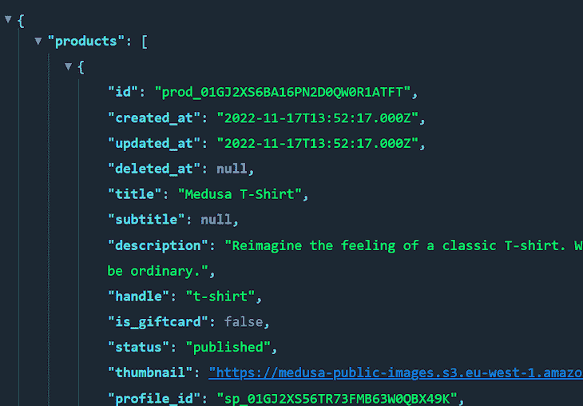

# 使用美杜莎作为 Shopify 替代品

> 原文：<https://blog.logrocket.com/use-medusa-shopify-alternative/>

使用无头 CMS 有很多好处，比如解耦的架构和可伸缩性，随处编写和部署代码的能力，以及用更少的代码维护多个基础设施的能力。

在这篇文章中，我们将探索[美杜莎](https://medusajs.com)，一个作为 [Shopify](https://www.shopify.com) 替代品的无头 CMS。我们开始吧！

*向前跳转:*

## 什么是无头 CMS？

术语 headless CMS 意味着使用 RESTful APIs 或 GraphQL 构建一个能够与任何前端集成的内容存储库或后端。

简而言之， [headless CMS 可以在一个地方管理内容，并使用任何前端](https://blog.logrocket.com/4-open-source-headless-cms-built-with-javascript/)进行部署。

无头 CMS 是一个没有内置表示层的后端内容管理系统。在 CMS 的早期，表示层是和内容融合在一起的。然而，无头技术的出现极大地改善了内容创建者从单一架构管理内容的方式，这是一种耦合的方法，可以实现去耦或无头的内容管理系统。如今，创作者可以通过 API 将内容部署到各种渠道，如 web 应用程序、移动应用程序、网站等。

几个比较流行的无头 CMS 有[故事会](https://www.storyblok.com/)、[普里西米](https://prismic.io/)、[美杜莎](https://medusajs.com/)、[理智](https://sanity.io)、[知足](https://contentful.com)。

## 美杜莎是什么？

Medusa 是一个开源的无头电子商务引擎，它以自己是许多企业选择的电子商务网站 Shopify 的替代品而自豪。基于 Node.js 构建的 Medusa 考虑到了修改，由三部分组成:

*   Headless commerce:公开 REST API 的仓库
*   管理面板:开发者可以使用 [Medusa 管理面板](https://docs.medusajs.com/admin/quickstart/) l 来定制和管理他们的商店功能
*   前端:你可以用 Next.js 开发前端，一个像 Gatsby 一样的静态站点生成器，或者任何其他框架

## 美杜莎诉 Shopify

让我们回顾一些参数，这些参数可以作为开发人员在选择 Medusa 和 Shopify 店面时进行比较的基础。

### 费用

首先，我们会考虑成本；Shopify 电子商务商店提供各种价格选项，从 29 美元到 299 美元不等，具体取决于选择，分别从基本到高级套餐。另一方面，美杜莎是开源的，可以免费使用。所以美杜莎受益于社区贡献，而 Shopify 没有。

### 用户化

Medusa 和 Shopify 的一个主要区别是，Medusa 为商家提供了更多的定制选项，然而，Shopify 却不是这样。例如，开发人员可以根据业务偏好定制 Medusa 商店的数据层或后端，以便更好地为客户服务。例如，用户可以集成 Strapi、Contentful 或任何其他 CMS 服务。此外，您可以将本地支付提供商集成到任何使用 Medusa 开发的商店中。然而，在 Shopify 商店进行定制修改几乎是不可能的。当商店不需要定制修改时，Shopify 是更好的选择。

### 结构和插件

Medusa 是一个无头商业引擎，而 Shopify 不符合无头商业标准。这意味着使用 Medusa，后端与表示层或前端是分离的，给任何使用 Medusa 开发的电子商务商店以灵活性。客户可以为他们的表示层使用 Next.js、Gatsby 或任何其他选择的前端框架。

当建立一个电子商务商店时，可维护性和可伸缩性都是需要考虑的重要特征。虽然 Shopify 通过提供广泛的支持、集成、应用程序和开发人员支持来解决可扩展性和可维护性问题，但 Medusa 具有内置的可定制功能，允许客户定制他们的电子商务商店以满足特定的业务需求。

Shopify 和 [Medusa](https://docs.medusajs.com/advanced/backend/plugins/overview/) 都提供了大量的应用程序、插件和扩展来帮助扩展电子商务商店的功能。

### 多种货币

建立一个电子商务商店，让客户可以看到当地货币的价格，可以改变游戏规则，为买家带来支付的真实性和准确性。在撰写本文时，仅当商家启用了 [Shopify 市场](https://help.shopify.com/en/manual/markets)和 [Shopify 支付](https://help.shopify.com/en/manual/payments/shopify-payments)时，Shopify 多币种支持才可用，仅限于 [17 个国家](https://help.shopify.com/en/manual/payments/shopify-payments/supported-countries#supported-countries-and-regions)。即使启用了这两项，商家仍然需要一个既定的计划来构建不同货币或汇率的价格格式。另一种方法是使用 Shopify 创建各种商店，以特定货币为用户提供关于产品成本的进一步指导。

使用 Medusa，您可以创建不同的地区，并在同一商店中选择其当地货币，通过单个管理仪表板访问一切，并为每种货币单独设置产品成本。

## 用美杜莎建一个店面

在本节中，我们将使用[M](https://blog.logrocket.com/next-js-13-new-app-directory/)edusa 和 Next.js 构建一个基本的店面。为了跟进，你需要在你的机器上安装 [Node.js](https://nodejs.org/en/) 。运行以下命令确认 Node.js 安装的状态:

```
node -v

```

输出应该是撰写本文时 Node.js 的最新版本，即 v18，但是，如果 Node.js 尚未安装，请单击上面的链接下载并安装它。

## 安装 Medusa CLI

要开始构建我们的 Medusa 店面，我们首先需要安装 Medusa CLI:

```
npm install @medusajs/medusa-cli -g

```

上面的命令将全局安装[`medusa-cli`](https://www.npmjs.com/package/@medusajs/medusa-cli)；`-g`标志表示全球安装。接下来，使用以下命令创建一个 Medusa 存储:

```
medusa new logRocket-store —seed

```

上面的命令在`logRocket-store`目录中创建一个 Medusa 安装。上面使用的`--seed`标志用演示产品预先填充或植入商店数据库:


Directory structure

要测试我们的服务器，请将目录更改为新目录，并使用以下命令运行服务器:

```
cd logRocket-store

medusa develop

```

您的服务器应该在`localhost:9000`上运行。使用您选择的任何客户端进行测试，如 Thunder Client、Postman 或使用`localhost:9000/store/products` URL 的浏览器。

如果到目前为止您做了所有的事情，那么应该会返回一个 JSON 格式的产品列表:



至此，我们完成了无头 CMS 环境中的服务器端、后端或前端。接下来，我们将配置和集成商店前端。

## 配置我们的前端

为了构建我们的商店前端，我们将使用 Next.js。使用下面的命令安装 [Medusa Next.js Starter](https://github.com/medusajs/nextjs-starter-medusa) :

```
npx create-next-app -e https://github.com/medusajs/nextjs-starter-medusa my-logrocket-store

```

我选择了`my-logrocket-store`作为我商店的名称，但是你可以随意选择其他名称。假设这是您第一次安装`nextjs-starter-medusa`，您会看到如下通知:


点击**进入**继续。根据你的网速，安装应该不会花很长时间。当 Next.js starter 包成功安装后，使用以下命令将目录更改到您的存储中:

```
cd my-logrocket-store

```

确保您的服务器正在运行，然后运行以下命令:

```
npm run dev

```

你的店面应该在`localhost:8000`上线。完成后，我们目前有完整的美杜莎电子商务引擎在本地运行。

回想一下，Medusa 分为三个部分，无头商务、管理面板和前端。我们已经集成了前端和无头部分，现在只剩下管理部分:


Medusa storefront example

向下滚动或点击左上角的**商店**查看产品系列:


Medusa store products

注册账户，点击左上角**我的包**旁边的**账户**:


Create account on Medusa store

## 设置管理面板

要设置我们的 Medusa 存储的管理部分，请运行以下命令来克隆 Medusa 管理存储库:

```
git clone https://github.com/medusajs/admin admin-panel 

```

将目录更改为`admin-panel`:

```
cd admin-panel

```

然后，运行以下命令来安装依赖项:

```
npm install

```

此时，如果一切正常，您应该能够在`localhost:7000`访问您的管理面板。因为这是你第一次访问，你需要登录。使用 Medusa 提供的以下详细信息登录:

成功登录后，您将看到一个控制面板，您可以在其中管理商店功能:


Medusa admin-panel

Medusa 是开源软件，因此变化可以很快发生。要保留标签，您可以查看 GitHub 资源库[这里的](https://github.com/medusajs/admin)。

## 结论

在本文中，我们讨论了什么是无头 CMS 以及为什么应该考虑使用它。我们还探索了 Medusa，这是一个开源的无头 CMS，自称是 Shopify 的替代品。我们将 Medusa 的一些功能与 Shopify 进行了比较，包括成本、插件的可用性、定制、货币支持等。最后，我们学习了如何开始使用 Medusa，构建一个简单的电子商务商店。

你认为美杜莎会是 Shopify 的真正竞争者吗？留下评论让我们知道！快乐编码。

## 您是否添加了新的 JS 库来提高性能或构建新特性？如果他们反其道而行之呢？

毫无疑问，前端变得越来越复杂。当您向应用程序添加新的 JavaScript 库和其他依赖项时，您将需要更多的可见性，以确保您的用户不会遇到未知的问题。

LogRocket 是一个前端应用程序监控解决方案，可以让您回放 JavaScript 错误，就像它们发生在您自己的浏览器中一样，这样您就可以更有效地对错误做出反应。

[](https://lp.logrocket.com/blg/javascript-signup)[https://logrocket.com/signup/](https://lp.logrocket.com/blg/javascript-signup)

[LogRocket](https://lp.logrocket.com/blg/javascript-signup) 可以与任何应用程序完美配合，不管是什么框架，并且有插件可以记录来自 Redux、Vuex 和@ngrx/store 的额外上下文。您可以汇总并报告问题发生时应用程序的状态，而不是猜测问题发生的原因。LogRocket 还可以监控应用的性能，报告客户端 CPU 负载、客户端内存使用等指标。

自信地构建— [开始免费监控](https://lp.logrocket.com/blg/javascript-signup)。