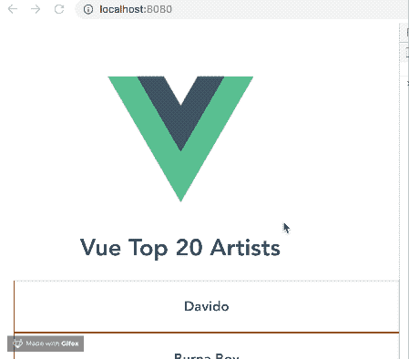

# 如何在 Vue 3 中使用 props 向子组件传递数据

> 原文：<https://blog.logrocket.com/use-props-pass-data-child-components-vue-3/>

***编者按**:这篇文章最后更新于 2022 年 12 月 15 日[以反映 Vue 3](https://blog.logrocket.com/definitive-guide-vue-3-components/) 中的更新。*

Props 是 Vue 中管理父组件和子组件的一个重要特性，但是处理它们可能有些棘手。在本文中，我们将学习如何使用 Vue 3 中的 props 将数据从父组件传递到子组件。你可以在 GitHub 上找到本教程的[完整代码。我们开始吧！](https://github.com/nemo0/vue-props-demo)

## 目录

## 先决条件

本文适合所有阶段的开发人员，包括初学者。

要阅读本文，您需要安装 Node.js 版本≥16.x。您可以通过在终端或命令提示符下运行以下命令来验证您是否已经安装了它:

节点 v

你还需要一个代码编辑器；我[强烈推荐 VS 代码](https://blog.logrocket.com/top-10-vs-code-extensions-2021/)。最后，您需要在您的计算机上全局安装 Vue 3。在撰写本文时， [Vue3 是最新版本](https://blog.logrocket.com/how-to-use-vue-3-typescript/)。

在开始之前，继续[下载一个 Vue starter 项目](https://github.com/nemo0/vue-props-starter)。解压缩下载的项目，导航到解压缩后的文件，然后运行下面的命令以保持所有依赖项都是最新的:

```
npm install

```

## Vue 里有哪些道具？

在 Vue 中， [props](https://blog.logrocket.com/vue-js-simplified-components-props-and-slots/) 是可以在任何组件上注册的定制属性。您可以在父组件上定义数据，并为其赋值。然后，转到需要该数据的子组件，并将值传递给一个适当的属性。因此，数据成为子组件中的一个属性。

在一个`<script setup>`组件中，语法看起来像下面的代码:

```
<script setup>
const props = defineProps(['title'])

console.log(props.title)
</script>

```

在非`<script setup>`组件中，语法如下所示:

```
export default {
  props: ['title'],
  setup(props) {
    // setup() receives props as the first argument.
    console.log(props.title)
  }
}

```

要从任何需要的组件中动态访问这些数据，可以使用根组件`App.vue`作为父组件，存储数据，然后注册 props。

## 为什么要在 Vue 中使用道具？

假设您有一个数据对象，您希望在两个不同的组件中以非常不同的方式显示，例如，Billboard Top 10 Artists 列表。您的第一反应可能是创建这两个独立的组件，将数组添加到数据对象中，然后在模板中显示它们。

这个解决方案最初很棒，但是随着您添加更多组件，它就不再有效了。让我们用您在 VS 代码中打开的 starter 项目来演示这一点。打开`Test.vue`文件，复制下面的代码块:

```
<template>
  <div>
    <h1>Vue Top 20 Artists</h1>
    <ul>
      <li v-for="(artist, x) in artists" :key="x">
      <h3>{{artist.name}}</h3>
      </li>
    </ul>
  </div>
</template>
<script>
export default {
  name: 'Test',
  data (){
    return {
      artists: [
       {name: 'Davido', genre: 'afrobeats', country: 'Nigeria'},
       {name: 'Burna Boy', genre: 'afrobeats', country: 'Nigeria'},
       {name: 'AKA', genre: 'hiphop', country: 'South-Africa'},
       {name: 'Sarkodie', genre: 'hiphop', country: 'Ghana'},
       {name: 'Stormzy', genre: 'hiphop', country: 'United Kingdom'},
       {name: 'Lil Nas', genre: 'Country', country: 'United States'},
       {name: 'Nasty C', genre: 'hiphop', country: 'South-Africa'},
       {name: 'Shatta-walle', genre: 'Reagae', country: 'Ghana'},
       {name: 'Khalid', genre: 'pop', country: 'United States'},
       {name: 'ed-Sheeran', genre: 'pop', country: 'United Kingdom'}
      ]
    }
  }
}
</script>

```

在 components 文件夹中创建一个名为`Test2.vue`的新文件，并将以下代码块粘贴到其中:

```
<template>
  <div>
    <h1>Vue Top Artist Countries</h1>
    <ul>
      <li v-for="(artist, x) in artists" :key="x">
      <h3>{{artist.name}} from {{artist.country}}</h3>
      </li>
    </ul>
  </div>
</template>
<script>
export default {
  name: 'Test2',
  data (){
    return {
      artists: [
       {name: 'Davido', genre: 'afrobeats', country: 'Nigeria'},
       {name: 'Burna Boy', genre: 'afrobeats', country: 'Nigeria'},
       {name: 'AKA', genre: 'hiphop', country: 'South-Africa'},
       {name: 'Sarkodie', genre: 'hiphop', country: 'Ghana'},
       {name: 'Stormzy', genre: 'hiphop', country: 'United Kingdom'},
       {name: 'Lil Nas', genre: 'Country', country: 'United States'},
       {name: 'Nasty C', genre: 'hiphop', country: 'South-Africa'},
       {name: 'Shatta-walle', genre: 'Reagae', country: 'Ghana'},
       {name: 'Khalid', genre: 'pop', country: 'United States'},
       {name: 'ed-Sheeran', genre: 'pop', country: 'United Kingdom'}
      ]
    }
  }
}
</script>
<style scoped>
li{
    height: 40px;
    width: 100%;
    padding: 15px;
    border: 1px solid saddlebrown;
    display: flex;
    justify-content: center;
    align-items: center;
  }  
a {
  color: #42b983;
}
</style>

```

要注册您刚刚创建的新组件，打开`App.vue`文件，并将下面的代码复制到其中:

```
<template>
  &lt;div id="app">
    
    <Test/>
    <Test2/>
  </div>
</template>
<script>
import Test from './components/Test.vue'
import Test2 from './components/Test2.vue'
export default {
  name: 'app',
  components: {
    Test, Test2
  }
}
</script>

```

在 VS 代码终端中，使用以下命令在开发环境中提供应用程序:

```
npm run dev

```

它应该如下所示:



您会注意到，如果您只有大约五个组件，您将不得不继续复制每个组件中的数据。想象一下，有一种方法可以在一个父组件中定义数据，然后通过使用属性名将它带到每个需要它的子组件中。

## 在父组件中定义数据

既然您已经选择了根组件作为您的父组件，那么您首先必须定义您想要在根组件内部动态共享的数据对象。如果您从一开始就遵循了本文，请打开您的`App.vue`文件，并将数据对象代码块复制到脚本部分中:

```
<template>
  <div id="app">
    
    <Test />
    <Test2 />
  </div>
</template>

<script>
import Test from "./components/Test.vue";
import Test2 from "./components/Test2.vue";
export default {
  name: "app",
  components: {
    Test,
    Test2,
  },
  data() {
    return {
      artists: [
        { name: "Davido", genre: "afrobeats", country: "Nigeria" },
        { name: "Burna Boy", genre: "afrobeats", country: "Nigeria" },
        { name: "AKA", genre: "hiphop", country: "South-Africa" },
        { name: "Sarkodie", genre: "hiphop", country: "Ghana" },
        { name: "Stormzy", genre: "hiphop", country: "United Kingdom" },
        { name: "Lil Nas", genre: "Country", country: "United States" },
        { name: "Nasty C", genre: "hiphop", country: "South-Africa" },
        { name: "Shatta-walle", genre: "Reagae", country: "Ghana" },
        { name: "Khalid", genre: "pop", country: "United States" },
        { name: "Ed Sheeran", genre: "pop", country: "United Kingdom" },
      ],
    };
  },
};
</script>

```

## 在 Vue 中接收道具

在定义数据之后，进入两个测试组件并删除其中的数据对象。要在组件中接收道具，您必须指定您想要在该组件中接收的道具。进入两个测试组件，并在脚本部分添加规范，如下所示:

```
<script>
export default {
  name: 'Test',
  props: ['artists']
}   
</script> 

```

## 在 Vue 中注册道具

为了让 Vue 引擎知道您有想要动态传递给某些子组件的 props，您必须在 Vue 实例中指明它。这是在模板部分完成的，如下所示:

```
<template>
  <div id="app">
    <Test v-bind:artists="artists"/>
    <Test2 v-bind:artists="artists" />
  </div>
</template>

```

在上面的代码中，我们使用`v-bind`指令来绑定`artists`，它是脚本部分中数据对象数组的名称，以及`artists`，它是测试组件中的属性名称，您在上面的部分中已经设置好了。

如果您在没有以下指令的情况下设置它，您将看不到任何输出；Vue 编译器甚至 ESLint 都不会将其标记为错误或警告:

```
    <Test artists="artists"/>
    <Test2 artists="artists"/>

```

因此，注意并记住对每个动态绑定使用`v-bind`是很重要的。

## 在 Vue 中使用道具

在 Vue 应用程序中设置了 props 之后，您可以在组件中使用它们，就像数据是在同一个组件中定义的一样。因此，在我们的演示案例中，您可以设置方法调用并轻松访问`this.artists`。

## 强力打字道具

通过强类型化 props，您还可以确保您的组件只接收您希望它接收的数据类型。例如，在我们的演示中，您可以通过如下设置身份验证来确保只有数组传递到您的组件:

```
<script>
export default {
  name: 'Test',
  props: {
    artists: {
      type: Array
    }
  }
}
</script>

```

因此，每当您添加一个错误的类型，比如说一个`String`，您将在控制台中得到一个警告，告诉您它收到的类型不是它期望的类型:


## 结论

在本文中，我们探索了 Vue 3 中的 props，了解了它们如何通过创建一个重用数据对象的平台来帮助鼓励 DRY(不要重复自己)方法。我们还学习了如何在您的 Vue 项目中设置道具。如需更多信息，请查看 [Vue 关于道具](https://vuejs.org/v2/guide/components-props.html)的官方文档。编码快乐！

## 像用户一样体验您的 Vue 应用

调试 Vue.js 应用程序可能会很困难，尤其是当用户会话期间有几十个(如果不是几百个)突变时。如果您对监视和跟踪生产中所有用户的 Vue 突变感兴趣，

[try LogRocket](https://lp.logrocket.com/blg/vue-signup)

.

[](https://lp.logrocket.com/blg/vue-signup)[https://logrocket.com/signup/](https://lp.logrocket.com/blg/vue-signup)

LogRocket 就像是网络和移动应用程序的 DVR，记录你的 Vue 应用程序中发生的一切，包括网络请求、JavaScript 错误、性能问题等等。您可以汇总并报告问题发生时应用程序的状态，而不是猜测问题发生的原因。

LogRocket Vuex 插件将 Vuex 突变记录到 LogRocket 控制台，为您提供导致错误的环境，以及出现问题时应用程序的状态。

现代化您调试 Vue 应用的方式- [开始免费监控](https://lp.logrocket.com/blg/vue-signup)。