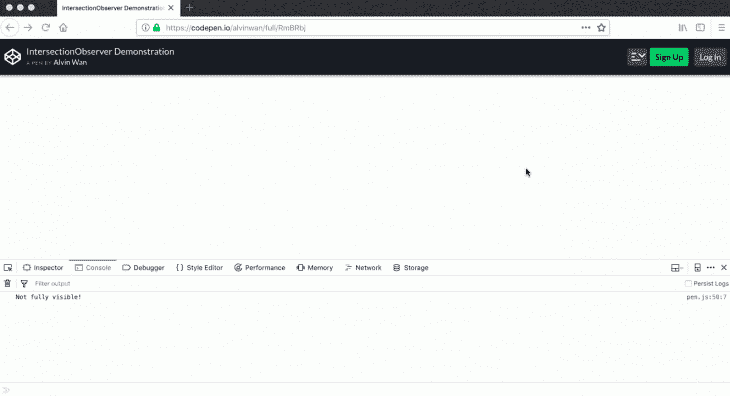

# 如何正确使用滚动链接动画

> 原文：<https://blog.logrocket.com/use-scroll-linked-animations-right-way/>

***编者按:**这篇文章更新于 2021 年 6 月，包含了关于`IntersectionObserver` V2 的最新信息。*

如果使用不当，滚动链接动画会因实现效率低下而导致较低的帧速率和明显的抖动。即使是 2014 年的热门话题，视差滚动效果，也遇到了效率低下的问题。 [Frederick 等人](http://uxpajournal.org/the-effects-of-parallax-scrolling-on-user-experience-in-web-design/) (2015 年)报告了带有视差滚动的网站的“重大可用性问题”，甚至晕车。

动画并不总是罪魁祸首，因为即使没有效果或者不合适的滚动事件监听器仍然会让人头疼。Twitter 在 2011 年对[滞后滚动的一系列问题做出了回应](https://twitter.com/twittersupport/status/25683274323992577?lang=en)，导致 jQuery 的创始人约翰·雷西格[得出结论，昂贵的滚动事件处理程序不是一个好主意](https://johnresig.com/blog/learning-from-twitter/)。

## 使用 CSS 和 JavaScript 制作滚动链接动画

这引发了两大类回应:Javascript monkey 补丁和 CSS 替换，以利用[浏览器优化](https://staktrace.com/spout/entry.php?id=834)。前者只是一种变通方法，我们将在下面详细介绍一种长期的`IntersectionObserver`解决方案。

后者同样是一个合适的长期解决方案，在主流浏览器中被广泛采用，覆盖了高达 97%的用户。然而，它的确切规范会定期进行小的重构，留下许多[被弃用的 scroll-snap-* CSS 属性](https://developer.mozilla.org/en-US/docs/Web/CSS/CSS_Scroll_Snap)。

本文围绕这两类响应，给出了两个技巧:使用 Javascript 观察者模式，尽可能使用 CSS。我们从 JavaScript 变通方法和解决方案开始。然后，我们讨论 CSS 属性以及如何使用它们来简化滚动链接的动画——应避免使用的不推荐使用的属性、当前使用的和广泛支持的属性，以及即将出现的属性。

## 尽可能使用 JavaScript 观察者模式

滚动链接动画通常基于滚动位置。对于这样的应用程序，滚动事件侦听器正在轮询滚动位置—如果滚动位置在目标范围内，则执行滚动链接动画。这与 Javascript 的[设计方法](https://developer.mozilla.org/en-US/docs/Web/API/EventListener)相反，它是监听事件而不是轮询事件。类似地，滚动链接动画将*监听*滚动位置，而不是*检查*滚动位置。观察者模式，确切地说是`IntersectionObserver`是一种持久的技术，可以实现这一点。粗略地说，一旦到达某个滚动位置，就会执行`IntersectionObserver`事件处理程序。我们将在下面更详细、更精确地描述它所实现的功能。

### 使用`IntersectionObserver`的离散滚动效果

[交叉点观察器 API](https://developer.mozilla.org/en-US/docs/Web/API/Intersection_Observer_API) 基于每个元素工作。每当这个元素(称为**目标**)出现在屏幕上时，交叉点观察器回调就会被调用。有三个配置选项需要注意:

1.  具体来说，API 支持的不仅仅是屏幕。每当目标元素与另一个元素 [**根**](https://developer.mozilla.org/en-US/docs/Web/API/Intersection_Observer_API#Intersection_observer_concepts_and_usage) 相交时，回调就会被调用。根可能是屏幕，它是使用`null` 指定的，或者是开发人员指定的任何其他 DOM 元素。
2.  API 允许开发人员指定“出现”的含义，是指目标几乎不与根相交，还是完全与根相交。**相交比**是目标在根内可见的百分比。0 表示目标不可见，1.0 表示目标完全可见；开发者可以为这个交集比率指定一个**阈值**，或者一组阈值。每当交集比率超过数组中的阈值时，就会调用回调。注意两个方向都会触发回调——要么在阈值以下开始，要么在阈值以上结束，反之亦然。
3.  为了计算交集，API 使用包含目标可见部分的最小矩形和包含根内容的最小矩形。在根内容的包含矩形周围添加了**根边距**，用于计算交集。详见 MDN 的[“交集如何计算”](https://developer.mozilla.org/en-US/docs/Web/API/Intersection_Observer_API#How_intersection_is_calculated)。

以下是一个交叉点观察器配置示例。只要示例框在用户视口中完全可见，就会触发处理程序:

```
var intersectionOptions = {
  root: null,  // use the viewport
  rootMargin: '0px',
  threshold: 1.0
}

function intersectionCallback(entries, observer) {
  entries.forEach(entry => {
    if (entry.intersectionRatio >= 1) {
      console.log("Fully visible!");
    } else {
      console.log("Not fully visible!");
    }
  });
}

var observer = new IntersectionObserver(intersectionCallback, intersectionOptions);

var target = document.querySelector('#box');
observer.observe(target);

```

下面是对应的 HTML 和 CSS:

```
<html>
  <head>
    <title>IntersectionObserver Demo</title>
    <style>
      #box {
        margin-top:100% 0 100% 0;
        width:100%;
        height:90%;
        background-color:black;
      }
    </style>
  </head>
  <body>
    <div id="box"></div>
  </body>
</html>
```

使用支持[的浏览器](https://caniuse.com/intersectionobserver)在这里查看代码笔[，并尝试将黑盒完全滚动到视图中，然后部分或完全从视图中消失。每当盒子完全滚动到视图中时，控制台显示`Fully visible!`。每当盒子滚动到不再完全可见时，控制台就会显示`Not fully visible!`。](https://codepen.io/alvinwan/pen/RmBRbj)



但是，`IntersectionObserver`会告诉您某个项目何时完全出现在视窗中，但不会告诉您该项目是否实际可见。例如，项目可能完全透明或被遮挡，导致广告曝光的统计不精确。

## 使用`IntersectionObserver` V2 的可见性感知离散滚动事件

类似于`IntersectionObserver`，`IntersectionObserver`的第一个版本，每当目标与视口重叠时，`IntersectionObserver` V2 将调用一个回调。与以前不同的是，V2 现在增加了两种配置，下面的描述几乎一字不差地从 W3 规范的接口中摘录了[:](https://w3c.github.io/IntersectionObserver/v2/#intersection-observer-interface)

`trackVisibility`:如果为真，跟踪目标可见性的变化。跟踪可见性比跟踪与视口的交点更昂贵，因此启用此功能会显著降低网页性能。因此，只有在必要时才应该使用这个仅适用于 V2 的选项。如果在未指定有效延迟的情况下设置可见性跟踪，则会出现此警告。

`delay`:观察者通知之间的最小毫秒数，如果`trackVisibility`为真，则最小为 100ms。

要查看 V2 的运行情况，请在初始化`IntersectionObserver`时设置上面的两个配置选项。返回的 [`IntersectionObserverEntry`](https://w3c.github.io/IntersectionObserver/v2/#intersection-observer-entry) 将有一个新的布尔字段`isVisible`，您可以使用它。

以下是一个交叉点观察器配置示例。有两个样品盒:一个部分透明，另一个是纯色的。每当纯色框在用户视口中完全可见时，就会触发处理程序。下面的代码大部分是从上面复制的，只有几行新的注释:

```
var intersectionOptions = {
  root: null,
  rootMargin: '0px',
  threshold: 1.0,
  trackVisibility: true, // NEW
  delay: 100, // NEW
}

function intersectionCallback(entries, observer) {
  entries.forEach(entry => {
    if (
entry.intersectionRatio >= 1
&& entry.isVisible // NEW
) {
      console.log(entry.target.id + " fully visible!"); // NEW
    } else {
      console.log(entry.target.id + " not fully visible!"); // NEW
    }
  });
}

var observer = new IntersectionObserver(intersectionCallback, intersectionOptions);

var targets = document.querySelectorAll('.box'); // NEW - id -> class selector + select all
targets.forEach((target) => { // NEW - iterate over all boxes
    observer.observe(target);
});

```

HTML 和 CSS 也大部分是复制的，只有几行改动。

```
<html>
  <head>
    <title>IntersectionObserver Demo</title>
    <style>
      .box {  # NEW - change from id to class selector
        margin-top:100% 0 100% 0;
        width:100%;
        height:90%;
        background-color:black;
      }
    .transparent { # NEW - new class for transparent box
        opacity: 0.5;
}
    </style>
  </head>
  <body>
    <div id=”box1” class="box"></div> <!-- NEW: change from id to class selector -->
    <div id=”box2” class=”box transparent”></div> <!-- NEW: half-transparent box -->
  </body>
</html>

```

使用支持[的浏览器](https://caniuse.com/intersectionobserver-v2)在这里查看代码笔[，并尝试将框完全滚动到视图中，然后部分或完全滚动到视图之外。当纯色框完全滚动到视图中时，控制台会显示`Box 1 fully visible!`。每当盒子滚动到不再完全可见时，控制台就会显示`Box 1 not fully visible!`。请注意，无论透明框是否出现在视口中，您都会看到`Box 2 not fully visible!`。](https://codepen.io/alvinwan/pen/rNmJRqM)

尽管这为我们提供了离散滚动事件的可见性健壮变体，但是这不包括当用户滚动时连续出现的滚动链接动画。一个例子是视差效应。如果在这些情况下需要滚动事件处理程序，有几种解决方法。这些方法适用于所有高频率的事件处理程序，重点是减少处理程序被调用的次数。

### 具有去抖动和节流的连续滚动效果

**去抖**关注事件的“突发”。对于事件处理程序调用的任何快速序列，要么(a)第一次执行并忽略所有直接的后续调用，要么(b)等到“最后一次”调用后再执行。前者被称为*尾随模式*。后者被称为*领先(或“即时”)模式*。

这直接应用于窗口大小调整、拖放和预览渲染。然而，这对于滚动链接的动画有不利的影响。去抖动的这个缺陷是它对突发的定义:所有在`wait`毫秒内的连续呼叫都聚集成一个突发。这意味着只要事件发生在`wait`毫秒内，突发就可以无限期持续。在跟踪模式下，这意味着事件处理程序永远不会被触发。换句话说，如果用户一直滚动，你的网站内容可能永远不会在网页上显示出来。

**节流**关注的是执行速度，解决了上面的陷阱。当一个事件被重复调用时，事件处理程序保证每`wait`毫秒执行一次。这与搜索中的自动完成有直接的应用。然而，这种方法的缺陷是去抖动容易发生——如果一个脉冲串在`wait`毫秒内开始和结束，该脉冲串将不会触发事件处理程序。例如，如果`wait`是`1000ms`秒，用户拿着`500ms`滚过网页的 A 部分，A 部分将永远不会运行它的滚动链接动画。通过显示和位置不幸的正确组合，这可以不利地抵消视差效应。

诚然，上述对立的例子是人为的，但这是为了说明节流和去抖动的互补性质。选择一种方法就是选择一种折衷，没有一种方法完全胜过另一种。更多细节见来自[CSS Tricks’Chris Coyier](https://css-tricks.com/the-difference-between-throttling-and-debouncing/)和【客座作者】David Corbacho 的文章，以及`requestAnimationFrame`作为第三种选择的可能性。正如我们在下面的 CSS 部分所讨论的，这些连续滚动效果现在或者将来会被浏览器优化的 CSS 属性所替代。

## 尽可能使用 CSS 替换

使用浏览器优化的 CSS 属性，几种常见的滚动效果是可能的:滚动捕捉已经被主流浏览器支持，覆盖了 93.7%以上的用户； [95.5%+的用户](https://caniuse.com/#search=sticky)支持粘性位置；而一个[的临时 CSS 视差](https://alligator.io/css/pure-css-parallax/)得到了 98.4%+的用户[ [1](https://caniuse.com/#search=transform) ， [2](https://caniuse.com/#search=transform) ]的支持。然而，考虑到 W3C 记录的[多种多样的用例，即使包含部分用户基础覆盖的 CSS 属性，支持也是有限的。然而，CSS 替换将实现和优化的开销卸载到浏览器上。有了 Javascript 或无动画的后备，CSS 属性可以提高大多数用户的可用性。](https://github.com/w3c/css-houdini-drafts/blob/master/scroll-customization-api/UseCases.md)

### 对齐滚动

首先，CSS snap scrolling 的[规范在不断变化。有许多**不赞成使用的 CSS 属性来避免**，包括以下内容:](https://drafts.csswg.org/css-scroll-snap/)

1.  [滚动捕捉坐标](https://developer.mozilla.org/en-US/docs/Web/CSS/scroll-snap-coordinate)
2.  [滚动捕捉目的地](https://developer.mozilla.org/en-US/docs/Web/CSS/scroll-snap-destination)
3.  [滚动捕捉点 x](https://developer.mozilla.org/en-US/docs/Web/CSS/scroll-snap-points-x)
4.  [滚动捕捉点 y](https://developer.mozilla.org/en-US/docs/Web/CSS/scroll-snap-points-y)

这些属性被广泛用于来自 [webkit](https://webkit.org/demos/scroll-snap/) 和 [CSS 窍门](https://css-tricks.com/introducing-css-scroll-snap-points/)的 CSS 滚动链接动画教程，并且[受到 Firefox 和 Safari 的支持。](https://gist.github.com/majido/9900261e1b7e2b1eb180b01c03656b42)然而，与大多数 CSS 设计理念不同，捕捉位置是全局定义的，而不是按元素定义的。CSS 属性的当前规范有所不同，并且更加严格地遵循每个元素的设计原则:

1.  `[**scroll-snap-align**](https://developer.mozilla.org/en-US/docs/Web/CSS/scroll-snap-align):[none | start | end | center] [none | start | end | center]` 为 x 和 y 方向指定对齐。如果只指定了一个值，该选项将应用于两个方向。 [Google Web 开发者说明了](https://developers.google.com/web/updates/2018/07/css-scroll-snap#css_scroll_snap) 这种对齐方式并提供了一个轮播示例。
2.  `[**scroll-snap-type**](https://developer.mozilla.org/en-US/docs/Web/CSS/scroll-snap-type): none | mandatory | proximity`无选项很简单，而强制 选项是你可能期望的快速滚动，所有滚动位置都快速滚动。然而， 接近度 仅在用户已经滚动到对齐滚动位置附近的位置时对齐。否则，滚动不受影响。
3.  这为滚动区域配置了填充，其行为类似于典型的填充属性。有一个类似的滚动边距 属性。这不是特定于对齐行为，而是避免了像粘性标题遮蔽内容这样的问题。
4.  **`[scroll-snap-stop](https://developer.mozilla.org/en-US/docs/Web/CSS/scroll-snap-stop)`** 注意，这个属性被 [W3C 2021 编辑草案](https://drafts.csswg.org/css-scroll-snap/)认为是“有风险的”，意味着它在未来可能会被弃用，也可能不会被弃用。

但是，捕捉位置现在由具有上述属性的元素表示。下面是一个 HTML 和 CSS 格式的快照滚动演示示例，没有多填充。

```
<html>
  <head>
    <title>Scroll Snapping Demo</title>
    <style>
      html, body, section {
        width:100%;
        height:100%;
      }
      body {
        scroll-snap-type: y mandatory;
      }
      section {
        scroll-snap-align: start;
      }
      section.black { background-color: black; }
    </style>
  </head>
  <body>
    <section></section>
    <section class="black"></section>
    <section></section>
    <section class="black"></section>
    <section></section>
  </body>
</html>
```

你可以在这里查看密码本。尝试上下滚动以查看滚动的效果。

滚动捕捉只是许多滚动链接动画中的一个，但凭借其 93.8%以上的用户群覆盖率和持续快速上升的支持，它可能会成为您应用程序的黄金时间。

### **其他滚动链接动画**

为了支持持续的效果，同时支持滚动行为(例如，当用户向下滚动页面 x%时，项目水平移动 x%)，W3C 于 2021 年 2 月 发布了一个非官方规范，概述了潜在的 CSS 实现。不用说，这些都是需要注意的属性，但不是用来写作的。然而，类似的提议有望进一步将滚动链接的动画工作卸载到浏览器上。

## 外卖食品

简而言之，对于滚动链接的动画，尽可能使用 CSS 属性，但在必要时，使用 Javascript 中的适当优化:对于基于位置的离散事件，使用观察者模式。对于连续事件，基于时间或事件突发的速率限制。如果做不到这一点，就会导致可用性体验下降，滚动链接的动画会阻碍可用性体验，也不会支持可用性体验。要了解更多细节和其他资源，请参阅关于 [Google Web 开发人员](https://developers.google.com/web/updates/2018/07/css-scroll-snap)、 [CSS 技巧](https://css-tricks.com/introducing-css-scroll-snap-points/)和 [MDN web 文档](https://developer.mozilla.org/en-US/docs/Mozilla/Performance/Scroll-linked_effects)的相关文章。

## 你的前端是否占用了用户的 CPU？

随着 web 前端变得越来越复杂，资源贪婪的特性对浏览器的要求越来越高。如果您对监控和跟踪生产环境中所有用户的客户端 CPU 使用、内存使用等感兴趣，

[try LogRocket](https://lp.logrocket.com/blg/css-signup)

.

[](https://lp.logrocket.com/blg/css-signup)[https://logrocket.com/signup/](https://lp.logrocket.com/blg/css-signup)

LogRocket 就像是网络和移动应用的 DVR，记录你的网络应用或网站上发生的一切。您可以汇总和报告关键的前端性能指标，重放用户会话和应用程序状态，记录网络请求，并自动显示所有错误，而不是猜测问题发生的原因。

现代化您调试 web 和移动应用的方式— [开始免费监控](https://lp.logrocket.com/blg/css-signup)。