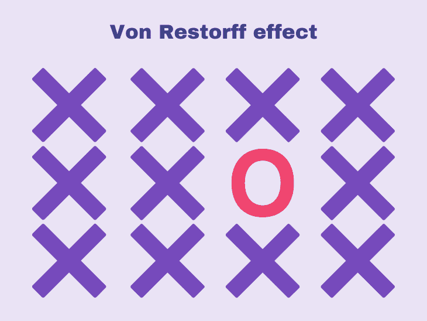
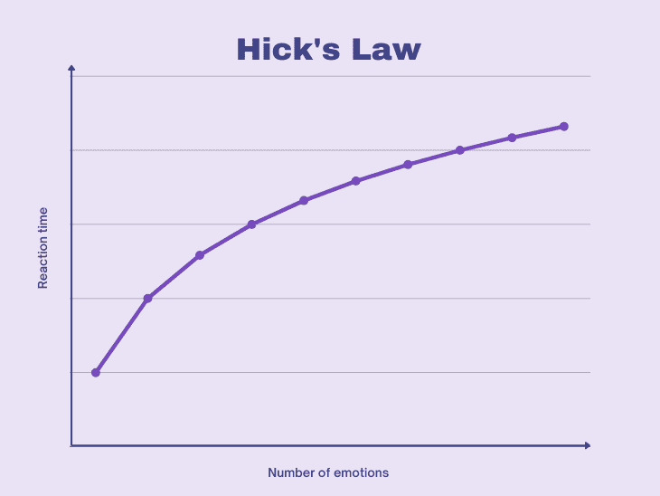

# 4 管理用户行为的法则和效果

> 原文：<https://blog.logrocket.com/product-management/user-behavior-laws-effects/>

在本指南中，我们将向您介绍影响用户行为的四个最有影响力的法律、效果和原则:

* * *

## 目录

1.  [冯·雷斯托夫效应:为什么奇数被计数](#the-von-restorff-effect-why-the-odd-one-out-counts)
2.  [米勒定律:为什么用户不能跟踪多个任务](#millers-law-why-users-cant-keep-track-of-multiple-tasks)
3.  [希克斯定律:为什么过多的选择会让你慢下来](#hicks-law-why-too-much-choice-slows-you-down)
4.  [美学-可用性效应:为什么漂亮的设计更有用](#the-aesthetic-usability-effect-why-beautiful-design-is-more-useful)

* * *

## 冯·雷斯托夫效应:为什么奇数被认为是重要的

[冯·雷斯托夫效应](https://thebehavioursagency.com/von-restorff-effect/#:~:text=What%20is%20the%20Von%20Restorff,it%20is%20to%20be%20seen.)，也被称为隔离效应，表示当你将多个相似的物体放在一起时，与其余物体最不同的物体将更有可能被记住。

以德国精神病学家 Hedwig von Restorff 的名字命名，她在 1933 年的研究中发现，当参与者面前有一系列完全相似的项目，并且列表上有一个独特的项目时，对独特项目的记忆会得到改善:

### 这对用户行为有什么影响？

这一理论在我们的日常生活中经常出现。在设计和改进我们的产品时，我们会遇到不断使用这种洞察力的决策。

每当我们被要求设计任何东西时，我们的目标应该是使最重要的信息或动作在视觉上与页面上的其他东西有所区别。这就是为什么我们发现网站页面使用不同颜色的按钮来显示公司想要直接关注的动作。

例如，一个网站可以全是灰色的按钮，但把“继续”或“购买”按钮变成绿色。当然，颜色只是表示区分的一种方式；该理论适用于许多其他属性，如形状、大小和字体。

### 课程

让太多东西都一样会给用户带来困惑。

我们能确保在页面上有一个动作层次结构吗，最高优先级的动作是最明显的？我们能否以相似的风格保存相似性质的行为或信息，以支持用户识别差异？

## 米勒定律:为什么用户不能跟踪多项任务

[米勒定律](https://uxdesign.cc/millers-law-is-there-a-magical-number-in-ux-design-7999f92ef7b8#:~:text=Miller's%20Law%20states%20that%20the,number%20of%20choices%20to%20them.)关注的是一心多用的能力。

1956 年，作为哈佛大学的一名教授，乔治·米勒断言，一个人的即时记忆限于大约七条单独的信息，正负两条。这样做的结果是，我们的大脑无法同时处理太多的事情，处理得越多，它在试图完成的任务中失败的可能性就越大。

### 这对用户行为有什么影响？

米勒定律的应用可以在产品中看到，这些产品被设计成用更少的部件将更大的任务分成更小的部分。前提是，如果我们能够将我们的活动保持在我们大多数人能够应付的七条信息以下，那么最终成功完成我们任务的机会就更大。

这一点在解决首次用户的需求时尤为关键，因为这些用户没有时间将呈现给他们的信息编码到长期记忆中。他们完全处理我们放在他们面前的所有东西，而不依赖于习得的记忆。

### 课程

给用户一长串的信息或动作会导致混乱。

我们能把注册表单分成易于管理的小块，而不是一个无休止滚动的表单吗？能否在后期向用户介绍新的概念，让他们在学习基础的同时，不会被各方面的内容淹没？

## 希克定律:为什么过多的选择会让你慢下来

希克定律(Hick's Law)或更正式地称为希克-海曼定律(Hick-Hyman Law ),是以心理学家威廉·希克和雷·海曼的名字命名的，他们在 1952 年开始研究一个人受到的刺激数量与其对个人反应时间的影响之间的关系。

这项研究发现，一个人可以选择的刺激越多，他们做决定的时间就越长:

### 这对用户行为有什么影响？

你会在你可能接触过的众多产品中看到这个理论的基础。

这就是为什么当你注册时，Twitter 会推荐一些主题或用户，因为这可以防止你在刚刚开始你的 Twitter 之旅时，被迫从数百万用户中决定跟随谁。

这就是为什么订阅定价页面通常只有三到四个选项。公司提供的选择越多，消费者就越担心做出正确的选择，因此根本不会做出选择。

这就是为什么每当我们注册一项新服务时，我们会得到一系列默认设置，并有机会在我们了解我们想要什么时调整它们。想象一下，每次启动新服务时都必须设置每个值。

### 课程

有太多的选择会给用户带来困惑。

你能为用户做出什么样的选择来让他们继续使用你的产品？我们怎样才能促使他们做出更快的选择，而不被分析麻痹所困扰？

## 美学可用性效应:为什么漂亮的设计更有用

1995 年，日立设计中心的研究人员开始研究人机交互，并发现用户界面外观的评级与他们对其可用性的感知之间有很强的相关性。这就是众所周知的审美可用性效应。

他们的结论是，用户很可能会受到界面美感的强烈影响，即使是在他们试图评估底层功能的时候。基本上，如果我们认为它看起来不错，那么我们可能会认为它更容易使用。

* * *

订阅我们的产品管理简讯
将此类文章发送到您的收件箱

* * *

### 这对用户行为有什么影响？

这种效果似乎给了设计师一张免罪卡，可以用来克服他们引入的任何可用性问题，但它也有其局限性。这种效果实际上只是克服了一些小的可用性问题；它没有考虑任何更大的、基本的 UI 问题。

当向利益相关者提出想法和模型时，这里有一个考虑因素。如果你展示了一些设计精美的页面，那么利益相关者就有可能被这些美丽所蒙蔽，而没有注意到一些更重要的方面。也许你没有包括法律文本，或者追加销售选项，但是因为他们着迷于图片，他们不太可能提出来。

### 课程

让产品更美观可能会克服任何可用性困难。

你能提供低保真度的线框图或原型吗？内容和可用性才是重点，而不是美学。

## 这还没有结束

这四种效应和理论并不是影响我们开发产品的唯一因素。

从[逐字效应](https://effectiviology.com/verbatim-effect/)到[图式理论](http://web.mit.edu/pankin/www/Schema_Theory_and_Concept_Formation.pdf)、[雅各布定律](https://lawsofux.com/jakobs-law/)到[峰端法则](https://thedecisionlab.com/biases/peak-end-rule)，我们的用户为什么做他们正在做的事情背后都有原因和想法。

作为提供高质量产品的参与者，我们应该理解这些理论，并利用它们来确保我们的用户从我们的产品中获得他们需要的东西，同时继续返回。

*精选图片来源:[icon scout](https://iconscout.com/icon/people-network-2863988)*

## [LogRocket](https://lp.logrocket.com/blg/pm-signup) 产生产品见解，从而导致有意义的行动

[LogRocket](https://lp.logrocket.com/blg/pm-signup) 确定用户体验中的摩擦点，以便您能够做出明智的产品和设计变更决策，从而实现您的目标。

使用 LogRocket，您可以[了解影响您产品的问题的范围](https://logrocket.com/for/analytics-for-web-applications)，并优先考虑需要做出的更改。LogRocket 简化了工作流程，允许工程和设计团队使用与您相同的[数据进行工作](https://logrocket.com/for/web-analytics-solutions)，消除了对需要做什么的困惑。

让你的团队步调一致——今天就试试 [LogRocket](https://lp.logrocket.com/blg/pm-signup) 。