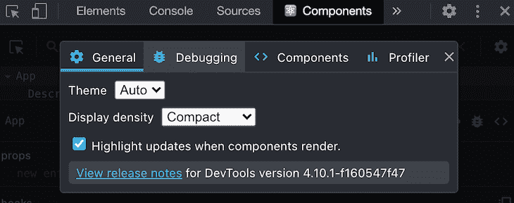
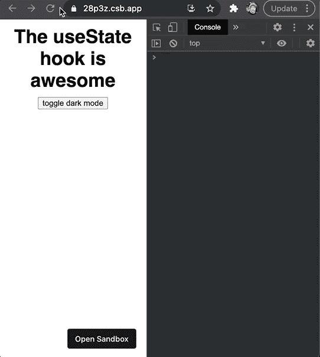
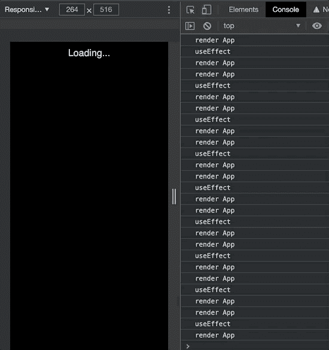
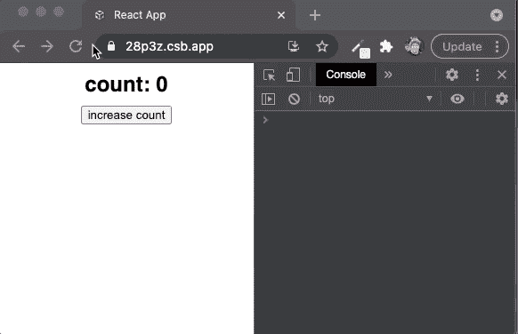
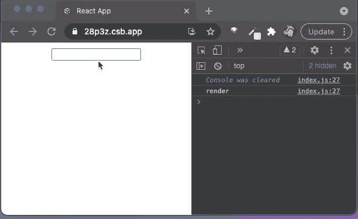
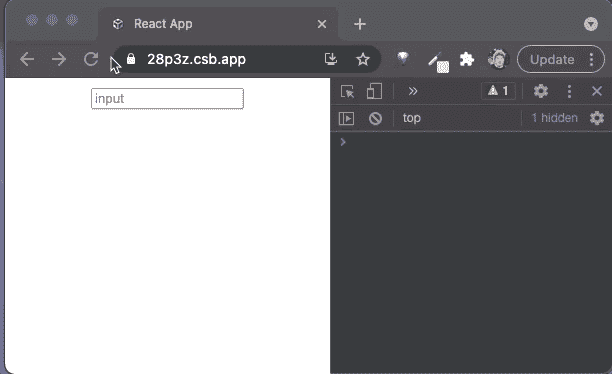
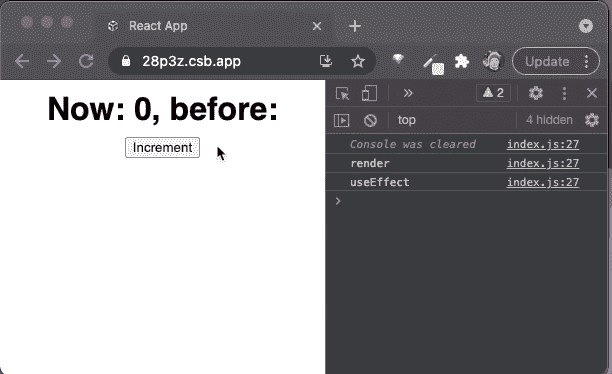

# useState vs. useRef:相似性、差异和用例

> 原文：<https://blog.logrocket.com/usestate-vs-useref/>

这篇文章解释了 React 钩子`useState`和`useRef`。您将学习它们的基本用法，并了解两种挂钩的不同用例。

你可以在[代码沙箱](https://codesandbox.io/s/gifted-austin-28p3z?file=/src/App.js)中找到这些例子。要查看不同的示例，只需修改`App.js:`中的以下代码行

```
export default AppDemo6; // change to AppDemo<Nr>
```

## 理解`useState`挂钩

`[useState](https://reactjs.org/docs/hooks-state.html)`钩子支持功能组件的组件状态开发。在 React 16.8 之前，组件局部状态只能在基于类的组件中实现。

看一下下面的代码。

```
import { useState } from "react";
function AppDemo1() {
  const stateWithUpdater = useState(true);
  const darkMode = stateWithUpdater[0];
  const darkModeUpdater = stateWithUpdater[1];
  return (
    <div>
      <p>{darkMode ? "dark mode on" : "dark mode off"}</p>
      <button onClick={() => darkModeUpdater(!darkMode)}>
        toggle dark mode
      </button>
    </div>
  );
}
```

`useState`钩子返回一个包含两项的数组。在这个例子中，我们实现了一个布尔组件状态，并用`true`初始化我们的钩子。

只有在最初的渲染周期中才会考虑这个参数`useState`。然而，如果你需要一个计算复杂的初始值，那么你可以[传递一个回调函数](https://reactjs.org/docs/hooks-reference.html#lazy-initial-state)来优化性能。

第一个数组项表示实际状态，第二个项构成状态更新器函数。`onClick`处理程序演示了如何使用更新函数(`darkModeUpdate`)来改变状态变量(`darkMode`)。像这样更新你的状态是很重要的。以下代码是非法的:

```
darkMode = true;
```

如果你有一些使用`useState`钩子的经验，你可能会对我的例子的语法感到疑惑。默认用法是在[数组析构](https://blog.logrocket.com/javascript-concepts-before-learning-react/)的帮助下利用返回的数组项。

```
const [darkMode, setDarkMode] = useState(true);
```

提醒一下，使用任何钩子时，都要遵循[钩子](https://reactjs.org/docs/hooks-rules.html)的规则，而不仅仅是`useState`或`useRef`规则，这一点至关重要:

*   钩子应该只从 React 函数的顶层调用
*   不得从嵌套代码中调用挂钩(例如，循环、条件)
*   钩子也可以从自定义钩子在顶层调用

现在我们已经介绍了基础知识，让我们用下面的示例代码来看看钩子的各个方面。

```
import { useState } from "react";
import "./styles.css";
function AppDemo2() {
  console.log("render App");
  const [darkMode, setDarkMode] = useState(false);
  return (
    <div className={`App ${darkMode && "dark-mode"}`}>
      <h1>The useState hook</h1>
      <h2>Click the button to toggle the state</h2>
      <button
        onClick={() => {
          setDarkMode(!darkMode);
        }}
      >
        toggle dark mode
      </button>
    </div>
  );
}
```

如果`darkMode`被设置为`true`，那么一个额外的 CSS 类(`dark-mode`)被添加到`className`，并且背景和文本的颜色被反转。从记录中的控制台输出可以看出，每次状态改变时，相应的组件都会被重新呈现。


Every state change re-renders the `App` component.

在这里，React DevTools 特别有助于在组件渲染时突出显示更新。在最后一个记录中，您可以看到组件周围闪烁的边框，通知您另一个组件渲染周期。



Option to visually highlight re-renders.

在下一个例子中，标题被提取到一个单独的 React 组件中(`Description`)。

```
import { useState } from "react";
import "./styles.css";
function AppDemo3() {
  console.log("render App");
  const [darkMode, setDarkMode] = useState(false);
  return (
    <div className={`App ${darkMode && "dark-mode"}`}>
      <Description />
      <button
        onClick={() => {
          setDarkMode(!darkMode);
        }}
      >
        toggle dark mode
      </button>
    </div>
  );
}
const Description = () => {
  console.log("render Description");
  return (
    <>
      <h1>The useState hook</h1>
      <h2>Click the button to toggle the state</h2>
    </>
  );
};
```

每当用户单击按钮时，`App`组件就会被呈现，因为相应的 click 处理程序会更新`darkMode`状态变量。此外，子组件`Description`也得到了渲染。


Every state change re-renders the `App` and child components.

下图中的[说明了状态变化导致渲染循环。](https://wavez.github.io/react-hooks-lifecycle/)


A state update re-renders the corresponding component.

为什么理解 React 钩子生命周期很重要？一方面，只要不通过 updater 函数更新状态，状态就会在渲染过程中保持不变，这本身就会触发新的渲染周期。

### 使用带有`useEffect`的`useState`挂钩

另一个需要理解的重要概念是`[useEffect](https://reactjs.org/docs/hooks-effect.html)`钩子，您很可能必须在应用程序中使用它来调用异步代码(例如，获取数据)。正如你在前面的图中看到的，`useState`和`useEffect`钩子紧密耦合，因为状态变化可能会调用效果。

让我们看看下面的例子。我们引入两个额外的状态变量:`loading`和`lang`。每当`url`道具改变时，该效果就会被调用。它获取一个语言字符串(或者是`en`或者是`de`)并用`setLang` updater 函数更新状态。

根据语言的不同，标题中会呈现英语或德语字符串。此外，在获取过程中，设置了一个`loading`状态，并且根据该值(`true`或`false`)，呈现一个加载指示符而不是标题。

```
import { useEffect, useState } from "react";
import "./styles.css";
  function App4({ url }) {
  console.log("render App");
  const [loading, setLoading] = useState(true);
  const [lang, setLang] = useState("de");
  const [darkMode, setDarkMode] = useState(false);
  useEffect(() => {
    console.log("useEffect");
    const fetchData = async function () {
      try {
        setLoading(true);
        const response = await axios.get(url);
        if (response.status === 200) {
          const { language } = response.data;
          setLang(language);
        }
      } catch (error) {
        throw error;
      } finally {
        setLoading(false);
      }
    };
    fetchData();
  }, [url]);
  return (
    <div className={`App ${darkMode && "dark-mode"}`}>
      {loading ? (
        <div>Loading...</div>
      ) : (
        <>
          <h1>
            {lang === "en"
              ? "The useState hook is awesome"
              : "Der useState Hook ist toll"}
          </h1>
          <button
            onClick={() => {
              setDarkMode(!darkMode);
            }}
          >
            toggle dark mode
          </button>
        </>
      )}
    </div>
  );
}
```



Setting loading and lang state inside `useEffect`.

让我们假设我们想在获取当前语言时切换黑暗模式。在更新了语言之后，我们添加了对`setDarkMode`更新器的调用。此外，我们需要将`darkMode`状态作为依赖项添加到效果的依赖数组中。

> 为什么必须这样做超出了本文的范围，但是你可以在我之前的文章中[详细阅读`useEffect`钩子](https://blog.logrocket.com/guide-to-react-useeffect-hook/)。

```
import { useEffect, useState } from "react";
import "./styles.css";
function AppDemo5({ url }) {
  console.log("render App");
  const [loading, setLoading] = useState(true);
  const [lang, setLang] = useState("de");
  const [darkMode, setDarkMode] = useState(false);
  useEffect(() => {
    console.log("useEffect");
    const fetchData = async function () {
      try {
        setLoading(true);
        const response = await axios.get(url);
        if (response.status === 200) {
          const { language } = response.data;
          setLang(language);
          setDarkMode(!darkMode);
        }
      } catch (error) {
        throw error;
      } finally {
        setLoading(false);
      }
    };
    fetchData();
  }, [url, darkMode]);
  return (
    <div className={`App ${darkMode && "dark-mode"}`}>
      {loading ? (
        <div>Loading...</div>
      ) : (
        <>
          <h1>
            {lang === "en"
              ? "The useState hook is awesome"
              : "Der useState Hook ist toll"}
          </h1>
          <button
            onClick={() => {
              setDarkMode(!darkMode);
            }}
          >
            toggle dark mode
          </button>
        </>
      )}
    </div>
  );
}
```

不幸的是，我们造成了一个无限循环。



Wrong usage of state in combination with `useEffect` causes an infinite loop.

这是为什么呢？因为我们已经将`darkMode`添加到效果的依赖数组中，并且我们更新了效果内部的确切状态，所以效果再次被调用，再次更新状态，如此循环往复。

但是有一条出路！我们可以通过[从先前的状态](https://reactjs.org/docs/hooks-reference.html#functional-updates)计算新的状态来避免`darkMode`成为效果的依赖。我们通过传递一个具有先前状态的函数作为参数来调用`setDarkMode`更新器。

修改后的`useEffect`实现如下所示:

```
  useEffect(() => {
    console.log("useEffect");
    const fetchData = async function () {
      try {
        setLoading(true);
        const response = await axios.get(url);
        if (response.status === 200) {
          const { language } = response.data;
          setLang(language);
          setDarkMode((previous) => !previous); // no access of darkMode state
        }
      } catch (error) {
        throw error;
      } finally {
        setLoading(false);
      }
    };
    fetchData();
  }, [url]); // no darkMode dependency
```

### 与基于类的组件的区别

如果您已经使用 React 很长时间了，或者您目前正在处理遗留代码，那么您应该知道基于类的组件。对于基于类的组件，只有一个对象表示组件状态。为了更新整体状态的一部分，您可以利用通用的`[setState]([https://reactjs.org/docs/state-and-lifecycle.html](https://reactjs.org/docs/state-and-lifecycle.html))`方法。

假设我们只想更新`darkMode`状态变量。然后，您可以将更新的属性放入对象中；该州的其他地方不受影响。

```
this.setState({darkMode: false});
```

然而，对于功能组件，首选方式是使用可以单独更新的原子状态变量。否则，你可以很快发现自己在泪之谷。

与`AppDemo6`相比，以下组件(`AppDemo7`)仅在状态管理方面进行了重构。我们使用一个状态对象(`state`)，而不是三个原始数据类型的原子状态变量。

```
import { useEffect, useState } from "react";
import "./styles.css";
function AppDemo7({ url }) {
  const initialState = {
    loading: true,
    lang: "de",
    darkMode: true
  };
  const [state, setState] = useState(initialState);
  console.log("render App", state);
  useEffect(() => {
    console.log("useEffect");
    const fetchData = async function () {
      try {
        setState((prev) => ({
          loading: true,
          lang: prev.lang,
          darkMode: prev.darkMode
        }));
        const response = await axios.get(url);
        if (response.status === 200) {
          const { language } = response.data;
          setState((prev) => ({
            lang: language,
            darkMode: !prev.darkMode,
            loading: prev.loading
          }));
        }
      } catch (error) {
        throw error;
      } finally {
        setState((prev) => ({
          loading: false,
          lang: prev.lang,
          darkMode: prev.darkMode
        }));
      }
    };
    fetchData();
  }, [url]);
  return (
    <div className={`App ${state.darkMode && "dark-mode"}`}>
      {state.loading ? (
        <div>Loading...</div>
      ) : (
        <>
          <h1>
            {state.lang === "en"
              ? "The useState hook is awesome"
              : "Der useState Hook ist toll"}
          </h1>
          <button
            onClick={() => {
              setState((prev) => ({
                darkMode: !prev.darkMode,
                // lang: prev.lang,
                loading: prev.loading
              }));
            }}
          >
            toggle dark mode
          </button>
        </>
      )}
    </div>
  );
}
```

如你所见，代码很乱，很难维护。它还包括一个 bug，用`onClick`处理程序中的注释掉的属性来说明。当用户单击按钮时，整体状态计算不正确。

在这种情况下，`lang`属性不存在。这导致了一个错误，导致文本以德语呈现，因为`state.lang`是`undefined`。我希望我已经明确表明这是一个坏主意。顺便说一下， [React 团队也不建议](https://reactjs.org/docs/hooks-faq.html#should-i-use-one-or-many-state-variables)。

## 理解`useRef`挂钩

`[useRef](https://reactjs.org/docs/hooks-reference.html#useref)`挂钩与`useState`相似，但有所不同😀。在我澄清之前，我先解释一下它的基本用法。

```
import { useRef } from 'react';
const AppDemo8 = () => {
  const ref1 = useRef();
  const ref2 = useRef(2021);
  console.log("render");
  console.log(ref1, ref2);
  return (
    <div>
      <h2>{ref1.current}</h2>
      <h2>{ref2.current}</h2>
    </div>
  );
};
```

结果并不引人注目，但却揭示了症结所在。


The values are stored in the `current` property.

我们通过调用。钩子调用返回一个具有属性`current`的对象，该属性存储实际值。如果您将一个参数`initialValue`传递给`useRef(initialValue)`，那么这个值将存储在`current`中。

这就是第一个`console.log`输出存储`undefined`的原因:因为我们在没有任何参数的情况下调用了钩子。别担心，我们可以稍后赋值。

要访问 ref 的值，您需要访问它的`current`属性，就像我们在 JSX 部分所做的那样。定义引用后，它们在初始渲染中直接可用。

但是我们到底为什么需要`useRef`？为什么不用普通的[变量`let`代替](https://developer.mozilla.org/en-US/docs/Web/JavaScript/Reference/Statements/let)？别急——我们回头再谈那个。

### `useRef`的常见用例

让我们看看下面的例子。

```
import { useRef } from "react";
import "./styles.css";
const AppDemo9 = () => {
  const countRef = useRef(0);
  console.log("render");
  return (
    <div className="App">
      <h2>count: {countRef.current}</h2>
      <button
        onClick={() => {
          countRef.current = countRef.current + 1;
          console.log(countRef.current);
        }}
      >
        increase count
      </button>
    </div>
  );
};
```

我们的目标是定义一个名为`countRef`的 ref，用`0`初始化这个值，并在每次点击按钮时增加这个计数器变量。渲染的计数值应该更新。不幸的是，它不起作用——甚至控制台输出也证明了`current`属性保存了正确的更新。



Count does not update on button click.

正如您从我们的另一个控制台输出呈现中看到的，我们的组件没有重新呈现。我们可以利用`useState`来代替这种行为。

什么？所以`useRef`挺没用的？没那么快——和其他触发重渲染的钩子结合使用很方便，比如`useState`、`[useReducer](https://reactjs.org/docs/hooks-reference.html#usereducer)`和`[useContext](https://reactjs.org/docs/hooks-reference.html#usecontext)`。

你得把`useRef`当成你工具箱里的另一个工具，你得明白什么时候用它。还记得上面的组件生命周期图吗？refs 的值(特别是`current`属性)在整个渲染周期中保持不变。这不是一个错误；这是一个特点。

考虑这样的情况，您想要更新组件的数据(即，它的状态变量)来触发呈现，以便更新 UI。您也可能需要相同的行为，但有一个例外:您不希望触发渲染循环，因为这可能会导致错误、尴尬的用户体验(例如，闪烁)或性能问题。

你可以把 refs 想象成基于类的组件的[实例变量。ref 是一个通用容器，用于存储任何类型的数据，如原始数据或对象。](https://reactjs.org/docs/hooks-faq.html#is-there-something-like-instance-variables)

好吧，我们将展示一个有用的例子。

```
import { useState } from "react";
import "./styles.css";
const AppDemo10 = () => {
  const [value, setValue] = useState("");
  console.log("render");
  const handleInputChange = (e) => {
    setValue(e.target.value);
  };
  return (
    <div className="App">
      <input value={value} onChange={handleInputChange} />
    </div>
  );
};
```

从下面的记录中可以看到，这个组件只是呈现一个输入字段，并将其值存储在`value`状态变量中。控制台输出显示，每次击键时都会重新呈现`AppDemo10`组件。

这可能是您想要的行为，例如，对每个字符执行搜索等操作。这被称为[受控组件](https://reactjs.org/docs/uncontrolled-components.html)。然而，它可能正好相反，并且渲染变得有问题。然后你需要一个[不受控组件](https://reactjs.org/docs/uncontrolled-components.html)。



A controlled component renders on every keystroke.

让我们重写这个例子，使用一个带有`useRef`的不受控制的组件。因此，我们需要一个按钮来更新组件的状态并存储完全填充的输入字段。

```
import { useState, useRef } from "react";
import "./styles.css";
const AppDemo11 = () => {
  const [value, setValue] = useState("");
  const valueRef = useRef();
  console.log("render");
  const handleClick = () => {
    console.log(valueRef);
    setValue(valueRef.current.value);
  };
  return (
    <div className="App">
      <h4>Value: {value}</h4>
      <input ref={valueRef} />
      <button onClick={handleClick}>click</button>
    </div>
  );
};
```

使用这种解决方案，我们不会在每次击键时导致渲染循环。另一方面，我们需要用一个按钮“提交”输入来更新状态变量`value`。从控制台输出可以看出，第二次渲染首先发生在单击按钮时。


An uncontrolled component does not trigger re-renders on change.

顺便说一下，上面的例子展示了 refs 的第二个用例。

```
<input ref={valueRef} />
```

通过`ref`属性，React 提供了对 React 组件或 HTML 元素的直接访问。控制台输出显示我们确实可以访问`input`元素。引用存储在`current`属性中。

这构成了`useRef`的第二个用例，除了将它作为一个通用容器在整个组件生命周期中保存数据。如果需要直接访问 DOM 元素，可以利用`ref` prop。下一个示例显示了如何在组件初始化后聚焦输入字段。

```
import { useEffect, useRef } from "react";
import "./styles.css";
const AppDemo12 = () => {
  const inputRef = useRef();
  console.log("render");
  useEffect(() => {
    console.log("useEffect");
    inputRef.current.focus();
  }, []);
  return (
    <div className="App">
      <input ref={inputRef} placeholder="input" />
    </div>
  );
};
```

在`useEffect`回调中，我们调用本机`[focus](https://developer.mozilla.org/en-US/docs/Web/API/HTMLOrForeignElement/focus)`方法。



Focus an input field with the help of a ref.

当您需要直接访问 DOM 元素时，这种技术也广泛用于与第三方(非 React)组件结合的 React 项目中。

另一个常见的用例是当您需要前一个渲染周期的状态值时。以下示例显示了如何做到这一点。当然，您也可以将逻辑提取到一个定制的`[usePrevious](https://usehooks.com/usePrevious/)`钩子中。

```
import { useEffect, useState, useRef } from "react";
import "./styles.css";
const AppDemo13 = () => {
  console.log("render");
  const [count, setCount] = useState(0);
  // Get the previous value (was passed into hook on last render)
  const ref = useRef();
  // Store current value in ref
  useEffect(() => {
    console.log("useEffect");
    ref.current = count;
  }, [count]); // Only re-run if value changes
  return (
    <div className="App">
      <h1>
        Now: {count}, before: {ref.current}
      </h1>
      <button onClick={() => setCount(count + 1)}>Increment</button>
    </div>
  );
};
```

在初始渲染之后，执行一个效果，将状态变量`count`分配给`ref.current`。因为没有额外的渲染发生，所以渲染值是`undefined`。点击按钮触发状态更新，因为调用了`setCount`。

接下来，UI 被重新呈现，标签前的**显示正确的值(`0`)。渲染后，调用另一个效果。现在`1`被分配给我们的 ref，以此类推。**



Access previous state with the help of `useRef`.

值得注意的是，所有的引用都需要在`useEffect`回调或处理程序中得到更新。在渲染期间改变 ref，也就是说，从除了刚才提到的地方之外的地方，可能会引入 bug。这同样适用于`useState`。

### 为什么`let`不能取代`useRef`

现在我还欠你一个解释，为什么一个`let`变量不能代替一个 ref 的概念。下一个例子用来自`useEffect`钩子内部的普通 JavaScript 变量赋值替换了`useRef`的使用。

```
import { useEffect, useState } from "react";
import "./styles.css";
const AppDemo14 = () => {
  console.log("render");
  const [count, setCount] = useState(0);
  let prevCount;
  useEffect(() => {
    console.log("useEffect", prevCount);
    prevCount = count;
  }, [count]);
  return (
    <div className="App">
      <h1>
        Now: {count}, before: {prevCount}
      </h1>
      <button onClick={() => setCount(count + 1)}>Increment</button>
    </div>
  );
};
```

然而，下面的录音将揭示这是行不通的。控制台输出加剧了这个问题，因为在每个新的渲染周期中，`useEffect`内部的赋值都会被覆盖。`undefined`因`let prevCount;`而被隐式赋值。


A normal variable assignment cannot replace useRef.

甚至强大的 ESLint [钩子规则插件](https://www.npmjs.com/package/eslint-plugin-react-hooks)也告诉你我们应该利用`useRef`来代替。


The ESLint plugin warns you about using variables instead of refs.

## `useRef`和`useState`的区别一目了然

以下差异已经过详细讨论，但在此再次以简洁的总结形式呈现:

*   两者都在渲染周期和 UI 更新期间保留了它们的数据，但是只有带有 updater 函数的`useState`钩子会导致重新渲染
*   `useRef`返回一个具有保存实际值的`current`属性的对象。相反，`useState`返回一个包含两个元素的数组:第一项构成了州，第二项代表了州更新函数
*   `useRef`的`current`属性是[可变的](https://doppelmutzi.github.io/javascript-to-master-before-learning-react/#immutable-vs-mutable-values)，而`useState`的状态变量不是。与`useRef`的`current`属性相反，你不应该直接给`useState`的状态变量赋值。相反，总是使用 updater 函数(即第二个数组项)。正如 React 团队在[文档](https://reactjs.org/docs/react-component.html#state)中为基于类的组件`setState`所建议的那样(但对函数组件也是如此)，将状态视为不可变变量
*   `useState`和`useRef`可以被认为是数据挂钩，但是只有`useRef`可以用于另一个应用领域:直接访问 React 组件或 DOM 元素

## 结论

本文讨论了`useState`和`useRef`挂钩。在这一点上应该很清楚，挂钩没有好坏之分。React 应用程序需要这两个挂钩，因为它们是为不同的应用程序设计的。

如果你想更新数据并引起 UI 更新，`useState`就是你的钩子。如果在组件的整个生命周期中，您需要某种数据容器，而不会因为改变变量而导致渲染周期，那么`useRef`就是您的解决方案。

## 使用 LogRocket 消除传统反应错误报告的噪音

[LogRocket](https://lp.logrocket.com/blg/react-signup-issue-free)

是一款 React analytics 解决方案，可保护您免受数百个误报错误警报的影响，只针对少数真正重要的项目。LogRocket 告诉您 React 应用程序中实际影响用户的最具影响力的 bug 和 UX 问题。

[ ](https://lp.logrocket.com/blg/react-signup-general) [  ](https://lp.logrocket.com/blg/react-signup-general) [LogRocket](https://lp.logrocket.com/blg/react-signup-issue-free)

自动聚合客户端错误、反应错误边界、还原状态、缓慢的组件加载时间、JS 异常、前端性能指标和用户交互。然后，LogRocket 使用机器学习来通知您影响大多数用户的最具影响力的问题，并提供您修复它所需的上下文。

关注重要的 React bug—[今天就试试 LogRocket】。](https://lp.logrocket.com/blg/react-signup-issue-free)