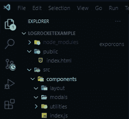
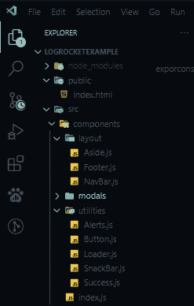
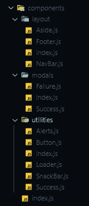

# 使用桶导出来组织 React 组件

> 原文：<https://blog.logrocket.com/using-barrel-exports-organize-react-components/>

开发 React 应用程序时的一个常见任务是将不同文件中的组件或模块放入应用程序中需要它们的部分。您可能会发现，为了导入一个单独的 React 模块，您经常需要深入研究您的文件夹结构。

现在，想象一下必须对多个模块做同样的事情。这将是非常乏味的，也会使我们的代码库变得有点乱，这是没有人喜欢的！

在本文中，我们将介绍 React 中桶导出的概念，并讨论如何使用桶导出来节省开发时间并提高协作和效率。我们甚至会看一个高级用例，当您想要在一个导入语句中使用多个别名时。

*向前跳转:*

## 什么是桶出口？

一个桶使我们能够将多个文件或模块的导出合并或汇总到一个模块中。桶简化了导入，简化了导出，并帮助我们避免了代码库中的大量混乱。

让我们来看看桶是如何简化导入的，从精神上和视觉上都是如此。

这段代码展示了我们通常如何在 React 应用程序中处理导入:

```
import Button from '../../components/utilities/Button.js';
import Alert from '../../components/utilities/Alert.js';
import SnackBar from '../../components/utilities/SnackBar.js'
import Loader from '../../components/utilities/Loader.js'
import Success from '../../components/utilities/Success.js'

```

这只是五个导入语句，但是想象一下，如果我们需要更多的组件，我们会有更多的代码行。

现在，如果我们使用桶导出来处理同样的五个导入，代码看起来是这样的:

```
import { Button, Alert, SnackBar, Loader, Success  } from '../../components';

```

我们可以通过给所有东西取别名来使代码更加简洁，所以每当我们需要一个组件时，我们只需在别名前加上 React 组件名，就像这样:

```
import * as com from '../../components';

```

我们是这样使用它的:

```
const Home=()=>{
    return(
        <div className="home">
            //aliasing our imports
            <com.Button />
        </div>
    )
}

```

我们的本地进口产品更干净，看起来更舒服，而且不需要花太多心思就能记住我们是从哪里进口的，因为它们都来自一个文件夹。

这难道不令人兴奋吗？让我们来看看使用桶出口的一些额外好处。

## 桶出口的好处

桶装出口不仅仅是外观。他们做的不仅仅是保持我们的代码库干净。

桶出口的最大优势之一是协作。考虑开发一个应用程序，其中多个团队使用一个共享的 UI 组件。对项目结构的更改可能会中断应用程序中的大量导入。

对于桶出口，我们不必担心这一点。我们可以改变 React 组件的位置，而不必重构我们的导入语句。

以下是将多个出口装入一个桶中的一些好处:

*   改进的组件自动导入
*   能够按照我们认为合适的方式组织应用程序文件夹
*   改进的智能感知
*   桶中定义的所有导出的单一真实来源

现在，让我们看看桶出口实际上是如何工作的。

## 如何使用桶出口

要使用桶导出，我们需要做以下工作:

1.  当导出 React 组件或模块时，从默认导出更改为[命名导出](https://developer.mozilla.org/en-US/docs/web/javascript/reference/statements/export)
2.  将一个`index.js`文件添加到任何我们想要转储的目录中(这将有效地成为我们的转储；我们将从该文件中重新导出所有组件

让我们看一个简单的例子，以便了解它是如何工作的。



上面的文件树帮助我们可视化我们的文件夹结构。在`components`文件夹的根目录下，我们有一个`index.js`文件，它将是我们的桶。`components`文件夹也有三个嵌套的文件夹:`layout`、`modals`和`utilities`。

在`layout`文件夹中，我们有三个布局组件文件:`Aside.js`、`Footer.js`和`NavBar.js`。在`utilities`文件夹中我们有五个文件；`Alert.js`、`Loader.js`、`SnackBar.js`、`Success.js`和`Button.js`。

以下是完整的文件树:



要使用桶导出来访问 React 组件并在我们的应用程序中使用它，我们只需使用命名导出来导出组件。

下面是一个对`Alert.js`文件使用命名导出的例子:

```
export const Alert=()=>{
    return<h1>Alert</h1>
}

```

现在一切都设置好了，我们可以导出一个桶中的所有组件。在组件文件夹的根目录下的`index.js`文件中，我们可以使用以下命令导出所有组件:

```
export { Alert } from './utilities/Alerts';
export { Button } from './utilities/Button';
export { Loader } from './utilities/Loader';
export {SnackBar} from './utilities/SnackBar';
export { Success } from './utilities/Success';

```

在上面的代码中，我们只从`utilities`文件夹中导出组件。

现在，我们可以简单地使用组件，就像这样:

```
import * as util from './components'
function App() {
  return (
    <div className="App">
      <h1>Hello World</h1>
      <util.Button />
      <util.Loader />
      <util.Alert />
      <util.SnackBar />
      <util.Success />
    </div>
  );
}

```

考虑下面的场景:团队 A 和团队 B 都在协作开发我们的应用程序。团队 A 正在重组应用程序，并将`Button.js`文件移动到应用程序中其他位置的不同文件夹中。

你认为我们的 React 应用程序会怎么样？如果你说:“它会碎”，你是对的。为什么？因为我们的桶不再知道`Button.js`文件的路径。

幸运的是，团队 A 可以很容易地解决这个问题。我们的桶为其中定义的所有导出提供了单一的真实来源，因此团队 A 只需更新桶中的`Button.js`文件路径，使用它的每个组件都将重新获得访问权。不需要手动更新每个文件的路径。

## 高级用例:多个别名

现在，让我们进一步学习。在前面的例子中，components 文件夹中只有一个桶文件处理从`utilities`文件夹的所有导出，我们使用别名`util`导入组件。

这非常简洁，但是不要忘记在我们的`components`文件夹中还有一个`layout`文件夹和一个`modals`文件夹。我们不能使用同一个`util`别名来导入它们各自的组件，因为那样会令人困惑。

下面是我们如何从一个中心桶文件中获得多个别名:

1.  [确保每个组件文件夹都有自己的桶](#ensure-each-folder-has-its-own-barrel)
2.  [使用主桶文件](#export-using-an-alias-in-the-main-barrel-file)中的别名导出
3.  [使用每个别名导入](#import-using-each-individual-alias)

让我们看看这个动作:

### 每个文件夹都有自己的桶



上面的文件树显示了我们的`components`文件夹和子文件夹:`layout`、`modals`和`utilities`。每个子文件夹现在都有自己的桶，或`index.js`文件。

代码如下所示:

```
//layouts barrel
export { Aside } from "./Aside";
export { Footer } from "./Footer";
export { NavBar } from "./NavBar";

//modals barrel
export {Failure} from './Failure';
export {Success} from './Success';

//utilities barrel
export { Alert } from './Alerts';
export { Button } from './Button';
export { Loader } from './Loader';
export {SnackBar} from './SnackBar';
export { Success } from './Success';

```

### 使用主桶文件中的别名导出

现在，我们可以使用每个子桶的别名(`util`、`mod`和`lay`)来导出主桶中的子文件夹文件:

```
export * as util from './utilities'
export * as mod from './modals'
export * as lay from './layout'

```

### 使用每个别名导入

现在，我们可以使用各自的别名(`util`、`mod`和`lay`)导入子文件夹文件:

```
import {util, mod, lay} from './components'

```

来自`utilities`文件夹的组件将具有`util`前缀，而来自`modals`和`layout`文件夹的组件将分别具有`mod`和`lay`前缀。

代码如下所示:

```
>import {util, mod, lay} from './components'
function App() {
  return (
    <div className="App">
      <h1>Hello World</h1>
        //Utilities
      <util.Button />
      <util.Loader />
      <util.Alert />
      <util.SnackBar />
      <util.Success />

      //modals
      <mod.Failure />
      <mod.Success />

      //layouts
      <lay.Aside />
      <lay.Footer />
      <lay.NavBar />
    </div>
  );
}

```

## 结论

一个架构良好的 React 应用程序更容易设计、部署、维护和扩展。桶出口通过使我们能够清理我们的本地进口来提供帮助，从而产生更干净的代码库、更好的协作和增强的组织。

## [LogRocket](https://lp.logrocket.com/blg/react-signup-general) :全面了解您的生产 React 应用

调试 React 应用程序可能很困难，尤其是当用户遇到难以重现的问题时。如果您对监视和跟踪 Redux 状态、自动显示 JavaScript 错误以及跟踪缓慢的网络请求和组件加载时间感兴趣，

[try LogRocket](https://lp.logrocket.com/blg/react-signup-general)

.

[ ](https://lp.logrocket.com/blg/react-signup-general) [](https://lp.logrocket.com/blg/react-signup-general) 

LogRocket 结合了会话回放、产品分析和错误跟踪，使软件团队能够创建理想的 web 和移动产品体验。这对你来说意味着什么？

LogRocket 不是猜测错误发生的原因，也不是要求用户提供截图和日志转储，而是让您回放问题，就像它们发生在您自己的浏览器中一样，以快速了解哪里出错了。

不再有嘈杂的警报。智能错误跟踪允许您对问题进行分类，然后从中学习。获得有影响的用户问题的通知，而不是误报。警报越少，有用的信号越多。

LogRocket Redux 中间件包为您的用户会话增加了一层额外的可见性。LogRocket 记录 Redux 存储中的所有操作和状态。

现代化您调试 React 应用的方式— [开始免费监控](https://lp.logrocket.com/blg/react-signup-general)。