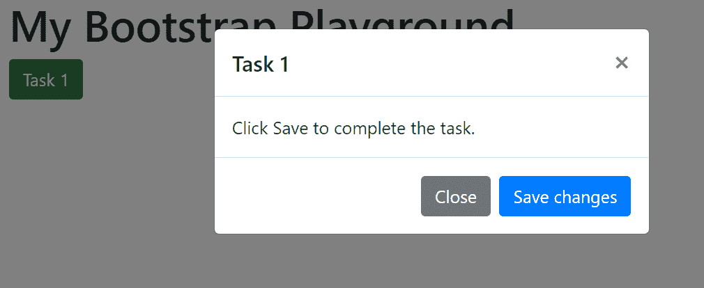
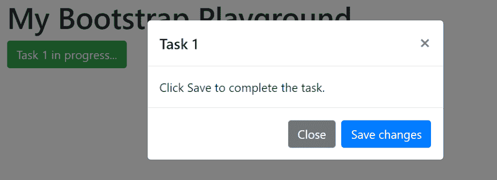
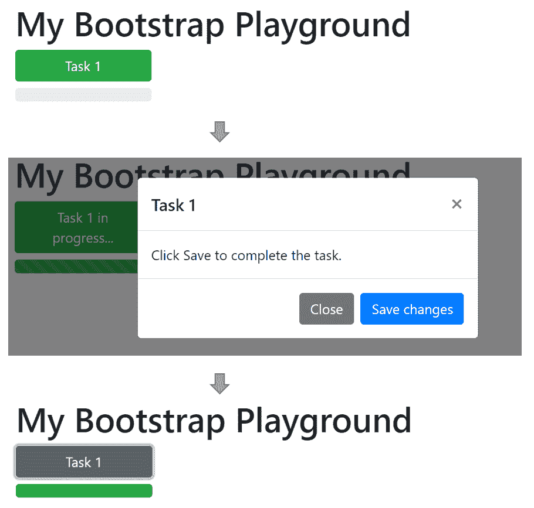
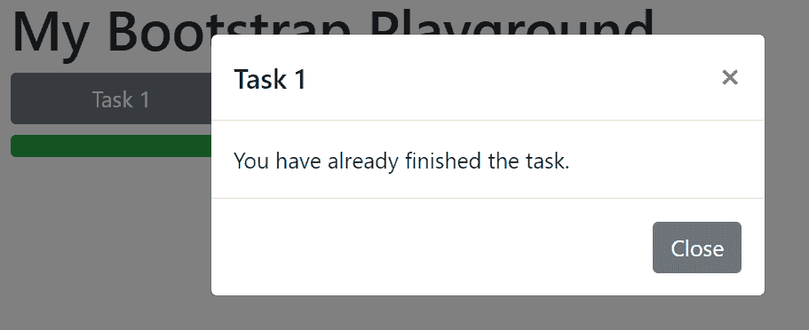

# 将引导组件用于定制 JavaScript - LogRocket 博客

> 原文：<https://blog.logrocket.com/using-bootstrap-components-with-custom-javascript/>

Bootstrap 是一个 CSS 框架，它提供了各种组件，比如按钮、面板和下拉菜单。您可以使用它来快速设计网站或 web 应用程序的图形界面。

要创建一个引导前端，你需要的只是一些 HTML 和 CSS 的知识。但是，有些功能只能在 JavaScript 的帮助下实现。为此，Bootstrap 框架提供了一个简单的 JavaScript 接口。

## 在 JavaScript 界面中使用引导程序

在本文中，我们将探索如何通过 JavaScript 接口修改和控制引导组件。我们将使用的例子是一个简单的按钮，允许用户打开一个对话框(模态)。

如果你看一下引导程序文档，你会注意到其他交互式引导程序组件的界面，如[转盘](https://getbootstrap.com/docs/4.5/components/carousel/)、[折叠](https://getbootstrap.com/docs/4.5/components/collapse/)或[下拉菜单](https://getbootstrap.com/docs/4.5/components/dropdowns/)，非常相似。因此，您在本文中学到的东西可以很容易地应用于其他组件。

### 示例页面:基本结构

下面，您可以看到我们的样本页面的基本结构的 HTML 代码。它是基于 Bootstrap 4.5 的 [starter 模板](https://getbootstrap.com/docs/4.5/getting-started/introduction/)结合一个[流体容器](https://getbootstrap.com/docs/4.5/layout/overview/#fluid)来放置页面的内容。

```
<!DOCTYPE html>

<html>

<head>

<meta charset="UTF-8"/>

<meta name="viewport" content="width=device-width, initial-scale=1, shrink-to-fit=no">

<!-- Bootstrap CSS -->

<link rel="stylesheet" href="https://cdn.jsdelivr.net/npm/[email protected]/dist/css/bootstrap.min.css" integrity="sha384-TX8t27EcRE3e/ihU7zmQxVncDAy5uIKz4rEkgIXeMed4M0jlfIDPvg6uqKI2xXr2" crossorigin="anonymous">

<title>Bootstrap Example</title>

</head>

<body>

<div class="container-fluid">

<h1>My Bootstrap Playground</h1>

</div>

<script src="https://code.jquery.com/jquery-3.5.1.slim.min.js" integrity="sha384-DfXdz2htPH0lsSSs5nCTpuj/zy4C+OGpamoFVy38MVBnE+IbbVYUew+OrCXaRkfj" crossorigin="anonymous"></script>

<script src="https://cdn.jsdelivr.net/npm/[email protected]/dist/js/bootstrap.bundle.min.js" integrity="sha384-ho+j7jyWK8fNQe+A12Hb8AhRq26LrZ/JpcUGGOn+Y7RsweNrtN/tE3MoK7ZeZDyx" crossorigin="anonymous"></script>

</body>

</html>

```

在这个例子中有两件事需要考虑:

*   在未来的版本 [Bootstrap 5](https://blog.logrocket.com/trying-out-the-new-bootstrap-5-with-react/) 中，将不再需要 jQuery 库。
*   所需的外部 CSS 和 JS 文件将通过内容交付网络(CDN)集成到这里。

使用 CDN 将允许您的网站连接到外部服务器，这可能需要在您的隐私政策中提及。或者，框架的文件也可以手动下载到你自己的服务器上。

在下一节中，我们将回顾一个没有额外 JavaScript 的按钮/模态示例。用户可以通过点击按钮来打开该模式。点击“关闭”或“x”可再次关闭。

为了实现额外的行为(比如当用户点击“保存”时)，我们需要定制 JavaScript。这种可能性将在随后的章节中讨论。

## 没有定制 JavaScript 的交互式引导组件

让我们从向示例页面添加几个组件开始。首先，我们将添加一个按钮(`button`):

```
<div class="container-fluid">

<h1>My Bootstrap Playground</h1>

<button type="button" class="btn btn-success">Task 1</button>

</div>

```

当点击按钮时，一个[模式](https://getbootstrap.com/docs/4.5/components/modal/)应该打开，显示如下文本:“点击保存以完成任务。”[现场演示](https://getbootstrap.com/docs/4.5/components/modal/#live-demo)部分解释了如何实现这一行为:

按钮必须补充属性`data-toggle="modal"`和`data-target="#task1_Modal"`。

```
<button type="button" class="btn btn-success" data-toggle="modal" data-target="#task1_Modal">Task 1</button>
```

必须插入模式组件的 HTML 代码。分配的 ID(这里:`task1_Modal`)必须在按钮的`data-target`属性中被正确引用(前面有一个#符号，所以它读作`#task1_Modal”`)。

```
< div class="modal fade" id="task1_Modal" tabindex="-1" aria-labelledby="task1_ModalLabel" aria-hidden="true">

<div class="modal-dialog">

<div class="modal-content">

<div class="modal-header">

<h5 class="modal-title" id="task1_ModalLabel">Task 1</h5>

<button type="button" class="close" data-dismiss="modal" aria-label="Close">

<span aria-hidden="true">×</span>

</button>

</div>

<div class="modal-body">
</div>

<div class="modal-footer">

<button type="button" class="btn btn-secondary" data-dismiss="modal">Close</button>

</div>

</div>

</div>

</div>
```

如果您在浏览器中查看该页面，您会注意到，当您单击按钮时，对话框会显示出来，并且可以通过单击“关闭”按钮再次关闭。



The modal opens after clicking the button “Task 1”.

这里你可以试试我们例子的第一个版本。

如果不使用 Bootstrap 框架，这种交互只能通过额外的 JavaScript 代码来实现。我们必须对点击事件做出反应，显示和隐藏模态，并调整按钮的样式。Bootstrap 框架为我们做了所有这些事情。

## 带有定制 JavaScript 的交互式引导组件

请注意，以下代码示例要求 JavaScript 库 [jQuery](https://jquery.com/) 包含在网站中。如果你想把代码改成简单的 JavaScript，我推荐托拜厄斯·阿林写的一本优秀的[小抄。](https://tobiasahlin.com/blog/move-from-jquery-to-vanilla-javascript/)

### 按钮方法

在单个组件的引导文档中，通常有一个[方法部分](https://getbootstrap.com/docs/4.5/components/buttons/#methods)。Bootstrap 为我们提供了一个有用的`toggle`方法来通过 JavaScript 控制按钮。要使用这个方法，我们首先要给按钮一个 ID，比如`task1_button`:

```
<button id="task_button"… </button>
```

通过调用`toggle`方法，我们可以通过 JavaScript 将按钮的外观从“未点击”切换到“已点击”,反之亦然。

为了对其进行测试，请在结束 body 标记之前插入以下代码段:

```
…

<script>

$("#task1_button").button("toggle");

</script>

</body>
```

浏览器加载页面后，会立即执行代码。

通过使用[选择器](https://developer.mozilla.org/de/docs/Web/CSS/CSS_Selectors) `#task1_button`，我们指出方法`toggle`应该只应用于 ID 为`task1_button`的按钮(即使页面上应该有更多的按钮)。

当打开页面时，按钮看起来应该像一个已经被点击过的按钮(深绿色)。

现在添加第二个调用`toggle`:

```
$("#task1_button").button("toggle");

$("#task1_button").button("toggle");
```

当打开页面时，按钮现在应该回到初始状态(浅绿色)。

### 模态方法

模态组件的[方法部分](https://getbootstrap.com/docs/4.5/components/modal/#modaltoggle)也有类似的结构。这里还有一个`toggle`方法，使用它可以有计划地将模态从关闭状态移动到打开状态(然后再返回)。

```
…

<script>

$("#task1_Modal").modal("toggle");

</script>

</body>
```

有了这个代码片段，当页面加载时，模式会自动打开，用户不必先单击按钮。第二次调用导致对话框关闭。

要打开和关闭对话框，您也可以使用单独的方法`show`和`hide`。我们可以在单击“保存”按钮后使用 hide 方法关闭模态。这需要 2 个步骤:

首先，使用属性`onclick`定义点击按钮时应该执行哪个 JavaScript 函数，例如`task1_save()`:

```
<button type="button" class="btn btn-primary" onclick="task1_save()">Save changes</button>
```

然后，在结束 body 标记之前插入以下脚本代码:

```
<script>

function task1_save(){

$("#task1_Modal").modal("hide");

}

</script>
</body>
```

其他交互组件，如`Carousel`、`Collapse`、`Dropdown,`也有类似的控制组件状态的方法。

### 事件

对于一些引导组件，在[文档](https://getbootstrap.com/docs/4.5/components/modal/#events)中有一个额外的“事件”部分。这是关于以编程方式对用户在与相应组件交互期间触发的预定义事件做出反应。

例如，对于一个模态，我们可以定义当事件`show`或`hide`被触发时应该发生什么(例如，通过调用组件的相应的`show`或`hide`方法)。

在我们的示例中，应定义以下内容:

*   一旦`show`事件被触发，按钮的标签就会从“任务 1”变为“任务 1 正在进行中…”。
*   一旦`hide`事件被触发，标签就变回“任务 1”。



While the modal is open, the button has a different label.

将以下代码插入页面底部的脚本区域:

```
$('#task1_Modal').on('show.bs.modal', function (e) {

$("#task1_button").text("Task 1 in process...");

});

$('#task1_Modal').on('hide.bs.modal', function (e) {

$("#task1_button").text("Task 1");

});
```

你会注意到，在任何情况下，当关闭对话框时，标签都会被重置，不管用户是点击“关闭”还是“保存”。在这两种情况下都会触发`hide`事件。

您可以在这里尝试我们示例[的第二个版本。](https://codepen.io/blaustern_fotografie/pen/yLapWWz)

## 使用引导组件来指示进度

在前面的例子中，我们已经看到了如何使用 jQuery 函数`text`来定制 HTML 元素的文本内容。使用 JavaScript，您可以修改 HTML 元素的所有属性，包括 CSS 类或单个 CSS 属性。看看下面的例子:

#### **扩展`task1_save`功能**

保存对话框后，我们将按钮的 CSS 类`btn-success`改为`btn-secondary`。这表明任务已经完成:

```
function task1_save(){

$("#task1_Modal").modal("hide");

$("#task1_button").removeClass("btn-success");

$("#task1_button").addClass("btn-secondary");

}
```

#### 添加进度条

用一个小的[进度条](https://getbootstrap.com/docs/4.5/components/progress/)将按钮置于上下文中:

```
<h1>My Bootstrap Playground</h1>
<button id="task1_button" type="button" class="btn btn-success" data-toggle="modal" data-target="#task1_Modal">Task 1</button>

<div id="task1_progress" class="progress">
<div id="task1_progressbar" class="progress-bar bg-success" style="width:0%" role="progressbar" aria-valuenow="0" aria-valuemin="0" aria-valuemax="100"></div>
</div>
```

进度条从 0%开始。我们现在想要实现以下行为:

首先，当对话框显示时，进度应该已经设置为 100%。为此，我们必须修改 CSS 属性`width`。由于任务仍在进行中，我们希望在进度条上显示一个动画条纹图案。我们通过添加 CSS 类`progress-bar-striped`和`progress-bar-animated`来实现这一点。

```
$('#task1_Modal').on('show.bs.modal', function (e) {

$("#task1_button").text("Task 1 in progress...");

$("#task1_progressbar").css("width", "100%");

$("#task1_progressbar").addClass("progress-bar-striped");
$("#task1_progressbar").addClass("progress-bar-animated");

});
```

然后，在隐藏对话框后(无论用户是否保存或关闭)，动画和条纹图案将被删除，进度设置为 0%。

```
$('#task1_Modal').on('hide.bs.modal', function (e) {

$("#task1_button").text("Task 1");

$("#task1_progressbar").css("width", "0%");

$("#task1_progressbar").removeClass("progress-bar-striped");
$("#task1_progressbar").removeClass("progress-bar-animated");
});
```

如果用户保存了对话框，那么进度必须永久设置为 100%。

```
function task1_save(){

$("#task1_Modal").modal("hide");

$("#task1_button").removeClass("btn-success");
$("#task1_button").addClass("btn-secondary");

$("#task1_progressbar").css("width", "100%");

}
```



Updated button and progress bar.

注意，当用户点击“保存更改”时，这将在打开对话框之前、期间和之后显示按钮和进度条

#### 信号任务完成

任务保存后，第二次点击按钮将显示另一个对话框，内容为“您已经完成了任务”。我们正在为此准备第二个模型。

这个模态的代码与我们的第一个模态相同，但是我们必须选择一个不同的 ID，例如，`task1_Message`。然后，我们将把模式主体中的文本设置为“您已经完成了任务”

在保存第一个对话框时调用的函数`task1_save()`中，我们添加了一条指令，将按钮的属性`data-target`从`task1_Modal`更改为`task1_Message`:

```
function task1_save(){

$("#task1_Modal").modal("hide");

$("#task1_button").removeClass("btn-success");
$("#task1_button").addClass("btn-secondary");

$("#task1_progressbar").removeClass("progress-bar-striped");
$("#task1_progressbar").removeClass("progress-bar-animated");

$("#task1_button").attr("data-target", "#task1_Message");

}
```



A different dialog is shown if the user has already saved the task.

您可以从这里下载完整示例的代码: [bootstrap_example.html](https://blaustern.eu/bootstrap_example.html)

或者，您可以在 [CodePen](https://codepen.io/blaustern_fotografie/pen/poEpqVz) 上尝试我们示例的最终版本。

## 结论

即使没有额外的 JavaScript，你仍然可以使用交互式引导组件，包括`Button`、`Modal`、`Carousel`、`Collapse`和`Dropdown`。然而，利用 Bootstrap 的小 JavaScript 接口允许与方法和事件进行更多的交互。

## 使用 [LogRocket](https://lp.logrocket.com/blg/signup) 消除传统错误报告的干扰

[](https://lp.logrocket.com/blg/signup)

[LogRocket](https://lp.logrocket.com/blg/signup) 是一个数字体验分析解决方案，它可以保护您免受数百个假阳性错误警报的影响，只针对几个真正重要的项目。LogRocket 会告诉您应用程序中实际影响用户的最具影响力的 bug 和 UX 问题。

然后，使用具有深层技术遥测的会话重放来确切地查看用户看到了什么以及是什么导致了问题，就像你在他们身后看一样。

LogRocket 自动聚合客户端错误、JS 异常、前端性能指标和用户交互。然后 LogRocket 使用机器学习来告诉你哪些问题正在影响大多数用户，并提供你需要修复它的上下文。

关注重要的 bug—[今天就试试 LogRocket】。](https://lp.logrocket.com/blg/signup-issue-free)