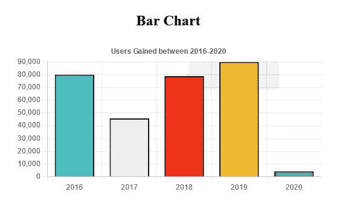
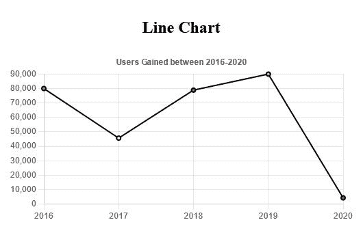

# 在 React - LogRocket 博客中使用 Chart.js

> 原文：<https://blog.logrocket.com/using-chart-js-react/>

***编者按**:本 React Chart.js 教程最后一次更新是在 2022 年 11 月 18 日，增加了 Chart.js.* 中`PieChart`和`LineChart`类型的信息

数据可视化一直是软件工程，尤其是前端开发的重要组成部分。我们的用户总是需要可视化数据，以帮助他们更好地理解我们的应用程序中正在发生的事情。

Chart.js 是一个流行的 JavaScript 库，用于在网站上创建灵活的图表，在本教程中，您将学习如何在 React 环境中使用 Chart.js。

我们将涵盖:

## 先决条件

要继续学习，您需要对 React 框架有一个基本的了解。React 的文档是一个很好的起点。

## 在 React 项目中安装 Chart.js

我将使用 CodeSandbox 来设置一个新的 React 应用程序，但是您可以选择使用您喜欢的任何工具来设置 React 应用程序。[项目的沙箱在这里](https://codesandbox.io/s/chartjs-wl7m1)可用。

要在 CodeSandbox 中创建一个新的 React 模板，请在浏览器中打开一个新标签，然后键入`react.new`。

接下来，在`dependencies`部分，添加这两个库:

如果您从终端工作，您可以使用以下命令安装这些库:

```
npm install chart.js react-chartjs-2

```

`React-chartjs-2`是 Chart.js 2.0 和 3.0 的 React 包装器，让我们可以使用 Chart.js 元素作为 React 组件。

在本帖中，我们将创建三个图表，用临时数据描绘一家公司获得的用户数量。

## 创建临时数据

从文件树中，创建一个`utils`文件夹并存储一个`Data.js`文件。在这里，我们将存储数据并将其导出到一个单独的组件来呈现图表。

用下面的代码输入`Data.js`的内容:

```
// utils/Data.js
export const Data = [
  {
    id: 1,
    year: 2016,
    userGain: 80000,
    userLost: 823
  },
  {
    id: 2,
    year: 2017,
    userGain: 45677,
    userLost: 345
  },
  {
    id: 3,
    year: 2018,
    userGain: 78888,
    userLost: 555
  },
  {
    id: 4,
    year: 2019,
    userGain: 90000,
    userLost: 4555
  },
  {
    id: 5,
    year: 2020,
    userGain: 4300,
    userLost: 234
  }
];

```

现在，您可以导入这些数据，并将其提供给 Chart.js 组件进行显示。但是在我们这样做之前，让我们了解一下`react-chartjs-2`包中组件的 API。

## Chart.js React 组件

`react-chartjs-2`提供多种图表类型供选择。这些包括条形、放射状、饼形等。这个包的 React 组件接受[许多道具](https://github.com/reactchartjs/react-chartjs-2#chart-props)，两个主要的是`data`和`options`。

`data`道具接收一个类似于下图的物体:

```
const data = {
        labels: ['Red', 'Orange', 'Blue'],
        // datasets is an array of objects where each object represents a set of data to display corresponding to the labels above. for brevity, we'll keep it at one object
        datasets: [
            {
              label: 'Popularity of colours'
              data: [55, 23, 96],
              // you can set indiviual colors for each bar
              backgroundColor: [
                'rgba(255, 255, 255, 0.6)'
                'rgba(255, 255, 255, 0.6)'
                'rgba(255, 255, 255, 0.6)'
              ],
              borderWidth: 1,
            }
        ]
}

```

`backgroundColor`和`borderWidth`只是可以添加到`datasets`数组中的一些属性。点击查看[可接受礼节的完整列表。](https://www.chartjs.org/docs/latest/charts/line.html#dataset-properties)

现在我们知道了如何设置`data`对象，您可以用来自`Data.js`文件的数据填充它。

## 创建 Chart.js 饼图

在`App.js`中，我们将在使用`useState`钩子创建的`chartData`变量中复制`data`道具的模式。

通过使用 JavaScript map 方法，可以用我们的临时数据填充`labels`和`dataset`数组。用以下代码编辑`App.js`:

```
// App.js
import Chart from "chart.js/auto";
import { CategoryScale } from "chart.js";
import { useState } from "react";
import { Data } from "./Data";
import "./styles.css";

Chart.register(CategoryScale);

export default function App() {
  const [chartData, setChartData] = useState({
    labels: Data.map((data) => data.year), 
    datasets: [
      {
        label: "Users Gained ",
        data: Data.map((data) => data.userGain),
        backgroundColor: [
          "rgba(75,192,192,1)",
          &quot;#ecf0f1",
          "#50AF95",
          "#f3ba2f",
          "#2a71d0"
        ],
        borderColor: "black",
        borderWidth: 2
      }
    ]
  });

  return (
    <div className="App">
      <p>Using Chart.js in React</p>
    </div>
  );
}

```

我们在上面所做的是在一个名为`chartData`的对象中准备我们想要在不同图表上表示的数据。然后这个状态可以被传递给一个`PieChart`组件，它将呈现一个饼图。

在`src`中创建一个`components`文件夹，并创建一个空的`PieChart.js`，您将这样导入:

```
// App.js
import Chart from "chart.js/auto";
import { CategoryScale } from "chart.js";
import { useState } from "react";
import { Data } from "./Data";
import PieChart from "../components/PieChart";
import "./styles.css";

Chart.register(CategoryScale);

export default function App() {
  const [chartData, setChartData] = useState({
    // ...chart data
  });

  return (
    <div className="App">
      <PieChart chartData={chartData} />
    </div>
  );

```

`PieChart.js`的内容将如下所示:

```
// src/components/PieChart.js
import React from "react";
import { Pie } from "react-chartjs-2";

function PieChart({ chartData }) {
  return (
    <div className="chart-container">
      <h2 style={{ textAlign: "center" }}>Pie Chart</h2>
      <Pie
        data={chartData}
        options={{
          plugins: {
            title: {
              display: true,
              text: "Users Gained between 2016-2020"
            }
          }
        }}
      />
    </div>
  );
}
export default PieChart;

```

这里，我们从`react-chartjs-2`导入了`Pie` React 组件。`chartData`被破坏，通过了`Pie`的`data`道具。我还使用了`options`对象来调整图表的某些方面，比如图表标题和图例。检查所有的[可配置选项](https://www.chartjs.org/docs/latest/general/options.html)。

这将呈现下图:


## 创建 Chart.js 条形图

创建一个`BarChat`组件并输入以下代码:

```
// components/BarChart.js
import { Bar } from "react-chartjs-2";
export const BarChart = ({ chartData }) => {
  return (
    <div className="chart-container">
      <h2 style={{ textAlign: "center" }}>Bar Chart</h2>
      <Bar
        data={chartData}
        options={{
          plugins: {
            title: {
              display: true,
              text: "Users Gained between 2016-2020"
            },
            legend: {
              display: false
            }
          }
        }}
      />
    </div>
  );
};

```

现在将这个组件导入到`App.js`:

```
// App.js
import Chart from "chart.js/auto";
import { CategoryScale } from "chart.js";
import { useState } from "react";
import { Data } from "./Data";
import PieChart from "../components/PieChart";
import BarChart from "../components/BarChart";
import "./styles.css";

Chart.register(CategoryScale);

export default function App() {
  const [chartData, setChartData] = useState({
    // ...chart data
  });

  return (
    <div className="App">
      <PieChart chartData={chartData} />
      <BarChart chartData={chartData} />
    </div>
  );

```

这将呈现下面的条形图:



## 创建 Chart.js 折线图

对于折线图，创建一个`LineChart`组件，就像我们对前两种情况所做的那样，并用以下内容编辑它:

```
// components/LineChart.js
import React from "react";
import { Line } from "react-chartjs-2";
function LineChart({ chartData }) {
  return (
    <div className="chart-container">
      <h2 style={{ textAlign: "center" }}>Line Chart</h2>
      <Line
        data={chartData}
        options={{
          plugins: {
            title: {
              display: true,
              text: "Users Gained between 2016-2020"
            },
            legend: {
              display: false
            }
          }
        }}
      />
    </div>
  );
}
export default LineChart;

```

接下来，将这个组件导入到`App.js`:

```
// App.js
import Chart from "chart.js/auto";
import { CategoryScale } from "chart.js";
import { useState } from "react";
import { Data } from "./Data";
import PieChart from "../components/PieChart";
import BarChart from "../components/BarChart";
import LineChart from "../components/LineChart";
import "./styles.css";

Chart.register(CategoryScale);

export default function App() {
  const [chartData, setChartData] = useState({
    // ...chart data
  });

  return (
    <div className="App">
      <PieChart chartData={chartData} />
      <BarChart chartData={chartData} />
      <LineChart chartData={chartData} />
    </div>
  );

```

这就结束了我们的项目！上述配置将呈现以下折线图:



## 结论

Chart.js 是在 web 应用程序中创建不同类型图表的强大工具。您还看到了`react-chartjs-2`包对于在 React 中呈现这些图表是多么有帮助。我鼓励你访问 [Chart.js 文档](https://www.chartjs.org/docs/latest/)以了解更多关于这个库的信息，并深入研究`options`对象以查看更多配置图表的方法。

## [LogRocket](https://lp.logrocket.com/blg/react-signup-general) :全面了解您的生产 React 应用

调试 React 应用程序可能很困难，尤其是当用户遇到难以重现的问题时。如果您对监视和跟踪 Redux 状态、自动显示 JavaScript 错误以及跟踪缓慢的网络请求和组件加载时间感兴趣，

[try LogRocket](https://lp.logrocket.com/blg/react-signup-general)

.

[ ](https://lp.logrocket.com/blg/react-signup-general) [](https://lp.logrocket.com/blg/react-signup-general) 

LogRocket 结合了会话回放、产品分析和错误跟踪，使软件团队能够创建理想的 web 和移动产品体验。这对你来说意味着什么？

LogRocket 不是猜测错误发生的原因，也不是要求用户提供截图和日志转储，而是让您回放问题，就像它们发生在您自己的浏览器中一样，以快速了解哪里出错了。

不再有嘈杂的警报。智能错误跟踪允许您对问题进行分类，然后从中学习。获得有影响的用户问题的通知，而不是误报。警报越少，有用的信号越多。

LogRocket Redux 中间件包为您的用户会话增加了一层额外的可见性。LogRocket 记录 Redux 存储中的所有操作和状态。

让你调试 React 应用的方式现代化— [开始免费监控](https://lp.logrocket.com/blg/react-signup-general)。