# 用 Chrome DevTools 调试 CSS 网格

> 原文：<https://blog.logrocket.com/using-chrome-devtools-to-debug-css-grid/>

CSS Grid 是一种功能强大的布局规范，正逐年流行起来。今年的[CSS 调查状态](https://2020.stateofcss.com/en-US/features/layout/)显示，73.3%的受访者使用过网格，比 2019 年增加了 18.6%。


There’s been a sharp increase in CSS grid usage.

网格成功故事的一个重要部分是，现在大多数主流浏览器都在它们的 [DevTools](https://developers.google.com/web/tools/chrome-devtools) 中加入了网格支持。当你构建一个界面时，视觉检查给你一个更有效的反馈回路。

它可以消除调试布局问题的一些痛苦:当您构建布局时，不再需要添加红色边框(或一些类似的技巧)来查看发生了什么。

在本文中，我将重点介绍 Chrome。我将向您展示如何发现页面中的网格，并给出如何检查页面布局和调试布局问题的提示。

## 使用 Chrome DevTools 发现页面中的网格

重要的事情，首先。是什么让一个 HTML 元素成为一个网格？

如果页面上的 HTML 元素应用了`display: grid`或`display: inline-grid`，那么它就是一个网格。

您可能需要在 [DevTools](https://developers.google.com/web/tools/chrome-devtools#open) 设置中启用网格调试，因为它仍被视为实验性设置:

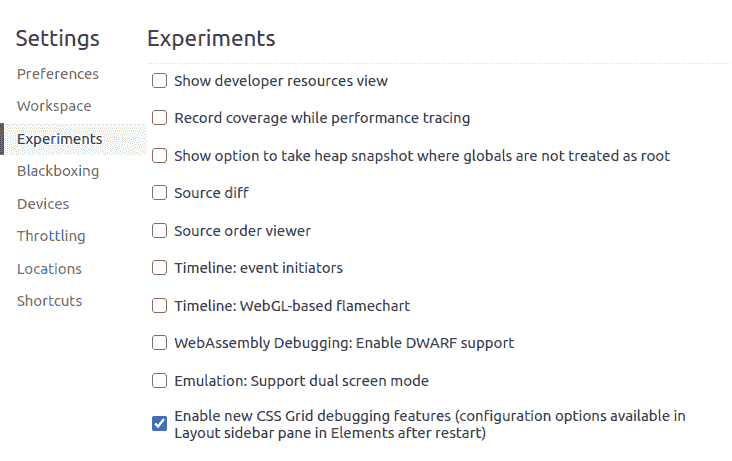

您可以通过以下方式快速发现页面是否有网格元素。

### 1.通过检查发现

在**元素**窗格中，您会看到一个网格元素旁边的灰色`grid`标记:

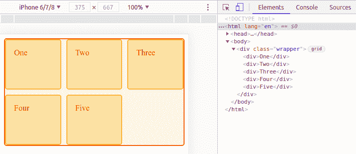

在[这个简单的例子](https://developer.mozilla.org/en-US/docs/Web/CSS/CSS_Grid_Layout/Auto-placement_in_CSS_Grid_Layout)中，带有“包装器”类的`div`是一个网格。

单击此标记将切换元素的覆盖显示，如下所示:

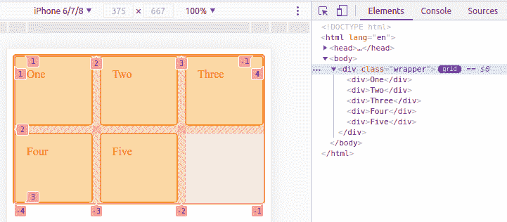

您会看到徽章改变了颜色，表示现在处于活动状态。

覆盖图显示:

*   编号网格线
*   网格项目之间的间隙显示为带有虚线图案的檐槽。差距在我们这里是 10px，很容易挑出来。当然，你可能没有缝隙，也不会有阴沟。相反，您将看到网格项目彼此齐平(如下所示)

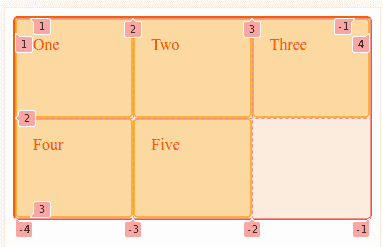

### 2.概览式发现

在一个更复杂的网页中，可能会有许多网格，它们可能不像我们前面的例子那样是`body`的子元素。如果你想理解一个页面的布局，通过检查来找到它们需要更多的工作。

**布局**面板有一个**网格**部分，为我们列出了所有的网格。

再举一个例子，[用 Grid](https://codepen.io/robjoeol/pen/wvKaGjz) 重新创建 Instagram 的个人资料页面。注意它有八个网格。你可以在副标题“网格覆盖”下看到它们(见下面的红框)。

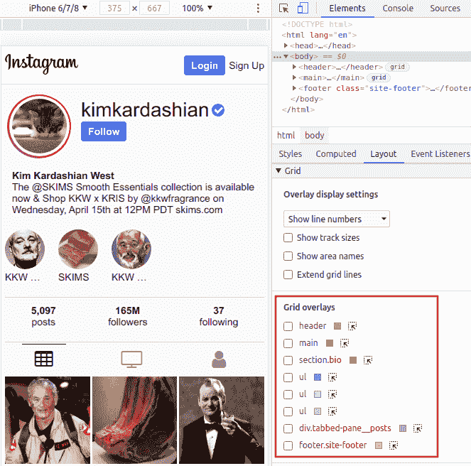

网格按出现的顺序列出。标签包括元素名称、ID 选择器(如果有)和类选择器(如果有)。

您可以通过选中相邻的复选框来显示覆盖:


正如你所看到的，在**布局**窗格中有一些其他的设置，我们将在下面介绍。

## 在 Chrome 中自定义覆盖图

在**布局**窗格中有一些自定义覆盖的选项。让我们先覆盖**网格覆盖**部分。

### 网格覆盖部分

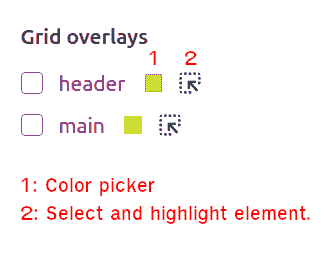

默认情况下，Chrome 为覆盖层选择不同的颜色，以便于区分它们。如果你想选择你自己的颜色，有一个相邻的颜色选择器。如果网格覆盖颜色和背景之间有冲突，这尤其有用。

本部分的第二个选项将突出显示网页中元素的覆盖图，并在**元素**窗格中选择该元素(如下)。这不会自定义覆盖图；相反，它帮助你定位并探索相关的风格。


### 覆盖显示设置

这些显示设置是什么应该相当清楚了，但是让我们逐一讨论细节。


#### 1.显示轨道大小设置

**s****how track size**设置有助于理解为什么一个网格项目以特定的大小结束。

为了弄清楚术语，让我们定义一个轨道。

根据 W3C 的 [CSS 网格布局模块 Level 1](https://www.w3.org/TR/css-grid-1/#grid-track-concept)) ，网格轨迹是网格列或网格行的通称——换句话说，就是两条相邻网格线之间的空间。每个网格轨迹都被分配了一个大小调整函数，该函数控制列或行的宽度或高度，从而控制其边界网格线的间距。

在这个上下文中，它只是告诉您一个网格项的宽度和高度，它可能跨越多行或多列。

轨道大小标签具有以下格式:`[authored size] - [computed size]`。`authored size`是样式表中声明的大小(如果没有定义，则省略它)。`computed size`是屏幕上的实际尺寸。

让我们回到 Instagram 的例子来说明这一点。

你可以看到故事部分的宽度固定为 115px。


```
.story {
    display: grid;
    grid-template-columns: repeat(auto-fill, 115px);
}

```

因为大小是固定的，所以列的创建大小和实际大小是相同的。

行标签只显示实际大小，因为我们没有为该轨道声明任何内容。

对于文章部分，列宽是一个范围。


```
.tabbed-pane__posts {
   display: grid;
   grid-template-columns: repeat(3, minmax(50px, 1fr));
   grid-gap: 25px;
}

```

对于该视口大小，创作大小为`minmax(50px, 1fr)`，实际大小为 236 像素。*的实际尺寸*会因视窗宽度而异。

同样，行标签只显示实际大小，因为没有为它定义任何内容。

#### 2.显示区域名称设置

如果您的网格上有已命名的区域，此设置会将它们显示为每个项目左上角的嵌入标签。

在这个例子中，我们命名了三个区域:标题、侧边栏和内容。我们使用`grid-template-areas`给音轨分配区域。

我们将第一个网格项留空，因此它没有标签。

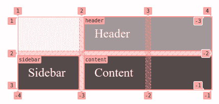

```
<div class="wrapper">
  <div class="box header">Header</div>
  <div class="box sidebar">Sidebar</div>
  <div class="box content">Content</div>
</div>

```

```
.sidebar {
 grid-area: sidebar;
}

.content {
 grid-area: content;
}

.header {
 grid-area: header;
}

.wrapper {
 display: grid;
 grid-gap: 10px;
 grid-template-columns: 120px  120px  120px;
 grid-template-areas:
   "....... header  header"
   "sidebar content content";
}

```

#### 3.延伸网格线设置

如果您想要对齐独立元素，则**延伸网格线**设置非常有用。它会创建延伸到网格边界之外的虚线。

在我们的 Instagram 示例中，如果我们想以某种方式对齐标题和故事部分，扩展的网格线可以作为指南。

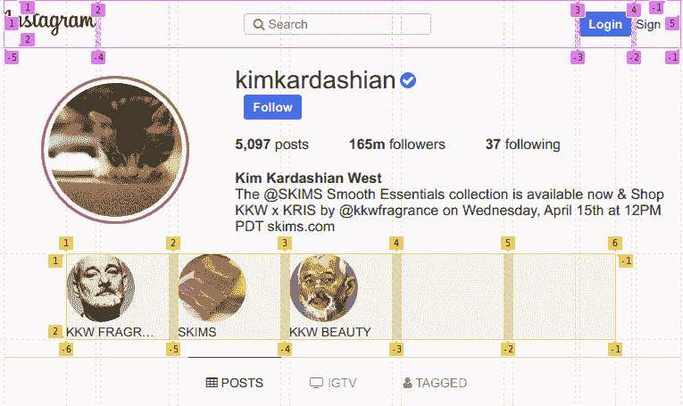

## 使用 Chrome DevTools 的调试技巧

通过向元素添加 ID 或类，或者使用区域名称，可以使网格更容易识别。

在我们的 Instagram 示例中，最初我们有三个`ul`元素，它们是网格，但没有 id 或类(见红框)。所以，我们无法区分它们。

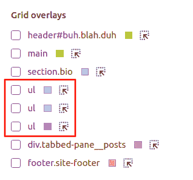

将类添加到`ul`中使它们更容易识别！

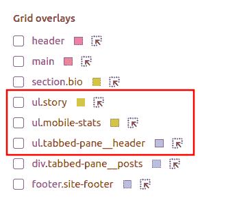

这听起来很老套，但是预防胜于治疗。有些问题可以通过先规划布局来避免。网格的力量在于它更容易强加秩序，所以为什么不在做之前决定好你在做什么呢？

您的设计不必非常详细，类似于下面的设计通常就足够了:

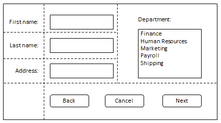

布局示例。来源:CSS 网格布局模块 1 级规范。

重要的是你要提前考虑布局中的元素大小、对齐方式和间距。您需要针对不同的设备尺寸进行设计，并决定如何在可用空间内呈现内容。您可能需要为不同的设备大小包装项目或更改网格布局。

我不想规定性地列举如何调试布局——有太多的排列。相反，我将讨论 Instagram 示例中的几个设计决策。这会给你一些如何检查和解决问题的想法。

## 错误的最常见原因

曲目和内容的大小可能是问题的最常见原因。

如果您为轨道设置了固定的大小，您应该确保内容不会溢出(当然，除非您决定让它溢出)。要处理溢出，可以:为内容设置固定的大小；使用`overflow`属性；或用于图像和视频的`object-fit`属性。

例如，在我们的 Instagram 示例中，story 部分在移动设备上的列大小固定为 115px。


我们将图像的尺寸固定为 56px。对于图片下面的标题(`h2`)，我们隐藏溢出的内容，禁止文本换行(所以总是单行文本)。添加`text-overflow:ellipsis;`会在文本末尾添加省略号，表示文本被截断。

现在，我们可以保证每个“故事”的大小都是一致的。当您处理动态内容时，您需要预测这种情况的发生:

```
.story img {
    border-radius: 50%;
    width: 56px;
    height: 56px;
}

.story h2 {
    overflow: hidden;
    text-overflow: ellipsis;
    white-space: nowrap;
}

```

如果我们没有管理标题的溢出，它看起来会像这样:


调整的另一部分是您使用的单位。当你希望一个项目的大小是动态的时，你应该只选择`fr`或`minmax()`。如果要冻结它们的大小，请使用其他值。


以标题部分为例。第一列(轨道)具有一个分数单位的宽度(`1fr`)。当有更多的可用空间时，这个数字将会增长。它不会导致徽标图像(`.header__logo`)的任何移动或大小调整，因为它的大小是绝对的，并且它位于项目的开头。

请记住，如果您对声明的`min-width`或`min-height`感到满意，那么您可能会对小数单元产生意想不到的结果。

`fr`单位填满了可用空间，但它绝不会小于网格容器的最小尺寸或行或列的内容:

```
header {
    display: grid;
    grid-template-columns: 1fr auto auto;
    align-items: center;
    width: 100%;
}

.header__logo {
    justify-self: start;
}

```

其他两个网格项目(登录和注册按钮)将始终保持相同的大小。

进行故障排除时，调整视口的大小以查看网格项目的大小如何变化会很有用。在我们的示例中，您可以清楚地看到，只有第一个项目改变了大小。


## 结论

Chrome DevTools 增加了网格支持，现在你可以很容易地可视化和调试你的布局。在你构建布局的时候获得更好的反馈对生产力是一个很大的提升。我希望这篇文章能够向您展示在使用 CSS Grid 时如何从 Chrome DevTools 中获益。

## 你的前端是否占用了用户的 CPU？

随着 web 前端变得越来越复杂，资源贪婪的特性对浏览器的要求越来越高。如果您对监控和跟踪生产环境中所有用户的客户端 CPU 使用、内存使用等感兴趣，

[try LogRocket](https://lp.logrocket.com/blg/css-signup)

.

[](https://lp.logrocket.com/blg/css-signup)[https://logrocket.com/signup/](https://lp.logrocket.com/blg/css-signup)

LogRocket 就像是网络和移动应用的 DVR，记录你的网络应用或网站上发生的一切。您可以汇总和报告关键的前端性能指标，重放用户会话和应用程序状态，记录网络请求，并自动显示所有错误，而不是猜测问题发生的原因。

现代化您调试 web 和移动应用的方式— [开始免费监控](https://lp.logrocket.com/blg/css-signup)。