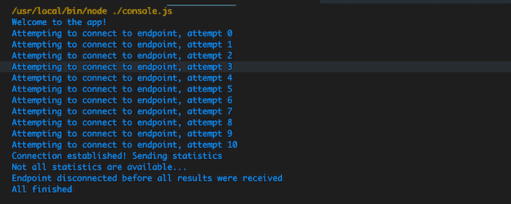
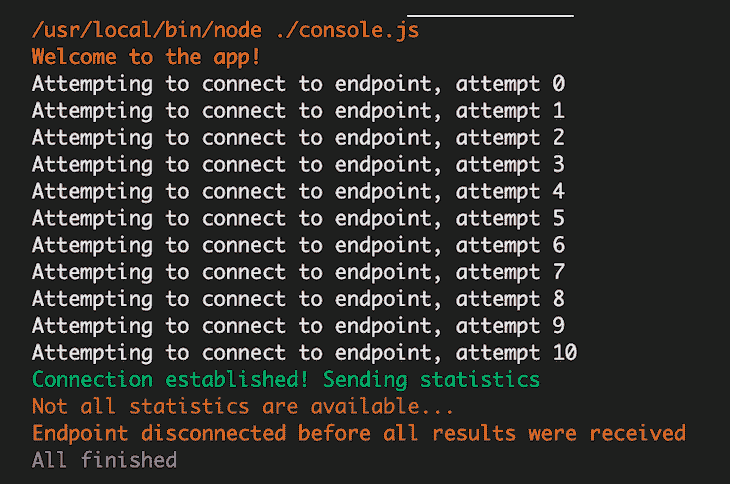
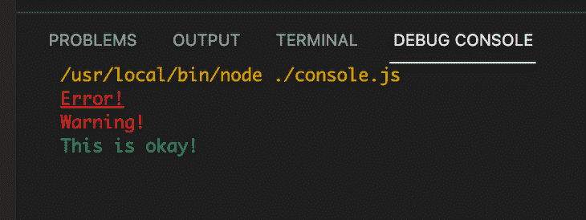

# 在 Node.js 中使用控制台颜色

> 原文：<https://blog.logrocket.com/using-console-colors-node-js/>

***编者按:**自这篇博文发布后， [Color.js 被破坏，恢复到之前的 1.4.0 版本](https://www.theverge.com/2022/1/9/22874949/developer-corrupts-open-source-libraries-projects-affected)。虽然您仍然可以使用 Color.js 的旧版本，但是要谨慎使用它，或者使用本文中提到的其他替代方法。*

自从 Node.js 兴起以来，我们看到越来越多的控制台应用程序发布，比以往任何时候都多。有时候如果不需要写 UI 那么复杂，控制台输出就够了。但是，默认情况下，Node.js 应用程序的输出呈现为黑色背景上的简单白色文本。

这意味着你很容易弄乱应用程序的视图，或者错过重要的信息。在本文中，我们将学习如何实现控制台颜色，以及如何使用 Chalk、Colors.js 和 Color-CLI 来帮助我们。

## Node.js 应用程序中缺少控制台颜色的问题

让我们想象下面的示例应用程序使用 Node.js 连接到一个端点并检索一些数据。

当连接到这些端点时，我们实际上并没有做任何繁重的工作，相反，我们只是简单地产生一个我们通常可以从这样的应用程序中看到的输出。

然而，在这样的应用程序中，我们很容易将文本作为输出写入控制台。也许我们忙得不可开交，没有时间给我们的应用程序添加颜色，或者它根本就没有出现在我们的脑海中。

无论原因是什么，我们简单的控制台 Node.js 应用程序的输出如下所示:



如果你作为程序的创建者阅读输出，你知道要寻找什么，看到在连接成功之前有相当多的连接尝试，只收到部分结果集，你知道如何修复它。

但是，如果你在一个团队中工作，其他人使用这个脚本，不同的人会对结果有不同的解释。

如果这个脚本作为一个预定操作的一部分运行，或者作为一个更大的脚本系列的一部分运行，那么人们很可能会跳到最后一行，并且理解`All finished`为一切按预期运行。

为了给我们的用户留下正确的印象，我们可以使用视觉方面来清楚地表明是否一切都如预期的那样工作，或者是否有些事情失败了。这就是我们控制台颜色的由来。

## 在 Node.js 应用程序中实现控制台颜色

要在我们的 Node.js 应用程序中使用控制台颜色，我们必须首先了解幕后发生了什么。

产生文本输出的程序已经存在了几十年，所以让我们做出这些颜色变化的相关标准可能有点原始。我们必须了解如何使用转义码向控制台发出信号，告知我们想要更改输出的颜色。

通常，我们的控制台打印我们通过 `[console.log](https://blog.logrocket.com/comparing-node-js-logging-tools/)`提供给它的[文本。但是，如果我们向控制台发送一个转义字符(`\x1b`)和一个特定的序列(`[33m`)，控制台实际上会在打印之前捕获该序列，从而允许基本的终端配置。](https://blog.logrocket.com/comparing-node-js-logging-tools/)

在这种情况下，我们用它来告诉控制台我们想改变颜色。

然后，我们需要完成两件事:首先，我们必须将文本的颜色更改为我们想要的颜色，其次，我们必须将控制台的颜色重置为更改前的颜色。否则，该时间之后的所有输出都将是我们选择的颜色。

所以，如果我们想打印，“欢迎使用这个应用程序！”黄色部分是我们的`console.log`陈述:

```
console.log('\x1b[33m Welcome to the app! \x1b[0m');

```

结果是这样的:


即使我们有黄色的字符串，方括号和反斜杠到底是怎么回事？我们来分解一下。

### 使用控制字符来着色我们的输出

`\x1b`是一个[控制字符](https://en.wikipedia.org/wiki/ANSI_escape_code#Description)，它向控制台表明我们想要做一些与实际打印文本到控制台无关的事情。在同一行中，写在这个控制字符之后的所有内容都以某种方式配置终端。

在我们的控制字符之后，我们指定我们想要做什么。在这种情况下，我们希望将前景改为黄色字符，它在 ANSI 颜色表中的 ID 为 33。通过将`[33m`放在我们的初始控制字符之后，我们将控制台输出颜色切换为黄色。

我们有相当多的颜色可供选择，但这种方法也有利弊。

好消息是，我们没有在 Node.js 项目中引入新的依赖项，我们的应用程序将在全球数百万台计算机上产生正确的颜色。

坏消息是我们的代码变得有点神秘。人们不会直观地知道我们通过这个字符串设置我们的控制台字符，将来维护这个代码会成为一个问题。

当我们只想给控制台输出着色时，引用一个表也很烦人。我们还必须记住在使用颜色后总是要加上`\x1b[0m`,这样控制台就会重置回默认的配色方案。

幸运的是，正如 Node.js 世界中通常的情况一样，不只是一个包可以帮助我们。我们将看看 CLI 颜色的三个流行选项。

## 白垩

粉笔是将控制台颜色引入 Node.js 项目的简单方法。最后一次提交[发生在 11 月 26 日](https://github.com/chalk/chalk/commit/4d5c4795ad24c326ae16bfe0c39c826c732716a9)，一个主要版本刚刚发布(v5.0.0)。

粉笔的另一个好特性是它不会延伸`String.prototype`。在 JavaScript 中扩展本地对象实质上改变了内置函数的实现，通常被认为是一个糟糕的想法。

这是因为如果`library 1`像`.colorify`一样在`String`上设置一个函数，然后`library 2`在`String`实现上设置自己的函数`.colorify`，第二个库将覆盖第一个库。这显然是[调试](https://blog.logrocket.com/how-to-debug-node-js-apps-in-visual-studio-code/)的一个大问题。

语法也很容易理解和使用。

对于我们的代码示例，让我们将`[console.log](https://blog.logrocket.com/node-js-logging-best-practices/)` [赋给常量值](https://blog.logrocket.com/node-js-logging-best-practices/) `[log](https://blog.logrocket.com/node-js-logging-best-practices/)`，这样我们可以更容易地访问它。然后，我们可以通过适当的函数调用使用`chalk`函数来获得我们想要的颜色。

为了演示这一点，通过创建一个项目目录来快速引导 Nodejs 应用程序，并从该目录运行:

```
npm init -y

```

并通过运行安装`chalk`:

```
npm install chalk

```

接下来，创建一个名为`console.js`的文件。您可以使用 CLI 通过运行以下命令来实现这一点:

```
touch console.js

```

将以下代码添加到`console.js`文件中:

```
import chalk from 'chalk';

const log = console.log;
chalk.level = 1; // Use colours in the VS Code Debug Window
log(chalk.yellow('Welcome to the app!'));
for (var i = 0; i <= 10; i++){
    log(chalk.white('Attempting to connect to endpoint, attempt ' + i));
}

log(chalk.green('Connection established! Sending statistics'));
log(chalk.red('Not all statistics are available...'));
log(chalk.redBright('Endpoint disconnected before all results were received'));
log(chalk.magenta('All finished'));

```

通过将`"type":` `"module"`添加到`package.json`文件的属性列表中，更新我们的`package.json`文件以使用`ES6 modules`。您可以将其添加到`"name": "chalk",`属性下。

最后，更新`scripts`部分，将代码替换为:

```
 "scripts": {
    "start": "node console.js"
  },

```

现在，我们可以通过运行以下命令来测试我们的应用程序并查看 chalk 的运行情况:

输出如下所示:



显然，你的口味可能会有所不同，你可能不想在你的控制台应用程序中使用这么多颜色。但是，如果你想用它们，它们就在那里。

### 用粉笔指定基本主题

我们也可以选择给我们的颜色分配一些基本的主题。例如，要为我们的错误或警告设置一种通用的颜色，就像给名称分配适当的功能一样简单，就像这样:

```
import chalk from 'chalk';

const error = chalk.red;
const warning = chalk.bgRed; // Orange color

console.log(error('Error!'));
console.log(warning('Warning!'));

```

您可以用上面的代码替换`console.js`中的代码，然后运行:

```
npm start
```

这段代码的输出与预期的一样:


你可以任意混合搭配这些风格，也可以根据你的应用需求任意搭配。

## Colors.js

[Colors.js 是在 Node.js 应用](https://github.com/Marak/colors.js)中改变颜色的另一种方式。但是，它确实扩展了`String.prototype`。我们已经讨论了为什么这通常是一个坏主意，但是它确实使得在你的应用程序中调用颜色稍微容易一些。

上一次提交 Colors.js 是在 2020 年 1 月的[。可能只有这么多种方法可以给控制台上色，但是在撰写本文时，过去两年没有任何变化，可以安全地假设它已经被放弃了。](https://github.com/Marak/colors.js/commit/7ddd6a3d657efb081abb9beddfec26a01a8790a8)

但是，这并不意味着它不起作用，但是您应该意识到，如果您使用它，可能很难获得支持。

要使用 Colors.js，请创建一个项目目录。在项目目录中，通过运行以下命令初始化 Node.js 项目:

```
npm init -y

```

并通过运行安装`color.js`:

```
npm install colors

```

现在用下面的代码在项目目录中创建一个`console.js`文件:

```
var colors = require('colors');

colors.enable()

console.log('Error!'.underline.red);
console.log('Warning!'.red);
console.log('This is okay!'.green);

```

现在更新`package.json`文件中的`scripts`部分，将代码替换为:

```
 "scripts": {
    "start": "node console.js"
  },

```

我们可以测试我们的应用程序，看看粉笔是如何工作的:

```
npm start

```

它的输出是:



能够在一个字符串上直接调用这些函数是很棒的，但事实是这个包污染了 JavaScript 中的`String`实现。

毕竟，让`.red`紧挨着`.indexOf`感觉是错误的，而且使用一个软件包来修改像`String`这样基本的东西的功能似乎是一个可怕的提议。[它也被证明会引起问题](https://github.com/yeoman/yo/issues/68)，所以要谨慎使用(或者干脆不要使用)。

然而，`color.js`包提供了一个替代模块和 API，它没有扩展`String.prototype`。

您可以通过从 safe 模块导入`colorjs`包来使用这个 API，如下所示:

```
var colors = require('colors/safe');

console.log(colors.green('hello')); // outputs green text
console.log(colors.red.underline('i like cake and pies')); // outputs red underlined text
console.log(colors.inverse('inverse the color')); // inverses the color
console.log(colors.rainbow('OMG Rainbows!')); // rainbow
console.log(colors.trap('Run the trap')); // Drops the bass

```

你可以用上面的代码替换`console.js`文件中的代码。
现在来看看它的工作运行情况:

```
npm start

```

我们得到了:


最后，需要注意的是最近版本的 [Color.js 被破坏了，库被恢复到了之前的版本 1.4.0](https://www.theverge.com/2022/1/9/22874949/developer-corrupts-open-source-libraries-projects-affected) 。所以要谨慎使用这个库(也可能根本不用)。

## CLI-颜色

[我们给控制台上色的第三个选择是 CLI-Color](https://github.com/medikoo/cli-color) 的形式。它与 Chalk 有很多共同之处，因为它没有修改`String.prototype`的实现。

[最后一次更新是在 10 月 16 日](https://github.com/medikoo/cli-color/commit/875fccfc08fb5879e14ccb13d7ca4513fc0e2e19)，所以还在积极维护中。

要使用 Colors.js，请创建一个项目目录，并通过运行以下命令从项目目录初始化 Nodejs 项目:

```
npm init -y

```

并通过运行安装`color-cli`:

```
npm install cli-color

```

现在用下面的代码在项目目录中创建一个`console.js`文件:

```
var clc = require("cli-color");

console.log(clc.red.underline("Error!"));
console.log(clc.red("Warning!"));
console.log(clc.green('This is okay!'));

```

通过将代码替换为以下内容来更新`package.json`文件中的`scripts`部分:

```
 "scripts": {
    "start": "node console.js"
  },

```

我们可以通过运行以下命令来测试我们的应用:

```
npm start

```

我们的输出看起来像这样:


## 结论

在 Node.js 中给你的控制台着色是一种简单的方法，可以让你的应用程序的输出更具可读性。当谈到实现这一点时，您并不缺少选择，但是如果您想用一个包来实现这一点，似乎 Chalk 是最先进、最全面的选择。

快乐涂色！🎨

## 200 只显示器出现故障，生产中网络请求缓慢

部署基于节点的 web 应用程序或网站是容易的部分。确保您的节点实例继续为您的应用程序提供资源是事情变得更加困难的地方。如果您对确保对后端或第三方服务的请求成功感兴趣，

[try LogRocket](https://lp.logrocket.com/blg/node-signup)

.

[](https://lp.logrocket.com/blg/node-signup)[https://logrocket.com/signup/](https://lp.logrocket.com/blg/node-signup)

LogRocket 就像是网络和移动应用程序的 DVR，记录下用户与你的应用程序交互时发生的一切。您可以汇总并报告有问题的网络请求，以快速了解根本原因，而不是猜测问题发生的原因。

LogRocket 检测您的应用程序以记录基线性能计时，如页面加载时间、到达第一个字节的时间、慢速网络请求，还记录 Redux、NgRx 和 Vuex 操作/状态。

[Start monitoring for free](https://lp.logrocket.com/blg/node-signup)

.