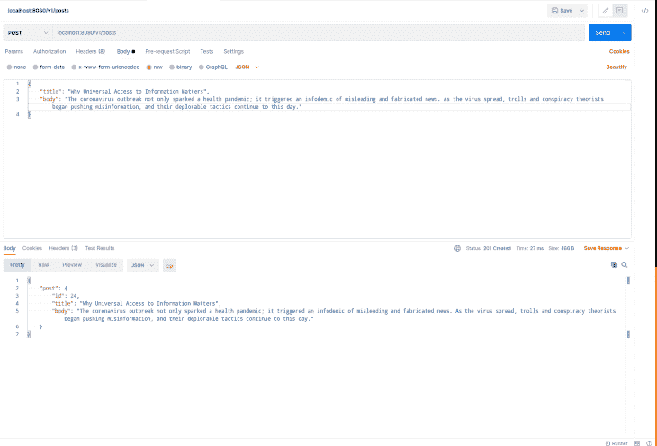
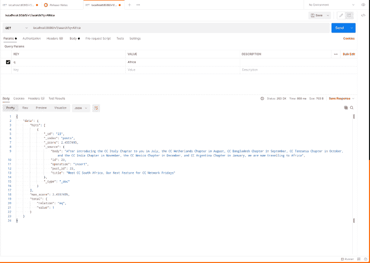
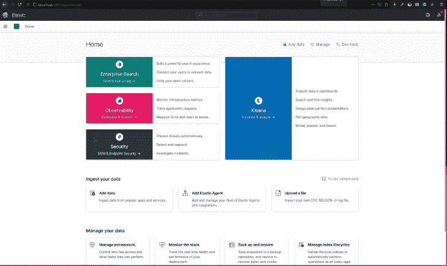
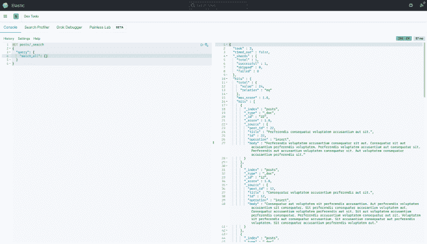

# 在 Go 应用程序中使用 Elasticsearch、Logstash 和 Kibana

> 原文：<https://blog.logrocket.com/using-elasticsearch-logstash-and-kibana-with-go-applications/>

Elasticsearch 是一个开源的分布式搜索和分析引擎，基于 T2 的 Apache Lucene。与主要目的是存储数据的典型 SQL 和 NoSQL 数据库不同，Elasticsearch 存储并索引数据，以便可以快速搜索和分析。它还集成了 [Logstash](https://www.elastic.co/logstash) (一种可以从多个来源(如日志和数据库)获取数据的数据处理管道)和 [Kibana](https://www.elastic.co/kibana) (用于数据可视化)，它们一起组成了 ELK 堆栈。

在本教程中，我们将探讨如何结合 Elasticsearch 和 Golang 的力量。我们将建立一个基本的内容管理系统，能够创建，阅读，更新和删除帖子，以及通过 Elasticsearch 搜索帖子的能力。

## 要求

要了解本教程中的示例项目，您需要:

*   安装在您机器上的 [Go](https://golang.org/dl/) (版本> = 1.14)
*   [对接器](https://www.docker.com/)和[对接器组合](https://docs.docker.com/compose/)安装完毕
*   熟悉 Docker 和 Go 编程语言

## 入门指南

在您的首选位置创建一个新目录来存放项目(我将我的命名为`letterpress`)，并使用下面的命令初始化一个新的 Go 模块:

```
$ mkdir letterpress && cd letterpress
$ go mod init gitlab.com/idoko/letterpress

```

应用程序依赖关系包括:

*   [lib/pq](https://github.com/lib/pq)%5Bib/pq%5D(https://github.com/lib/pq) —与 Go 标准库中的数据库/sql 包兼容的用于 Go 的 PostgreSQL 驱动程序
*   [elastic/go-elasticsearch](https://pkg.go.dev/github.com/elastic/go-elasticsearch/)—Golang 官方 elastic search 客户端
*   gin-gonic/gin —我们将为应用程序的 REST API 使用的 HTTP 框架
*   rs/zerolog —一个轻量级的日志记录器

通过在您的终端中运行以下命令来安装依赖项:
`$ go get github.com/lib/pq github.com/elastic/go-elasticsearch github.com/gin-gonic/gin github.com/rs/zerolog`

接下来，在项目目录中创建所需的文件夹和文件，以匹配下面的结构:

```
├── cmd
│   ├── api
│   │   └── main.go
├── db
│   ├── database.go
│   └── posts.go
├── .env
├── handler
├── logstash
│   ├── config
│   ├── pipelines
│   └── queries
└── models
    └── post.go

```

*   `cmd` —这是应用程序二进制文件(即`main.go`文件)所在的位置。我们还添加了一个内部的`api`子文件夹，允许多个二进制文件，否则这是不可能的
*   `db`—`db`包充当我们的应用程序和数据库之间的桥梁。我们稍后还将使用它来存储数据库迁移文件
*   `.env` —包含环境变量的“键值”映射(例如，数据库凭证)
*   `handler`—`handler`包包括由 gin 框架支持的 API 路由处理器
*   `logstash` —这是我们保存与 logstash 相关的代码的地方，比如管道配置和附带的`Dockerfile`
*   `models` —模型是 Golang 结构，可以被编组到适当的 JSON 对象中

打开项目根目录下的`.env`文件，设置如下环境变量:

```
POSTGRES_USER=letterpress
POSTGRES_PASSWORD=letterpress_secrets
POSTGRES_HOST=postgres
POSTGRES_PORT=5432
POSTGRES_DB=letterpress_db

ELASTICSEARCH_URL="http://elasticsearch:9200"

```

打开`post.go`文件(在`models`文件夹中)并设置`Post`结构:

```
package models

type Post struct {
   ID    int    `json:"id,omitempty"`
   Title string `json:"title"`
   Body  string `json:"body"`
}

```

接下来，将下面的代码添加到`db/database.go`中，以管理数据库连接:

```
package db

import (
   "database/sql"
   "fmt"
   _ "github.com/lib/pq"
   "github.com/rs/zerolog"
)

type Database struct {
   Conn *sql.DB
   Logger zerolog.Logger
}

type Config struct {
   Host     string
   Port     int
   Username string
   Password string
   DbName   string
   Logger zerolog.Logger
}

func Init(cfg Config) (Database, error) {
   db := Database{}
   dsn := fmt.Sprintf("host=%s port=%d user=%s password=%s dbname=%s sslmode=disable",
      cfg.Host, cfg.Port, cfg.Username, cfg.Password, cfg.DbName)
   conn, err := sql.Open("postgres", dsn)
   if err != nil {
      return db, err
   }

   db.Conn = conn
   db.Logger = cfg.Logger
   err = db.Conn.Ping()
   if err != nil {
      return db, err
   }
   return db, nil
}

```

在上面的代码中，我们设置了数据库配置并添加了一个`Logger`字段，该字段可用于记录数据库错误和事件。

此外，打开`db/posts.go`并为我们即将创建的*帖子*和*帖子日志*表执行数据库操作:

```
package db

import (
   "database/sql"
   "fmt"
   "gitlab.com/idoko/letterpress/models"
)

var (
   ErrNoRecord = fmt.Errorf("no matching record found")
   insertOp = "insert"
   deleteOp = "delete"
   updateOp = "update"
)

func (db Database) SavePost(post *models.Post) error {
   var id int
   query := `INSERT INTO posts(title, body) VALUES ($1, $2) RETURNING id`
   err := db.Conn.QueryRow(query, post.Title, post.Body).Scan(&id)
   if err != nil {
      return err
   }
   logQuery := `INSERT INTO post_logs(post_id, operation) VALUES ($1, $2)`
   post.ID = id
   _, err = db.Conn.Exec(logQuery, post.ID, insertOp)
   if err != nil {
      db.Logger.Err(err).Msg("could not log operation for logstash")
   }
   return nil
}

```

上面，我们实现了一个`SavePost`函数，它在数据库中插入了`Post`参数。如果插入成功，它会将操作和为新帖子生成的 ID 记录到一个`post_logs`表中。这些日志发生在应用程序级别，但是如果您觉得您的数据库操作不会总是通过应用程序，您可以尝试使用触发器在数据库级别完成。Logstash 稍后将使用这些日志来同步我们的 Elasticsearch 索引和我们的应用程序数据库。

仍然在`posts.go`文件中，添加下面的代码来更新和删除数据库中的帖子:

```
func (db Database) UpdatePost(postId int, post models.Post) error {
   query := "UPDATE posts SET title=$1, body=$2 WHERE id=$3"
   _, err := db.Conn.Exec(query, post.Title, post.Body, postId)
   if err != nil {
      return err
   }

   post.ID = postId
   logQuery := "INSERT INTO post_logs(post_id, operation) VALUES ($1, $2)"
   _, err = db.Conn.Exec(logQuery, post.ID, updateOp)
   if err != nil {
      db.Logger.Err(err).Msg("could not log operation for logstash")
   }
   return nil
}

func (db Database) DeletePost(postId int) error {
   query := "DELETE FROM Posts WHERE id=$1"
   _, err := db.Conn.Exec(query, postId)
   if err != nil {
      if err == sql.ErrNoRows {
         return ErrNoRecord
      }
      return err
   }

   logQuery := "INSERT INTO post_logs(post_id, operation) VALUES ($1, $2)"
   _, err = db.Conn.Exec(logQuery, postId, deleteOp)
   if err != nil {
      db.Logger.Err(err).Msg("could not log operation for logstash")
   }
   return nil
}

```

## 使用 golang-migrate 进行数据库迁移

虽然 PostgreSQL 会在 Docker 容器中设置应用程序数据库时自动创建它，但是我们需要自己设置表。为此，我们将使用 [golang-migrate/migrate](https://github.com/golang-migrate/migrate) 来管理我们的数据库[迁移](https://en.wikipedia.org/wiki/Schema_migration)。使用[安装`migrate`本指南](https://github.com/golang-migrate/migrate/tree/master/cmd/migrate#installation)并运行以下命令，为*帖子*表生成迁移文件:

```
$ migrate create -ext sql -dir db/migrations -seq create_posts_table
$ migrate create -ext sql -dir db/migrations -seq create_post_logs_table

```

上面的命令将在 db/migrations 中创建四个 SQL 文件，其中两个的扩展名为`.up.sql`，而另外两个以`.down.sql`结尾。 *Up* 迁移是在我们应用迁移时执行的。因为我们想在我们的例子中创建表，所以将下面的代码块添加到`XXXXXX_create_posts_table.up.sql`文件中:

```
CREATE TABLE IF NOT EXISTS posts (
    id SERIAL PRIMARY KEY,
    title VARCHAR(150),
    body text
);

```

类似地，打开`XXXXXX_create_post_logs_table.up.sql`并指示它创建 *posts_logs* 表，如下所示:

```
CREATE TABLE IF NOT EXISTS post_logs (
    id SERIAL PRIMARY KEY,
    post_id INT NOT NULL,
    operation VARCHAR(20) NOT NULL,
    created_at TIMESTAMP DEFAULT CURRENT_TIMESTAMP
);

```

*Down* 当我们想要回滚对数据库所做的更改时，就会应用迁移。在我们的例子中，我们希望删除刚刚创建的表。将下面的代码添加到`XXXXXX_create_posts_table.down.sql`中，删除*帖子*表:

```
DROP TABLE IF EXISTS posts;

```

通过将下面的代码添加到`XXXXXX_create_post_logs_table.down.sql`中，对 *posts_logs* 表做同样的事情:

```
DROP TABLE IF EXISTS post_logs;

```

## 作为 Docker 容器的 Elasticsearch 和 PostgreSQL

在项目根目录中创建一个`docker-compose.yml`文件，并声明我们的应用程序需要的服务，如下所示:

```
version: "3"

services:
  postgres:
    image: postgres
    restart: unless-stopped
    hostname: postgres
    env_file: .env
    ports:
      - "5432:5432"
    volumes:
      - pgdata:/var/lib/postgresql/data

  api:
    build:
      context: .
      dockerfile: Dockerfile
    hostname: api
    env_file: .env
    ports:
      - "8080:8080"
    depends_on:
      - postgres

  elasticsearch:
    image: 'docker.elastic.co/elasticsearch/elasticsearch:7.10.2'
    environment:
      - discovery.type=single-node
      - "ES_JAVA_OPTS=-Xms512m -Xmx512m"
    ports:
      - "9200:9200"
    volumes:
      - esdata:/usr/share/elasticsearch/data

volumes:
  pgdata:
    driver: local
  esdata:
    driver: local

```

这些服务包括:

*   `postgres` —我们的应用程序将使用的 PostgreSQL 数据库。它还公开了默认的 PostgreSQL 端口，以便我们可以从容器外部访问我们的数据库
*   这是我们应用程序的 REST API，允许我们创建和搜索帖子
*   `elasticsearch` —为我们的搜索功能提供动力的弹性搜索图片。由于我们处于开发环境中，我们还将[发现类型](https://www.elastic.co/guide/en/elasticsearch/reference/current/bootstrap-checks.html)设置为`single-node`

接下来，在项目文件夹中创建项目的`Dockerfile`,并用下面的代码填充它:

```
FROM golang:1.15.7-buster

COPY go.mod go.sum /go/src/gitlab.com/idoko/letterpress/
WORKDIR /go/src/gitlab.com/idoko/letterpress
RUN go mod download
COPY . /go/src/gitlab.com/idoko/letterpress
RUN go build -o /usr/bin/letterpress gitlab.com/idoko/letterpress/cmd/api

EXPOSE 8080 8080
ENTRYPOINT ["/usr/bin/letterpress"]

```

在上面的代码中，我们已经设置了 Docker 来使用 Debian buster 映像构建我们的应用程序。接下来，它下载应用程序依赖项，构建应用程序，并将生成的二进制文件复制到`/usr/bin`。

虽然我们还没有实现 REST API，但是您可以通过在您的终端中运行`docker-compose up--build`来启动服务，尝试一下目前的进展。

在 PostgreSQL 服务运行的情况下，将*数据源名称* (DSN)导出为环境变量，并应用我们通过从项目根目录运行以下命令创建的迁移:

```
$ export PGURL="postgres://letterpress:[email protected]:5432/letterpress_db?sslmode=disable"
$ migrate -database $PGURL -path db/migrations/ up 

```

*注:DSN 的格式为`postgres://USERNAME:[[email protected]](/cdn-cgi/l/email-protection):PORT/DATABASE?sslmode=SSLMODE`。如果您的值与我们在上面的`.env`文件中使用的值不同，请记住使用您的值。*

## 用 gin-gonic/gin 传送处理器

要设置我们的 API 路由，在`handlers`文件夹中创建一个新的`handler.go`文件，并设置它来初始化和注册相关的路由:

```
package handler

import (
   "github.com/elastic/go-elasticsearch/v7"
   "github.com/gin-gonic/gin"
   "github.com/rs/zerolog"
   "gitlab.com/idoko/letterpress/db"
)

type Handler struct {
   DB     db.Database
   Logger zerolog.Logger
   ESClient *elasticsearch.Client
}

func New(database db.Database, esClient *elasticsearch.Client, logger zerolog.Logger) *Handler {
   return &Handler{
      DB:     database,
      ESClient: esClient,
      Logger: logger,
   }
}

func (h *Handler) Register(group *gin.RouterGroup) {
   group.GET("/posts/:id", h.GetPost)
   group.PATCH("/posts/:id", h.UpdatePost)
   group.DELETE("/posts/:id", h.DeletePost)

   group.GET("/posts", h.GetPosts)
   group.POST("/posts", h.CreatePost)

   group.GET("/search", h.SearchPosts)
}

```

routes 向我们的帖子展示了一个 CRUD 接口，以及一个*搜索*端点，允许使用 Elasticsearch 搜索所有的帖子。

在同一个`handlers`目录中创建一个`post.go`文件，并添加上述路由处理程序的实现(为了简洁起见，我们将查看创建和搜索帖子，尽管您可以在[项目的 GitLab 存储库](https://gitlab.com/idoko/letterpress/-/blob/master/handler/post.go)中看到其他处理程序的完整实现):

```
package handler

import (
   "context"
   "encoding/json"
   "fmt"
   "github.com/gin-gonic/gin"
   "gitlab.com/idoko/letterpress/db"
   "gitlab.com/idoko/letterpress/models"
   "net/http"
   "strconv"
   "strings"
)

func (h *Handler) CreatePost(c *gin.Context) {
   var post models.Post
   if err := c.ShouldBindJSON(&post); err != nil {
      h.Logger.Err(err).Msg("could not parse request body")
      c.JSON(http.StatusBadRequest, gin.H{"error": fmt.Sprintf("invalid request body: %s", err.Error())})
      return
   }
   err := h.DB.SavePost(&post)
   if err != nil {
      h.Logger.Err(err).Msg("could not save post")
      c.JSON(http.StatusInternalServerError, gin.H{"error": fmt.Sprintf("could not save post: %s", err.Error())})
   } else {
      c.JSON(http.StatusCreated, gin.H{"post": post})
   }
}

func (h *Handler) SearchPosts(c *gin.Context) {
   var query string
   if query, _ = c.GetQuery("q"); query == "" {
      c.JSON(http.StatusBadRequest, gin.H{"error": "no search query present"})
      return
   }

   body := fmt.Sprintf(
      `{"query": {"multi_match": {"query": "%s", "fields": ["title", "body"]}}}`,
      query)
   res, err := h.ESClient.Search(
      h.ESClient.Search.WithContext(context.Background()),
      h.ESClient.Search.WithIndex("posts"),
      h.ESClient.Search.WithBody(strings.NewReader(body)),
      h.ESClient.Search.WithPretty(),
      )
   if err != nil {
      h.Logger.Err(err).Msg("elasticsearch error")
      c.JSON(http.StatusInternalServerError, gin.H{"error": err.Error()})
      return
   }
   defer res.Body.Close()
   if res.IsError() {
      var e map[string]interface{}
      if err := json.NewDecoder(res.Body).Decode(&e); err != nil {
         h.Logger.Err(err).Msg("error parsing the response body")
      } else {
         h.Logger.Err(fmt.Errorf("[%s] %s: %s",
            res.Status(),
            e["error"].(map[string]interface{})["type"],
            e["error"].(map[string]interface{})["reason"],
         )).Msg("failed to search query")
      }
      c.JSON(http.StatusInternalServerError, gin.H{"error": e["error"].(map[string]interface{})["reason"]})
      return
   }

   h.Logger.Info().Interface("res", res.Status())

   var r map[string]interface{}
   if err := json.NewDecoder(res.Body).Decode(&r); err != nil {
      h.Logger.Err(err).Msg("elasticsearch error")
      c.JSON(http.StatusInternalServerError, gin.H{"error": err.Error()})
      return
   }
   c.JSON(http.StatusOK, gin.H{"data": r["hits"]})
}

```

`CreatePost`获取 JSON 请求体，并使用 gin 的`[ShouldBindJSON](https://pkg.go.dev/github.com/gin-gonic/gin#Context.ShouldBindJSON)`将其转换成一个`Post`结构。然后使用我们之前编写的`SavePost`函数将结果对象保存到数据库中。

`SearchPosts`比较投入。它使用 Elasticsearch 的多重查询来搜索帖子。这样，我们可以快速找到标题和/或正文包含给定查询的帖子。我们还检查并记录任何可能发生的错误，并使用 Go 标准库中的`json`包将响应转换成 JSON 对象，并将其作为用户的搜索结果呈现给用户。

## 使用 Logstash 将数据库同步到 Elasticsearch

Logstash 是一个数据处理管道，它从不同的输入源接收数据，对它们进行处理，然后将它们发送到输出源。

因为我们的目标是通过 Elasticsearch 搜索数据库中的数据，所以我们将配置 Logstash，使用 PostgreSQL 数据库作为输入，使用 Elasticsearch 作为输出。

在`logstash/config`目录中，创建一个新的`pipelines.yml`文件来保存我们将需要的所有 Logstash 管道。对于这个项目，它是一个将数据库与 Elasticsearch 同步的单一管道。在新的`pipelines.yml`中添加下面的代码:

```
- pipeline.id: sync-posts-pipeline
  path.config: "/usr/share/logstash/pipeline/sync-posts.conf"

```

接下来，使用下面的代码在`logstash/pipeline`文件夹中添加一个`sync-posts.conf`文件，以设置输入和输出源:

```
input {
    jdbc {
        jdbc_connection_string => "jdbc:postgresql://${POSTGRES_HOST}:5432/${POSTGRES_DB}"
        jdbc_user => "${POSTGRES_USER}"
        jdbc_password => "${POSTGRES_PASSWORD}"
        jdbc_driver_library => "/opt/logstash/vendor/jdbc/postgresql-42.2.18.jar"
        jdbc_driver_class => "org.postgresql.Driver"
        statement_filepath => "/usr/share/logstash/config/queries/sync-posts.sql"
        use_column_value => true
        tracking_column => "id"
        tracking_column_type => "numeric"
        schedule => "*/5 * * * * *"
    }
}

filter {
    mutate {
        remove_field => ["@version", "@timestamp"]
    }
}

output {
    if [operation] == "delete" {
        elasticsearch {
            hosts => ["http://elasticsearch:9200"] # URL of the ES docker container - docker would resolve it for us.
            action => "delete"
            index => "posts"
            document_id => "%{post_id}"
        }
    } else if [operation] in ["insert", "update"] {
        elasticsearch {
            hosts => ["http://elasticsearch:9200"]
            action => "index"
            index => "posts"
            document_id => "%{post_id}"
        }
    }
}

```

上面的配置文件由三个块组成:

*   `input` —使用 [JDBC](https://www.elastic.co/guide/en/logstash/current/plugins-integrations-jdbc.html) 插件建立到 PostgreSQL 的连接，并指示 Logstash 每五秒运行一次由`statement_filepath`指定的 SQL 查询(由`schedule`值配置)。虽然 *schedule* 有类似 cron 的语法，但它也支持分钟间隔，并在幕后使用 [rufus-scheduler](https://github.com/jmettraux/rufus-scheduler) 。你可以在这里了解更多关于语法和配置的信息[。我们还跟踪`id`列，以便 Logstash 只获取自管道上次运行以来记录的操作](https://github.com/jmettraux/rufus-scheduler#parsing-cronlines-and-time-strings)
*   `filter` —删除不需要的字段，包括由 Logstash 添加的字段
*   `output` —负责将输入数据移入我们的弹性搜索索引。它使用 es 条件从索引中删除文档(如果数据库中的操作字段是 delete)或创建/更新文档(如果操作是 insert 或 update)

*你可以在[输入](https://www.elastic.co/guide/en/logstash/current/input-plugins.html)、[过滤器](https://www.elastic.co/guide/en/logstash/current/filter-plugins.html)和[输出](https://www.elastic.co/guide/en/logstash/current/output-plugins.html)插件上探索日志存储文档，以查看每个块中可能的更多内容。*

接下来，在`logstash/queries`中创建一个`sync-posts.sql`文件来存放我们管道的 SQL 语句:

```
SELECT l.id,
       l.operation,
       l.post_id,
       p.id,
       p.title,
       p.body
FROM post_logs l
         LEFT JOIN posts p
                   ON p.id = l.post_id
WHERE l.id > :sql_last_value ORDER BY l.id;

```

*SELECT* 语句使用 SQL 连接来获取基于 *post_logs* 表中的`post_id`的相关帖子。

配置好 Logstash 后，我们现在可以设置它的 Dockerfile 并将其添加到 docker-compose 服务中。在`logstash`文件夹中创建一个名为`Dockerfile`的新文件，并将下面的代码添加到其中:

```
FROM docker.elastic.co/logstash/logstash:7.10.2

RUN /opt/logstash/bin/logstash-plugin install logstash-integration-jdbc
RUN mkdir /opt/logstash/vendor/jdbc
RUN curl -o /opt/logstash/vendor/jdbc/postgresql-42.2.18.jar https://jdbc.postgresql.org/download/postgresql-42.2.18.jar

ENTRYPOINT ["/usr/local/bin/docker-entrypoint"]

```

上面的 docker 文件获取了官方的 Logstash 映像，并设置了我们的管道需要的 JDBC 插件以及 PostgreSQL JDBC 驱动程序。

通过将 Logstash 添加到服务列表(即在`volumes`块之前)来更新`docker-compose.yml`文件，如下所示:

```
logstash:
  build:
    context: logstash
  env_file: .env
  volumes:
    - ./logstash/config/pipelines.yml:/usr/share/logstash/config/pipelines.yml
    - ./logstash/pipelines/:/usr/share/logstash/pipeline/
    - ./logstash/queries/:/usr/share/logstash/config/queries/
  depends_on:
    - postgres
    - elasticsearch

```

Logstash 服务使用包含 Dockerfile 的`logstash`目录作为其上下文。它还使用卷将之前的配置文件装载到 Logstash 容器中的适当目录中。

## 构建我们的 API 二进制

我们现在准备将我们的项目公开为 HTTP API。我们将通过驻留在`cmd/api`中的`main.go`来实现这一点。在编辑器中打开它，并将下面的代码添加到其中:

```
package main

import (
   "github.com/elastic/go-elasticsearch/v7"
   "os"
   "strconv"

   "github.com/gin-gonic/gin"
   "github.com/rs/zerolog"
   "gitlab.com/idoko/letterpress/db"
   "gitlab.com/idoko/letterpress/handler"
)

func main() {
   var dbPort int
   var err error
   logger := zerolog.New(os.Stderr).With().Timestamp().Logger()

   port := os.Getenv("POSTGRES_PORT")
   if dbPort, err = strconv.Atoi(port); err != nil {
      logger.Err(err).Msg("failed to parse database port")
      os.Exit(1)
   }
   dbConfig := db.Config{
      Host:     os.Getenv("POSTGRES_HOST"),
      Port:     dbPort,
      Username: os.Getenv("POSTGRES_USER"),
      Password: os.Getenv("POSTGRES_PASSWORD"),
      DbName:   os.Getenv("POSTGRES_DB"),
      Logger: logger,
   }
   logger.Info().Interface("config", &dbConfig).Msg("config:")
   dbInstance, err := db.Init(dbConfig)
   if err != nil {
      logger.Err(err).Msg("Connection failed")
      os.Exit(1)
   }
   logger.Info().Msg("Database connection established")

   esClient, err := elasticsearch.NewDefaultClient()
   if err != nil {
      logger.Err(err).Msg("Connection failed")
      os.Exit(1)
   }

   h := handler.New(dbInstance, esClient, logger)
   router := gin.Default()
   rg := router.Group("/v1")
   h.Register(rg)
   router.Run(":8080")
}

```

首先，我们设置一个日志记录器，并将其传递给所有应用程序组件，以确保错误和事件日志是一致的。接下来，我们使用环境变量的值建立一个数据库连接(由`.env`文件管理)。我们还连接到 Elasticsearch 服务器，并确保它是可到达的。接下来，我们初始化路由处理程序，并在端口 8080 上启动 API 服务器。注意，我们还使用 gin 的路由组将我们所有的路由放在一个`v1`名称空间下，这样，我们也为我们的 API 提供了一种“版本控制”。

## 测试我们的搜索应用

现在，我们可以试用我们的搜索应用程序了。通过在终端中运行`docker-compose up --build`来重建并启动 docker-compose 服务。该命令还应该在 [http://localhost:8080](http://localhost:8080) 上启动 API 服务器。

调出自己喜欢的 API 测试工具(例如 [Postman](https://www.postman.com/) 、 [cURL](https://curl.se/) 、 [HTTPie](https://httpie.io/) 等)。)并创建一些帖子。在下面的例子中，我使用 HTTPie 向我们的数据库添加了五个不同的帖子(来自 Creative Commons 博客):

```
$ http POST localhost:8080/v1/posts title="Meet CC South Africa, Our Next Feature for CC Network Fridays" body="After introducing the CC Italy Chapter to you in July, the CC Netherlands Chapter in August, CC Bangladesh Chapter in September, CC Tanzania Chapter in October, and the CC India Chapter in November, the CC Mexico Chapter in December, and CC Argentina Chapter in January, we are now traveling to Africa"

$ http POST localhost:8080/v1/posts title="Still Life: Art That Brings Comfort in Uncertain Times" body="There is a quiet, familiar beauty found in still life, a type of art that depicts primarily inanimate objects, like animals, food, or flowers. These comforting images offer a sense of certainty and simplicity in uncertain and complex times. This could explain why over six million Instagram users have fallen in love with still life"

$ http POST localhost:8080/v1/posts title="Why Universal Access to Information Matters" body="The coronavirus outbreak not only sparked a health pandemic; it triggered an infodemic of misleading and fabricated news. As the virus spread, trolls and conspiracy theorists began pushing misinformation, and their deplorable tactics continue to this day."

```

如果您更喜欢使用 Postman，这里有一个与上面类似的 Postman 请求的截图:



您还可以检查 docker-compose 日志(如果您没有在后台运行 docker-compose ),以查看 Logstash 如何索引新帖子。

要测试搜索端点，向[HTTP://localhost:8080/v1/search](http://localhost:8080/v1/search)发出一个 HTTP GET 请求，如下图所示:



## 使用 Kibana 可视化弹性搜索

虽然我们总是可以使用 Elasticsearch API 来查看我们的 Elasticsearch 服务器上正在发生的事情，或者查看当前索引中的文档，但有时在定制的仪表板中可视化和浏览这些信息会很有帮助。Kibana 允许我们这样做。通过将下面的代码添加到`services`部分(即在`logstash`服务之后，但在`volumes`部分之前)，更新 docker-compose 文件以包含 Kibana 服务:

```
kibana:
  image: 'docker.elastic.co/kibana/kibana:7.10.2'
  ports:
    - "5601:5601"
  hostname: kibana
  depends_on:
    - elasticsearch

```

我们让 Kibana 依赖于 Elasticsearch 服务，因为如果 Elasticsearch 没有启动和运行，它将毫无用处。我们还公开了默认的 Kibana 端口，这样我们就可以从我们的开发机器上访问仪表板。

通过运行`docker-compose up`启动 docker-compose 服务(如果它们正在运行，您必须先用`docker-compose down`停止它们)。访问 [http://localhost:5601](http://localhost:5601) 访问 Kibana 仪表板。



您还可以使用 Dev 工具查看 posts 索引中的所有文档，或者在应用程序中使用它们之前尝试不同的搜索查询。在下面的截图中，我们使用`match_all`列出了所有被索引的帖子:



## 结论

在本文中，我们探索了如何使用 ELK 堆栈将“搜索”添加到我们的 Go 应用程序中。完整的源代码可在 [GitLab](https://gitlab.com/idoko/letterpress) 上获得。如果你遇到了问题，可以在那里随意制造问题。

## 使用 [LogRocket](https://lp.logrocket.com/blg/signup) 消除传统错误报告的干扰

[](https://lp.logrocket.com/blg/signup)

[LogRocket](https://lp.logrocket.com/blg/signup) 是一个数字体验分析解决方案，它可以保护您免受数百个假阳性错误警报的影响，只针对几个真正重要的项目。LogRocket 会告诉您应用程序中实际影响用户的最具影响力的 bug 和 UX 问题。

然后，使用具有深层技术遥测的会话重放来确切地查看用户看到了什么以及是什么导致了问题，就像你在他们身后看一样。

LogRocket 自动聚合客户端错误、JS 异常、前端性能指标和用户交互。然后 LogRocket 使用机器学习来告诉你哪些问题正在影响大多数用户，并提供你需要修复它的上下文。

关注重要的 bug—[今天就试试 LogRocket】。](https://lp.logrocket.com/blg/signup-issue-free)