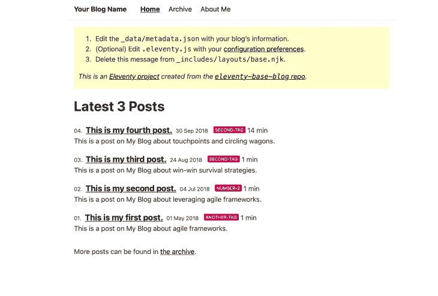

# 使用 Eleventy 托管您的博客

> 原文：<https://blog.logrocket.com/using-eleventy-to-host-your-blog/>

找到一个完美的网站来托管你的博客是具有挑战性的。例如，在过去的十年里，我已经转移了几次我的博客。最初，我的博客托管在 WordPress 上，然后是 Posterous，最近是 SquareSpace。

为什么我的博客搬了这么多次？因为我想对它的设计和内容有更多的控制权。至于自托管 WordPress，管理版本、插件和安全问题并不是我每个月都想做的事情。

然后，在我开始写更多的博客后，我不喜欢在 SquareSpace 上创建和发布的体验。页面加载很慢，网站很笨重，移动编辑器的体验很糟糕，除了优化一些图片，我无能为力来修复它。

然后我在各种博客上了解到了 Jamstack 运动。博客不需要动态的。从技术上讲，在请求页面时从数据库中提取数据是没有意义的。相反，预先(在构建过程中)创建页面(HTML)更有意义。

Jamstack 运动的想法很有意义(即使当你开始考虑安全性的时候)，我开始深入研究[静态站点生成器(SSG)](https://www.netlify.com/blog/2020/04/14/what-is-a-static-site-generator-and-3-ways-to-find-the-best-one/)的世界。

就在那时，我偶然发现了 [Eleventy (11ty)](https://www.11ty.dev/) ，并开始用它来写我的博客。在本文中，我将介绍什么是 11ty，为什么它越来越受欢迎，为什么我选择它作为[我的博客](https://sahilparikh.dev)，以及如何开始使用 11ty 创建自己的博客。

## 什么是十一(11ty)？

Eleventy 是一个用 JavaScript 编写的静态站点生成器。Eleventy 获取您的页面(用它支持的许多模板引擎之一编写)并在构建过程中将它们转换成 HTML。Eleventy 听起来令人兴奋，我决定阅读更多关于它的内容，以及为什么我应该在我的博客中使用它。

> “虽然 Eleventy 在 node.js 中使用 JavaScript 将模板转换为内容，但重要的是(默认情况下)，它不建议也不强制您的 HTML 包含任何特定于 Eleventy 的客户端 JavaScript。这是项目意图和目标的核心方面。
> 
> “我们不是 JavaScript 框架。我们希望我们的内容尽可能与 Eleventy 完全分离，因为 Eleventy 使用独立于 Eleventy 的模板引擎，这让我们更加接近这一目标。”–[扎克·莱泽曼](https://twitter.com/zachleat)，十一月的创造者

11ty 是开发人员友好的，支持各种模板。我选择了 Nunjucks 模板(它听起来很酷，让我想起了我的空手道时代)。当其他 SSG 被绑定到一个模板引擎时，11ty 支持:

Eleventy 是用 JavaScript 编写的(但不是 JavaScript 框架)，它让你可以访问[节点包管理器](https://www.npmjs.com/) (npm)生态系统。

> “Eleventy 是基于 JavaScript 的 SSG 中最灵活的，而且它还远远不够。光是模板就让它在这一点上赢了。在某些方面，Eleventy 在基于 JS 的 SSG 中胜出，因为它不做什么:也就是说，它不强迫你使用特定的框架，也不强迫你使用 GraphQL 来做简单的小事。–[布莱斯·雷](https://twitter.com/BryceWrayTX)

> “我一直在寻找一个不需要客户端 JS 或 React 之类库的 SSG，尽管我喜欢 React 用于更大的交互式应用程序。我只是认为我们在不需要的时候过度使用了前端框架。所以我尝试了 11 月 11 日，再也没有回头。”–[Sia Karamalegos](https://twitter.com/TheGreenGreek)

那时，我在 11 号被卖了。现在我不得不亲自尝试一下，看看它是否易于安装和运行。

## Eleventy 入门

我立刻注意到 [11ty 的网站文档](https://www.11ty.dev/docs/)读起来很有趣。我用了 11ty 的一个入门包，不到五分钟就建立了一个基本的博客。

首先，让我们克隆并设置官方的 eleventy-base-blog 启动项目:

```
git clone https://github.com/11ty/eleventy-base-blog.git myblog
```

通过`cd myblog`进入新创建的目录。

接下来，安装依赖项:

```
npm install
```

在您选择的编辑器中随意打开这个项目，查看目录结构，甚至编辑`_data/metadata.json`。

现在，让我们用`npx eleventy --serve`运行 11ty。一旦运行了这个命令，Eleventy 就会用你所有的网站文件创建一个`_site`目录，甚至运行一个热重装的本地 web 服务器来提供这些文件。你的新博客在`[http://localhost:8080](http://localhost:8080)`。

## 使用 Eleventy 创建博客文章

让我们现在创建一个新的博客帖子。

复制`posts/fourthpost.md`，重命名为`fifthpost.md`。更新文件顶部的标题、描述、日期和标签(这被称为[前沿事件数据](https://www.11ty.dev/docs/data-frontmatter/)——把它想象成你的博客文章的元数据)。

接下来，更新文件底部的内容，保存并返回浏览器。在那里，你的新帖子是可见的。

我更喜欢居中对齐的网站，所以打开`css/index.css`文件并添加:

```
@media screen and (min-width: 768px) {
  body {
    max-width: 768px;
    margin: 0 auto;
  }
}

```

接下来，不要在主页上只显示三篇文章，而是显示五篇文章。将`index.njk`文件中的 Nunjucks 代码编辑为:

```

```

另一个更新是在主页上显示帖子的描述(在`/posts`中的每个`*.md`帖子文件的顶部的前事数据)。这将让访问者在点击链接之前获得博客文章的摘录。

打开`postlists.njk`,将高亮显示的那一行也添加到你的代码中(在这篇文章中，我们不会担心样式)。

```
<ol reversed class="postlist" style="counter-reset: start-from {{ (postslistCounter or postslist.length) + 1 }}">

  <li class="postlist-item postlist-item-active">
    <a href="{{ post.url | url }}" class="postlist-link">{{ post.data.title }}<code>{{ post.url }}</code></a>
    <time class="postlist-date" datetime="{{ post.date | htmlDateString }}">{{ post.date | readableDate }}</time>
    
      
      /tags/{{ tag }}/
      <a href="{{ tagUrl | url }}" class="post-tag">{{ tag }}</a>
      
    
  </li>
    {{ post.data.description }}<br/><br/>

</ol>
```

最后，让我们安装一个阅读时间插件，为每篇文章添加一个阅读时间估计。我在 npm 目录中找到了[第十一插件读取时间](https://www.npmjs.com/package/eleventy-plugin-reading-time)。

```
npm install --save eleventy-plugin-reading-time
```

将`.eleventy.js`配置文件更新为:

```
const readingTime = require('eleventy-plugin-reading-time');

module.exports = (eleventyConfig) => {
  eleventyConfig.addPlugin(readingTime);
};

```

我们现在准备在 Nunjuck 模板文件中使用`readingTime`过滤器。打开`postelist.njk`，在下面加上这一行。

```
<ol reversed class="postlist" style="counter-reset: start-from {{ (postslistCounter or postslist.length) + 1 }}">

  <li class="postlist-item postlist-item-active">
    <a href="{{ post.url | url }}" class="postlist-link">{{ post.data.title }}<code>{{ post.url }}</code></a>
    <time class="postlist-date" datetime="{{ post.date | htmlDateString }}">{{ post.date | readableDate }}</time>
    
      
      /tags/{{ tag }}/
      <a href="{{ tagUrl | url }}" class="post-tag">{{ tag }}</a>
      
    
    {{ post | readingTime }}
  </li>
     {{ post.data.description }}<br/><br/>

</ol>
```

这就是你的博客应该有的样子！



11ty 背后有一个不断增长的社区，网络上有大量的文章和操作方法可供参考。一旦我用 Eleventy 设计了我的博客，我就用 [Tailwind CSS](http://tailwindcss.com/) 来设计它，然后把它放在 [Netlify](https://netlify.com) 上。如果你正在寻找一款不固执己见、简单、灵活、快速的 SSG，我建议你试试 11ty。

## 使用 [LogRocket](https://lp.logrocket.com/blg/signup) 消除传统错误报告的干扰

[](https://lp.logrocket.com/blg/signup)

[LogRocket](https://lp.logrocket.com/blg/signup) 是一个数字体验分析解决方案，它可以保护您免受数百个假阳性错误警报的影响，只针对几个真正重要的项目。LogRocket 会告诉您应用程序中实际影响用户的最具影响力的 bug 和 UX 问题。

然后，使用具有深层技术遥测的会话重放来确切地查看用户看到了什么以及是什么导致了问题，就像你在他们身后看一样。

LogRocket 自动聚合客户端错误、JS 异常、前端性能指标和用户交互。然后 LogRocket 使用机器学习来告诉你哪些问题正在影响大多数用户，并提供你需要修复它的上下文。

关注重要的 bug—[今天就试试 LogRocket】。](https://lp.logrocket.com/blg/signup-issue-free)