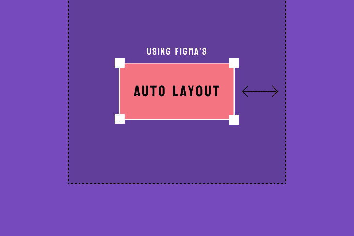
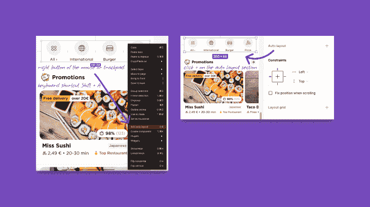
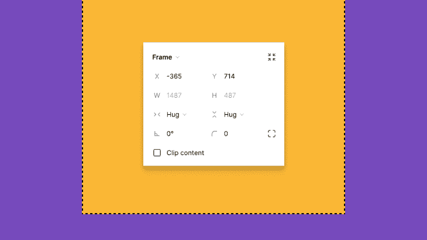
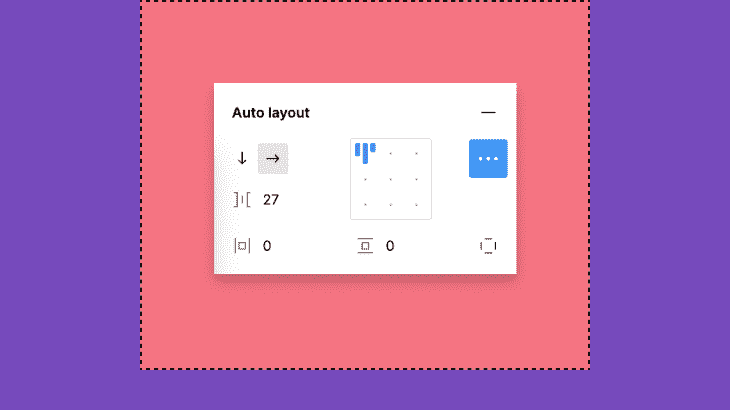
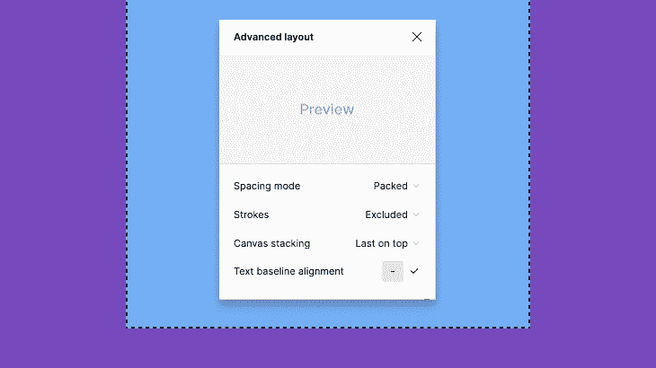

# 使用 Figma 的自动布局

> 原文：<https://blog.logrocket.com/ux-design/using-figma-auto-layout/>

Figma 的第一个自动布局版本最初于 2019 年发布，但最近在 2022 年 5 月的 config 期间进行了更新。增加了新的特性，更新了一些，关于界面视觉，一些已经移动或改变了。

本文将探讨自动布局的最新版本。我们将深入学习如何使用这个强大的特性及其主要功能，这样您就可以用它来创建设计系统。我们开始吧。

## 目录

在本文中，我们将介绍以下几点:

## 什么是自动布局？

自动布局是一项允许您创建响应内容或布局大小变化的框架的功能。这些动态组件或框架响应其子对象的大小，例如随着标签长度增长的按钮，或者现在添加了图标并再次随着组件长度增长的按钮。

对于那些新手来说，一个框架就像一个由更小的物体组成的容器，所有的物体一起形成一个框架。因此，框架是控制内部所有子对象的父对象。

框架的大小由设计者明确设置，而组只是多个对象的组合，没有任何大小规范。有时框架也被称为组件。

自动布局可以应用于以下所有已经解释过的内容:

*   单个对象的选择。
*   一群
*   一个框架

你可以在画布上找到框架、群组或单个对象，这是设计师创造奇迹的有限背景。根据 Figma 的说法，画布在每个轴上都有一个从-65，000 到+65，000 的有限大小。

在本文中，我们将探讨多种功能，如让项目透气的填充或改变项目在框架中位置的对齐。

自动布局几乎可以应用于设计系统的所有组件，当不同的团队成员在团队工作的每个项目中使用它们时，会使它们更加灵活和有凝聚力。

## 为什么自动布局很重要？

要理解这个特性的重要性，有两个重要的概念:第一，我们需要知道一个布局是什么；其次，使用响应式布局意味着什么。

首先，布局被定义为在屏幕上排列单个或复合项目，如图像、文本或组件。布局使用简单或复杂的组件和间距，以鼓励跨平台和屏幕尺寸的一致性。

其次，响应式布局允许框架根据屏幕大小动态更改和重新调整，从而保证设备间的一致性。

响应式设计对于构建适用于不同设备尺寸的产品至关重要，从移动设备到桌面设备以及介于两者之间的平板电脑。设计师一直在使用布局和网格来更好地适应不同屏幕尺寸的设计。如果使用自动布局，您可以将每个组件放置在不同的布局中，它们将动态适应新的内容维度，从而节省您为每个视窗手动重新调整每个组件的时间。

## 如何使用 Figma 的自动布局

将自动布局应用于框架或组有三种不同的可能性，始终通过选择整个框架、组或仅选择要转换的多个元素:

*   点击鼠标或触控板的右键，在菜单上选择**添加自动布局**。
*   接下来，点击屏幕右侧的**属性**面板中自动布局部分的加号按钮。
*   或者，使用键盘快捷键 Shift + A(对 Mac 和 Windows 有效)。

在这两种情况下，应用自动布局后，您将在屏幕左侧的属性面板上看到一个新的框架出现。如果用鼠标或触控板双击新框架，您可以更改其名称；单击向右箭头将允许您展开父框架中的子对象。子对象按照在画布上出现的顺序从上到下或从左到右显示。

创建自动布局后，您将在右侧的自动布局面板或菜单中看到新选项。此外，一项新功能将出现在**帧**菜单上。

在下一节中，我们将首先浏览自动布局的基本选项，然后转到更高级的功能，让您的工作更加出色。

创建自动布局后，将出现一个名为“水平和垂直调整大小”的新部分。根据您的目标，这一部分有两个值得使用的变量:

*   **固定宽度和高度**:当你希望你的框架在画布上垂直或水平扩展时，这个选项非常有用。当框架增长时，子对象将在框架内保持与所选选项对齐。如果你想让框架响应布局，这是一个很好的选择。一个典型的例子是网站的顶部导航栏
*   **拥抱内容**:如果你想让你的框架根据它的子对象的大小垂直和水平增长，这个选项很好用。因此，基本上，自动布局框架将根据其子对象的大小增加其大小，而不遵循响应布局的规则。如果您想让框架响应子对象，这是一个很好的选择。一个典型的例子是按钮

#### 提示:使用绝对位置选项

这个选项也是新的，确实可以帮助您在自动布局框架内以绝对位置定位子元素。您需要选择其中一个孩子，然后选择右上角的加号按钮。

该对象将自动更改其属性，并固定在您设置的位置。您可以将它移动到您想要的任何位置，但是在调整组件大小时，它将保持固定。

在右侧面板的简化菜单中有多个选项。请记住保持选中框架以显示面板，我将从上到下、从左到右向您展示所有选项:

*   **删除自动布局**:点击减号按钮删除自动布局，或者点击右键，按**删除自动布局**。这不会删除您的框架，甚至不会删除它的属性，只会将自动布局框架转换为常规框架
*   **方向**:箭头将帮助您选择框架内父子的垂直或水平方向
*   **项目间距**:每个对象或子对象之间的像素。注意数字会一直重复，所以不能在不同的子对象之间选择不同的像素。从上一个 Figma 版本开始，您现在可以设置自动布局框架的子对象之间的负间距来创建堆叠，它可以水平和垂直工作
*   **对齐**:子对象如何在框架的有限空间内对齐。根据您如何交叉和混合以下选项，有九种可能的对齐选项:上/中/下和左/中/右。它看起来比现实中的更复杂，你会看到视觉线索来设定物体的位置
*   **填充**:孩子和框架之间的水平和垂直空间。我们会遇到四种类型的填充—顶部和底部填充以及右侧和左侧填充。每个填充都可以独立设置

#### 提示:在画布上控制填充和间距

现在，您可以控制同一框架内项目之间的填充和间距。你只需要找到悬停在框架上时出现的红色小手柄，手动拖动它们来增大或减小尺寸。如果您按下其中一个手柄，控制器将会提示，您可以使用键盘手动更改间距或填充。

有几个键盘快捷键可能值得一提:

如果在拖动处理程序时按住 **Shift** 键，像素将随着自动布局菜单上先前设置的像素数增加或减少。

如果在拖动处理程序进行填充的同时按下 **Alt** ，垂直或水平领域的两边将相等地增加或减少。

通过点击自动布局菜单的三个点，一个高级菜单将在顶部提示。您首先会注意到的是一个预览部分，显示您的选择的不同阶段。让我们来谈谈这些选项:

*   **间隔模式**:这里有两个选项，默认为打包
    *   **Packed** :保持上一菜单中设置的项目间距
    *   **间距**:该选项使用所有垂直或水平空间将子对象分布在框架的可用空间上
*   **笔画**:现在你可以选择笔画是否是自动布局框架的一部分。因此，笔画围绕整个框架，而不是单独的孩子，甚至孩子也可以独立笔画。这有利于保持组件的清洁
*   **画布堆叠**:当使用负间距时，你现在可以在你孩子的物体上实现堆叠效果。使用此选项更改层的顺序；您可以在第一个或最后一个之间进行选择
*   **文本基线对齐**:如果您的自动布局框架上有文本，选择是将其居中对齐还是按其基线对齐。仅适用于水平对齐

#### 提示:将对象放置在自动布局框架的顶部

除非您将对象添加到框架中，并将其放在您想要的任何位置，否则不可能将对象放在自动布局框架的顶部。

现在提示按住空格键，同时将对象放在框架的顶部，魔术完成了，对象现在被设置在它的顶部。

## 综上

令人印象深刻的是，你可以使用 Figma 的自动布局功能做所有的事情，最新版本将功能提升到了另一个定制水平。仍然有改进的空间，我很确定 Figma 很快会用更多的更新让我们所有人惊讶，但仍然很好。

我建议所有用户都尝试一下简化菜单上的所有选项，然后是高级菜单，以便更深入地了解所有可用的选项。

自动布局是为响应设备工作和设计团队创建设计系统的绝佳选择。使用自动布局创建的组件在各种视角下都很容易使用，不需要太多的手动工作，因此总体上加快了设计过程，并保持了设计的整洁和内聚力。

现在你知道所有的技巧，你没有借口玩自动布局！

## [LogRocket](https://lp.logrocket.com/blg/signup) :无需采访即可获得 UX 洞察的分析

[LogRocket](https://lp.logrocket.com/blg/signup) 让您可以回放用户的产品体验，以可视化竞争，了解影响采用的问题，并结合定性和定量数据，以便您可以创建令人惊叹的数字体验。

查看设计选择、交互和问题如何影响您的用户— [立即尝试 LogRocket】。](hhttps://lp.logrocket.com/blg/signup)