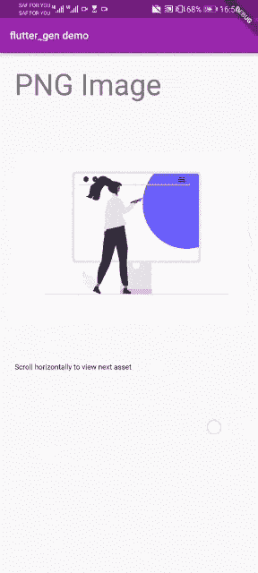

# 在 Flutter 中使用 FlutterGen 代码生成器

> 原文：<https://blog.logrocket.com/using-fluttergen-code-generator-flutter/>

那些已经开发了原生 Android 应用的人可能会在尝试使用 Flutter 中的资产时畏缩不前。作为一名 Flutter 开发人员，您别无选择，只能在代码中直接使用字符串来引用它们。例如，处理图像并不容易，因为您必须通过它们的路径字符串来引用它们。

Android 应用程序开发环境有一个工具，可以帮助您将所有资产转换为类型安全的变量，这些变量可以在代码中的任何地方引用。这个工具有很多好处，包括:

*   当提到你的资产时，减少拼写错误的风险。如果出现拼写错误，它们会出现在一个地方，这样更容易调试
*   轻松跟踪您的资产在代码中的使用位置
*   轻松识别代码中未使用的资产
*   还有更多！

Flutter 没有提供这种现成的工具。幸运的是，有 [FlutterGen](https://github.com/FlutterGen/flutter_gen) ，这是一个为你的资产提供的 Flutter 代码生成器，可以帮助你删除应用程序中所有基于字符串的 API。

在本文中，您将了解如何在您的 Flutter 应用程序中使用 FlutterGen。

## 介绍

资产是与您的应用程序一起捆绑和部署的任何文件，以便在运行时访问。资产可以是以下形式:

*   形象
*   动画片
*   字体
*   配置文件
*   静态数据，例如文本或 JSON 文件

要在 Flutter 应用程序中加载资产，您必须使用路径字符串引用资产，这是不安全的。 [FlutterGen](https://github.com/FlutterGen/flutter_gen) 包通过为您的所有资产生成代码，帮助您删除应用程序中所有基于字符串的 API。

使用 FlutterGen 非常简单:

1.  你像平常一样在`pubspec.yaml`文件中申报资产；不需要其他配置
2.  默认情况下，FlutterGen 将在`lib/gen`目录下生成相关的 Dart 文件
3.  然后，您可以使用生成的类加载您的资产

以下是您可以配置的可用解析器:

*   资产—该配置在`lib/gen`下生成`assets.gen.dart`文件
*   字体—该配置在`lib/gen`下生成`fonts.gen.dart`文件
*   颜色—该配置在`lib/gen`下生成`colors.gen.dart`文件

在处理动画等资源时，FlutterGen 提供了以下集成:

我们来试试吧！

## 入门指南

为了跟进，你可以[在这里](https://github.com/Ivy-Walobwa/flutter_gen_demo)获得入门应用。该应用程序在根目录的`assets`文件夹下添加了以下资产:

*   动画— `.riv`文件
*   字体— `.ttf`文件
*   图像— `.png`和`.svg`文件
*   JSON — `.json`文件
*   视频— `.mp4`

按照文件夹结构中所示的类型对资产进行分组是一种很好的做法。

下面是文件夹结构和应用外观:




资产已加载到应用程序中，但带有路径字符串。您将为资产生成代码，并使用静态变量来访问它们。您可以在 FlutterGen 分支中找到带有生成代码的最终应用程序。

接下来了解如何开始使用 FlutterGen。

## 设置 FlutterGen

要在应用程序中设置 FlutterGen:

### 安装 FlutterGen

您可以通过多种方式安装 FlutterGen:

*   使用自制软件
*   全局添加
*   作为`build_runner`的一部分

我们将把它作为`build_runner`的一部分来安装。

将`build_runner`和`flutter_gen`作为`dev_dependencies`的一部分添加到`pubspec.yaml`文件中:

```
dev_dependencies:
  build_runner:
  flutter_gen_runner:
```

在您的根应用程序目录中运行以下命令来安装 FlutterGen:

```
$ flutter pub get
```

### 使用 FlutterGen

在您的`pubspec.yaml`文件中指定资产，如下所示:

```
flutter:
  uses-material-design: true
  assets:
    - assets/images/
    - assets/video/
    - assets/animations/
    - assets/json/

  fonts:
    - family: RobotoMono
      fonts:
        - asset: assets/fonts/RobotoMono-Regular.ttf
        - asset: assets/fonts/RobotoMono-Bold.ttf
          weight: 700
        - asset: assets/fonts/RobotoMono-Italic.ttf
          style: italic

```

注意使用的解析器的类型，`assets`和`fonts`。[启动应用](https://github.com/Ivy-Walobwa/flutter_gen_demo)包含资源和字体。

#### 为资产生成代码

在您的根应用程序目录中运行`flutter packages pub run build_runner build`。该命令将在`lib/gen`文件夹中生成相关资产的文件。在这种情况下，因为指定了两个解析器，`assets`和`fonts`，所以为每个解析器生成两个文件:

*   `assets.gen.dart` —包含为您的图像、视频、动画和 JSON 资产生成的代码
*   `fonts.gen.dart` —包含为字体资源生成的代码

#### 使用生成的代码

您必须将文件导入添加到相关的布局文件中:

```
import '../gen/assets.gen.dart';
import '../gen/fonts.gen.dart';

```

根据您如何命名您的资产文件，将创建一个类来读取其路径字符串。

例如，如果我们以下面的格式添加了一个视频，就会创建一个 string 类并可以访问它:

```
// getter
String get bee => 'assets/video/bee.mp4';

// static variable
static const String robotoMono = 'RobotoMono';

```

现在，您已经为您的资产生成了代码，告别输入错误，使用代码中生成的静态变量。

接下来，您将学习如何在布局文件中处理生成的代码。

## 使用图像

如果 Flutter 支持添加的图像的格式，就会生成一个`Image`类。
对于您的情况，图像路径是`assets/images/add_color.png`。您可以按以下格式加载图像:

*   `Assets.images.addcolor` —实现`AssetImage`类
*   `Assets.images.addcolor.image(...)` —返回`Image`类
*   `Assets.images.addcolor.path` —返回路径字符串

在起始代码中，用生成的路径替换图像路径:

```
// with string APIs
Image.asset(
  "assets/images/add_color.png",
  height: 400,
  width: 400,
),

// with generated path - option 1
Image.asset(
 Assets.images.addColor.path,
  height: 400,
  width: 400,
),

// with generated image class- option 2
Assets.images.addColor.image(width: 400, height: 400),

```

您也可以使用`.svg`图像文件。在这种情况下也创建了`svg`类。您将实现`flutter_svg`集成来加载您的`.svg`文件:

### 在您的`pubspec.yaml`文件中启用集成

默认情况下，FlutterGen 积分设置为`false`。要使用它们，您必须将它们的值设置为`true`。

```
flutter_gen:
  integrations:
    flutter_svg: true
flutter:

```

每当对`pubspec.yaml`进行更改时，运行以下代码:

```
flutter pub get

flutter packages pub run build_runner build

```

最后，向应用程序添加一个 SVG 图像:

```
// with string APIs
SvgPicture.asset(
  "assets/images/book_lover.svg",
  height: 300,
  width:300,
),

// with generated SVG class
Assets.images.bookLover.svg(width: 300, height: 300),

```

## 使用视频

对于[视频](https://blog.logrocket.com/flutter-video-player/)，可以从创建的字符串类中读取路径字符串:

```
// with string APIs
_videoController = VideoPlayerController.asset("assets/video/bee.mp4");

// with generated path string
_videoController = VideoPlayerController.asset(Assets.video.bee);

```

## 使用动画

对于动画和图像，创建了一个类:`rive`，在本例中，我们使用了一个`.rive`文件。您还必须启用`rive`集成:

```
flutter_gen:
  integrations:
    flutter_svg: true
    rive: true

```

您可以像访问图像一样访问动画:

```
// with string APIs
RiveAnimation.asset(
  "assets/animations/vehicles.riv",
  controllers: [_animationController],
  animations: const ['idle', 'curves'],
),

// with generated path - option 1
RiveAnimation.asset(
  Assets.animations.vehicles.path,
  controllers: [_animationController],
  animations: const ['idle', 'curves'],
),

// with generated rive class - option 2
Assets.animations.vehicles.rive(
    controllers: [_animationController],
    animations: const ['idle', 'curves'],
  ),
),

```

## 使用字体

生成的字体名称被分配给一个`FontFamily`类中的静态变量，可通过您的应用程序访问:

```
// with string APIs
const Text(
  "This is RobotoMono font - medium",
  style: TextStyle(fontFamily: 'RobotoMono'),
),

// with generated variable
const Text(
  "This is RobotoMono font - medium",
  style: TextStyle(fontFamily: FontFamily.robotoMono),

```

## 使用静态数据

文本和 JSON 等静态数据的路径被分配给 getters，可以从您的应用程序中读取:

```
// with string APIs
final String response = await rootBundle.loadString("assets/json/assets_tye.json");
final data = await json.decode(response);

// with generated path
final String response = await rootBundle.loadString(Assets.json.assetsTye);
final data = await json.decode(response);

```

## 更改代码生成风格

默认情况下，FlutterGen 包使用点分隔符样式为您的资产生成代码:
`Assets.video.bee`。支持其他风格的代码生成。其中包括:

*   `snake-case` —作为`Assets.video_bee`访问的资产
*   `camel-case` —作为`Assets.videoBee`访问的资产

要改变代码生成风格，您必须在您的`pubspec.yaml`文件中指定`style`:

```
flutter_gen:
  integrations:
    flutter_svg: true
    rive: true

  assets:
    enabled: true
    # Avaliable values:
    # - camel-case
    # - snake-case
    # - dot-delimiter
    style: dot-delimiter

```

## 结论

您已经了解了资产的类型，以及在 Flutter 中如何使用字符串路径访问它们。现在，您可以安装并使用 FlutterGen 来:

*   移除整个应用程序中对资源的字符串引用
*   生成资产类别和静态变量
*   以类型安全的方式加载资产
*   定制资产生成的风格

你可以在 [GitHub](https://github.com/FlutterGen/flutter_gen) 上查看 FlutterGen。我们希望你喜欢这个教程！

## 使用 [LogRocket](https://lp.logrocket.com/blg/signup) 消除传统错误报告的干扰

[](https://lp.logrocket.com/blg/signup)

[LogRocket](https://lp.logrocket.com/blg/signup) 是一个数字体验分析解决方案，它可以保护您免受数百个假阳性错误警报的影响，只针对几个真正重要的项目。LogRocket 会告诉您应用程序中实际影响用户的最具影响力的 bug 和 UX 问题。

然后，使用具有深层技术遥测的会话重放来确切地查看用户看到了什么以及是什么导致了问题，就像你在他们身后看一样。

LogRocket 自动聚合客户端错误、JS 异常、前端性能指标和用户交互。然后 LogRocket 使用机器学习来告诉你哪些问题正在影响大多数用户，并提供你需要修复它的上下文。

关注重要的 bug—[今天就试试 LogRocket】。](https://lp.logrocket.com/blg/signup-issue-free)