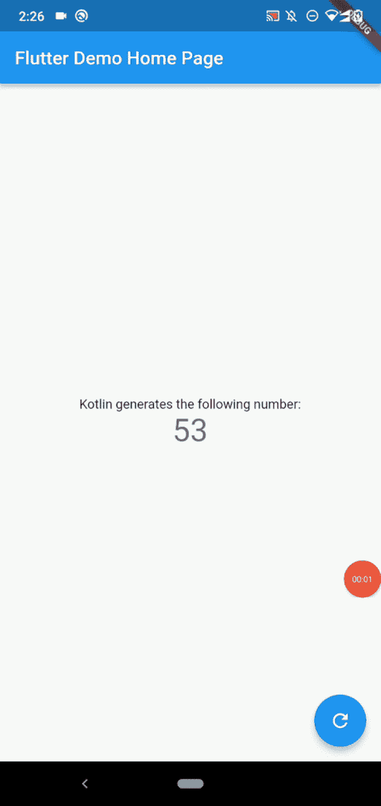
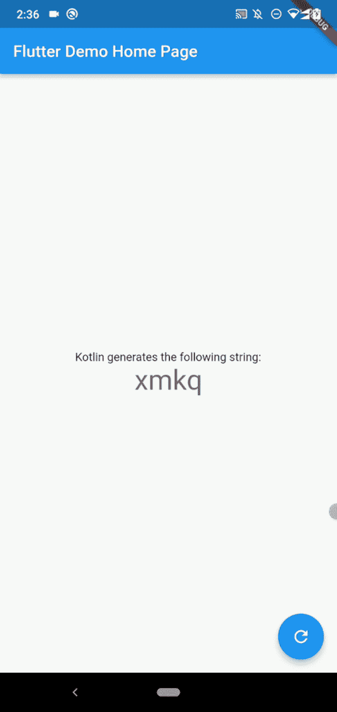
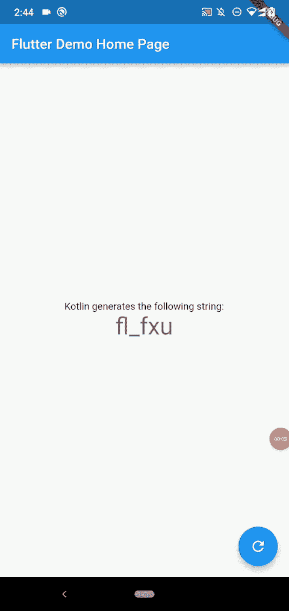
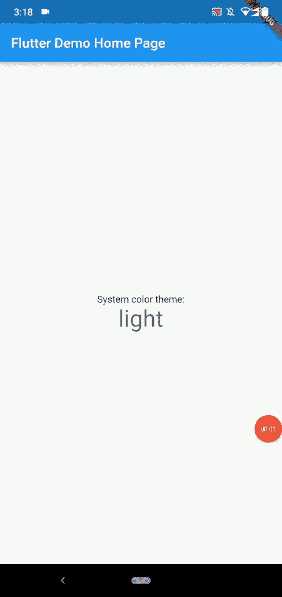

# 使用 Flutter 的 MethodChannel 为 Android 调用 Kotlin 代码

> 原文：<https://blog.logrocket.com/using-flutters-methodchannel-invoke-kotlin-code-android/>

开发一个 Flutter 移动应用程序需要渲染一些 UI 元素，这些元素会根据用户发起的触摸事件而改变，因此我们经常需要通过特定于平台的 SDK 来使用用户设备的硬件组件。

每个移动平台都提供内置的 API 来访问硬件组件和核心操作系统功能。例如，如果你用 Kotlin 构建了一个原生 Android 应用程序，你可以使用 Android SDK 中的 [`Vibrator`类](https://developer.android.com/reference/kotlin/android/os/Vibrator)来使用户的设备振动。

您可以在基于 Kotlin 的原生 Android 应用程序中使用现有的基于 Kotlin/Java 的共享库。但是如果你需要从你的 Flutter 应用程序中调用这个特定于平台的 Kotlin 代码呢？

Flutter 允许您使用 Dart 内置的跨平台标准库来满足通用编程需求(即 I/O、数学等)。).它还提供了平台通道 API 来与特定于平台的代码进行通信，以使用操作系统级 API 或调用用本机应用程序开发语言编写的代码段。

在本教程中，我将解释如何通过 Flutter 平台通道的`MethodChannel`类从 Dart 端调用 Kotlin 代码。此外，我将解释如何通过`EventChannel`进行事件驱动的颤振原生通信。

*向前跳转:*

## `MethodChannel`的突出特点

Flutter 为开发人员提供了`MethodChannel` Dart 类，以便从 Flutter 环境中调用特定于平台的本机代码。此外，Flutter 为您提供了将数据从本地主机应用程序代码发送回 Flutter 所需的 API。检查`MethodChannel`提供的以下突出显示的功能:

### 跨平台支持

我们将讨论如何从 Flutter 调用 Kotlin 代码，但是 Flutter 框架实现允许您在 iOS、Linux、macOS 和 Windows 上调用本机代码。所以，调用 Swift/Objective-C 和 C/C++代码也是可以的。

### 性能优先设计

与其他流行的跨平台应用开发框架不同，Flutter 不使用嵌入式 JavaScript 执行环境。此外，它使用 [AOT(提前)编译](https://en.wikipedia.org/wiki/Ahead-of-time_compilation)来发布二进制文件，以实现接近本机的性能。

类似地，Flutter 团队设计了 Flutter-Native 通信策略，采用性能优先的二进制消息协议，以实现更好的应用性能。因此，在 Android 上使用 Kotlin 和 Dart 来访问 Android SDK 没有明显的性能差异！

### 双向通信支持

基于 Dart 的`MethodChannel`类帮助您从 Flutter 调用特定于平台的代码。另一方面，Flutter 公开了特定于平台的`MethodChannel` API，从原生端调用 Dart 代码。因此，您可以在 Dart 代码和特定于平台的本机代码之间建立一条双向通信线路。

### 自动数据类型映射

Flutter 的底层平台通道 API 使用二进制消息传递协议，因此在 Dart-to-Native 通信期间，所有方法调用都被转换为字节流(参见 Android 类型转换实现如何使用`ByteBuffer` [这里](https://github.com/flutter/engine/blob/main/shell/platform/android/io/flutter/plugin/common/StandardMessageCodec.java))。Flutter 自动从字节流中删除数据记录，并在 Dart 和 native 端生成特定于语言的数据类型。因此，当使用一种语言时，即使有两种不同的环境，也可以将基于 Dart 的数据转换为 Kotlin/Java 数据，反之亦然。此外，类型转换功能可用于所有支持的平台。

### 错误处理功能

特定于平台的 API 通常会针对意外或失败事件抛出异常或返回错误代码。在本机端，我们可以轻松地使用本机 SDK 错误处理策略，但从 Dart 端我们能做什么呢？带有内置的错误处理支持并抛出 Dart 异常。此外，如果需要，可以使用异常实例中的错误代码来改进错误处理策略。

## 颤动的建筑

你大概已经阅读了`MethodChannel`的概述和 Flutter 平台通道 API 的目标。颤振框架由两个关键部分组成:Dart 框架和颤振引擎。

Dart 框架由一个内置的小部件工具包实现组成，而 Flutter 引擎实现了嵌入 Dart 框架的本地主机应用。平台通道 API 通过双向通信线路将这两个组件连接在一起。

`MethodChannel`实现是平台通道 API 的一部分，它允许您在 Dart 和本机代码上执行和提取命名方法的结果。

现在，你知道了`MethodChannel`的架构方面。你可以从[这篇文章](https://blog.logrocket.com/complete-guide-flutter-architecture/)和[官方文档](https://docs.flutter.dev/resources/architectural-overview)中了解更多关于整个 Flutter 架构的信息。

让我们开始实际应用吧！

## 设置新项目

在本节中，我们将构建一个示例 Flutter 应用程序，并根据各种实际需求对其进行扩展，以了解如何使用`MethodChannel`将 Kotlin 和 Dart 连接在一起。

首先，使用以下命令创建一个新的颤振项目:

```
flutter create flutter_platform_channels_demo
cd flutter_platform_channels_demo

```

用`flutter run`命令运行新生成的应用程序，检查一切是否正常。

打开`android/app`目录可以检查原生安卓主机 app 源码。默认情况下，`flutter create`命令会生成一个基于 Kotlin 的主机应用，你可以在`MainActivity.kt`中找到 Android 应用的 Kotlin 代码。你不会在那里看到这么多代码，但是你会注意到它实现了 [`FlutterActivity`类](https://github.com/flutter/engine/blob/main/shell/platform/android/io/flutter/embedding/android/FlutterActivity.java)，颤振引擎的一部分。

现在，我们可以开始修改`MainActivity` Kotlin 类来构建一个方法通道来连接 Dart 端。

## 从 Dart 调用 Kotlin 代码

我们知道可以在 Dart 内生成一个随机数，但是让我们从 Dart 端调用 Kotlin 标准库的随机数生成器来开始使用`MethodChannel`。

首先，我们需要从 Kotlin 端注册一个方法调用处理程序。将以下代码添加到您的`MainActivity.kt`中:

```
package com.example.flutter_platform_channels_demo

import kotlin.random.Random
import androidx.annotation.NonNull
import io.flutter.embedding.android.FlutterActivity
import io.flutter.embedding.engine.FlutterEngine
import io.flutter.plugin.common.MethodChannel

class MainActivity: FlutterActivity() {
  override fun configureFlutterEngine(@NonNull flutterEngine: FlutterEngine) {
    super.configureFlutterEngine(flutterEngine)
    MethodChannel(flutterEngine.dartExecutor.binaryMessenger, "example.com/channel").setMethodCallHandler {
      call, result ->
        if(call.method == "getRandomNumber") {
          val rand = Random.nextInt(100)
          result.success(rand)
        }
        else {
          result.notImplemented()
        }
    }
  }
}

```

这里，我们覆盖了来自`FlutterActivity`类的`configureFlutterEngine`方法来注册一个方法通道，用于构建与 Dart 的通信线路。当用特定的 Android 活动实例初始化 Flutter 引擎时，就会调用`configureFlutterEngine`方法，所以 Flutter 建议用它来注册方法通道处理程序。

方法通道就像由多个方法签名组成的命名空间，因此您可以使用一个方法通道来实现几个本机方法。在这个场景中，出于演示目的，我们实现了`getRandomNumber`方法。当特定的方法通道收到方法调用时，我们可以使用条件语句来标识方法名:

```
if(call.method == "getRandomNumber") {
    val rand = Random.nextInt(100)
    result.success(rand)
}
// ---
// ---

```

这里，我们使用`result.success`方法将生成的随机数返回到 Dart 环境。尽管我们不会故意从 Dart 中提供无效的方法名，但按如下方式处理未知的方法调用总是好的:

```
// ---
else {
   result.notImplemented()
}

```

现在，本机实现已经准备好接收来自 Dart 的方法调用。我们将修改 Flutter 的默认演示应用程序，以显示从 Kotlin 生成的随机数。在我们按下浮动操作按钮后，我们会看到一个新的随机数。

将以下代码添加到您的`main.dart`中:

```
import 'package:flutter/services.dart';
import 'package:flutter/material.dart';

void main() {
  runApp(const MyApp());
}

class MyApp extends StatelessWidget {
  const MyApp({super.key});
  @override
  Widget build(BuildContext context) {
    return MaterialApp(
      title: 'Flutter Demo',
      theme: ThemeData(
        primarySwatch: Colors.blue,
      ),
      home: const MyHomePage(title: 'Flutter Demo Home Page'),
    );
  }
}

class MyHomePage extends StatefulWidget {
  const MyHomePage({super.key, required this.title});
  final String title;
  @override
  State<MyHomePage> createState() => _MyHomePageState();
}

class _MyHomePageState extends State<MyHomePage> {
  int _counter = 0;
  static const platform = MethodChannel('example.com/channel');
Future<void> _generateRandomNumber() async {
    int random;
    try {
      random = await platform.invokeMethod('getRandomNumber');
    } on PlatformException catch (e) {
      random = 0;
    }
setState(() {
      _counter = random;
    });
  }
  @override
  Widget build(BuildContext context) {
    return Scaffold(
      appBar: AppBar(
        title: Text(widget.title),
      ),
      body: Center(
        child: Column(
          mainAxisAlignment: MainAxisAlignment.center,
          children: <Widget>[
            const Text(
              'Kotlin generates the following number:',
            ),
            Text(
              '$_counter',
              style: Theme.of(context).textTheme.headline4,
            ),
          ],
        ),
      ),
      floatingActionButton: FloatingActionButton(
        onPressed: _generateRandomNumber,
        tooltip: 'Generate',
        child: const Icon(Icons.refresh),
      ),
    );
  }
}

```

我们在 Dart 环境中创建了一个`MethodChannel`实例，如下所示:

```
static const platform = MethodChannel('example.com/channel');

```

注意，我们应该传递我们在 Kotlin 代码中使用的准确的方法通道名称——否则，特定的方法调用将抛出一个`MissingPluginException`。

当用户按下浮动操作按钮时，我们调用`_generateRandomNumber`方法。当特定的方法被调用时，应用程序通过`platform.invokeMethod(‘getRandomNumber’)`向方法通道发送消息。在内部，Flutter 引擎触发方法通道处理程序，并执行我们之前编写的基于 Kotlin 的随机数生成代码。

运行应用程序并查看运行中的示例应用程序:



## 将数据从 Kotlin 返回到 Dart

在前面的例子中，我们从 Kotlin 向 Dart 返回了一个整数。当我们为一个特定的方法调用提供一个 Kotlin `Int`类型时，Flutter 会自动将其转换为 Dart `int`类型。

类似地，Flutter 的`Method Channel`实现自动转换所有的原子类型和一些复杂的内置对象，比如 Kotlin `List`和`HashMap`。颤振文档中的下表[列出了所有支持的自动类型转换:](https://docs.flutter.dev/development/platform-integration/platform-channels?tab=type-mappings-kotlin-tab#codec)

| 镖 | 科特林 |
| --- | --- |
| 空 | 空 |
| 弯曲件 | 布尔代数学体系的 |
| （同 Internationalorganizations）国际组织 | （同 Internationalorganizations）国际组织 |
| （同 Internationalorganizations）国际组织 | 长的 |
| 两倍 | 两倍 |
| String | String |
| Uint8List | ByteArray |
| Int32List | IntArray |
| Int64List | 长数组 |
| 浮动 32 列表 | 漂浮阵列 |
| Float64List 列表 | 双阵列 |
| 目录 | 目录 |
| Map | HashMap |

我们试着用 Kotlin 的`String`型，看看从镖这边会发生什么。使用下面的代码从`MainActivity.kt`中的 Kotlin 生成一个随机字符串:

```
override fun configureFlutterEngine(@NonNull flutterEngine: FlutterEngine) {
    super.configureFlutterEngine(flutterEngine)
    MethodChannel(flutterEngine.dartExecutor.binaryMessenger, "example.com/channel").setMethodCallHandler {
      call, result ->
        if(call.method == "getRandomString") {
          val rand = ('a'..'z').shuffled().take(4).joinToString("")
          result.success(rand)
        }
        else {
          result.notImplemented()
        }
    }
  }

```

我们为 Dart 端的`getRandomString`方法返回一个四个字符长的随机字符串。现在，修改您的`main.dart`文件以接受来自 Kotlin 的字符串值，如下所示:

```
import 'package:flutter/services.dart';
import 'package:flutter/material.dart';

void main() {
  runApp(const MyApp());
}

class MyApp extends StatelessWidget {
  const MyApp({super.key});
  @override
  Widget build(BuildContext context) {
    return MaterialApp(
      title: 'Flutter Demo',
      theme: ThemeData(
        primarySwatch: Colors.blue,
      ),
      home: const MyHomePage(title: 'Flutter Demo Home Page'),
    );
  }
}

class MyHomePage extends StatefulWidget {
  const MyHomePage({super.key, required this.title});
  final String title;
  @override
  State<MyHomePage> createState() => _MyHomePageState();
}

class _MyHomePageState extends State<MyHomePage> {
  String _counter = '';
  static const platform = MethodChannel('example.com/channel');
Future<void> _generateRandomString() async {
    String random = '';
    try {
      random = await platform.invokeMethod('getRandomString');
      print(random.runtimeType);
    } on PlatformException catch (e) {
      random = '';
    }
setState(() {
      _counter = random;
    });
  }
  @override
  Widget build(BuildContext context) {
    return Scaffold(
      appBar: AppBar(
        title: Text(widget.title),
      ),
      body: Center(
        child: Column(
          mainAxisAlignment: MainAxisAlignment.center,
          children: <Widget>[
            const Text(
              'Kotlin generates the following string:',
            ),
            Text(
              '$_counter',
              style: Theme.of(context).textTheme.headline4,
            ),
          ],
        ),
      ),
      floatingActionButton: FloatingActionButton(
        onPressed: _generateRandomString,
        tooltip: 'Generate',
        child: const Icon(Icons.refresh),
      ),
    );
  }
}

```

上面的代码使用`print(random.runtimeType)`来检查`invokeMethod`方法的输出数据类型。在这种情况下，我们从 Kotlin 端接收一个字符串，并显示在 Flutter 应用程序屏幕上。运行上面的代码并按下浮动操作按钮，通过 Kotlin 生成随机字符串:



如果你检查你的终端屏幕，你应该看到`print`函数输出`String`作为`random`变量的数据类型；如果是这样，那么我们知道类型转换起作用了。

尝试其他原始数据类型。我将在本教程的下一节解释如何在 Kotlin 和 Dart 之间传输复杂的数据类型和对象。

## 将参数从 Dart 传递到 Kotlin

我们已经讨论了如何通过`success`方法调用从 Kotlin 返回数据。如果需要从 Dart 向 Kotlin 发送一些数据怎么办？

当我们用特定的编程语言调用方法时，我们通常使用方法参数——同样的方法也适用于 Flutter 方法通道！您可以使用 Dart 动态映射通过`invokeMethod`方法传递命名参数。

假设您必须从 Dart 端配置随机字符串生成过程。例如，我们可以从 Flutter 应用程序代码中发送字符串长度和前缀。

首先，确定所需的参数:

*   `len`:随机字符串长度
*   `prefix`:随机字符串的前缀

通过`_generateRandomString`发送这些参数值:

```
Future<void> _generateRandomString() async {
    String random = '';
    try {
      var arguments = {
        'len': 3,
        'prefix': 'fl_',
      };
      random = await platform.invokeMethod('getRandomString', arguments);
    } on PlatformException catch (e) {
      random = '';
    }
setState(() {
      _counter = random;
    });
  }

```

接下来，更新 Kotlin 代码以使用命名参数:

```
if(call.method == "getRandomString") {
  val limit = call.argument("len") ?: 4
  val prefix = call.argument("prefix") ?: ""
  val rand = ('a'..'z')
                .shuffled()
                .take(limit)
                .joinToString(prefix = prefix, separator = "")
  result.success(rand)
}

```

上面的代码使用 Kotlin 的[猫王运算符`[?:]`](https://kotlinlang.org/docs/null-safety.html#elvis-operator) 为`limit`和`prefix`常量设置默认值。运行应用程序。您将看到基于我们从方法通道的 Dart 端提供的参数的随机字符串:



进一步尝试使用不同的方法参数值，并尝试添加更多的参数。如果你需要传递一个方法参数，你可以直接传递特定的参数，而不需要创建一个动态映射来获得更好的可读性。查看以下代码片段如何发送随机字符串长度:

```
// Dart:
random = await platform.invokeMethod('getRandomString', 3);

// Kotlin
val limit = call.arguments() ?: 4
val rand = ('a'..'z')
              .shuffled()
              .take(limit)
              .joinToString("")
result.success(rand)

```

## 错误处理策略

编程中有两种主要的错误处理策略:基于错误代码的和基于异常的。一些程序员混合使用两种错误处理策略。

对于 Kotlin 端的错误流，具有处理 Dart 异常的内置支持。此外，它还提供了一种在异常实例中用错误代码区分本机错误类型的方法。换句话说，`MethodChannel`为 Flutter 开发者提供了一种混合的错误处理策略。

在前面的例子中，我们使用`result.success`方法返回值，使用`result.notImplemented`处理未知的方法调用，这将在 Dart 中抛出`MissingPluginException`。

如果我们需要从 Kotlin 端创建一个 Dart 异常怎么办？方法`result.error`帮助你从 Kotlin 抛出一个 Dart `PlatformException`实例。假设我们需要抛出一个异常，如果我们在前面的例子中为随机字符串长度提供了一个负值。

首先，按如下方式更新 Kotlin 代码，将异常通知 Dart:

```
if(call.method == "getRandomString") {
  val limit = call.arguments() ?: 4
  if(limit < 0) {
    result.error("INVALIDARGS", "String length should not be a negative integer", null)
  }
  else {
    val rand = ('a'..'z')
                  .shuffled()
                  .take(limit)
                  .joinToString("")
    result.success(rand)
  }
}

```

这里，我们通过`result.error`提供一个唯一的异常代码和消息。接下来，捕获异常并在 Dart 端使用它，如下所示:

```
Future<void> _generateRandomString() async {
    String random = '';
    try {
      random = await platform.invokeMethod('getRandomString', -5);
    } on PlatformException catch (e) {
      random = '';
      print('PlatformException: ${e.code} ${e.message}');
    }
    setState(() {
      _counter = random;
    });
  }

```

当您运行应用程序并按下浮动操作按钮时，您将在终端上看到异常代码和消息，因为我们从 Dart 端将`-5`作为字符串长度传递:


正如我们在上面的例子中看到的，您可以在 Dart 中捕获`PlatformException`，并且可以在异常实例中检查错误代码，以处理方法通道错误。另一种更抽象的方法是基于 Kotlin 错误代码创建自己的异常实例。检查 Flutter 相机插件的`[CameraException](https://github.com/flutter/plugins/blob/main/packages/camera/camera_platform_interface/lib/src/types/camera_exception.dart)`作为参考实现。

## 通过`MethodChannel`调用原生 SDK 函数

现在，我们知道如何使用`MethodChannel`从 Dart 调用 Kotlin 代码。在之前的演示中，我们已经使用了 Kotlin 的标准库特性。类似地，您可以在 Flutter 平台通道中重用预先实现的 Kotlin/Java 库。方法通道也可以使用原生 SDK，这是 Flutter 平台通道实现的主要目标。

Flutter 已经支持系统黑暗主题处理，并有其他原生 SDK 的插件，但让我们调用一些原生 SDK APIs 来进一步理解`MethodChannel`用例。

我们将编写一个本地方法来检查黑暗主题是否打开。首先，在你的`MainActivity.kt`中用 Kotlin 实现一个新的颤振方法通道:

```
package com.example.flutter_platform_channels_demo

import kotlin.random.Random
import androidx.annotation.NonNull
import android.content.res.Configuration
import io.flutter.embedding.android.FlutterActivity
import io.flutter.embedding.engine.FlutterEngine
import io.flutter.plugin.common.MethodChannel

class MainActivity: FlutterActivity() {
  override fun configureFlutterEngine(@NonNull flutterEngine: FlutterEngine) {
    super.configureFlutterEngine(flutterEngine)
    MethodChannel(flutterEngine.dartExecutor.binaryMessenger, "example.com/channel").setMethodCallHandler {
      call, result ->sucess
        if(call.method == "isDarkMode") {
          val mode = getContext()
                        .getResources()
                        .getConfiguration().uiMode and Configuration.UI_MODE_NIGHT_MASK
          result.success(mode == Configuration.UI_MODE_NIGHT_YES)
        }
        else {
          result.notImplemented()
        }
    }
  }
}

```

这里我们使用 Android SDK 的配置 API 中的 [`uiMode`位掩码](https://developer.android.com/reference/android/content/res/Configuration#uiMode)来检测系统主题。接下来，通过更新`_MyHomePageState`实现来使用 Dart 中的`isDarkMode`方法:

```
class _MyHomePageState extends State<MyHomePage> {
  String _theme = '';
  static const platform = MethodChannel('example.com/channel');
  Future<void> _findColorTheme() async {
    bool isDarkMode;
    try {
      isDarkMode = await platform.invokeMethod('isDarkMode');
    } on PlatformException catch (e) {
      isDarkMode = false;
      print('PlatformException: ${e.code} ${e.message}');
    }
  setState(() {
      _theme = isDarkMode ? 'dark' : 'light';
    });
  }

  @override
  Widget build(BuildContext context) {
    return Scaffold(
      appBar: AppBar(
        title: Text(widget.title),
      ),
      body: Center(
        child: Column(
          mainAxisAlignment: MainAxisAlignment.center,
          children: <Widget>[
            const Text(
              'System color theme:',
            ),
            Text(
              _theme,
              style: Theme.of(context).textTheme.headline4,
            ),
          ],
        ),
      ),
      floatingActionButton: FloatingActionButton(
        onPressed: _findColorTheme,
        tooltip: 'Find color theme',
        child: const Icon(Icons.refresh),
      ),
    );
  }
}

```

通过更改系统颜色主题来测试应用程序，如下所示:


同样，你可以通过 Flutter 平台通道从 Dart 调用任何 Android SDK APIs。

## 使用`EventChannel`类

与传统的 RESTful APIs 一样，`MethodChannel`类提供了基于请求-响应的通信解决方案。如果我们在使用 web 应用程序时需要从服务器调用客户机，该怎么办？然后，我们倾向于选择像 [WebSockets](https://blog.logrocket.com/websockets-two-way-communication-react-app/) 这样的事件驱动的通信机制。`EventChannel`类提供了异步事件流，用于在本地主机应用程序和 Flutter 之间建立事件驱动的通信线路。`EventChannel`类主要用于将本地事件发送到 Dart 端。

例如，我们可以将系统主题更改事件从 Kotlin 调度到 Dart。此外，我们可以使用`EventChannel`来广播来自设备传感器的频繁事件。

之前，我们必须按下浮动操作按钮来检测当前的系统颜色主题。现在，我们将通过添加一个`EventChannel`实例来自动处理它，从而改进我们的应用程序。

首先，将以下代码添加到您的`MainActivity.kt`中:

```
package com.example.flutter_platform_channels_demo

import kotlin.random.Random
import androidx.annotation.NonNull
import android.os.Bundle
import android.content.res.Configuration
import android.content.pm.ActivityInfo
import io.flutter.embedding.android.FlutterActivity
import io.flutter.embedding.engine.FlutterEngine
import io.flutter.plugin.common.EventChannel
import io.flutter.plugin.common.EventChannel.EventSink
import io.flutter.plugin.common.EventChannel.StreamHandler

class MainActivity: FlutterActivity() {
  var events: EventSink? = null
  var oldConfig: Configuration? = null

  override fun onCreate(savedInstanceState: Bundle?) {
    super.onCreate(savedInstanceState)
    oldConfig = Configuration(getContext().getResources().getConfiguration())
  }

  override fun configureFlutterEngine(@NonNull flutterEngine: FlutterEngine) {
    super.configureFlutterEngine(flutterEngine)
EventChannel(flutterEngine.dartExecutor.binaryMessenger, "example.com/channel").setStreamHandler(
      object: StreamHandler {
        override fun onListen(arguments: Any?, es: EventSink) {
          events = es
          events?.success(isDarkMode(oldConfig))
        }
        override fun onCancel(arguments: Any?) {
        }
      }
    );
  }

  override fun onConfigurationChanged(newConfig: Configuration) {
    super.onConfigurationChanged(newConfig)
    if(isDarkModeConfigUpdated(newConfig)) {
      events?.success(isDarkMode(newConfig))
    }
    oldConfig = Configuration(newConfig)
  }

  fun isDarkModeConfigUpdated(config: Configuration): Boolean {
    return (config.diff(oldConfig) and ActivityInfo.CONFIG_UI_MODE) != 0
      && isDarkMode(config) != isDarkMode(oldConfig);
  }

  fun isDarkMode(config: Configuration?): Boolean {
    return config!!.uiMode and Configuration.UI_MODE_NIGHT_MASK == Configuration.UI_MODE_NIGHT_YES
  }
}

```

我们使用`EventChannel`类来创建事件驱动的通信流。一旦附加了`EventChannel`处理程序，我们就可以使用`EventSink`实例向 Dart 端发送事件。事件在以下情况下发生:

*   当 Flutter 应用程序初始化时，事件通道将接收一个具有当前主题状态的新事件
*   当用户从设置应用程序更改系统主题后返回应用程序时，事件通道将收到一个带有当前主题状态的新事件

注意，这里我们使用一个布尔值作为事件有效载荷来标识黑暗模式是否被激活。现在，将以下代码添加到您的`main.dart`文件中，并完成实现:

```
import 'package:flutter/services.dart';
import 'package:flutter/material.dart';

void main() {
  runApp(const MyApp());
}

class MyApp extends StatelessWidget {
  const MyApp({super.key});
  @override
  Widget build(BuildContext context) {
    return MaterialApp(
      title: 'Flutter Demo',
      theme: ThemeData(),
      darkTheme: ThemeData.dark(),
      themeMode: ThemeMode.system,
      home: const MyHomePage(title: 'Flutter Demo Home Page'),
    );
  }
}

class MyHomePage extends StatefulWidget {
  const MyHomePage({super.key, required this.title});
  final String title;
  @override
  State<MyHomePage> createState() => _MyHomePageState();
}

class _MyHomePageState extends State<MyHomePage> {
  String _theme = '';
  static const events = EventChannel('example.com/channel');

  @override
  void initState() {
    super.initState();
    events.receiveBroadcastStream().listen(_onEvent);
  }
  void _onEvent(Object? event) {
    setState(() {
      _theme = event == true ? 'dark' : 'light';
    });
  }

  @override
  Widget build(BuildContext context) {
    return Scaffold(
      appBar: AppBar(
        title: Text(widget.title),
      ),
      body: Center(
        child: Column(
          mainAxisAlignment: MainAxisAlignment.center,
          children: <Widget>[
            const Text(
              'System color theme:',
            ),
            Text(
              _theme,
              style: Theme.of(context).textTheme.headline4,
            ),
          ],
        ),
      ),
    );
  }
}

```

上面的代码与我们之前创建的事件通道连接，并显示当前主题。每当从 Kotlin 端接收到新事件时，`EventChannel`实现就会触发`_onEvent`回调。

运行应用程序并激活/禁用黑暗模式。您应该会在应用程序屏幕上看到主题名称，如以下预览所示:



你会注意到应用程序的配色方案根据当前主题进行了更改。发生这种行为是因为我们用`ThemeMode.system`代替`themeMode`来使 Flutter 应用程序响应当前的系统主题，而这种行为不是使用`EventChannel` API 的结果。

## 发送/接收复杂对象

Flutter platform channels API 自动转换内置的复杂类型，比如地图和列表。但是，在某些场景中，我们需要传递带有许多数据记录的更复杂的对象。您可以考虑以下策略来发送/接收此类复杂对象:

*   将对象数据作为具有原始数据类型的地图进行传输。你可以写一个助手/工具方法来把你的复杂对象转换成一个地图
*   将对象序列化为与平台无关的格式，如 JSON，并在使用前反序列化它
*   为序列化/反序列化编写自定义编解码器。检查`[FirestoreMessageCodec](//github.com/firebase/flutterfire/blob/3a3e52123f04eac6d73c21474155e6e67cb357c1/packages/cloud_firestore/cloud_firestore_platform_interface/lib/src/method_channel/utils/firestore_message_codec.dart#L24)`作为参考实现

### 打包本机代码修改

Flutter 允许您修改本机主机应用程序，并通过平台通道 API 建立与 Dart 的通信线路。在本教程中，我们通过直接更新基于 Kotlin 的主机应用程序来学习`MethodChannel`。您也可以使用相同的方法来重用您的 Kotlin/Java 库，调用 Android SDK APIs，或者调用任何 Kotlin 代码段。在大多数情况下，您可以在其他 Flutter 应用程序中重用本机代码修改。

例如，如果你使用`MethodChannel`来振动用户的设备，你可能需要在你的其他应用程序中使用相同的原生实现。Flutter SDK 提供了一个全功能的插件系统来创建、发布和集成可共享的插件。

假设你需要在多个 Flutter apps 中使用基于 Kotlin 的随机数生成器方法。然后，你可以创建一个 Flutter 插件并导入它，而不是修改每个原生主机应用程序。查看[官方文档](https://docs.flutter.dev/development/packages-and-plugins/developing-packages)开始开发颤振插件，检查`[shared_preferences](https://github.com/flutter/plugins/tree/main/packages/shared_preferences/shared_preferences)`插件了解推荐的颤振插件结构。

## `MethodChannel`对`EventChannel`对`BasicMessageChannel`

`BasicMessageChannel`类也是 Flutter 平台通道 API 的一部分。它帮助您使用自定义编解码器实现低级通信线路。为连接 Kotlin 和 Dart 选择最合适的平台通道类将有助于激励您保持代码库的可读性、高效性和最小化。

看下面的对比表:

| 比较因素 | `MethodChannel` | `EventChannel` | `BasicMessageChannel` |
| --- | --- | --- | --- |
| 通信类型 | 请求-响应(类似 RPC)类型的方法调用 | 事件驱动流 | 低级消息 |
| 方向 | 双向的 | 双向的 | 双向的 |
| 一个通用用例示例 | 调用本机代码 | 订阅本地事件 | 实现自定义编解码器 |

## 结论

在本教程中，我们研究了 Flutter 平台通道 API，并用实际例子测试了`MethodChannel`类。此外，我们还熟悉了`EventChannel`类，它帮助我们使用本地主机应用程序创建事件驱动的通信流。本教程着重于从 Flutter 调用 Kotlin 代码，但是 Flutter 框架也允许您调用其他平台语言。

我们通常需要调用 Kotlin 代码来重用它或者调用 Android SDK 函数。如果您已经从原生 Android 应用程序迁移到 Flutter，但您仍然有大量业务逻辑编写在 Kotlin/Java 包中，或者您需要重用您基于 Java 的 web API 的业务逻辑，您可以使用`MethodChannel`高效地调用您现有的 Kotlin 代码。对于大多数 Android SDK 功能，你可以找到预先实现的插件。因此，在创建用于调用原生 SDK 的`MethodChannel`之前，检查现有的开源社区插件。

`MethodChannel` API 不提供代码生成，所以我们必须使用条件语句来区分方法调用，并通过动态 Dart 映射传递参数。此外，它不能保证类型安全。如果你寻找这样的功能，请查看 [`pigeon`套餐](https://pub.dev/packages/pigeon)。

总的来说，`MethodChannel` API 是一个高效的、最小的、动态的、内置的机制，我们可以用它从你的 Flutter 应用中调用 Kotlin 代码。

## LogRocket :即时重现你的安卓应用中的问题。

[](https://lp.logrocket.com/blg/kotlin-signup)

[LogRocket](https://lp.logrocket.com/blg/kotlin-signup) 是一款 Android 监控解决方案，可以帮助您即时重现问题，确定 bug 的优先级，并了解您的 Android 应用程序的性能。

LogRocket 还可以向你展示用户是如何与你的应用程序互动的，从而帮助你提高转化率和产品使用率。LogRocket 的产品分析功能揭示了用户不完成特定流程或不采用新功能的原因。

开始主动监控您的 Android 应用程序— [免费试用 LogRocket】。](hhttps://lp.logrocket.com/blg/kotlin-signup)